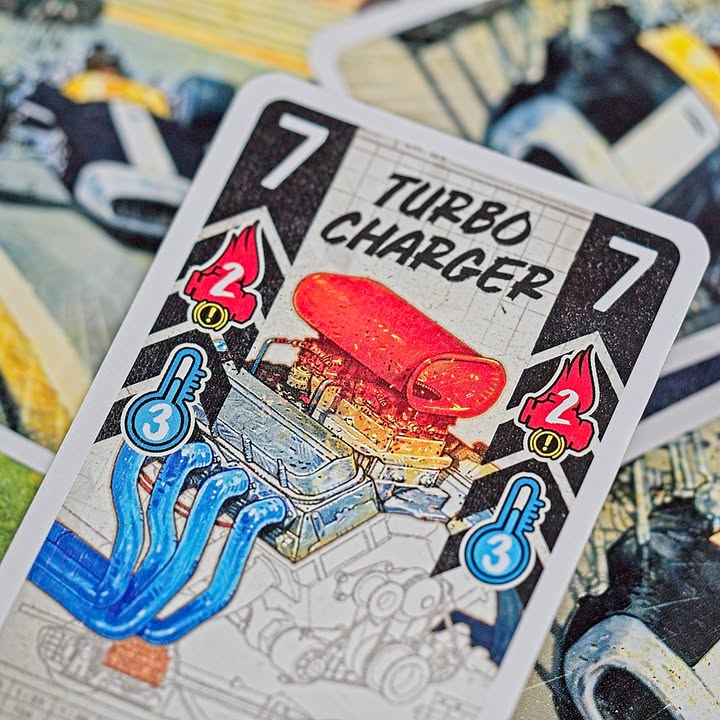

Heat: Pedal to the Metal

verdict: เกมรถซิ่งระดับครอบครัวเหยียบคันเร่งแล้วลุยไปเลยโซนิค!!

---
ธีมไม่ต้องพูดไรเยอะ เราก็จะมาขับรถแข่งนั้นแหละ เดินเกมระบบ deck building ที่ไม่มีการซื้อการ์ดเพิ่ม ในตาหนึ่งเราจะเริ่มจากเปลี่ยนเกียร์ขึ้นลงได้หนึ่งจึก ซึ่งเลขเกียร์มันจะกำหนดว่าเราต้องเล่นการ์ดกี่ใบ เราก็เล่นไปตามจำนวนที่ว่า บวกเลขเท่าไรก็วิ่งไปเท่านั้น จบ....

---
แต่เห้ยแค่นี้มันไม่ทำให้เกมมันดังหรอกเพราะเกมนี้ยัดระบบน่าสนใจมาหลายอย่างโดนแกนคือการบริหาร 'ความร้อน' ของเครื่องยนต์

---
คือเกมมันจะมี currency อยู่เป็นการ์ดความร้อนที่เมื่อเราทำอะไรซักอย่างที่เพิ่มความร้อนให้กับรถเรา เราก็จะเติมการ์ดนี้ลงไปในกองและเมื่อไรที่เราจ่ายไม่พอ หรือมีความร้อนเต็มมือเครื่องเราก็จะน็อกทำให้เราต้องอยู่นิ่งๆหรือแหกโค้งไป โดยความร้อนมันจะหายไปได้ถ้าเราเลือกใช้เกียร์ต่ำหรือเล่นการ์ดบางใบ

---
ความสนุกจริงๆของเกมนี้คือการหาจังหวะแหกโค้ง เพราะในแต่ละโค้งจะมีตำรวจหลบอยู่หลังเสา...ถุย คือจะมี speed limit เอาไว้แต่วิ่งเกินได้ไม่เป็นไรแต่ต้องเอาส่วนต่างของความเร็วและ speed limit ของโค้งมาลบกันแล้วเพิ่มความร้อนเข้าเครื่องยนต์ไป แต่มีไม่พอก็หมุนจ้าาาาาา กลับไปเริ่มใหม่ตรงโค้งนะ

---
อีกอย่างคือการ์ดความเครียดที่เล่นแล้วมันจะให้เราเปิดใบต่อไปแบบสุ่มแทน อันนี้ก็ทำให้ต้องบริหารความเสี่ยงกันอยู่เหมือนกันว่าจะเล่นตอนไหนดี กับเกมนี้ถ้าไปจี้หลังชาวบ้านจะถือว่ามีคนบังลมให้ทำให้เราได้เดินฟรี 2 ช่องด้วยนะ

---
จุดที่ทำให้ผู้เล่นแตกต่างและแนะนำให้ใส่ไปเลยแต่แรกคือโมดูลอัพเกรดพาร์ทที่ทำให้ผู้เล่นมีการ์ดวิ่งที่แตกต่างกัน ตรงนี้เกมจะให้ draft ไปแต่งกัน แบบบางคันก็จะเบรคดี บางคันวิ่งไวแต่ร้อนเร็ว บางคันติดปีกหลังแล้วโค้งอย่างเนี๊ยบไรงี้

---
ใครมองหาเกมระดับครอบครัวหรือแนว gateway มาแข่งซิ่งละก็แนะนำครับเล่นได้ถึง 6 คนเลย ในมุมมองกลุ่มนี้ผมคิดว่าซิ่งมันส์ดี เดินเกมฉับไว

---
Frog-o-Meter: กบเฉย  
  
(My) Collection Fit: เกมสนุกเพลินๆในระดับครอบครัวที่เบาไปหน่อย พอดีพื้นที่ประมาณนี้ยังไม่ได้อยากมีเยอะเพราะโดน Ticket To Ride / Parks ไรงี้จองไปละเลยคงไม่หามาเพิ่ม ไว้ลูกโตกว่านี้อาจจะวนกลับมาดูใหม่
  
What I like: ระบบซิ่งรถที่มีความสุ่มและความตื่นเต้นในการบริหารจัดการความร้อนของเครื่องยนต์ที่ง่ายแต่จีเนียสมาก เล่นละอินอยู่นะ ระบบเพิ่มลดเกียร์ในการทำความเร็วเล่นการ์ดก็ make sense ดี จังหวะไหลสลิปสตรีมเวลาไปได้ก็แบบเฟี้ยวฟ้าว ระบบเทิร์นฉับไว
  
What I dislike: รู้สึกเพลนๆวนลูปจั่วเล่นเร็วไป หลายจังหวะกลายเป็นเกมวิ่งๆหยุดๆออๆกันอยู่หน้าโค้งเพราะเครื่องร้อนวิ่งแหกไม่ไหวรอเครื่องเย็นก่อน กับระบบปรับจูนรถมันยังแตกต่างกันน้อยอยู่แล้วต้องอยู่กับมันทั้งเกมเปลี่ยนระหว่างเล่นไม่ได้
  
Not for... : สายซิ่งเข้มๆอยากได้อะไรวางแผนเข้มข้นทุกเหลี่ยมมุม (กดดูไวๆมี Race! Formula 90: 2nd Edition ที่ weight 3.9 น่าจะดีพอยู่.....)
  
Interaction Area: ขอวิ่งจี้ตูดบังลมแล้วแซงหน่อย เฟี้ยวววววววว  แต่รถก็บริหารจัดการของใครของมันนะไม่มีแกล้งกันไม่มีเบียดไม่มีบังเลน นี้เกมแข่งรถไม่ใช่มาริโอ้คาร์ท

