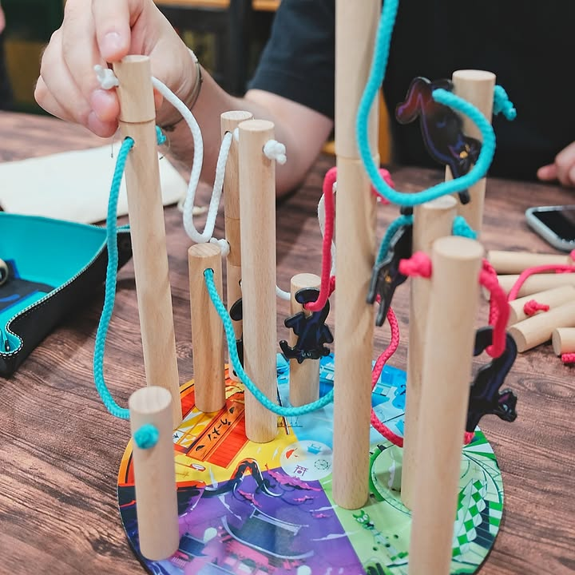
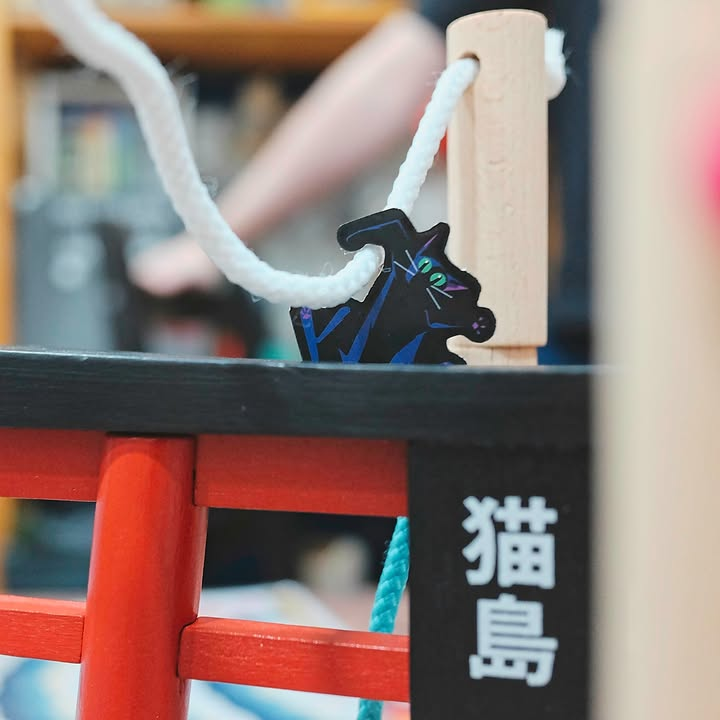

Nekojima 

เกมแนวปาร์ตี้+dexterity ที่มาวัดความนิ่งของมือผ่านการห้อยโหนไต่เชือกของน้อนๆแมวดำ

---
ไอเดียของเกมคือมันจะมีแท่งไม้ 2 แท่งที่ขนาดยาวไม่เท่ากัน แล้วมันจะผูกร้อยเข้าด้วยกันด้วยเชือกที่มีความยาวแตกต่างกัน หน้าตาประมาณกระบองสองท่อนน่ะ.... 

---
ในตานึงๆเราจะผลักกันทอยเต๋าเพื่อบอกว่าเราจะต้องวางแท่งที่ว่านี้ขานึงตรงพื้นที่โซนไหนแล้วอีกขาอยู่ด้านไหน เราจะวางบนพื้นหรือต่อเสาให้มันสูงขึ้นก็ได้ แล้วด้วยความที่แท่งมันสูงไม่เท่ากันแถมเชือกก็สั้นยาวต่างกันมันก็จะทำให้เราต้องระวังเพราะว่ามันห้ามทำให้แท่งหรือขดเชือกมันสัมผัสกับของที่มีอยู่แล้ว

---
กับบางคร้้งเราก็ต้องห้อยน้องแมวบนเชือกด้วยนะ แล้วแบบเวลาห้อยมันก็จะค่อยๆไหลลงมาตรงกลางเชือกที่ขึงอ่ะ  ตอนที่มันสูงๆก็จะมีเกร็งๆหน่อย 

---
ในรูปเป็นตัว deluxe ที่ไปเล่นของคนอื่นมา อุปกรณ์สวยดีโดยเฉพาะเสาโทริ (ตัวรีเทลทั่วไปไม่มีนะ)

---
Frog-o-Meter: กบเฉย
  
(My) Collection Fit: เกมทรงประมาณนี้พอดีมี Rhino Hero, Tinderblox,  Tokyo Highway, Riff Raff แล้วไม่รู้จะเอาเกมแนวตั้งเบาๆมาเพิ่มทำไมอีก
  
What I like: มีแมว 
  
What I dislike: เชือกมันเป็นขดแบบแข็งๆ ระบบห้อยแมวมันดูห้อยโยงมั่วๆแบบน่ารำคาญมากกว่าจะท้าท้ายหรือไปวางเหลี่ยมแกล้งเพื่อน เอาแค่ให้ห้อยได้ก็เหนื่อยพอละ
  
Not for... : คนที่ไม่ชอบเกมแนวมือนิ่งๆ
  
Interaction Area: สมน้ำหน้าเพื่อนเวลาจะวางเหลี่ยมท่ายากแกล้งเราแต่ดันทำเสาล้มเอง......

