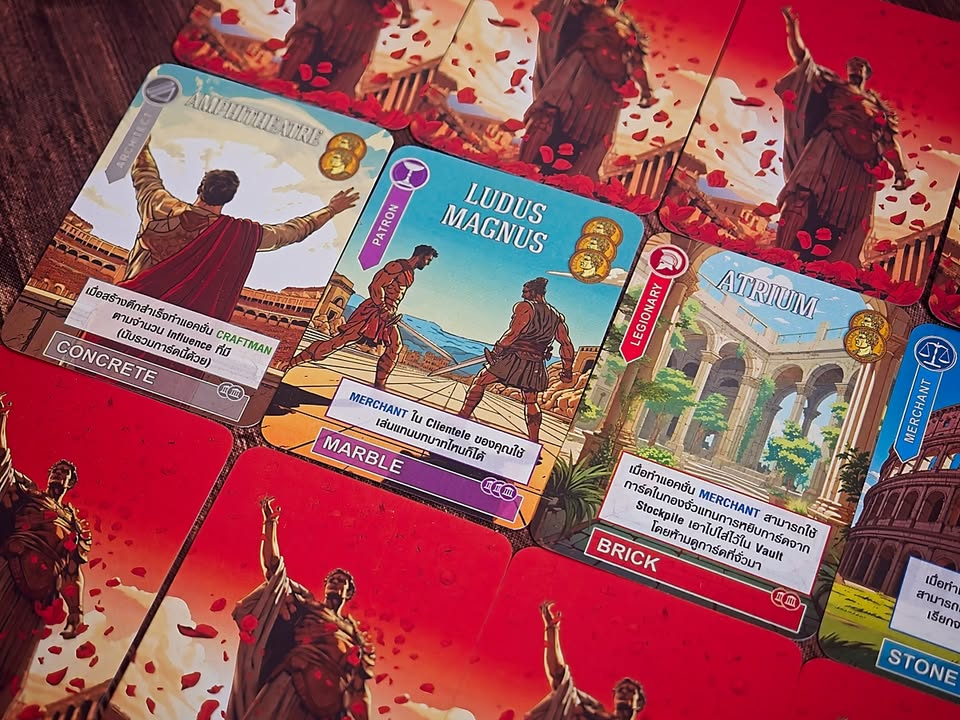
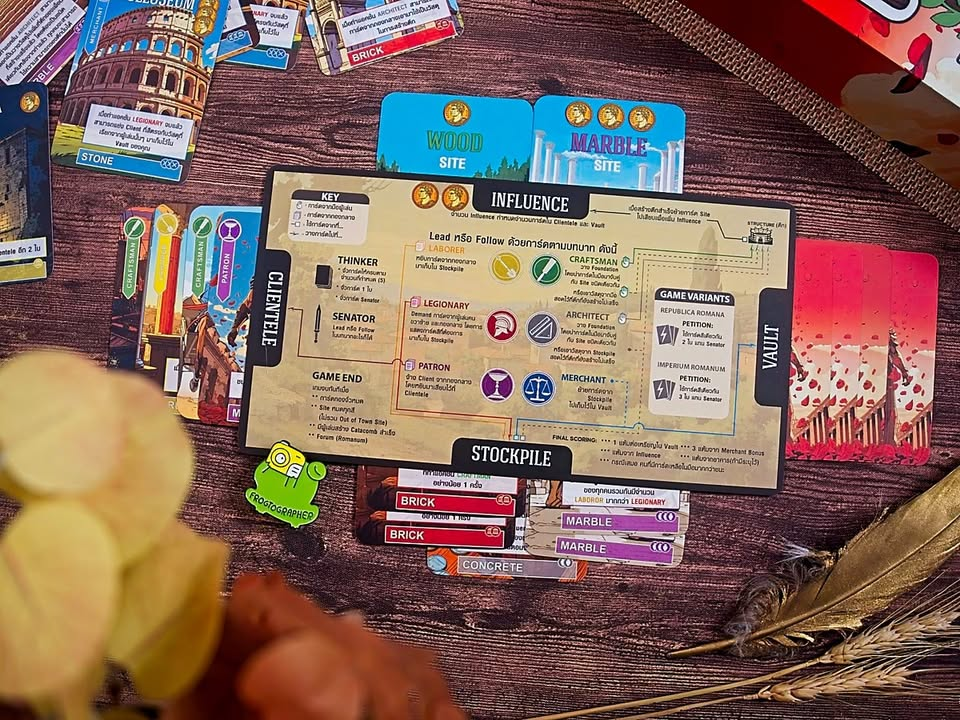
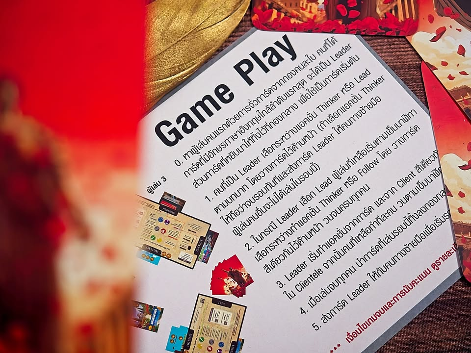
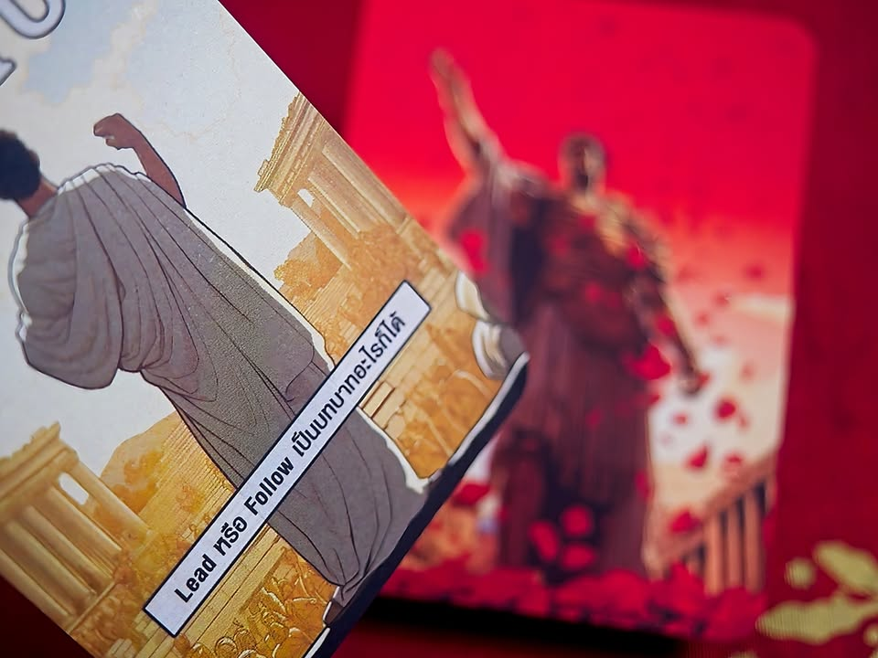

Glory To Rome ฉบับแฟนเมคทำเถื่อน.....

TLDR; ไฟล์ en หาโหลดได้จาก youtube, ตัว th ผมทำกับเพื่อนและไม่มีความคิดที่จะแจกจ่ายหรือรับพิมพ์ขาย

>>> Disclosure - ผลงานชิ้นนี้มีประเด็นในแง่ทรัพย์สินทางปัญญาอยู่จำนวนหนึ่ง เอาแบบย่อๆก็
.
- เกมมีปัญหาทางเอกสารจากผู้สร้างทั้งสองคนที่ทะเลาะกัน ทำให้เกมนี้อยู่ในสภาวะที่ไม่สามารถถูกนำมาตีพิมพ์ใหม่ได้ 
. 
- เป็นเกมที่มีการทำเถื่อนเยอะมากเนื่องจากความต้องการสูงแต่ดันไม่มีของและด้วยความที่มันเป็นการ์ดล้วนก็เลยทำกันเองง่าย เกลื่อนขนาดโพสไฟล์กันใน bgg โดยที่ไม่มีเจ้าของลิขสิทธิ์มาเคลมอะไร (ไม่ได้บอกว่ามันถูกแต่จะบอกว่าเกมดี demand สูงแต่ค่ายแตกมันเป็นแบบนี้แหละ)
. 
- ฉบับ fan made ตัวนี้ในแง่หนึ่งแล้วไม่ได้ละเมิดอะไรของเดิมเพราะใช้อาร์ทใหม่ แต่ก็ยังใช้ชื่อเกมเหมือนเดิมและในกฏหมายหลายประเทศการใช้ข้อความเดิมทั้งแผงก็ถือเป็นการละเมิดเชิงวรรณกรรม..... ก็เรียกว่าดำที่พยายามแถๆว่าเทาละกัน
.
- ฉบับ fan made ตัวนี้ใช้รูป ai generated ซึ่งเป็นเครื่องมีมีประเด็นอ่อนไหวในแง่การละเมิดอยู่
.
- ใดๆคือผมไม่ได้เป็นคนทำไฟล์ต้นฉบับนะ แต่เอาไฟล์เค้ามาแปลทับเพิ่มแล้วพิมพ์เล่นกันเองสำนวนก็เน้นตัวเองอ่านสะดวก ไม่มีความประสงค์จะแจกตัวทำไฟล์ที่แปลแล้ว และไม่ได้มาโพสขาย (และไม่มีแผนจะขายใดๆ) อยากทำก็สามารถไปหาไฟล์แล้วก็คุยกับโรงพิมพ์ดิจิตอลใกล้บ้านท่านได้เลย

---
ส่วนเกมสนุกไหมก็แบบ คนทำเถื่อนซ้ำซากกันเบอร์นี้คุณคิดว่าไงล่ะ? เอาแบบเร็วๆก็คือมันเป็นเกม multi-card use (น่าจะเกมแรก) ที่ใช้ทุกด้านของการ์ดแทนฟังชั่นแตกต่างกัน ยัดระบบ lead & follow กับคอมโบมั่วซั่วมาก 

ข้อเสียคืออาร์ทต้นฉบับนี้กากจัดๆ กับเกมสนุกก็จริงก็ไม่ใช่ระดับที่ราคามัน mark up ในตลาดตอนนี้นะ ไม่ต้องไปตามหาก็ได้ถ้าไม่ได้อยากมีไว้ขิง

