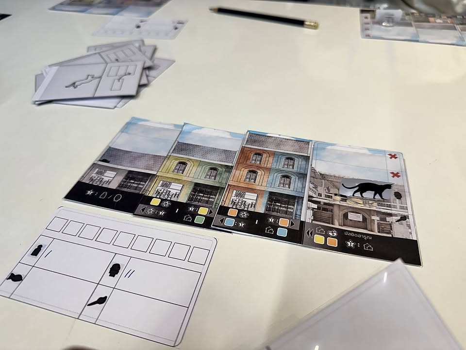
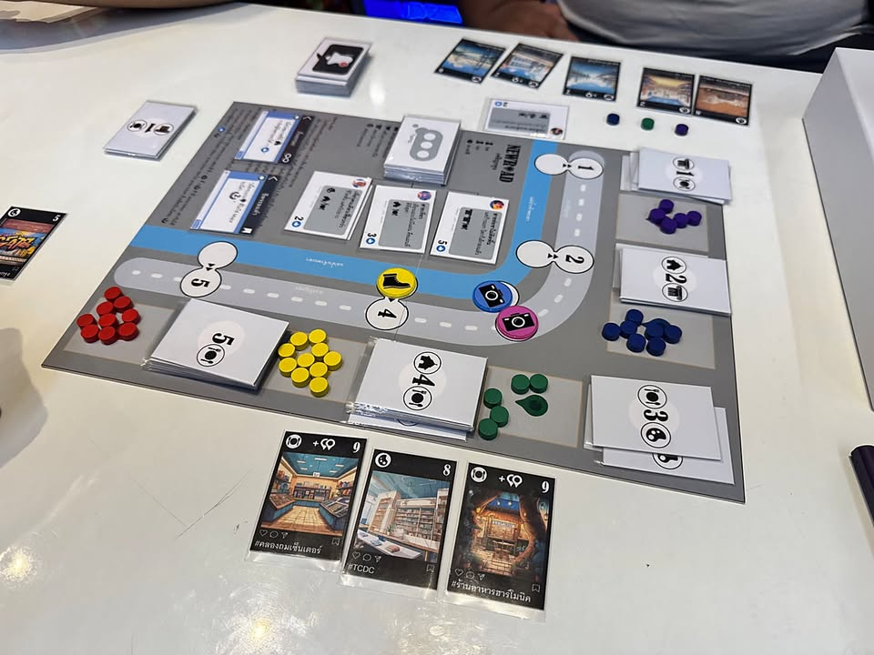
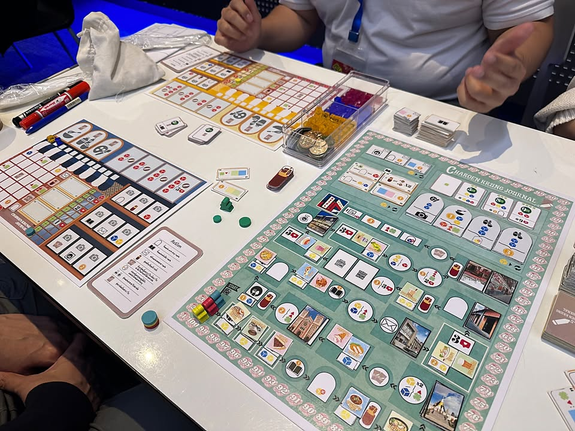
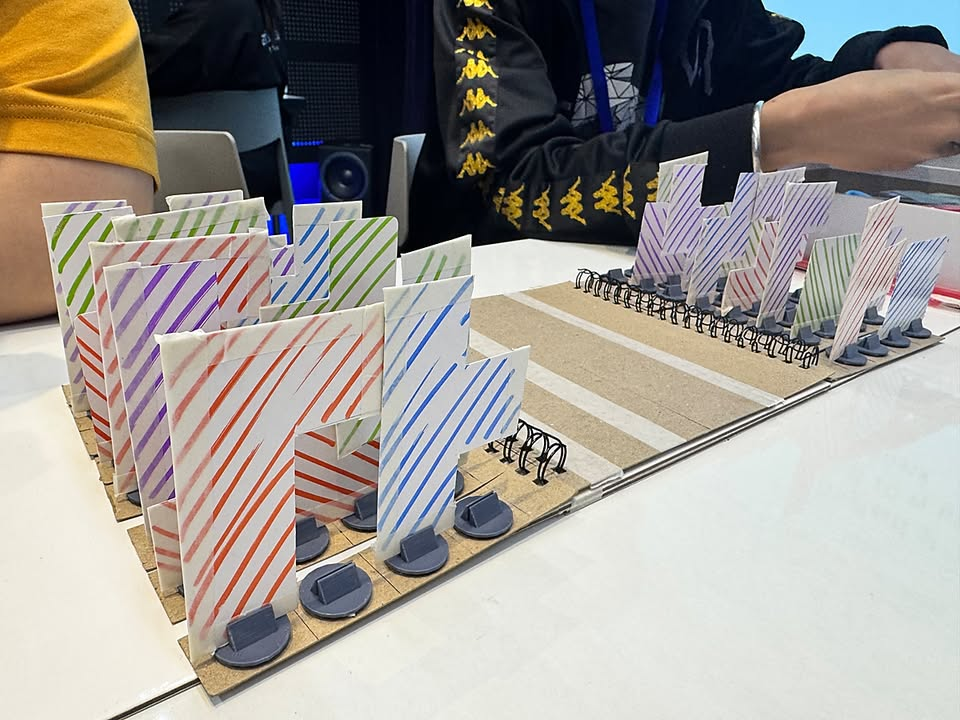
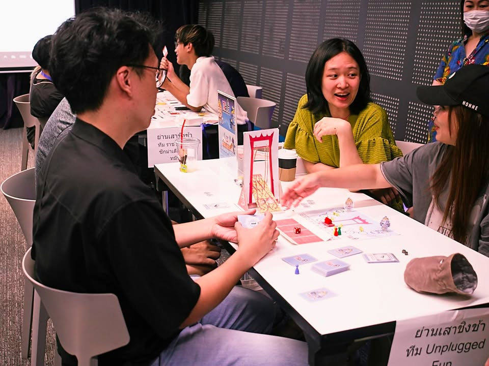
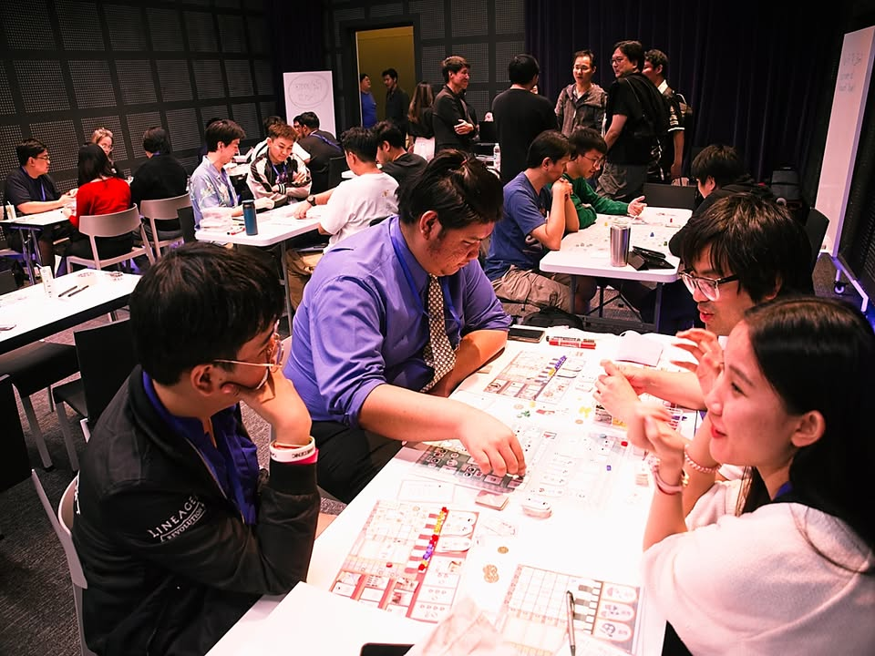
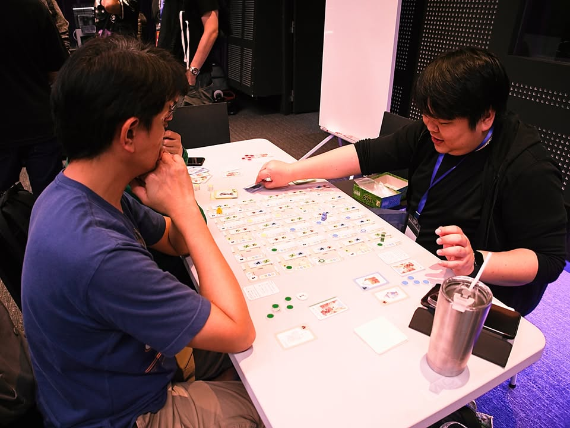
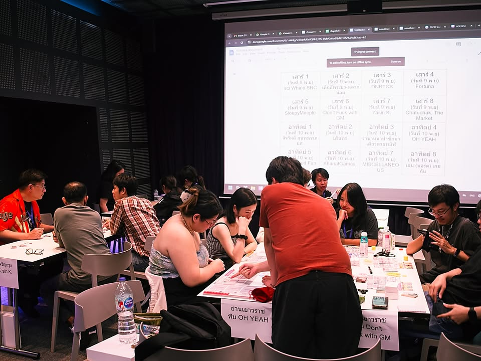

วันนี้ไปเป็นเมนเทอร์ให้กับนักออกแบบในงาน TBDC : Thailand Board Game Design Contest มาครับ #วันนี้อยู่นี้นะ 

---
สิ่งหนึ่งที่จะบอกคืองานนี้มีคนส่งประกวดมากว่า 120 โครงการทั้งๆที่ระยะจัดงานกระชั้นชิดมาก คือเวลามันน้อยแหละไม่เถียงเลย (ตามประสางานของบรัฐอ่ะนะ แต่ถ้าปีนี้ออกมาสวยปีต่อๆไปก็ดีขี้นแหละ) ก็แอบเห็นคนบ่นกันเยอะ แบบค่อนแคะว่าก็คงได้แค่เกมโล่งๆง่ายๆโง่ๆ แต่ว่างานที่โผล่มาในงานนี้ก็แสดงให้เห็นว่าทักษะของนักออกแบบเกมกระดานบ้านเรานั้นสูงจริงๆ ปั่นงานออกมาได้น่าสนใจกันมากๆ 

กรรมการคัดเกมก็ยอดมนุษย์พอกัน ดูคลิปที่ผู้เข้าแข่งขันส่งเข้ามากันยังไงไหว....

---
กลับมาที่ตัวงานที่เข้ารอบ 16 ทีมสุดท้ายจะมาจาก 4 ย่านคือ เยาวราช, จตุจักร, เจริญกรุง และเสาชิงช้าครับ โดยผมกับอาจารย์ตวงจะรับผิดชอบกลุ่มเจริญกรุง (แต่ก็มีแว๊บๆไปดูย่านอื่นบ้าง)

---
ก็ต้องบอกไว้ก่อนว่าเกมพวกนี้ยังอยู่ในช่วงพัฒนาที่เขียนๆมานี้อาจจะไม่ตรงหรือถูกปรับเปลี่ยนไปอีกได้นะ (ซึ่งก็ต้องปรับกันแน่ๆแหละ) ก็อ่านพอเป็นไอเดียละกัน

เกมที่ได้เล่นก็จะมี..... 

---
# เจริญกรุง Journey - ทีมเด็กสี่พระยา-ตลาดน้อย
- ระดับแถวๆ light euro แนวเดินรอบถนนเจริญดกรุงเพื่อแวะกินบ้าง แวะชมสถานที่เด่นดังรอบๆบ้าง ไอเดียจะคล้ายๆนักเดินทางใน Parks แต่ว่าได้ใส่ไอเดียการแข่นเดินแทรคทำคะแนนจากการแวะเวียนเก็บประสบการณ์แทนที่จะใช้ระบบเก็บของไปแลกการ์ดแบบใน Parks 
.
จุดท้าทายของผู้พัฒนาในมุมของผมก็จะอยู่ที่การมองหาวิธีเล่าเรื่องให้เข้ากับกลไก

---
# New Road เจริญกรุง - ทีม Yasin K.
- ระดับประมาณ light euro / family ที่จะให้เราเดินไปถ่ายภาพตามจุดต่างๆในย่านเจริญกรุง ความสนุกจะมาจากการที่พอถ่ายภาพแล้วจะมีจังหวะ push your luck ว่าอยากถ่ายต่อไหม ซึ่งก็จะมีผลต่อการได้ของและเคลมยอดไลก์ในแต่ละพื้นที่ กิมมิคเล่าเรื่องเล็กๆที่ดูไม่มีอะไรแต่ผมชอบเพราะทัชดี คือเวลาเคลมหมวดถ่ายรูปมันจะเป็นการ์ด comment จากผู้ติดตาม มีชื่อมีประโยคกวนๆเรียลๆดี 
.
ในหลายๆแง่แล้วผมชอบ concept นะลงตัวดีเลยตามเป้าหมาย มีจังหวะยึกยักวางแผนกับกั๊กที่อยู่ในทีสำหรับสายคิด เกมมีอะไรให้ขยายได้อีก จุดท้าทายของผู้พัฒนาในมุมของผมก็จะเหลือแค่การปรับเรื่อง player count / กลไก push your luck ที่ยังมีช่องให้ปรับบางท่าอยู่

---
# Cat in the Roof - ทีม MISCELLANEOUS
- มีแมวครับถือว่าผ่าน.......... เกมมีไอเดียว่าด้วยการต่อไทล์ตึกแถวย่านเจริญกรุงโดยจะมีน้องแมวเดินโดดขึ้นโดดลงเพื่อเก็บประสบการณ์ตามตึกในย่าน ซึ่งแมวแต่ละตัวก็จะชอบไม่เหมือนกัน รวมไปถึงคอมโบทำคะแนนจากการต่อตึกแต่ละชนิดให้มันติดกัน
.
จุดท้าทายของผู้พัฒนาในมุมของผมคือตอนนี้ไอเดียทำคะแนนมันเยอะแบบสไตล์ thinky filler คนเล่นเกมหนัก คือเยอะไป๊สำหรับคนปกติ ก็ต้องไปรอให้เค้าตกผลึกคัดอันที่น่าสนใจเน้นๆมาประกอบกันใหม่ แต่ใดๆคือชอบมากเอาน้องแมวเดินขึ้นเดินเดินลงตามตึก

---
# Charoen Krung Journal - ทีม SleepMeeple
- มาแนว mid euro แบบ point salad พ่วงเดินแต้ม objective มากมายประหนี่งเป็นร่างทรง Stefan Feld เล่าเรื่องผ่านการเดินตามช่องแอคชั่นที่แวะกินข้าวบ้าง แวะวัดเสี่ยงเซี่ยมซีบ้าง แวะถ่ายรูปบ้าง กับอีกล้านแปดการปลดล็อกมินิเกม
.
จุดท้าทายของผู้พัฒนาในมุมของผมคือถ้ามองจากกรอบงานประกวดรอบนี้เกมมันอาจจะล้นเกินกรอบไปหน่อย พอเริ่มออกแบบจากเกมใหญ่ซับซ้อนแล้วต้องมาตัดทอนพอตัดไม่พอก็เลยกลายเป็นได้เห็นระบบหลวมๆมากองรวมกัน ซึ่งผมก็คิดว่าถ้าไปตีความแล้วปรับแต่งลดทอนดีๆก็ยังน่าสนใจอยู่ครับ เพราะโดยพื้นฐานมันเป็นไอเดียการเล่นที่สายยูโรสนุกคุ้นเคยอยู่แล้ว

---
# Chatuchak : The Market - ทีม Chatuchak : The Market
- แอบไปเล่นเกมย่านอื่นมาล่ะ เกมนี้ไอเดียว่าด้วยการบริหารไกด์ทัวร์ในจตุจักร ที่เราจะต้องพาลูกค้าไปทัวร์ร้านต่างๆในรูปแบบที่ลูกค้าต้องการ ความสนุกของเกมจะอยู่ที่ลูกค้าแต่ละคนจะมีความอยากแวะลำดับร้านไม่เหมือนกัน เราก็ต้องพยายามจัดคิวทัวร์ให้แวะได้ optimal มากที่สุดผ่านระบบเลื่อนคนงานส่วนกลาง ที่มันต้องมีจังหวะยึกๆยักๆกั๊กเพื่อนไปพลางหาทางเดินให้ตัวเองได้จังหวะสวยๆไปพลาง
.
จริงๆเป็นเกมที่ concept นิ่งเกือบหมดละที่เหลือน่าจะเป็นการปรับเรื่อง scalability ของผู้เล่นมากกว่า กับเนื่องจากยังไม่ได้เล่นเกมอื่นในย่านเดียวกันก็คิดว่าจตุจักรนี้ก็แอบขายเอกลัษณ์ยากเหมือนกันแฮะ

---
# ป้ายไฟ - KhanatGames
- คืองี้เมนเทอร์ประจำย่านเค้าขิงไว้เยอะเลยต้องขอไปชมหน่อย... เกมของย่านเยาวราชที่แม่งไอเดียโคตรล้ำสัด ลิซ่าต้องมาดูงาน เป็นแนว abstract ที่เอาไอเดียเรื่องป้ายไฟเยอะสัดในเยาวราชมาเป็นเกม คือเกมจะเริ่มจากการที่เราต้องหยิบป้ายไฟทรงเททริสมาวางปักสลับกันตามเลเยอร์ พอวางครบมันจะคิดคะแนนโดยการเปิดเลื่อนดูทีละเลเยอร์ว่าใครได้คะแนนเท่าไร
.
จุดท้าทายของผู้พัฒนาในมุมของผมคือจะผลิตไงหว่าน่าสนใจมากเพราะมีหลายท่าเลย คือตัวนำเสนอไอเดียยังเป็นกระดาษอยู่ต้องก็มีคุยเรื่องไอเดียโน้นนี้กันนิดหน่อย กับอีกเรื่องในมุมผมคือไอเดียนำเสนอมันเจ๋งมากแต่มันยังมองไม่ออกว่าในมุมเกมจะสนุกยังไงเพราะ ณ ตอนที่ดูยังออกแนว concept idea อยู่ แต่ดูจากฝีมือทีมงานแล้วก็น่าติดตามมากครับ

---
# โล้ศิวะ - ธันยา นวลละออง
- ย่านเสาชิงช้าเนี่ยเป็นอะไรที่ผมสนใจเป็นพิเศษมากเพราะรากของครอบครัวผมจะเกี่ยวข้องกับ iconic ของย่านอยู่บ้างตั้งแต่ยุค ร.1 เลย ซึ่งเกมนี้ก็เอาไอเดียพิธีโล้ชิงช้าในอดีตออกมาเป็นเกมที่ใช้ตัวเสาชิงช้าและกระดานมาเป็นที่ทอยเต๋าดูว่าจะตกช่วงไหน ก่อนจะขยับตัวชิงช้าให้ไหลไปตามโมเม้นตั้มแรงเหวี่ยง จุดที่สนุกคือพื้นที่วางเต๋าถ้าทอยเบาไปหรือแรงไปมันจะอยู่นอกเขตทำให้พราหมณ์ที่อยู่บนกระดานลื่นล้มบาดเจ็บ ถ้าเจ็บบ่อยไปก็ต้องออกจากเกม
.
จุดท้าทายของผู้พัฒนาในมุมของผมคือ ทอยเต๋ามันสนุกดี (โดยเฉพาะตอนแช่งให้เพื่อนทอยพลาด) แต่ตัวระบบรวมเกมมันอาจจะนิ่งไปซักหน่อย ซึ่งปรับเยอะก็เดี๋ยวหลุด concept ที่วางมาแข็งแกร่งแล้ว ตรงนี้ก็คิดว่ามันมีไอเดียน่าสนใจหลายอย่างที่น่าหยิบมาลองใช้ดูเหมือนกัน ถือเป็นเกมเบาๆที่น่าสนใจในศักยภาพครับ

---
เวลาน้อยมากเล่นทุกเกมไม่ทัน ไว้เจอกันใหม่วีคหน้าครับ

