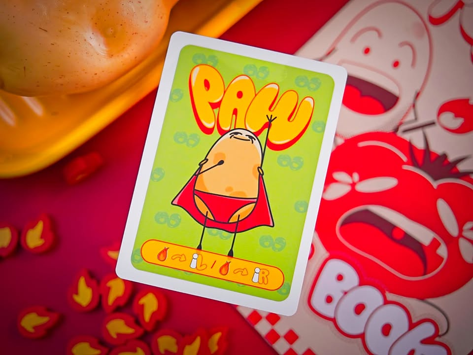
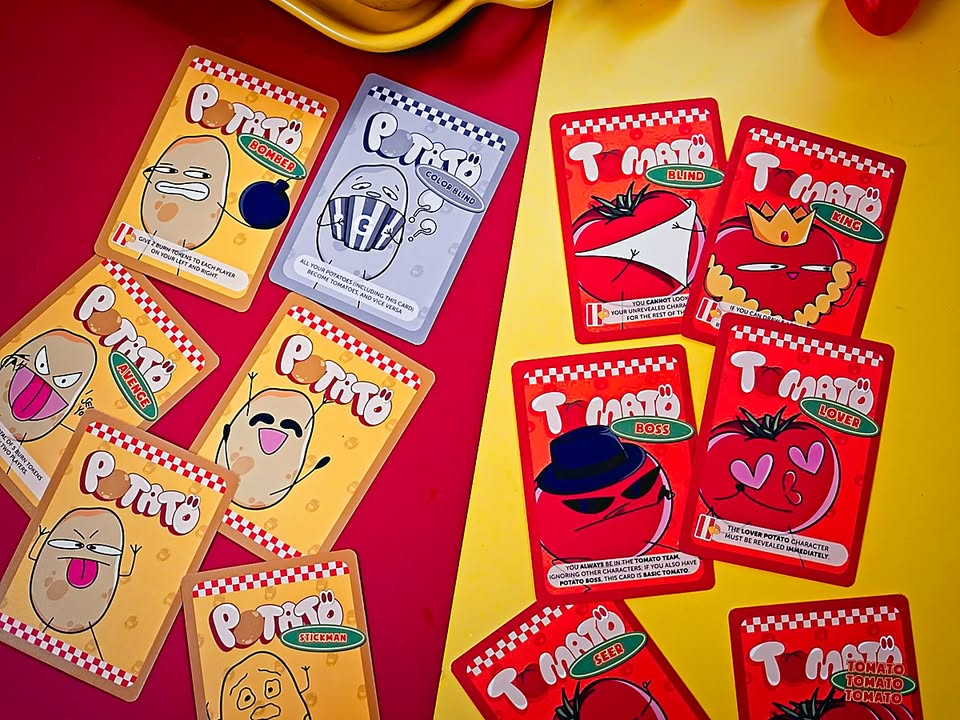
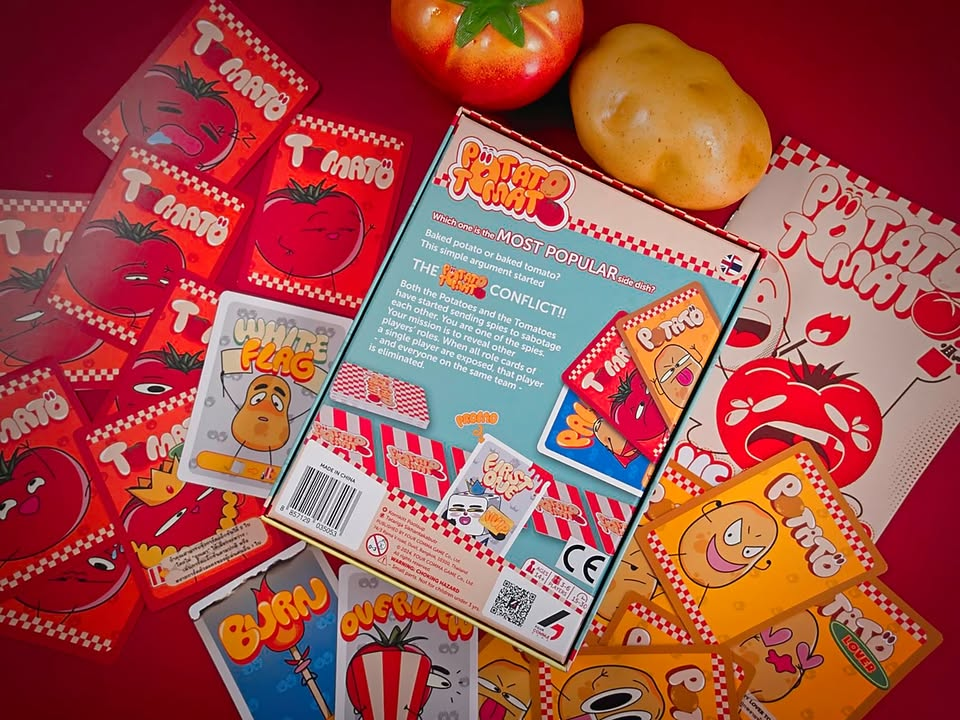
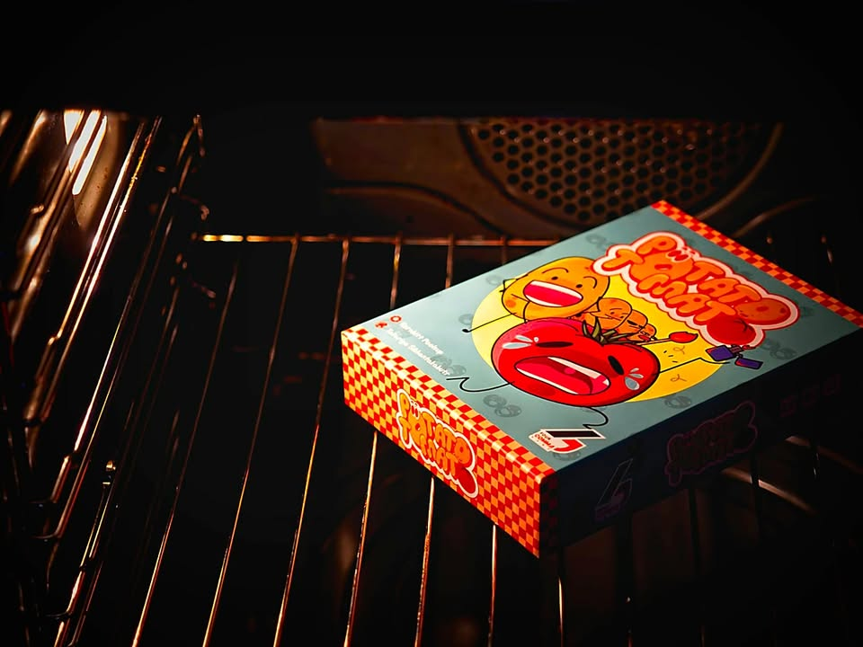
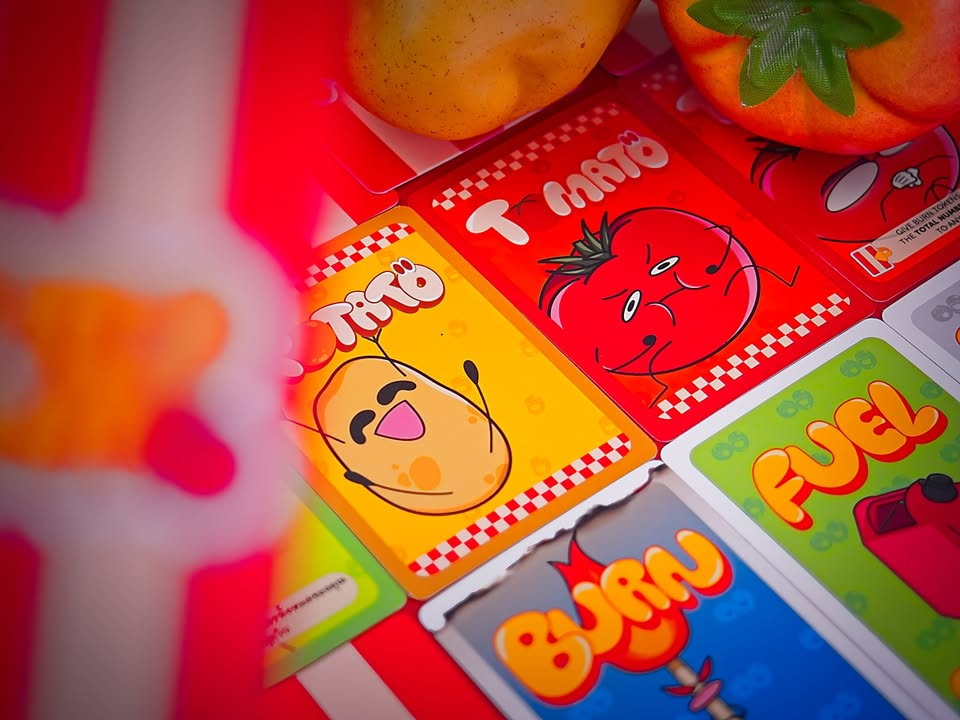
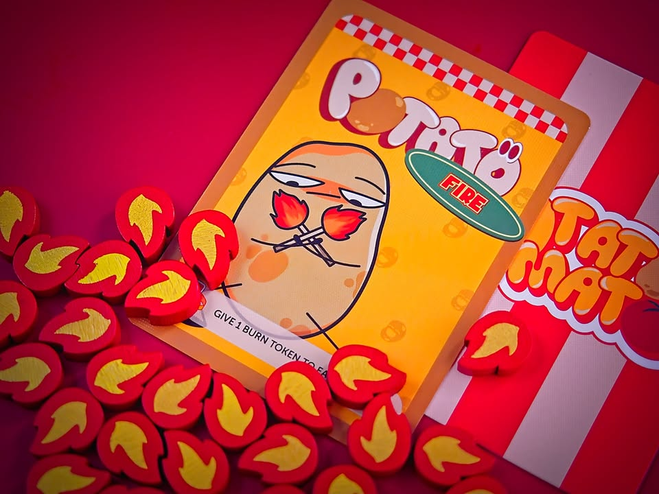

สงครามเครื่องเคียง - Potato Tomato

เกมปาร์ตี้ที่ว่ากันโดยไอเดียมันก็จะไปแนวๆ Good Cops & Bad Cops แต่อัดอารมณ์วายป่วงเข้าไปเยอะๆ เกมจะมีการ์ดทีมมันฝรั่งกับมะเขือเทศมาสับแล้วแจกให้คนละ 5 ใบ เปิดดูแล้วเรามีการ์ดทีมไหนเยอะเราก็คือทีมนั้นนั้นแหละ

---
ทีนี้เป้าหมายเราก็คืออยากไปเผาผู้เล่นคนอื่นเพื่อเปิดโปงว่ามันเป็นทีมอะไรต้องช่วยหรือกำจัด แต่วิธีการคือมันจะให้เราเปิดการ์ดแอคชั่นจากองกลาง จากนั้นเราก็เลือกได้จะเปิดไปเรื่อยๆจนถูกกติกาบังคับให้หยุดเพราะเปิดการ์ดซ้ำสีมากเกินไป (พร้อมกับโดนโทเคนไฟเผา) หรือโอเคพอใจละหยุดเองก็ได้ จากนั้นเกมมันจะบังคับให้เรา resolve การ์ดทุกใบที่เปิดมาไม่ว่ามันจะมีผลดีหรือไม่ดีกับเราก็ตาม ซึ่งการ์ดมันก็จะแนวๆขอดูบทบ้างอัดโทเคนไฟใส่บ้าง คือถ้าโดนไฟถึง 5 อันก็จะต้องเปิดบทใบหนึ่ง 

เกมจบเมื่อมีใครโดนเผาหมดครบทุกใบไม่ทิ้งให้คนค้างคาตายละเหงา

เพิ่มอีกนิดว่ามันมีพวกการ์ดทีมแบบ advance ที่ตอนเปิดมันจะมี effect โน้นนี้ตามมาด้วย ซึ่งก็ตลกๆกวนๆดี ประมาณว่าจ้องเผากูนักก็โดนไปซ้าาาาาาาาา 

---
ในแง่ความสนุกมันก็จะไปอยู่ในกรอบแบบเริ่มจากไม่รู้ใครเป็นใครก็ต้องเริ่มเผากันมั่วๆก่อนแต่พอการ์ดเปิดเริ่มเยอะด้วยความที่มันมีการ์ดอยู่ 5 ใบกว่าคนจะระบุได้ว่าใครอยู่ทีมไหนถ้าเอาให้ชัวร์มันก็ยากอยู่นะ เพราะว่าเผาไป 3 ใบก็ไม่ได้การันตีอะไรขนาดนั้นว่าทีมนั้นจริง ก็จะมีเรื่องของการบลัฟจากข้อมูลที่เราไม่รู้อยู่เหมือนกันว่าเห้ยนี้กูเพื่อนเมิงงงงงงงงงงงง

---
เอาจริงๆผมเคยเล่นเกมนี้ตั้งแต่งาน 'กล่องน้อยอร่อยมาก' (ชื่อนี้ป่ะว่ะ? แต่ทรงๆนี้แหละ) เมื่อหลายปีก่อนโน้นที่ทางค่ายแห่งหนึ่งจัดเพื่อหาเกมกล่องเล็กมีศักยภาพไปทำเกมขาย ตอนนั้นก็คิดอยู่ว่ามันตลกแบบที่พวกเกมปาร์ตี้สนุกๆติดร้านน่าจะมี วาร์ปมาอีกหลายปีก็ได้ค่าย 4 Comma Games (ของแท้ไม่เติม s) มาทำแล้วก็ถีบส่งไปเปิดตัวที่ Essen เลย 

---
(My) Collection Fit: มันเป็นปาร์ตี้เกมแบบที่ตี้ประจำผมกางยากอยู่ เพราะเกมมันเหมาะกับแก๊งทรงไปเล่นร้านเกมอ่ะ อย่างผมเองหนีบไปเล่นกะแก๊งชมรมบอร์ดเกมที่ออฟฟิตที่ไม่ได้เล่นเกมประจำก็คือโอเคเลย แต่มันต้องปั่นบรรยากาศกันนิดนึง เพราะไอเดียมันคือการจ้องรุมเล่นชาวบ้าน
  
I think this game might be a good fit for...: สายเด็กร้านเกมเห้นเอาฮา มองหาเกม 4-6 คนแบบไม่คิดไรมากเผาแม่งงงงง

I think this game might NOT fit for...: ไม่พร้อมมาฮาก็อย่าเล๊ย ส่วนยามาฮ่าคือมอเตอร์ไซค์

---
this is a gifted product from 4 Comma Games (ของแท้ Comma ไม่เติม s), no money changed hand for this content. ได้รับสินค้าโดยไม่มีค่าใช้จ่าย คอนเทนต์ทำเพื่อแสดงความเห็นส่วนตัวเกี่ยวกับเกมโดยไม่มีการจ้างวาน แต่เนื่องจากไอ้คุณโอ๊ตเป็นเพื่อนกันจึงขอแสดงความกวนตีนมา ณ ที่นี้.....

