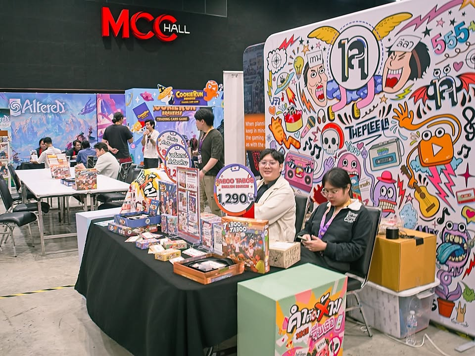
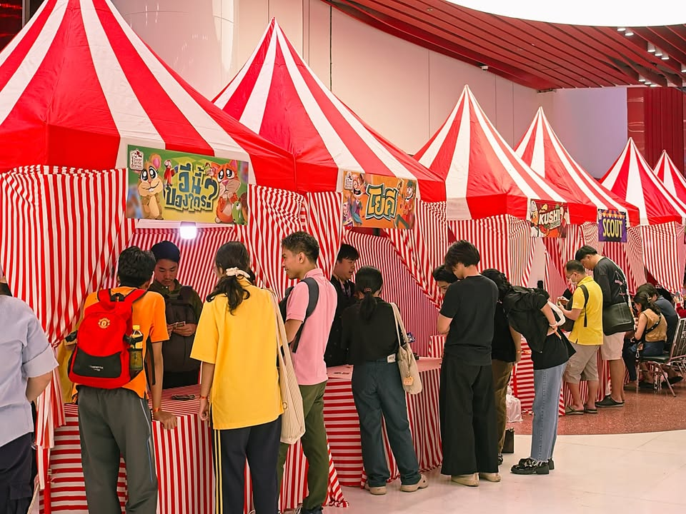
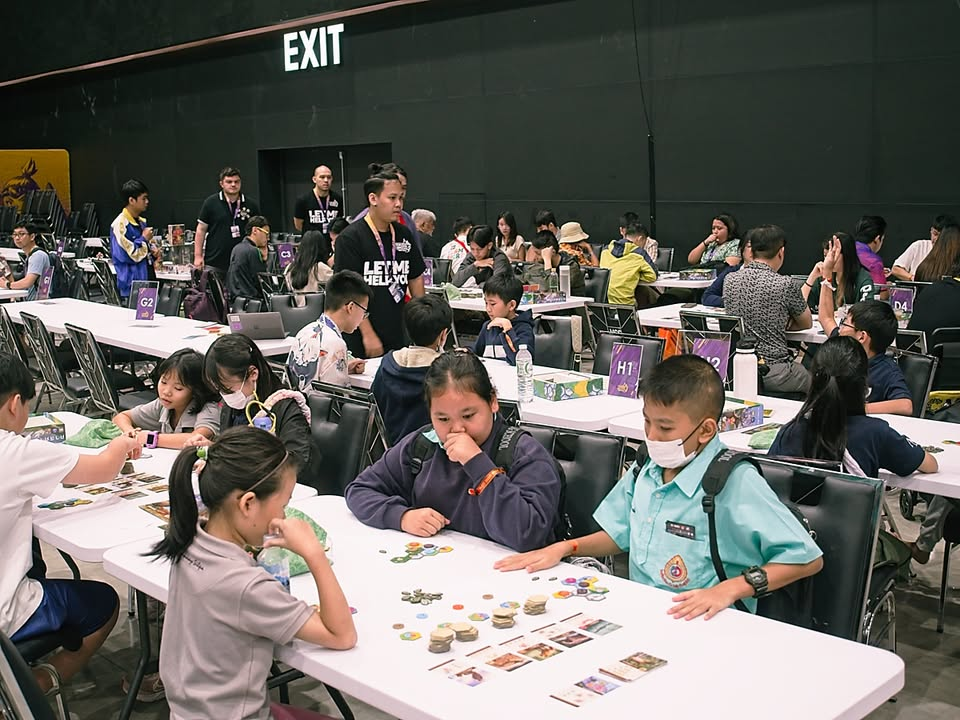
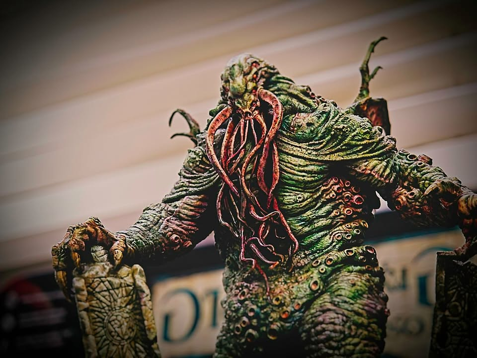
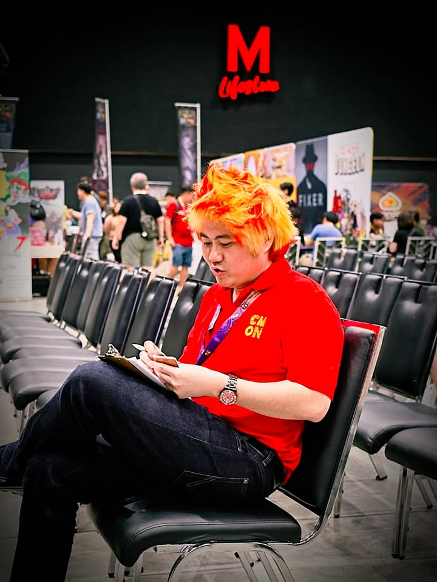
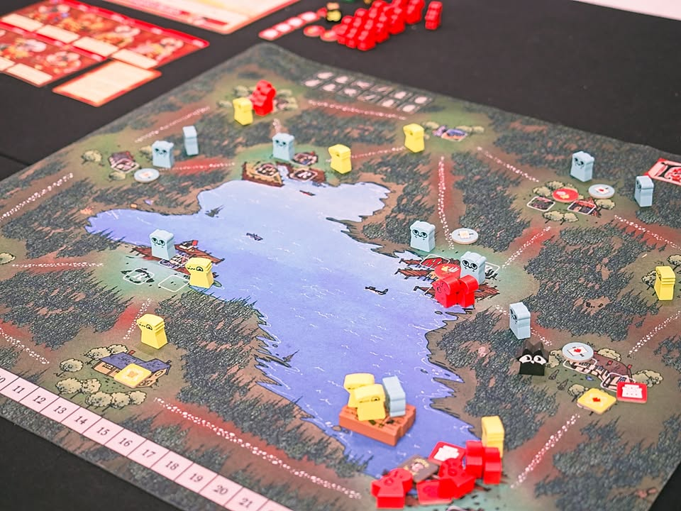
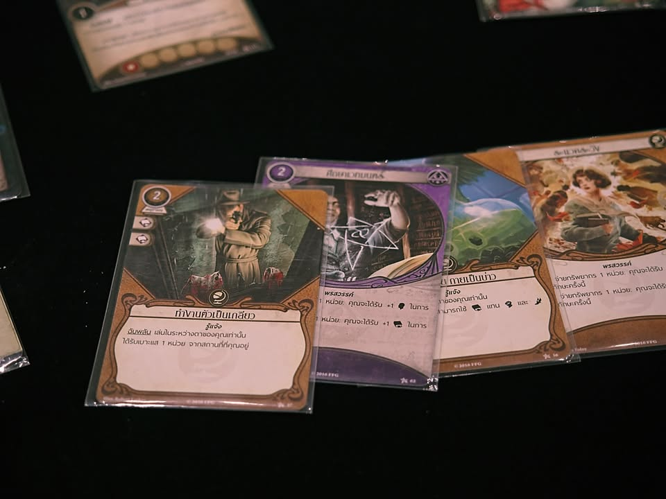
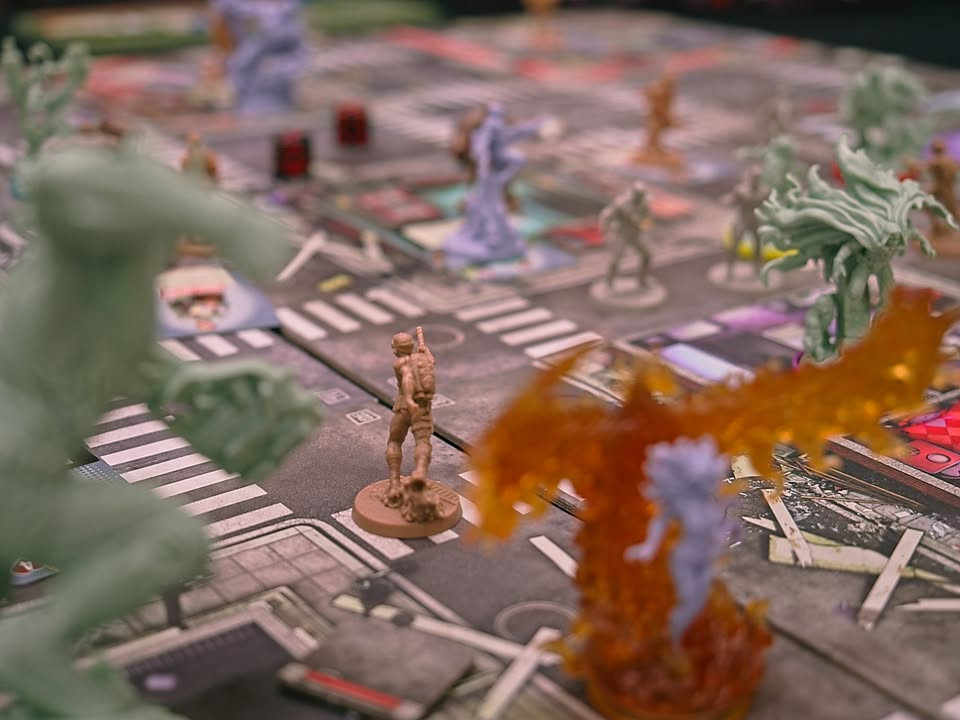
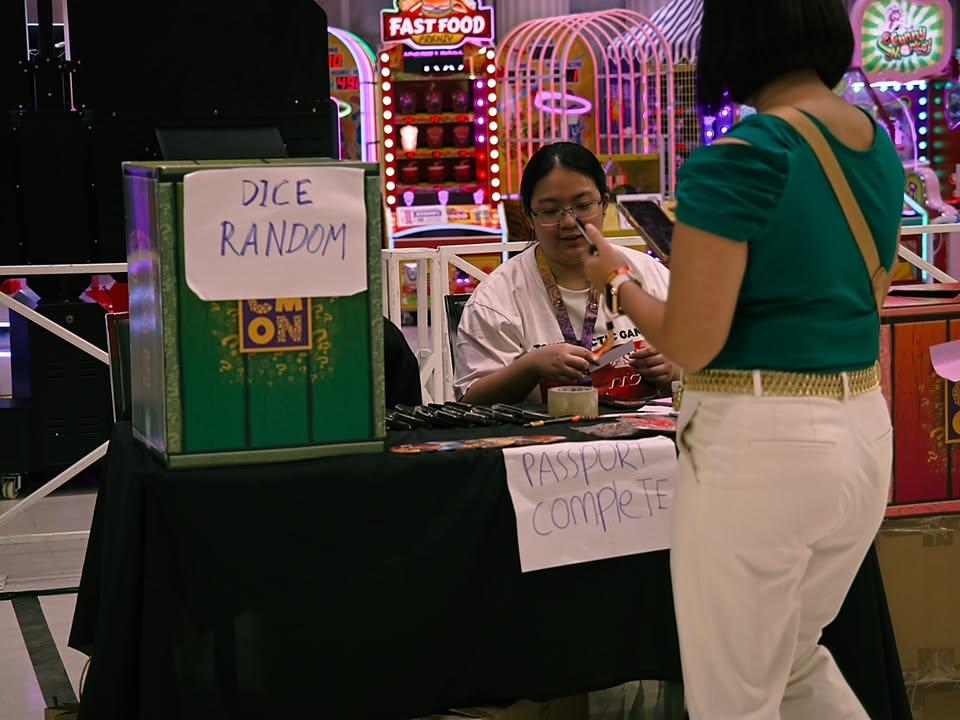

CMON Expo 2024 ฉบับพูดน้อยเพราะคนอื่นพูดหมดแล้ว ห้าห้า 

- disclamer ได้บัตรสื่อมาเลยเข้างานได้เลย แต่ไม่ได้มีสิทธิ์ในส่วนลดหรือการจับฉลากนะ

- ปีนี้จัดที่ the mall บางแค ที่ไกลบ้านฉันเหลือเกินบ้านฉันคือรามอินทรา แต่ก็มีพื้นที่กว้างขว้างขึ้นมาก ที่จอดรถเยอะ มีรถไฟฟ้าผ่าน ของกินเพียบ

- รอบนี้ประกวดยูเรก้าได้ Tom Vasel ตัวเป็นๆมาเป็นกรรมการและมาช่วยเล่นเกมเลยเว้ย โหดสัด ผมถ่ายรูปกะพี่แกไปทีบอก i'm your fan เลยแต่บอกไม่หมดว่าเห็นชีลคุณเกมไหนผมเลี้ยวหลบเกมนั้น (คือสไตล์เค้าดีแต่มันม่ายค่อยตรงกับเราเท่าไร)

- เกมที่ชนะรางวัลยูเรก้าคือเกมสาย deduction ของ Meeple Geek เพื่อนบ้านเรานี้เอง

- เนื่องจากไปวันที่สองเข้าใจว่าคนบางตากว่าวันแรก แต่ก็ยังเยอะอยู่นะ ประกอบกับพื้นที่มันเยอะขึ้นด้วย

- เกมที่โดนในระดับจ่ายซื้อกลับบ้านคือ Rings in Things คือมันแนวๆใบ้คำนั้นแหละทรงๆ 20 คำถาม (แบบ insider) แต่เปลี่ยนจากการที่คนถามมาตั้งคำถามก็จะใช้วิธีลงการ์ดสิ่งของในมือไปตามโซนต่างๆแทน โดยโซนจะระบุเป็นความลับที่คนคุมเกมรู้คนเดียวว่าเงื่อนไขที่ใช่คืออะไร ที่สนุกคือมันมี 3 วง 3 เงื่อนไขทับซ้อนกัน ทุกคนก็ต้องพยายามมองหารูปแบบและทิ้งการ์ดให้หมดมือเป็นคนแรก

- เกมอื่นๆจะหยิบกลับบ้านแต่ไปเช็คแล้วว่าสั่ง back order ไปหมดละก็เลยจบรอไปนะ

- แต่เห้ย Nova Era นึกว่าสั่งไปแล้วแต่ยังไม่มีนิหว่า อดลองเลยรูปสวยดีแต่เท่าที่ดูก็เกมเบานะ

- เกมที่อยู่ๆโดน hype มาโดยเหล่านักออกแบบไทยคือ Jakata Traffic ที่โอเคเดินวนอยู่ 50 รอบคนแม่งเต็มตลอดจน sold out.... เท่าที่ดูคือไอเดียก็น่าสนใจดี แต่วินาทีที่ผมเห็นคนหยิบไทล์มา 'ลอง' หมุนไปมาคือ โอเคกรูไม่ซื้อละ เกมใดมีให้ลองหมุนไทล์ก็แทบจะนอนกินได้ว่าโอกาส AP สูง แน่ๆ ซึ่งไม่ใช่อะไรที่ผมชอบนัก

- อีก hype คือ Ethnos ที่เฮ้ย first edition แม่งลดแล้วลดอีกไม่มีคนเอาพอมาใส่อาร์ทใหม่ทำอุปกรณ์ใหม่คนก็บ้าคลั่งกันไปเลย คือเป็นอีกตัวอย่างว่าเกมดีแค่ไหนถ้านำเสนอไม่ถูกใจประชาชนบางทีก็จะขายออกยากหน่อย

- มีส่วนที่บ่นงึมงำนิดหน่อย คือ อยากลองเล่น A Message From the Stars เพราะอ่านแล้วน่าสนใจดี ผมชอบเกมแนวใบ้คำสองทีมอยู่แล้ว ถาม staff คนขายว่ามีให้ลองไหมก็บอกว่ามีแต่เดินไปดันไม่มี.......  เซงนิดหน่อยแต่ก็ซื้อเกมกลับมาอยู่ดี เปิดอ่านแล้วพูดเหมือนกันหมดคือ Codename + Math

- บ่นสองคือผมไม่แน่ใจว่าระดับความคาดหวังของ staff ประจำบูธสอนว่าต้องประมาณไหน แต่ของ allplay ที่เจอมามันมีความเอ๊ะ.. ในแบบว่าเราฟังกติกาแล้วรู้เลยว่าไม่ใช่อ่ะ ที่ผมเจอมาเป็น Throught The Desert ที่ให้วาง set up leader 5 ตัวแรกแบบต่างคนต่างวางได้เลย (ในวงมองหน้ากันเรียบร้อย ก็เลยขอคู่มือมาดู สรุปคือให้ผลัดกันวางทีละตัว) และ Things in Rings ที่เป็นเกมใบ้คำที่จริงๆเป้าหมายการชนะคือการเล่นให้หมดมือ แต่การสอนจะวนอยู่กับการอธิบายเรื่องการลงการ์ด พอถามเรื่องชนะยังไงก็จบที่ ขอคู่มือหน่อยค้าบบบบบเช่นเคย (ประเด็นของผมคือที่บูธมันมีแต่เกมเล็ก ผิดพลาดก็เข้าใจ คนมาจอยก็มีหลากหลายอาจจะประเมินทักษะคนเล่นไม่ถูก แต่ก็คิดว่ามันน่าจะสมูธกับแม่นในพื้นที่รับผิดชอบกว่านี้)

- แต่เรื่อง staff ก็มีหลายบูธที่เพื่อนที่ไปลองเล่นแล้วประทับใจระดับขอช่องทางติดต่อไว้งานหน้าๆก็มี (eg. staff สอนเกม Minos ใจเย็นไม่ชัวร์ก็เช็คกติกาไรงี้)

- ถ้าคุณรู้สึกว่าชีวิตมีแต่เรื่องซวยๆ ขอให้ดู นักป้ายยามืออาชีพ เอาไว้ อีนี้แม่งชอบอยู่ดีๆทำตัวโดนของโน้นนี้ แต่มันดันเปิด Golden Ticket ได้ตั้งแต่กล่องแรก แถมอีกวันแม่งถูก Lucky Draw เฉย (จัดฉากแน่ๆ จัดฉากแน่ๆ เรียกพี่หนุ่มมาที!!)

- ขอบคุณทาง CMON Expo ที่ชวนไปงานครับ ทำงานทีก็โดนบ่นทีแต่ก็มีปรับแก้ปัญหาหลายๆอย่างจากงานที่แล้วตลอด รอชมปีหน้าครับ cheers.

