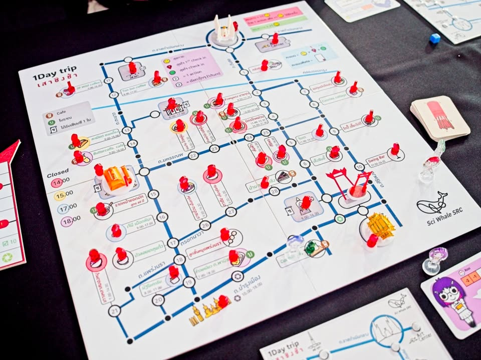
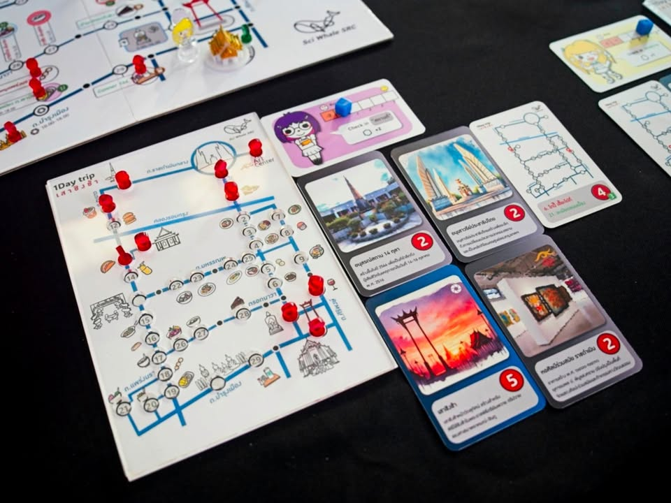
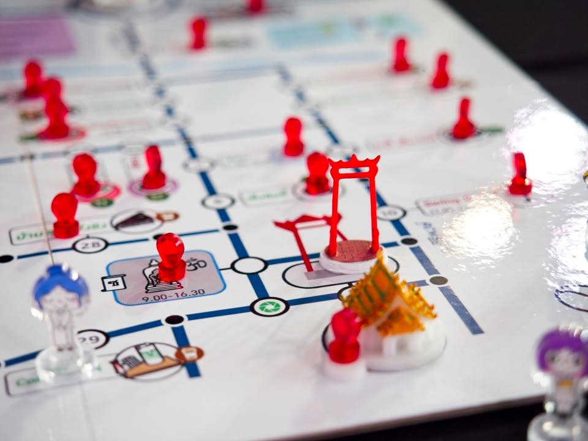

1 Day Trip เสาชิงช้า 

ผลงานชนะเลิศอันดับ 3 จาก 16 ทีมสุดท้ายในงานกระกวดออกแบบเกม 4 ย่านของ TBDC : Thailand Board Game Design Contest ที่จะให้เราเดินทางเช็คอินท่องเที่ยวและแวะกินร้านเด็ดแถวเสาชิงช้า แต่ว่าเดินมั่วซั่วไม่ได้นะเพราะร้านค้ามันเปิดปิดตามเวลา!!

---
ไอเดียเกมคือตัวเราจะเดินตามแผนที่เส้นทางไปเก็บ token check in ตามแผนที่ ตานึงเรามี 5 action point ก็เดินๆไป ง่ายๆแค่นั้นเลย กิมมิคที่สวยมากของเกมก็คือเวลาเราแวะไปหยิบ token check in แล้วเราจะเอามาวางไว้ตรงบอร์ดแผนที่ส่วนตัวเราด้วย.. nice!

---
ของเล่นที่น่าสนใจของเกมคือระบบ 'เวลา' ที่แต่ละร้านและสถานที่ในเกมจะเปิดปิดในช่วงเวลาแตกต่างกัน เพราะเวลาของเกมเดินไปในกรอบหนึ่งวันถ้าเราอยากจะแวะร้านผับบาร์ก็ต้องรอกลางคืนไรงี้ กลายเป็นว่าเราต้องวางแผนการเดินทางให้ดี เนื่องจากต้องทำ mission ส่วนตัวด้วยว่าต้องไปแวะที่ไหน มัวแต่เดินเพลินร้านที่อยากไปปิดประตูใส่หน้าก็จะเหงาๆหน่อย

กับเกมใหนเราวาร์ปได้ด้วยนะโดยจ่าย token พิเศษเพื่อเรียกตุ๊กตุ๊กให้ไปส่งหน่อย เพราะโดยไอเดียแล้วเกมมันไม่ได้เน้นหยิบตัดหน้าคนอื่นแต่เน้นวางแผนเที่ยวให้ตรงเป้าหมายตัวเอง แต่ก็มีกิมมิคเล่นการ์ดเซียมซีแกล้งเพื่อนพอให้แม้มปากอยู่ (ห้ามเพื่อนเรียกตุ๊กๆงี้) แต่ด้วยความที่เกมใช้ระบบไปก่อนได้แต้มเยอะคนที่สองแต้มเหลือครึ่งเดียว คนที่เหลือไม่ได้อะไรเลยมันก็จะมีจังหวะแย่งตัดหน้ากันนิดนึง

---
กิมมิคอื่นๆก็จะเป็นระบบเล่นการ์ดเลขในมือเพื่อกำหนด turn order เลขน้อยเล่นก่อน (ช่วยให้แย่งป้าย check in ได้ก่อน) แต่เล่นช้าก็จะได้แอคชั่นต่อรอบเพิ่ม ระบบที่เล่นละสนุกดีอีกอย่างคือค่าความหิวที่จะทำให้กระเพาะเราว่างทำให้แอคชั่นเหลือน้อย แต่ว่าถ้าเราเสียแอคชั่นแวะกินก็จะช่วยพยุงให้เรามีแรงไปต่อ เกมมีลูกเล่นเรื่องของหวานของคาวให้พลังไม่เท่ากันด้วย

---
ส่วนที่คิดว่าดีมากคือเกมนำเสนอการเดินเที่ยวที่คนออกแบบลงพื้นที่ไปเก็บตำแหน่ง แล้วก็รายละเอียดเวลาเปิดปิดจริง เล่นแล้วมีอารมณ์แบบเออหว่ะลองไปเที่ยวตามรอยในเกมก็น่าสนุกดี มีร้านแปลกๆอยู่ตรงโน้นตรงนี้ด้วย พวกกิมมิคที่แทรกๆมาดูเหมือนเยอะแยะสำหรับเกม weight เบาแต่ด้วยความที่มันแนบสนิทกับธีมก็ทำให้ไม่รู้สึกว่าขัดอะไร 

---
ในความเห็นส่วนตัวแล้วเป็นเกมแนวเดิน check-in ที่ 'make sense' สุดละในบรรดาเกมเดินทัวร์สถานที่ที่เคยเล่นมา ข้อดีอีกอย่างคือ framework มันเอาไปใช้กับแผนที่ไหนก็ได้

ข้อเสียคือเกมไม่มีแมว..... ส่วนที่เหลือก็เล็กๆน้อยๆตามประสาเกมประกวดเวลาออกแบบน้อย แต่โครงสร้างมาดีมากพร้อมเอาไปจูนขาย กับกระดานขาวมันสะอาดตาดีก็จริงแต่ส่วนตัวคิดว่ามันโล่งไปหน่อย (ก็แล้วแต่คนมั้ง?)

