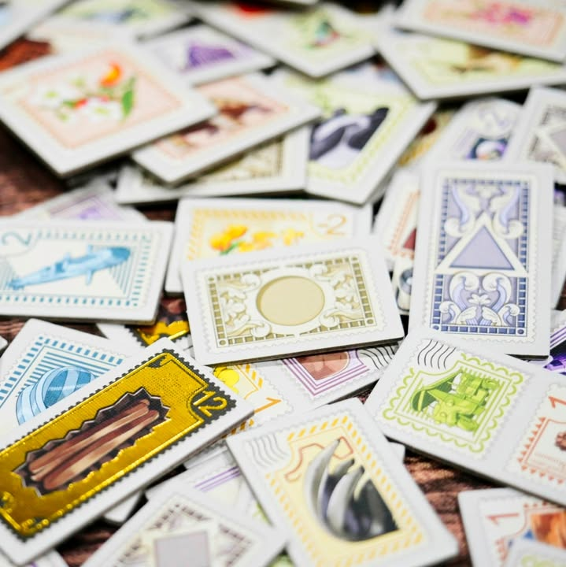
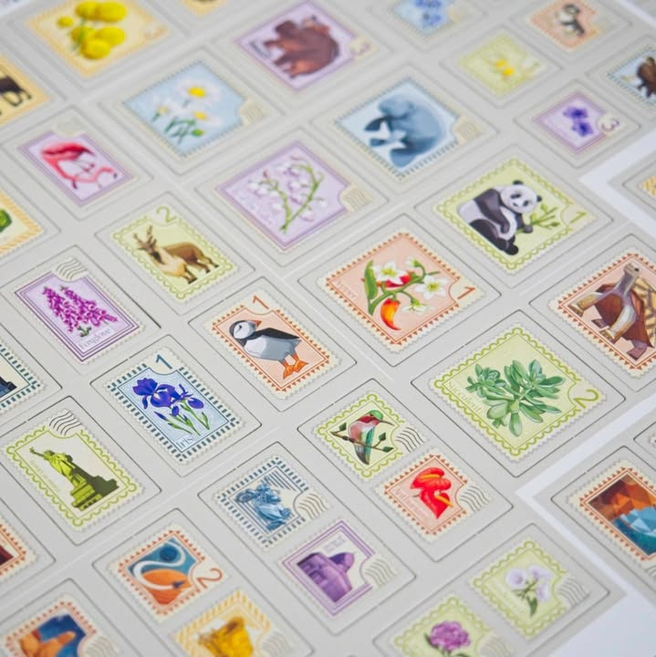
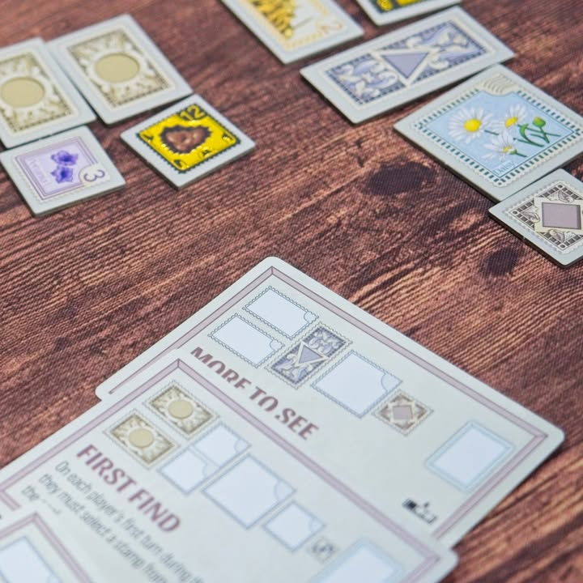

สลับตัดสะสมแสตมป์ - Stamp Swap

แสตมป์จดหมายน่าจะเป็นของสะสมที่มีคนเล่นเยอะมากอันหนึ่งที่เด็กสมัยนี้น่าจะไม่ค่อยเก็ทกันแล้ว เพราะเจอจดหมายทีก็น่าจะอยู่ในรูปของบิลกับใบปลิว แต่เมื่อก่อน(โน้นนนนนนน)คือ เวลาใครส่งจดหมายมาแล้วติดแสตมป์สวยๆผมก็จะมีความอยากไปลอกมาเก็บสะสมไว้ตลอดนะ

---
ไอเดียเกมนี้คือในหนึ่งรอบจะการ์ดที่จะสุ่มแสตมป์หลายๆรูปทรงไม่ก็การ์ดความสามารถพิเศษออกมา จากนั้นผู้เล่นจะผลัดกันดราฟมาเก็บไว้กับตัวคนละ 6 ชิ้น แต่ช้าก่อนว่าที่หยิบมาน่ะยังใช้ไม่ได้นะ!

เพราะกิมมิคของเกมคือระบบ I cut, you choose ที่เราจะต้องแบ่งของที่เราหยิบมาแบ่งเป็นสองกองในรูปแบบไหนก็ได้ 1:5, 3:3 ไรงี้ แสตมป์บางอันหยิบมาจะเป็นแบบคว่ำก็ห้ามคนอื่นดูนะ แต่เราดูได้ จากนั้นก็จะผลัดกันเลือกกองแสตมป์ของผู้เล่นคนอื่นถ้าใครโดนเลือกก็จะได้เก็บครึ่งหนี่งที่เราแบ่งไว้แล้วเราก็ไปเลือกอีกครึ่งของคนอื่นต่อ

---
เกมนี้ทำคะแนนแนวจัดวางเรียงในเกิดรูปแบบต่างๆที่เราจะเห็นตั้งแต่ต้นเกมว่ามีการทำคะแนนแบบไหนบ้าง และเกมนี้บังคับในเราเคลมหนึ่งหมวดทุกครั้งที่จบรอบแต่ห้ามซ้ำ หมายความว่าเราต้องวางแผนการเคลมแต้มล่วงหน้าไว้ด้วยว่าจะวางยังไงดี

จุดที่สนุกก็เลยเป็นการเลือกว่าจะแบ่งกองยังไงดีจะได้หลอกล่อให้เพื่อนมันหยิบของที่เราไม่อยากได้ ด้วยความที่แสตมป์มันมีการหยิบแบบคว่ำด้วยบางทีเราก็จะมีการซ้อนแผนโดยการเอาของห่วยๆไปกองคว่ำเยอะแล้วของที่เราอยากได้ไว้น้อยๆไรงี้ เกมเล่นกันสามรอบจบ

---
(My) Collection Fit: เป็นเกมที่ซื้อมางงๆแบบดูปกแล้วกด กะๆว่าคงอารมณ์ซัก Fit to Print แต่ก็นั้นแหละว่าไม่เหมือน ซึ่งมันก็เกมจาก Stonemaier Games น่ะก็จะแนวๆครอบครัวเล่นกันเพลินๆ อาจจะเก็บเอาไว้เล่นกับพวกกลุ่มแถวๆเกมสวยๆเล่นสนุกอย่าง Parks, Canvas ไรงี้
  
What I like: แสตมป์สวยยยยยย กติกาเหมือนจะง่ายแต่ตอนจังหวะเพื่อนแย่งแสตมป์ที่เราตั้งใจแบ่งไว้ก็มีกำหมัดอยู่
  
What I dislike: ไม่ได้มีอะไรที่ไม่ชอบเป็นพิเศษ ก็มันเกมครอบครัวใสๆกลุ่มร้านเกมน่ะ  จะมีก็พวกความสามารถการ์ดมันยึกยักแบบแปลกๆนิดหน่อยอ่านละแบบทำไมต้องมาอ่านยาวๆเกมสั้นแค่นี้
  
I think this game might be a good fit for...: คนที่มองหาเกมระดับครอบครัวของสวยแต่การเล่นไม่ได้ราบเรียบมีจังหวะทำขยักมองเพื่อนแล้วก็แบ่งของแบบลุ้นเล็กๆ

