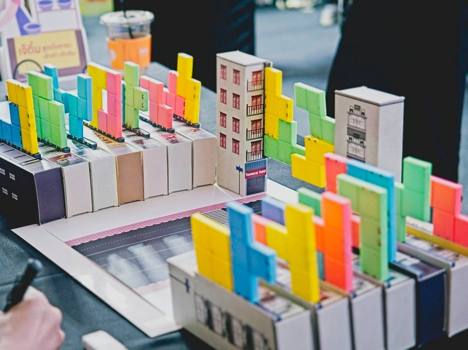

เยาวราช

ผลงาน 16 ทีมสุดท้ายในงานกระกวดบอร์ดเกม 4 ย่านของ TBDC : Thailand Board Game Design Contest. เป็นเกมที่มี table present และไอเดียโดดเด่นที่สุดในงานเนื่องจากถอดไอเดียของ 'ป้าย' ในถนนเยาวราชออกมาเป็นเกม

---
ไอเดียจะเป็นเกม abstract ที่ผู้เล่นจะเอาไทล์ทรงเททริสมาวางบน 'กระดาน' ด้วยแม่เหล็กในแนวตั้งทั้งสองด้านผลัดกันวางไปเรื่อยๆจนครบทุกไทล์แล้ว 'เมจิค' ก็จะเกิดขึ้นให้ดู

นั้นคือกระดานที่วางอยู่มันจะยกตัวเข้าหากันกลายเป็นสภาพของตีกแถวในถนนเยาวราชที่เราคุ้นตาจากนั้นเราจะนับคะแนนกันโดยจะค่อยๆเปิดตึกทีละเลเยอร์เพื่อดูว่าในแต่ละชั้นนั้นใครได้คะแนนเท่าไรโดยดูว่ามองเห็นสีไทล์ของใครบ้าง ได้กี่แต้ม ทำไปเรื่อยๆก่อนที่จะหุบตึกแล้วทำซ้ำอีกครั้งแต่มองจากอีกด้าน

---
แม้ไอเดียการนำเสนอจะล้ำมาก(กกกกกกกก) แต่ข้อเสียในความเห็นของผมคือระบบนับคะแนนในช่วงประกวดนั้นยังวุ่นวายเกินไป เพราะตอนนับคะแนนมันต้องนั่งเล็งต้องนับทีละชั้นไปกลับ เรียกได้ว่ากระบวนการนับคะแนนนั้นนานกว่าตอนเล่นหลายเท่าตัวเลยทีเดียว ซึ่งผลการนับคะแนนที่ยากมันก็ทำให้ตอนเล่นนั้นมองไม่ออกว่าควรจะวางมูฟยังไงแล้วตอนจบมันจะได้คะแนนเท่าไร แอบคิดว่าถ้าทำเป็นเกมที่เล่น 2 คนกับมีกติกาคิดคะแนนที่นับได้เลยระหว่างเล่นก็อาจจะกระชับดี

ยังหวังให้เกมนี้ไปผ่านการตกผลึกต่อเพราะไอเดียการนำเสนอดีมาก

อีกข้อเสียคือลิช่าอยู่ไหน!!

---
เกร็ดความรู้หนึ่งที่ผมรู้จากงานนี้คือป้ายยื่นเกะกะลูกตา (แต่คือสเน่ห์และซิกเนอร์เจอร์ย่าน) นั้นมีได้แค่ที่ถนนเส้นนี้เท่านั้น เพราะต่อมาเค้าออกกฎหมายและข้อจำกัดเกี่ยวกับป้ายออกมาทำให้ที่อื่นไม่สามารถสร้างป้ายแบบนี้ได้อีก

