Suriya - (pre-crowdfunding opinion)

อีกหนึ่งเกมใหม่ที่กำลังจะระดมทุนจากค่ายที่ทำเกมอลังการมากที่สุดในเซ้าท์อีสเอเชีย (มีใครให้มากว่านี้ก็บอกละกัน) Hexa House กับผลงานออกแบบจาก เก่ง Zemaki คนคุ้นตาเรานี้เอง

---
ธีมเกมนี้ประมาณว่าพระอาทิตย์แถวบ้านจะดับแล้วบังเอิญมีดาวที่ปลอดภัยอยู่ดวงนึงติดนิดเดียวดันมีเจ้าถิ่น พวกเราก็เลยจะมาตบตีกัน ไอเดียหลักของเกมจะเป็นตียึดพื้นที่กันชนะโดยการวิ่งไปยึดฐานชาวบ้านหรือไม่ก็สร้างฐานในครบแล้วตั้งป้อมให้รอดจากการโจมตีก็ได้ ซึ่งก็บอกไว้ก่อนว่าเกมนี้ออกแบบโดยตั้งใจให้เป็น head to head combat หรือเล่นกัน 2 คน แต่ก็สามารถขยายได้ถึง 4 คน แต่ว่ากันโดยส่วนตัวแล้วผมคิดว่า 3 คนน่าจะสนุกสุด ส่วนเหตุผลเดี๋ยวบอกตอนท้าย

🚨 ใดๆคือนี้มันยังไม่ใช่ final product ทุกอย่างที่เขียนในนี้อาจจะเปลี่ยนไปได้หมดเลยนะและผมได้ลองเล่นผิวเผินมากความเห็นบางส่วนอาจจะไม่ valid

---
สนามในเกมจะเป็นพื้นที่ hex 3x3 เกมเดินด้วยระบบ Deck Building ที่ในหนึ่งตาเราจะได้รับแร่มาใช้จ่ายเล่นการ์ดไปตามเรื่อง ซึ่งตัวการ์ดเบสิคหลักๆจะวนอยู่กับการสร้างทหาร (มีเบ๊ 2 เกรดกับระดับนายพล) แล้วก็เก็บทรัพยากรและสร้างฐานที่เป็นทั้งเป้าหมายในการชนะและช่วยปลดความสามารถ

พอจบรอบเกมจะให้เราหยิบการ์ดเข้ากองได้ใบหนึ่ง จะเป็นส่วนกลางที่ความสามารถดีขึ้นหรือจะเป็นการ์ดความสามารถประจำเผ่าก็ได้

---
ซึ่งไอ้การ์ดความสามารถประจำเผ่าเรียกได้ว่าเป็น highlight ของเกมนี้ เพราะมีเยอะแบบมาก ตีแบบง่ายๆก็เกมมีแม่ทัพสามแบบที่มีการเล่นสามสไตล์ และการ์ดประจำเผ่าที่ส่งเสริมการเล่นแต่ละสายอีกอย่างละ 2-3 แบบ แต่เราเลือกหยิบมาตรงๆไม่ได้นะเพราะมันมีเรื่องการ rotate ตลาดส่วนตัวในการหยิบอีกทำให้มีเรื่องที่ต้องตัดสินใจอยู่เหมือนกันว่าจะหยิบอะไรมาเก็บไว้ดี

แต่ใดๆคือด้วยระบบไม่ได้ดั่งใจนี้แหละทำให้การเล่นในแต่ละรอบของแต่ละเผ่ามันแตกต่างกันไป

---
ระบบ combat เกมนี้ใช้เต๋าที่มีหน้า 3 แบบคือ attack, defence และ tactic ตอนตีก็แต่ละ unit จะมีใช้ลูกเต๋าของตัวเองต่างคนต่างทอยแล้วก็เอา atk def มาลบกันแล้วหยิบทหารออกง่ายๆแค่นั้น แต่ส่วนที่ทำให้เกมลีลาคือ tactic ที่ถ้าออกหน้านี้เราจะได้ใช้ความสามารถอีกอย่างของการ์ดเราได้ อย่างแทนที่จะใช้เล่นตามปกติถ้าเอาไปใช้เป็น tactic มันก็จะมี effect แปลกๆไปตามสไตล์เผ่าไรอีก (ก็วนกลับไปตอนหยิบการ์ดเข้ากองที่ใบที่ไม่ตรงสายแต่ effect tactic อาจจะเหมาะกับสถานะการณ์ก็ได้) และเนื่องจากเป็นเกมตีกันฝ่ายบุกจะมี incentive เพิ่มด้วยการมีลูกเต๋าพิเศษแถมให้อีกลูก

---
เรียกได้ว่าจุดแข็งของเกมก็คือการ customized / adapt ตัวเองหน้างานตามสไตล์การเล่นของเราไปปะทะกับสไตล์การเล่นของอีกฝ่าย เกมจบค่อนข้างเร็วเล่นรวมสอนประมาณชั่วโมงก็จบละ (ถ้าเป็นสายเกมเมอร์นะ คนทั่วไปก็อาจจะนานขึ้นซัก 30 นาที แต่ถ้าสายอ่านมันทุกบรรทัดทำความเข้าใจทุกสิ่งอย่างก็จะนานกว่านั้นมากกก)

แต่จุดแข็งของเกมก็มีจุดระวังนิดหน่อยเพราะท่ามันเยอะทั้งผ่านการปลดล็อก ผ่านการเลือกการ์ด ผ่านความสามารถแม่ทัพ และความสามารถเผ่า ทำให้แม้การเข้าไปเล่นเกมจะทำได้ง่ายแต่ว่ามือใหม่ก็น่าจะโดนตบยับอยู่ดีเพราะมันมี combination หลายอย่างที่ถ้าไม่รู้ก็จะเสียเปรียบเหมือนกัน ซึ่งในจุดนี้ข้อดีก็คือผู้เล่นจะมีเวลา explore เกมเยอะรอบมากกว่าจะรู้สึกว่าโอเคกรูรู้หมดละ 

---
ในแง่การเล่าเรื่องผมขัดใจอยู่ประมาณหนึ่ง คือโดยปกติเกมแบบนี้ถ้าเต็มรูปแบบก็จะมีช่วง 'สร้างฐาน+ยึดพื้นที่+สะสมพลังพัฒนาตัว' --> 'ประจันหน้า' ไรงี้ แต่เกมนี้ไอเดียคืออยากจะตัดช่วงสร้างฐานเปิดแผนที่แล้วมาประจันหน้ากันเลยไม่ต้องลีลา..... 

แต่ว่าในช่วงแรกๆของเกมเราก็ยังต้องมาขยับนิดๆหน่อยๆกระจายตัวไปยังพื้นที่แคบๆแล้วก็จั่วๆหยิบๆปั้น deck ให้ตรงสายที่เราอยากเล่นอยู่ดี อารมณ์ช่วงองก์แรกมันเลยรู้สึกหนืดกว่าที่ชอบ ในขณะที่องก์สองที่จะเริ่มตีกันมันก็กลายเป็นยืนนัวๆแลกกันไปมาอยู่กลาง จังหวะขยับมันเลยไม่ได้เยอะมาก ซึ่งตอนสู้มันก็สนุกนะ มันคือการเอาของที่ปั้นมาโถมใส่เข้าหากันแล้วพุ่งทะลวงไปชนะไรงี้ แต่ประเด็นผมคือเกมมันสลัดองก์แรกไม่ขาดและการต่อสู้มันเหมือนเอาสกิลมาโถมใส่กันไม่ใช่เกมเน้นสไตล์ลูกล่อลูกชนด้านพื้นที่รบ (ย้ำว่าเท่าที่เห็นนะ)

แบบถ้าเราจะตัดให้มาเจอหน้าซัดกันเลยขอแบบจัดเด็คมาสู้เลยได้ไหมนะ?

---
เรียกว่าปกติผมค่อนข้าง prefer เกมสไตล์ที่แผนที่หลวมกว่านี้อีกนิดแบบมีที่ให้ขยับดูมีกลยุทธในการโยกย้ายทหาร มีการเคลื่อนที่แบบสองจังหวะ หรือมีการ follow up ไรงี้มากกว่า (ซึ่งที่พูดมาก็มีผ่านการปลดล๊อกนะ) จึงเป็นที่มาของที่ผมคิดว่า 3 คนน่าจะสนุกกว่า เพราะมันจะได้ element ของพื้นที่ที่ใหญ่ขึ้นอีกนิดดดดด และการเจรจาพารุมที่ทำให้เกิดมูลค่าพื้นที่แตกต่างกันไป แต่ถ้าเล่น 4 คนสิ่งที่รู้สึกแน่ๆคือนานจนขี้เกียจรอ คือต้องเก็บไว้เล่นกับวงที่คล่องๆเท่านั้น

ในมุมนี้ element ฝั่ง tactic ของเกมยังไม่ใช่สไตล์ผมเท่าไรเพราะตำแหน่งที่ตั้งมันไม่เกิดไดนามิคระหว่างคนเล่น เกมนี้จะออกไปทรงเกม Unmatch ตัว melee ยืนแลกกันมากกว่า

---
imho - สิ่งที่ผมมองว่าจะมาแก้ปัญหาทรงนี้คือระบบ scenario จำนวนมาก (แบบใน Memori 44 และที่เกมสงครามตามขนบเค้ามีกัน) ที่เกมจะสร้างสถานการณ์แผนที่ fixed ให้คนเล่นไปเล่น อาจจะจัด deck เพิ่มกับมีการวางทหารให้บางส่วนอีกเพื่อเร่งให้ผู้เล่นบู๊กันเราขึ้น ข้อดีของระบบแบบนี้คือมันลดระยะ learning curve ให้มือใหม่ด้วยแบบให้ match up เผ่าพร้อมกับเลือกผู้นำพร้อมกับ tactic ที่สู้กันสูสีให้ไรงี้ (อาจจะเป็นแค่ผมก็ได้ แต่ผมไม่ชอบ culture รับน้อง อะไรที่เร่งให้คนใหม่เก็ทเกมได้เร็วไม่พลาดโง่ๆก็คือดีหมด)

ซึ่งถ้าทำมาเยอะและแกรนพอมันก็อาจจะจะนำไปสู่ระบบ campaign ที่การแพ้ชนะในแต่ละศึกมีผลต่อการเล่นโหมดเนื้อเรื่องหรือ solo ก็ได้นะ

---
ตามแผนคือค่ายบอกจะเอาเข้าระดมทุนช่วง Q1 2025 ระหว่างนี้ก็ลองไปทดสอบได้ตามงาน event ครับ เท่าที่คุยเกมน่าจะมีตัวหลัก 4 เผ่ากับมีตัวเสริม 2-4 เผ่า (ยังไม่ final) เรื่องคุณภาพโมก็คิดว่าน่าจะหายห่วง สวยงามดีหน้าตามีสไตล์

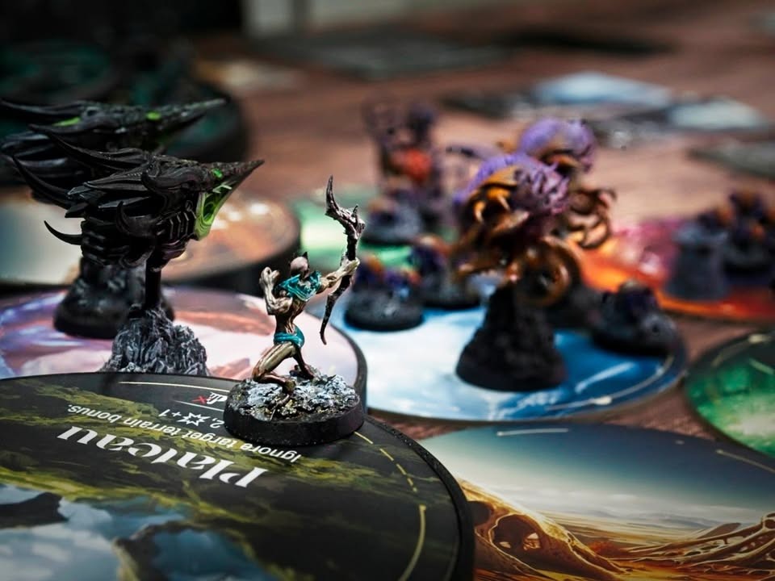

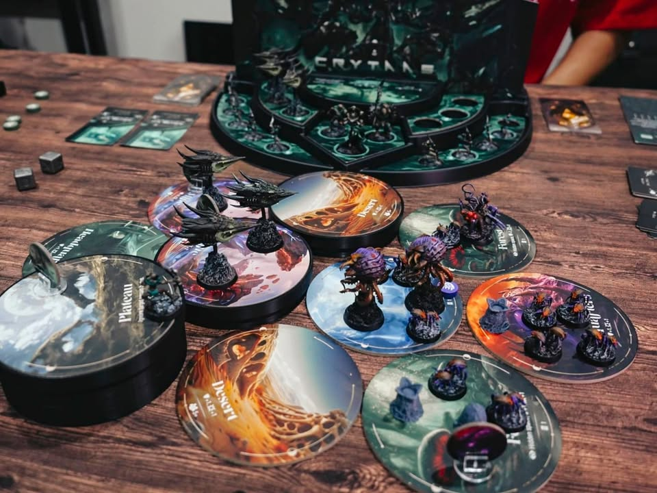

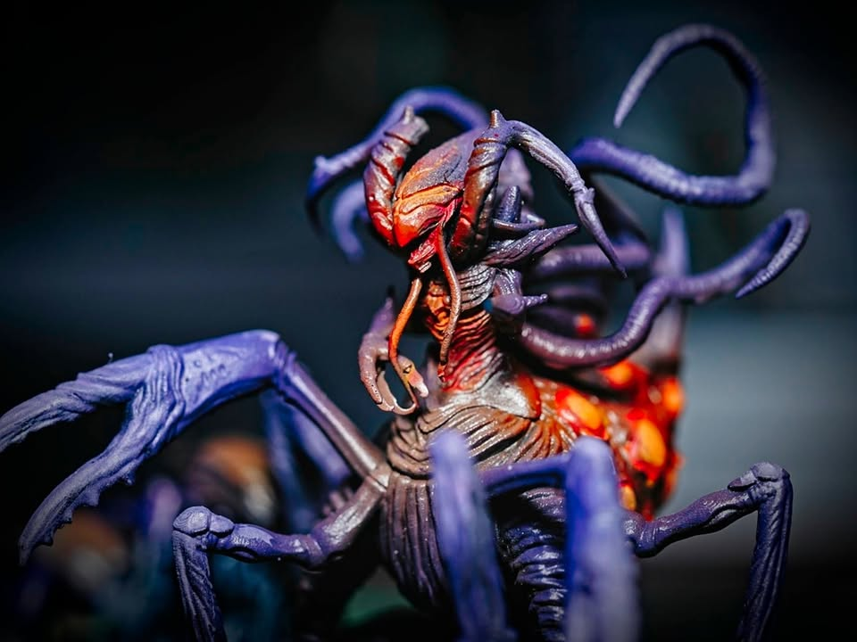

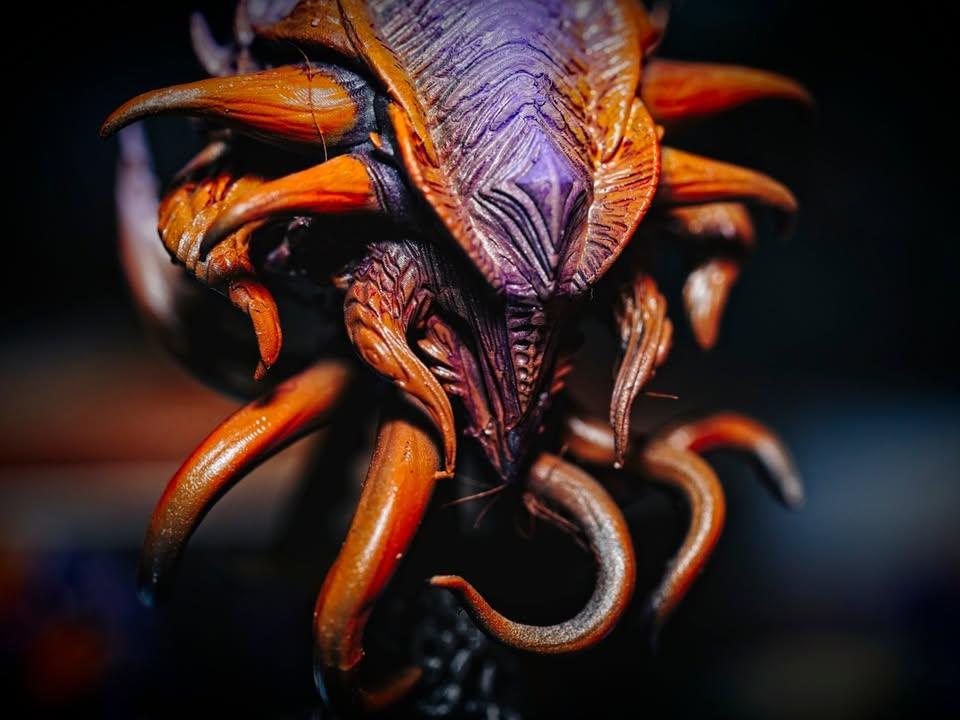

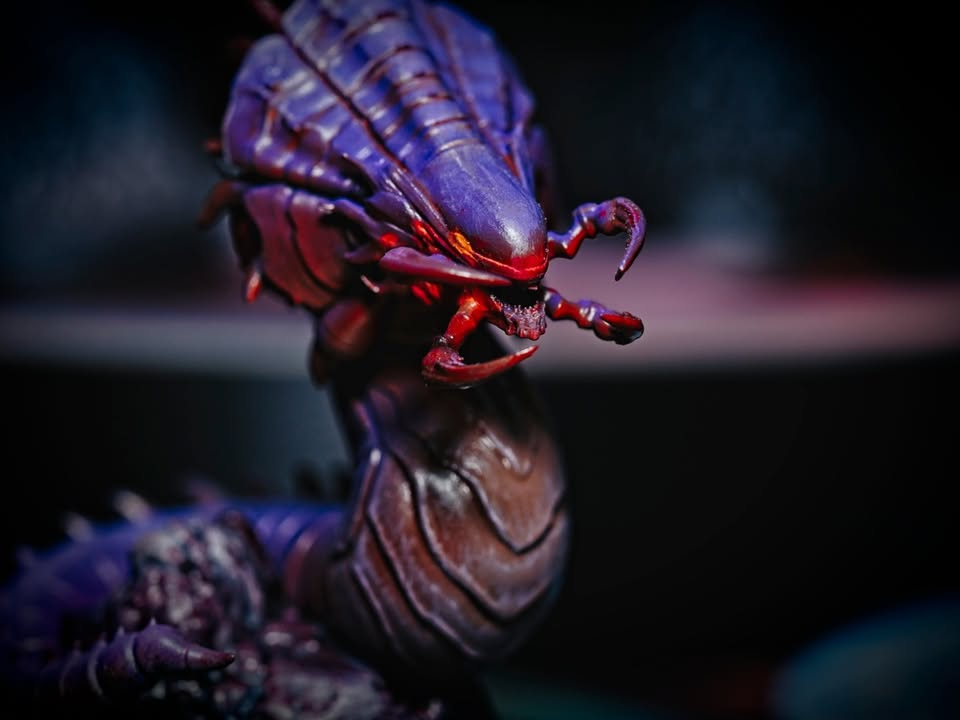

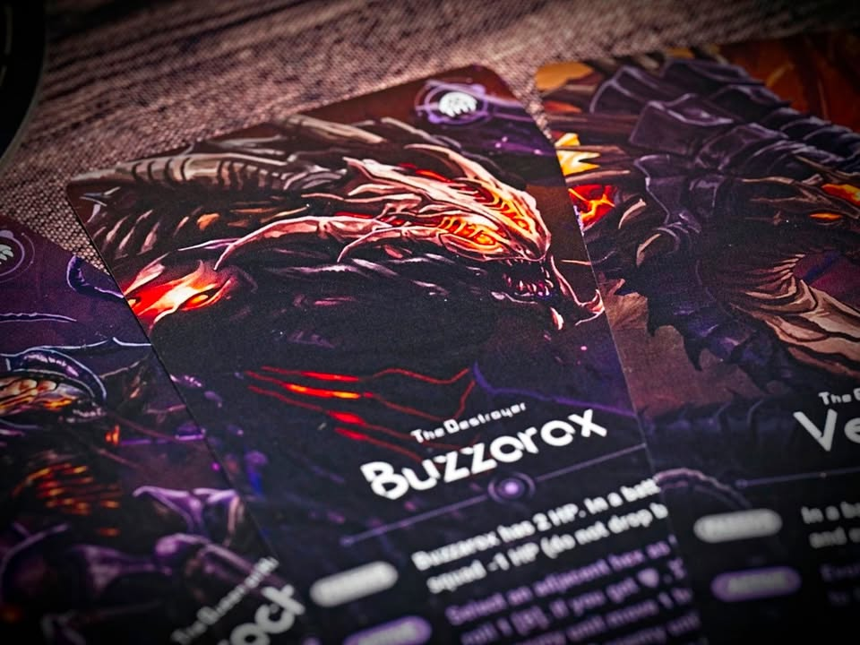

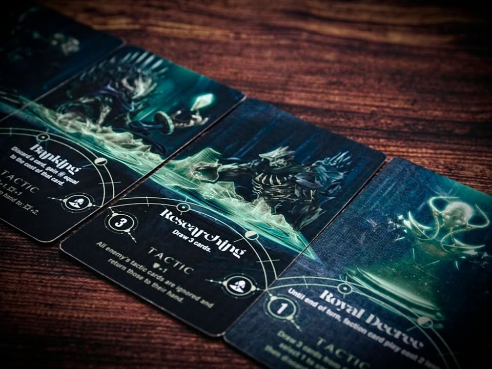

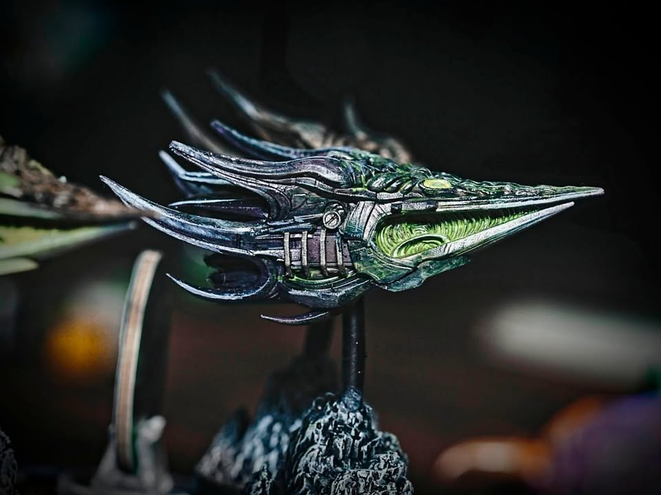

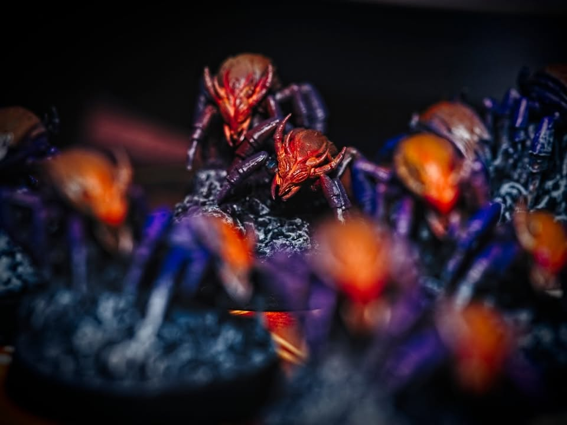

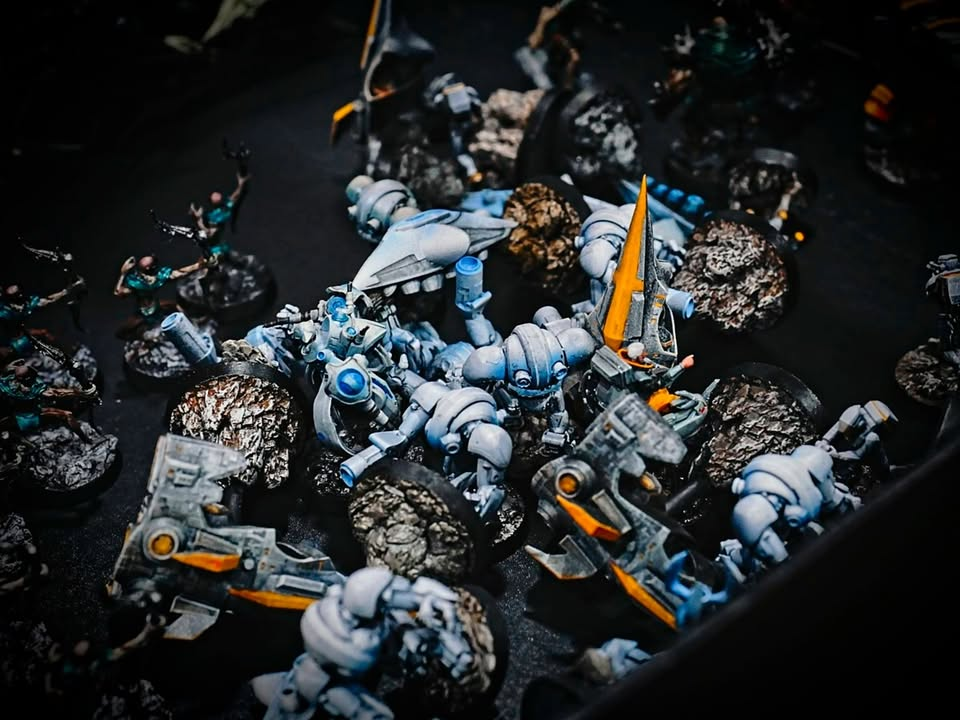

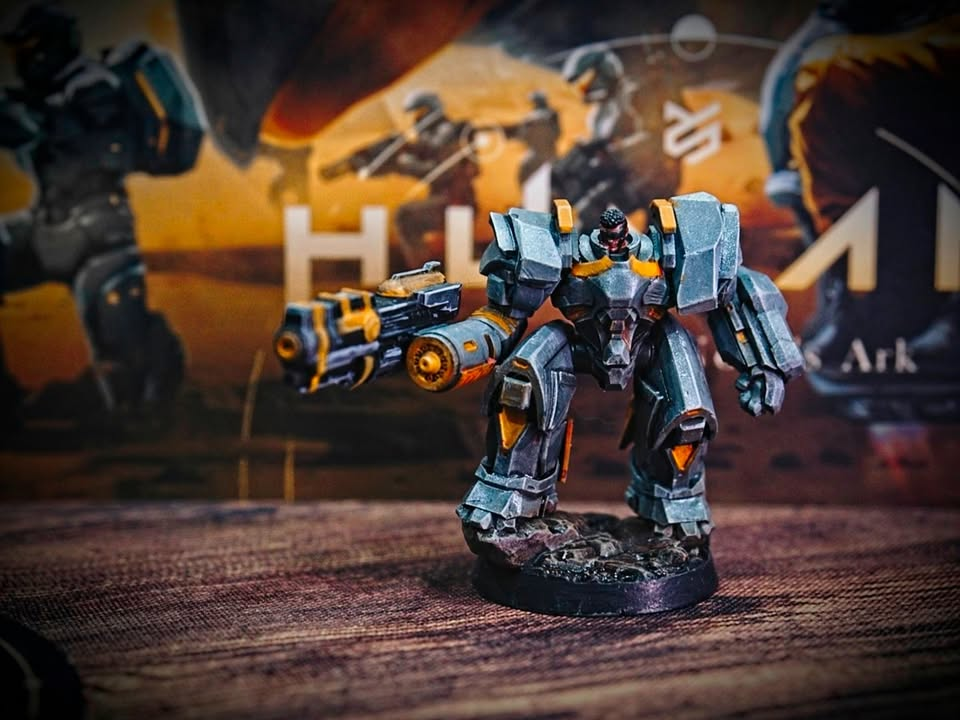
