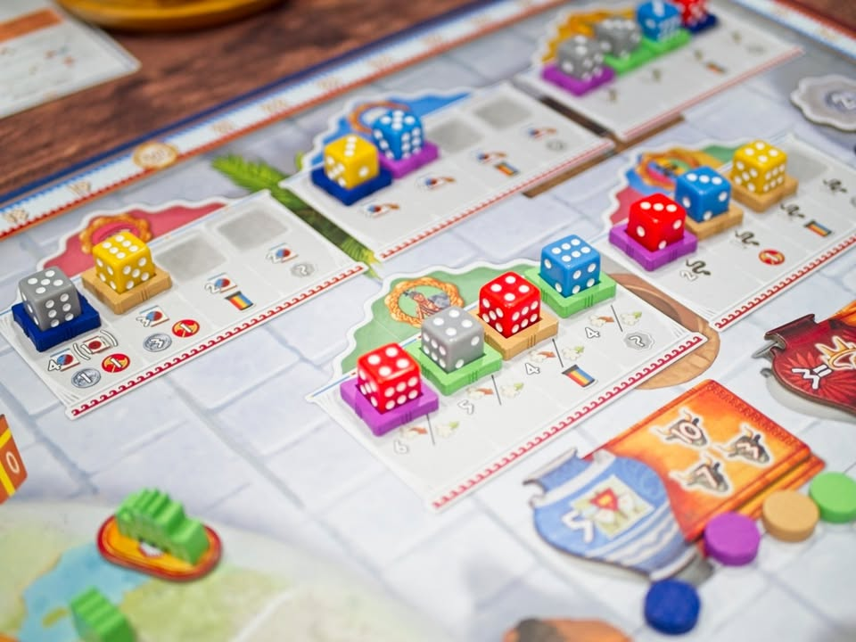
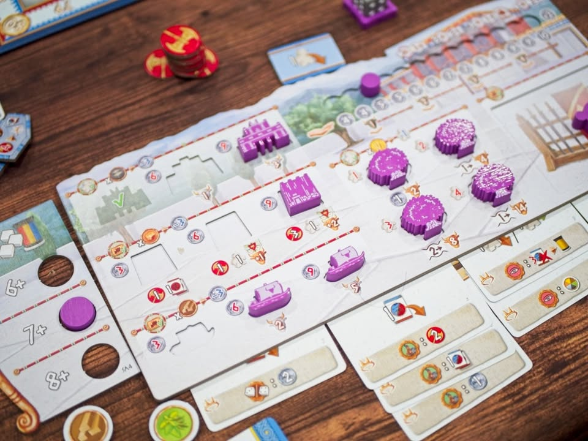
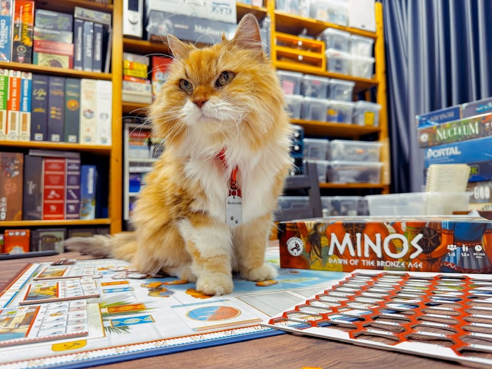

Minos: Dawn of the Bronze Age

อารยธรรมมิโนอันถือเป็นหนึ่งในอารยธรรมที่เก่าแก่ที่สุดของยุโรป ที่เจริญรุ่งเรืองบนเกาะครีต (Crete) ในทะเลเมดิเตอร์เรเนียน ช่วงประมาณ 2,700-1,450 ปีก่อนคริสตกาล

ความมั่งคั่งของอารยธรรมจะมากการค้าขายกับประเทศรอบข้างอย่างอียิปต์และเมโสโปเตเมีย อย่างไรก็ตาม อารยธรรมนี้ประสบกับเหตุการณ์ที่ทำให้เสื่อมถอยจนหายไป นักโบราณคดีเองก็ยังไม่รู้ถึงสาเหตุที่แน่ชัดนัก แต่ก็คาดเดาว่าเกิดจากหลายปัจจัย อย่างเช่นการระเบิดของภูเขาไฟบนเกาะเธรา (Thera) ซึ่งส่งผลกระทบต่อภูมิภาคโดยรอบ และในที่สุดก็ถูกอารยธรรมไมซีเนียน (Mycenaean) เข้ามาครอบครอง

---
เกมนี้เดินด้วยระบบ Dice Placement ที่ผู้เล่นจะผลัดกันดราฟลูกเต๋าไปใส่ฐานสีตัวเองแล้ววางบนช่องแอคชั่น พอวางครบก็ค่อยผลัดกันหยิบออกมาทำแอคชั่นกัน แต่เกมจะซ่อนกิมมิคไว้ให้เราหลายชั้นเลย

ในชั้นแรกนั้นเวลาวางลูกเต๋าลงไปเต๋าที่มีตัวเลขน้อยกว่าจะได้แซงคิวไปอยู่หัวแถว ซี่งแน่นอนว่าได้ผลประโยชน์แอคชั่นเต็มเม็ดเต็มหน่วยสุด แต่ว่าระดับการตัดสินใจเกมจะยากตรงที่คนที่ได้เลขเยอะจะมีสิทธิ์เอาผลรวมเลขไปเดินแทรคเทคโนโลยีแทน หรือกระทั้งการอยากหยุดตัวเองในตำแหน่งที่โบนัสตรงกับแผนการเล่นมากกว่า คือเอาแค่การหยิบเต๋าไปลงนอกจากคิดว่าอยากทำอะไรแล้วก็ต้องคิดด้วยว่าผลรองๆของมันคืออะไรนะ 

---
แอคชั่นจริงๆเกมไม่ได้ยุ่งยากอะไรเพราะมีแค่ 4 แบบ คือจั่ว, เล่นการ์ด, ส่งทหารไปเดินแล้วก็สร้างสิ่งปลูกสร้างหมวดต่างๆเพื่อทำคะแนน แต่สิ่งที่ทำให้เกมมันเคลื่อนไปจริงๆคือการเล่นการ์ด (และโบนัสของมัน) ในเกมนี้แหละ

ไอเดียพื้นฐานของเกมก็คือพอเล่นการ์ดเพื่อเอา effect แล้วมันจะมีระบบที่จะย้ายการ์ดไปเก็บไว้ใต้บอร์ดของเราเพื่อสะสม trigger effect เพิ่มอีกที ซึ่ง trigger effect ก็จะทำงานทุกครั้งที่เราทำแอคชั่นใดตามหมวดของมัน ซึ่งหมายความว่าในระหว่างที่เกมกำลังเนินไป โบนัสที่เราจะได้รับระหว่างทำแอคชั่นก็จะมากขึ้นเรื่อยๆ

---
ที่เหลือก็เดินแทรค อัพโน้นนี้ไปเรื่อย อันที่คิดว่าน่าสนใจก็คงเป็นวิธีการทำ engine ราคาส่วนลดเวลาเล่นการ์ดในเกมนะ กับวิธีใช้พวก token เพื่อทำแอคชั่นก็ทำให้เกมเดินไปได้สวยดี

---
ผมค่อนข้างชอบเกมนี้นะ เรียกว่าใครมาสาย Dice Drafting ก็น่าจะชอบกันโดยเฉพาะแนวๆ Medaira, Coimbra เพราะเวลาคิดมันจะมีขยักติดอยู่ในหัวตลอดว่าจะเอาไรดีว่ะ แล้วมันคุ้มไหม ระบบคอมโบก็คือทำมาฉลาดดีเพราะมันบังคับให้เราไปหาเงินมาจ่ายเล่นการ์ดแล้วค่อยดึงเข้าไปเก็บทำคะแนน ซึ่งเราก็ต้องมาคิดอีกว่าทำไงดีว่ะ เป็นเกมที่ให้ chain of thought สวยเกมหนึ่ง

แต่จุดที่ผมค่อนข้างสะดุดมากก็คือด้วยความที่คอมโบมันเยอะเยอะเก็บโน้นนี้มากมายมันก็แลกมากับการที่ downtime นานมาก นานแบบผมคงไม่เล่นเกมนี้ที่ 4 คนอีกแล้วเพราะนานเกินไปแบบไม่สนุกเพราะเจ้าของคอมโบมันก็งึมงำอะไรของมันไปแหละสังคมก้มหน้าจัดๆ (คือผมชอบมันในฐานะเกม 2-3 คนนะ) 

อีกจุดที่ขัดใจนิดหน่อยคือ conflict ในกระดานกลางไม่มีเลยแม้ว่าในหนึ่งพื้นที่จะสร้างของได้แค่จากผู้เล่นคนเดียว ก็เพราะว่ามันมีที่ว่างพอสำหรับทุกคน....  ระบบคิดคะแนนแบบ majority ก็ไม่ได้โดดเด่นนักเนื่องจากทุกคนจะมีทหารในปริมาณที่ใกล้เคียงกันมากจนระบบแต้มมันไม่ได้ขาดกันขนาดนั้น ทำให้มิติที่จะดึงผู้เล่นมาขัดแย้งกันโดนความคอมโบงึมงำกลบเยอะเหมือนกัน

ปัญหาของมันสำหรับผมเลยกลายเป็นเกมที่ยังโดน Dice Drafting เกมอื่นกดทับอยู่ แต่ถ้า 3 คนนี้คือ shine เลย และด้วยความที่ conflict กระดานกลางมันไม่มีก็ไม่แปลกเลยที่จะเหมาะกับผู้เล่นสองคนมาแข่งแบบ racing กัน (สายคู่แฟนอยากแข่งแต่ไม่ตีกัน มองข้ามเกมนี้เพราะเห็นมียึดพื้นที่ก็อาจจะลองกลับมามองหน่อย แต่เกมนี้ไม่มี catch up อะไรให้นะ)

---
(My) Collection Fit: สนุกดี ชอบ แต่คงเก็บไว้สำหรับตอนเล่น 3 คน เล่น 4 รอม่ายไหว
  
What I like: ระบบ dice drafting ที่ต้องลีลามีคิดหลายขยัก ทำคอมโบเก็บของสนุก กติกาค่อนข้างคลีนอ่านง่าย
  
What I dislike: เกมมันเวลาเครื่องติดคนมันจะงึมงำทำโบนัสกันแล้วรอนานนนนนนน การปะทะแย่งที่กันในกระดานกลางก็ไม่ได้มีมิติอะไรน่าสนใจเพราะโดนจำกัดจำนวนพื้นที่ที่ยึดได้
  
I think this game might be a good fit for...: สายยูโรที่ชอบ dice drafting ทั้งหลาย
  
I think this game might NOT fit for...: ถ้ามองหาเกมยึดพื้นที่อันนี้ไม่ตอบโจทย์ กับใครไม่ชอบเกมที่คนต้องมาอธิบายว่าตัวเองเก่งยังไงก็ข้ามได้เลย

