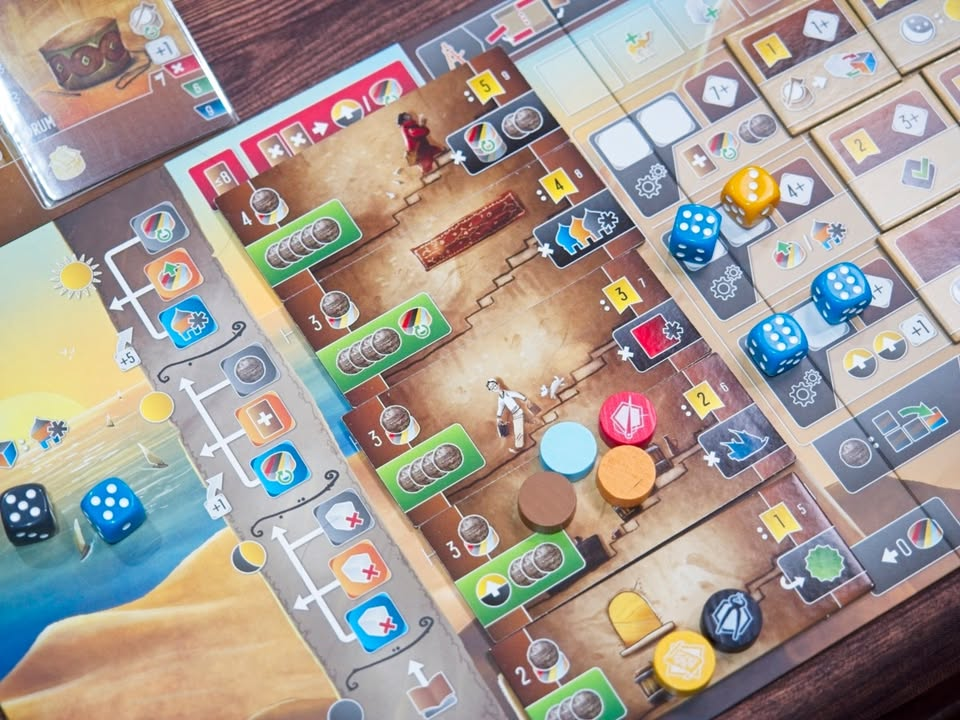
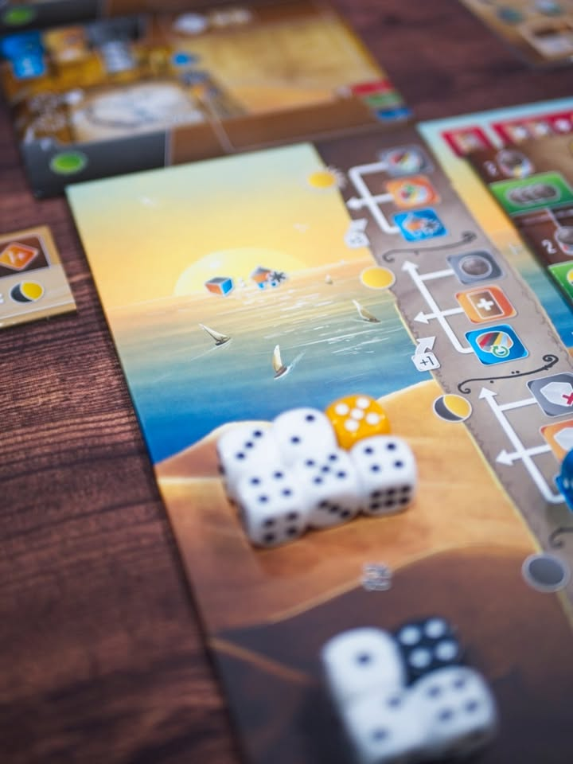
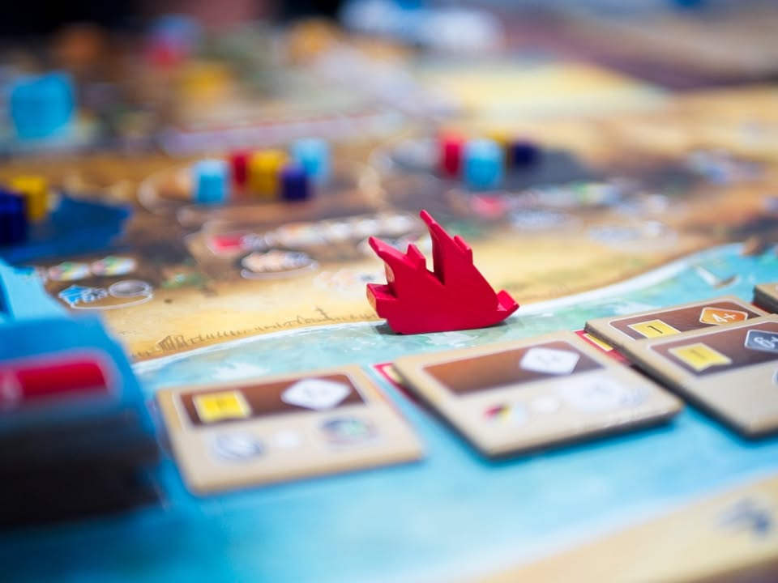

Inventors of the South Tigris - เพราะองก์ความรู้นั้นต้องช่วยกันใช้

เกมอันดับ 9 ในตระกูล 4 ทิศ และเป็นอันดับสุดท้ายของตัวทิศใต้ (ใต้ยุโรปก็คือแถบอาหรับ) โดยเกมนี้ถือว่าเป็นเกมที่หนักที่สุดของทีมนักออกแบบเลยทีเดียว

---
ไอเดียหลักเกมเดินด้วยสองระบบขนานกันคือ Dice Placement ที่เราจะมาทำแอคชั่นในกระดานของเรา และ Worker Placement ที่จะเอาคนงานไปแย่งทำแอคชั่นกลาง (ซึ่งจริงๆเราก็เห็นระบบนี้มาตั้งแต่ใน Wayfarers)

เกมนี้เหมือนจะซับซ้อนก็จริงแต่ถ้าเล่าไปทีละเลเยอร์ผมก็ไม่คิดว่ามันจะวุ่นวายเกินนะ โดยขั้นแรกสุดคือเกมเล่นกับไอเดียการนำเสนอนวัตกรรมสิ่งประดิษฐ์ ในกระดานกลางจะมีบอร์ดสิ่งประดิษฐ์ว่างๆอยู่ 4 อัน (ขอเรียกเอาเองว่า stage 0)

ทีนี้ผู้เล่นซักคนก็จะทำแอคชั่นบนบอร์ดตัวเอง เล่นเต๋าให้ถึงมูลค่าที่กำหนดกับจ่ายโน้นนี้ไปตามเรื่องเพื่อเล่นการ์ดจากมือไปลงทีนี้บอร์ดก็จะเข้าสู่ stage 1 เพราะว่ามีทั้งไอเดียและสิ่งประดิษฐ์แล้ว

พอจะไป stage 2 ก็คือต้องมีผู้เล่นซักคนไปทำแอคชั่นเอางานวิจัยไปผลิตเป็นของมา (ก็ต้องเอาเต๋าที่มูลค่าถึงไปทำ) ก็วางมาร์กเกอร์ไว้

พอจะไป stage 3 หรืออันสุดท้ายก็จะมีผู้เล่นซักคนไปทำแอคชั่นเผยแพร่ให้โลกรู้ ก็วางมาร์กเกอร์ไว้ไว้เช่นกัน

---
ความซับซ้อนของเกมจะแทรกอยู่ในระหว่างหลายๆ stage นี้แหละ เอาที่ปลายทางก่อน คือการ์ดแต่ละใบมันจะมีสภาพเป็น objective ที่จะมีคะแนนถ้าคุณทำอะไรซักอย่างตามเงื่อนไขการ์ดได้ แต่ว่าการจะทำคะแนนได้คุณก็ต้องไปทำแอคชั่นที่อนุญาตให้เราเอามาร์กเกอร์ไปวาง นั้นคือผลิตและเผยแพร่

ในขณะที่ลูกเต๋าเองเราจะมีจำนวนเท่าเดิมเสมอระหว่างเล่นมันจะมีระบบบริหารเต๋าอยู่โดยเต๋ามีอยู่ 4 stage (ไอเดียโคตรเท่) คือตะวันตกดิน/ย่ำรุ่ง ยามเช้า/กลางวัน (จริงๆในเกมเรียกชื่ออื่นแต่มันไม่ค่อยสื่อเท่าไร) จริงๆก็ไม่มีอะไร เต๋าที่ใช้แล้วมันจะไปอยู่ระดับล่างสุด อันที่ยังไม่ได้ใช้ก็จะเลื่อนระดับขึ้นไป ถ้ารอนานพอมันก็จะได้โบนับบวกแต้มด้วย (โดยเฉพาะถ้าเราดวงไม่มีทอยเต๋ากากก็ต้องรอแหละ) ระหว่างทางเกมก็จะมีจังหวะให้เราฟอกสีเต๋าไปทำแอคชั่นโน้นนี้ต่อ

---
ทรัพยากรที่ใช้ตามรายทางอีกอย่างของเกมคือช่างฝีมือ เป็น disc กลายสีตรงหน้าเรานี้แหละเอาไว้เวลาจะ up stage สิ่งประดิษฐ์เรา ซึ่งพอใช้งานมันจะคว่ำเราก็ต้องไปหาทางหงายเอาตามหน้างาน 

ความเท่ของ disc คือมันจะไต่ระดับขึ้นไปได้เรื่อยๆเพื่อทำคะแนน ถ้าเดินไปเยอะเราก็จะได้โบนัสฟรีรายทางเพิ่ม แต่ว่าไอ้การทำคะแนนเนี่ยช่างจะราคาแพงขึ้นเวลาเอาไปใช้งานสร้างสิ่งประดิษฐ์ก็ต้องหาเงินมาจ่าย

---
ระบบทำแอคชั่นบนบอร์ดเราเองก็น่าพูดถึงเนื่องจาก customized ได้หลายท่ามาก คือจริงๆเรามีแค่ 3 แอคชั่นให้ทำ ก็วางเต๋าให้เลขถึงก็จะได้อะไรมานิดหน่อย แต่ว่าด้วยความที่มันเป็นตาราง ทำให้เราสามารถหยิบไทล์โน้นนี้มาโมให้มันเกิด chain bonus ได้ต่อด้วย ทำให้เกมแต่ละเกมมันมีความหลากหลายสูงอยู่เหมือนกัน

---
รายละเอียดเกมในเชิงความสัมพันธ์ของทรัพยากรยังมีอีกเยอะแต่หลักๆก็เท่านี้แหละ เล่นกันแค่ 3 - 4 รอบใหญ่ก็จบเกม (มีโหมดสั้นกับยาวน่ะ)

---
นอกเรื่องนิดนึงผมชอบที่การนำเสนอของนักออกแบบมุ่งเจาะประเด็นได้น่าสนใจดีนะ ไม่ได้แบบเอะอะอะไรก็ค้าขายสู้รบดินแดนล้าหลัง แต่ว่า portrait  ดินแดนในส่วนนี้ว่ามันมีการเดินทาง มีการค้นคว้าวิทยาการต่างๆมากมาย (ซึ่งตามประวัติศาสตร์โลกว่ากันตรงๆก็ช่วงไหนศาสนานำหน้าเยอะวิทยาการก็โดนฟรีซเอาตอนนั้นแหละ ช่วงครูเสดฝั่งยุโรปก็นำเข้าความรู้จากฝั่งอาหรับเยอะ เพราะวิจัยเองเยอะละเดี๋ยวโดนเพ่งเล็ง)

---
ว่ากันตามตรงเกมสายคิดเยอะของ S J Macdonald + Shem Phillips เนี่ยปกติผมไม่ได้ให้ความหวังเยอะเท่าไรเพราะมันจะงึมงำกับตัวเองซะมาก ผมไม่ชอบ  Paladins กับ Viscounts เลย น่าเบื่อรอจะหลับ (content counter จากเพจหนึ่งกำลังจะมาในอีก 3... 2.. 1.) ตัว Scholars ทำมาดีขึ้นมากแล้วมา Inventors คือเห้ยสนุกหว่ะ ทำสมดุลย์ระหว่างคิดเองกับแบ่งส่วนกลางได้สวยเลยชอบมาก

แต่กระนั้นก็คือด้วยความที่มันซับซ้อน เวลาคิดก็นานตาม ผมคง happy ที่จะเล่นเกมนี้แค่ 3 คนนะ 4 คนม่ายไหว

---
ส่วนที่ผมชอบก็คงเป็นเรื่องการดูจังหวะทำคะแนนจากหมวดกลางมั้ง คือมันมีเลเยอร์หลายขั้นดี แบบเสนอไอเดียสิ่งประดิษฐ์เฉยๆมันไม่ได้นะ ต้องดูด้วยว่ามีใครอยากช่วยผลักไอเดียเราไป stage ถัดไปหรือปล่าว เพราะว่าการที่มันจะไปอยู่ในจุดทำแต้มก็ต้องมีหลายคนช่วย หรือการเดินเรือเพื่อเพิ่มเทคมันจะต้องเอาลูกเต๋าไปวาง เราจะเลือกวางที่บอร์ดใครเพราะคนที่อยู่ในบอร์ดจะได้แต้มด้วยไรงี้

รวมๆก็มีจังหวะคิดสวยๆหลายอันไทล์สุ่มหยิบมาเติมก็แบบเห้ยโบนัสโบ๊ะบะดี
---
  
(My) Collection Fit: อย่างมันส์ เล่นละแรมหมดแต่สนุก ในฐานะคนที่เก็บกล่องแดงอันเดียวคือ Architects กล่องเหลืองนี้คือดีทุกอันเลยแล้วเกมนี้ผสมจังหวะแล้วก็ไอเดียได้สวยเลย
  
What I like: ระบบความคิดที่ผูกซ้อนแอคชั่นเข้าด้วยกันโดยที่ไม่ได้เป็น interlock อึดอัด
  
What I dislike: เกมไม่ได้มีระบบโมหน้าเต๋าให้ กับรายละเอียดมันเยอะอธิบายเหนื่อย downtime ก็เอาเรื่องอยู่ถ้าเล่น 4 คน
  
I think this game might be a good fit for...: ขาเกมยูโรนวดสมอง
  
I think this game might NOT fit for...: ฉันจะไม่เล่นเกมนี้ 4 คน นานเกิ๊น กับคนที่ไม่ชอบเกมยูโรที่ระบบมันเกี่ยวเนื่องแบบอ้อมๆกันเยอะแยะหลายเลเยอร์ แล้วก็คิดว่าก่อนมาเกมนี้ควรผ่านยูโรหนักมาหลายเกมหน่อยจะได้ไม่เหนื่อยมาก (ไม่ก็เล่นเกมอื่นในซีรี่ย์นี้ไต่ๆระดับมาก่อน)

