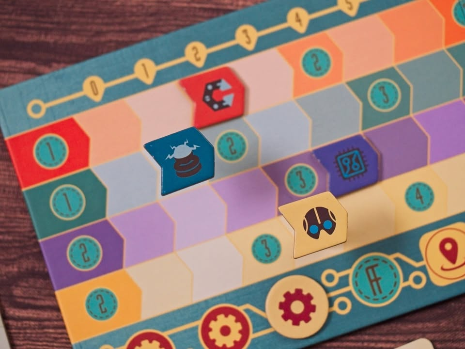

เศรษฐศาสตร์อัตคัตฉบับกระเป๋า - Future Inc. 

การ์ดเกมขนาดเล็กที่ความเข้มไม่เล็กตามกล่องเกมนี้จะให้เรามาเปิดโรงงานขายของแข่งกัน

---
ไอเดียของเกมคือเราจะเริ่มมาพร้อมเงินทุนจำนวนหนึ่งในตาหนึ่งเราจะก็จะทำได้สามอย่าง

อย่างแรกที่เป็นแกนหลักของเกมนี้ก็คือจ่ายเงินหยิบการ์ดมาเป็นโรงงานผลิตของ (ในเกมมีของ 4 ชนิด เรื่องธีมก็ช่างๆมันแหละ) ทีนี้ตัวโรงานมันจะมีราคาพื้นฐานอยู่ กับบอกว่าจะเปิดโรงงานนี้ต้องซื้อวัตถุดิบอย่างอื่นมากี่ชิ้นเราก็จ่ายเงินซื้อเพิ่มเอาตามราคาตลาด แต่ถ้าบังเอิญจังเรามีโรงงานผลิตของที่ต้องใช้พอดีเราก็จ่ายส่วนนี้น้อยลง

ส่วนที่ทริคกี้ของเกมจะอยู่ตรงที่เราเปิดโรงงานอะไรไม่สำคัญ แต่มันจะเพิ่ม demand ให้กับสินค้าที่โรงงานเราต้องการ อย่างเช่นโรงงานผลิตชิปเราต้องการแม่เหล็ก demand ของแม่เหล็กก็จะเพิ่ม

อย่างที่สองคือหยิบการ์ดโรงงานมาเป็นเงินสดจากนั้นก็เพิ่มหรือลด demand ของสินค้าที่เกี่ยวกับโรงงานเราได้

---
ก่อนจะไปอย่างที่สามก็บอกก่อนว่าเกมก็ให้เราวนๆทำแอคชั่นอยู่ 3 ครั้งก่อนที่จะให้เราขายของหนึ่งที ไอเดียการขายของในเกมนี้คือในแต่ละหมวดหมู่ใครตั้งราคาถูกสุดก็ได้ขายก่อน ขายชิ้นนึง demand ก็ลดลงทีนึง demand หมดก่อนก็ขายไม่ได้ไปนะจบ 

ไอเดียการตั้งราคาจะมาจากการ์ดโรงงานที่เราซื้อมานั้นแหละแต่ละใบมันมีราคาขายสินค้าไม่เท่ากัน เวลาซื้อเราก็เลือกได้ว่าจะเอามาวางทับใบเดิมเพื่อเปลี่ยนราคาขายหรือเอาไปเสียบด้านหลังเพื่อเอาแต่กำลังการผลิตก็ได้ 

ซึ่งก็วนกลับมาแอคชั่นที่สามที่เราสามารถหยิบการ์ดมาเพื่อปรับราคาขายชั่วคราวได้แบบ +- 1/2 หน่วยแล้วแต่ใบ

ส่วนที่เสริมให้เกมไม่นิ่งเกินไปก็จะเป็นส่วนของ event ที่ผู้เล่นจะได้รับมาจำนวนหนึ่ง มีผลที่จะช่วยปรับระดับ demand ตอนต้นรอบและช่วยให้ผู้เล่นมี mission เล็กๆที่อยากจะซื้อโรงงานบางแบบเพื่อให้ได้เงินโบนัสมาหมุนซื้อของเพิ่ม

---
ชอบมากเกมนี้ รอซื้อตั้งแต่ตอนที่ได้เล่นปีก่อนละ ในฐานะเกมกล่องเล็กคั่นเวลาของสายคนเล่นเกมหนักนี้ทำมาสวยมากๆ เรียกว่าเป็นสิ่งที่ Arkwright: The Card Game ควรจะเป็น (แต่ดันทำไม่ได้เพราะติดกับดักอยากทำให้เหมือนเกมต้นฉบับ) แอคชั่นน้อยเบียดแบบพอมีทางแก้ลำโดยไม่อึดอัดทำไรไม่ได้แต่ก็ไม่หลวมจนเล่นมั่วๆก็ไม่เป็นไร

ที่ชอบอีกหลายอย่างก็คงเป็นความเชื่อมต่อของระบบที่มันไม่ได้จบแค่หยิบการ์ดแต่มันโยงทั้งต้นทุนที่เรามี สินค้าที่เราขายได้และ demand ในตลาดที่อีก แค่ขนาดทิ้งการ์ดเอาเงินยังมีผลกับทุกคนว่าจะขายของได้ไหม คือเกมแม่งต้องคิดหมด เราซื้อโรงงานแค่คนอื่นดันขายของได้ไรงี้ 

---
ส่วนข้อเสียจริงๆก็คือระบบแทรคนับเงินที่โอเคมันใช้งานได้แหละ ประหยัดที่ดี แต่ไม่ค่อยสะดวกเท่าไรต้องพลิกหน่วยไปมา แนะนำว่าใช้เหรียญกลางมาแทนจะดีกว่ามากๆ กับด้วยธรรมชาติของตลาดที่สุ่มเปิดบางทีก็ต้องเล่นแบบยอมรับว่าดวงไม่มาซื้อแต่ของแพงก็ช่วยไม่ได้จริงๆ

กับด้วยความที่มันเป็นการ์ดเกมแห้งๆกล่องเล็กก็อาจจะไม่ได้มีความลุ่มลึกอะไรขนาดนั้นนะ เหมาะกับเป็นเกมคั่นเวลาหยิบสลับฉากมากกว่า เน้นแก้ปัญหารอบต่อรอบ

---
(My) Collection Fit: ซื้อดิ๊ best tight economic theme in small box ที่มานึกๆแล้วโดดเด่นมาก คู่แข่งที่ใกล้เคียงไม่น่ามี
  
What I like: ระบบการเล่นที่แอคชั่นมันเชื่อมโยงกันหลายมิติแบบเป็นเหตุเป็นผล ระบบ demand ที่ค่อนข้าง tight ทำให้ผู้เล่นต้องกระเสือกกระสนดี
  
What I dislike: แทรคเงิน ม่ายไหวจริงๆ
  
I think this game might be a good fit for...: แฟนๆเกมหนักที่ชอบธีมธุรกิจ อัตคัตนับเงิน แล้วอยากหาเกมคั่นเวลา (ซัก 45 นาที)
  
I think this game might NOT fit for...: คนที่ไม่ชอบเกมบวกลบเลขธีมแห้งๆ

---
this is a gifted product from Thumbs Up Boardgame, no money changed hand for this content. ได้รับสินค้าโดยไม่มีค่าใช้จ่าย คอนเทนต์ทำเพื่อแสดงความเห็นส่วนตัวเกี่ยวกับเกมโดยไม่มีการจ้างวาน

