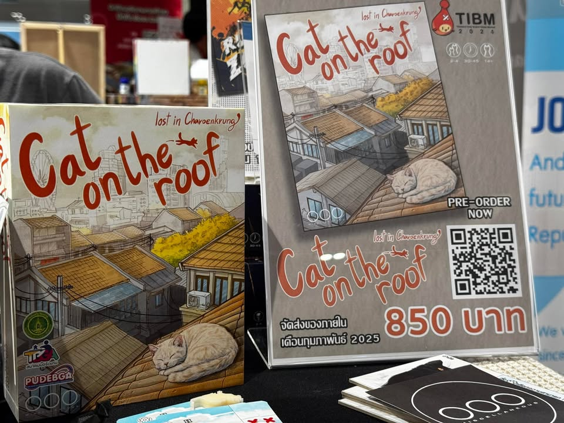
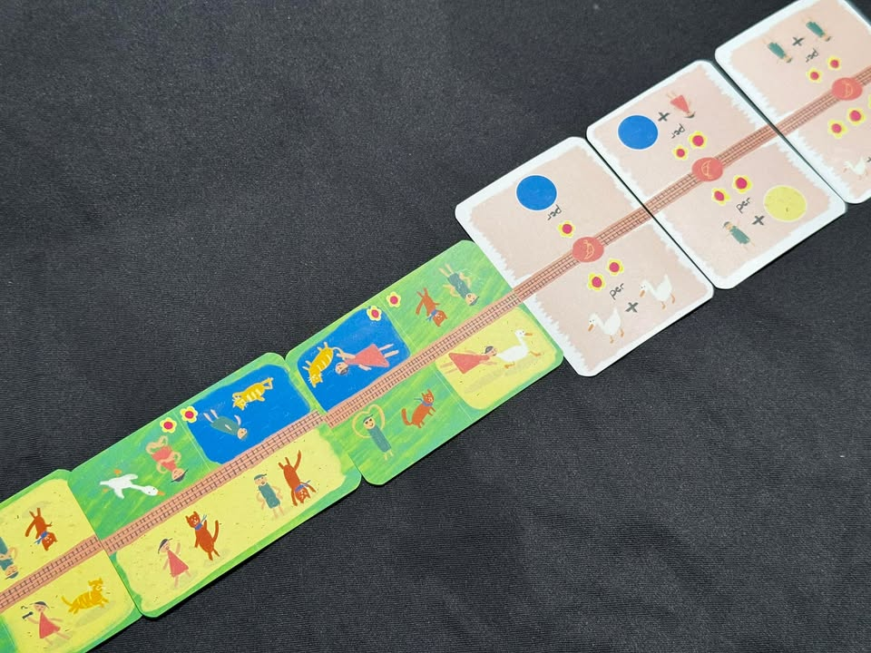
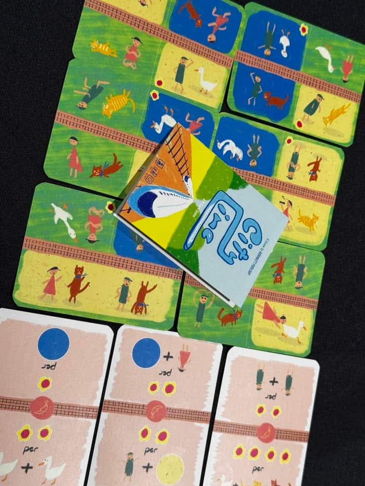
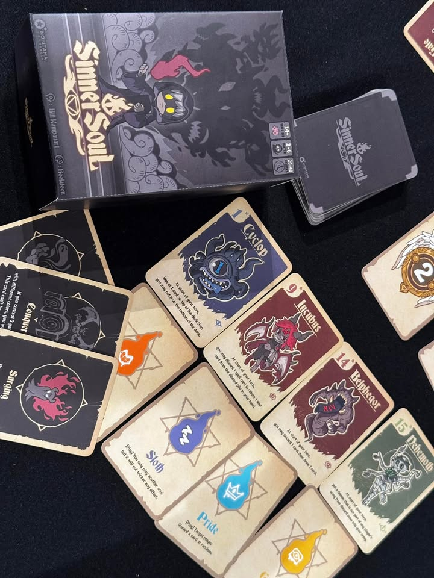
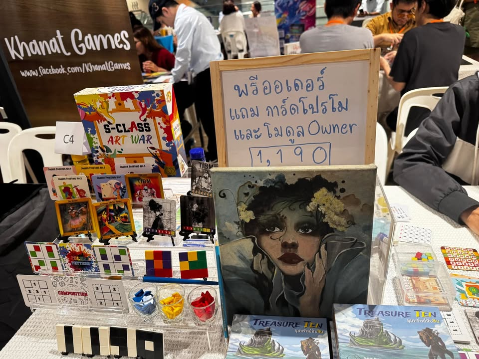
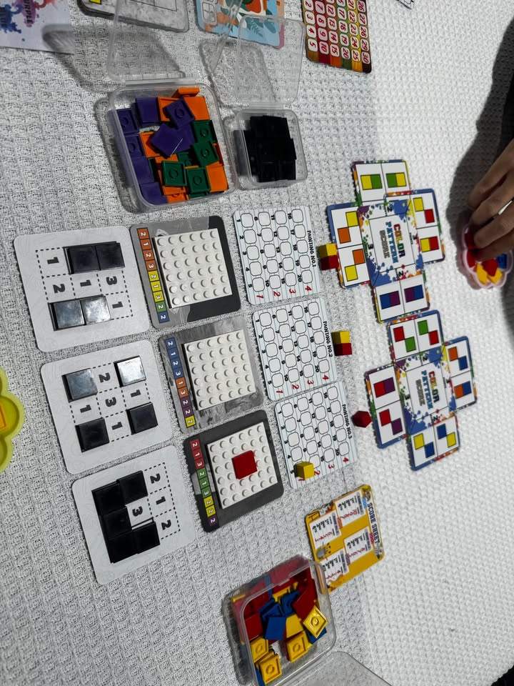

Tibm quick #5  

Cat on the roof - เกมอันดับหนึ่งจากงานประกวดเกม 4 ย่าน รอบนี้คือร่างที่พัฒนามาดีขึ้นไปอีกเพราะมีไอคอนและวิธีการทำคะแนนที่เข้าใจง่ายขึ้น ระบบความคิดก็ไม่รุงรังแต่ว่าสวยขึ้นมากๆ เล่นโดยการผลัดกันดราฟตึกแถวย่านเจริญกรุงพร้อมกับบันทึกการเดินทางของน้องแมว, pre order 850

City line - การ์ดเกม 9 ใบไอเดียเรียบง่ายแต่คิดเยอะเหมือนกันสำหรับเกมสิบนาที ไอเดียคือเราจะต้องมาต่อเติมวิวข้างทางรถไฟฟ้าโดยทำเราและคู่แข่งพร้อมกัน แต่ว่าแต่ละฝั่งจะมีตัวคูณคะแนนไม่เหมือนกันและสามารถเพิ่มได้จากการพลิกการ์ดเส้นเส้นทางให้กลายเป็นด้านทำคะแนน และการชนะคู่แข่งห้ามชนะเกินหกแต้ม ทำให้หลายครั้งการยัดแต้มใส่ฝ่ายตรงข้ามนั้นสนุกกว่ามาก ไอเดียดีพกง่าย, พร้อมจำหน่าย 150 บาท

Sinner Soul - การ์ดเกมสไตล์ take that ที่เราจะมาปั้นกองทัพปีศาจมาโจมตีวาติกัน ไอเดียคือการสะสมการ์ดไปพลางเตะตัดขาคนอื่นไปพลาง ชอบงานอาร์ทนะคลีนสวยดี ทำโทนภาพสะอาดตา , pre order จำราคาไม่ได้

S-class artwar - เกมผลัดกันวางไทล์สีเพื่อทำคะแนนบนรูปวาด ตำแหน่งและลำดับการวางไทล์สีนั้นล้วนมีผลกับคะแนน จุดเด่นคือคะแนนจะมาจากแค่สองรูปที่ดีที่สุดจากสามรูปเท่านั้น อุปกรณ์เป็นเลโก้, pre order 1190

