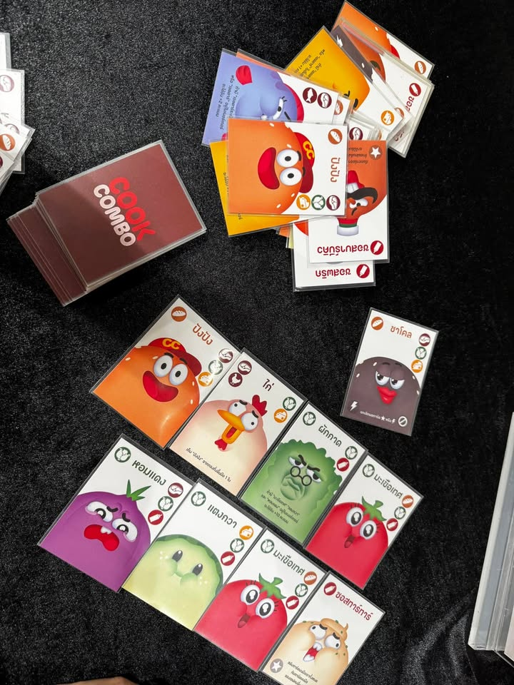
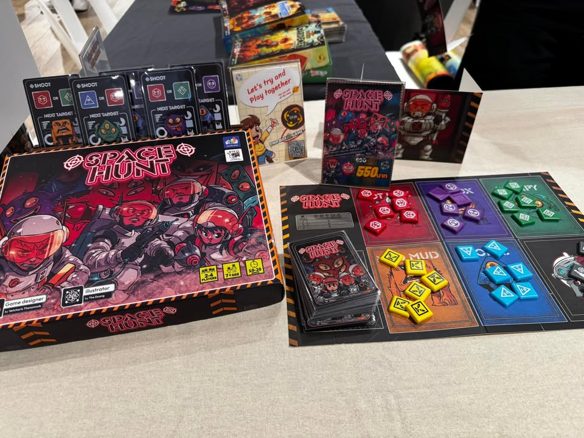
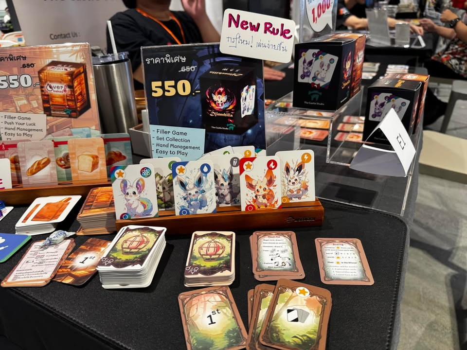
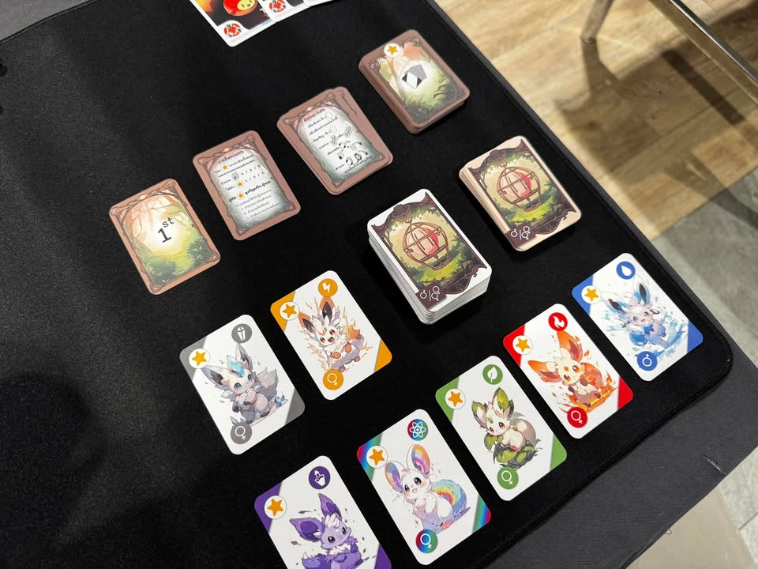
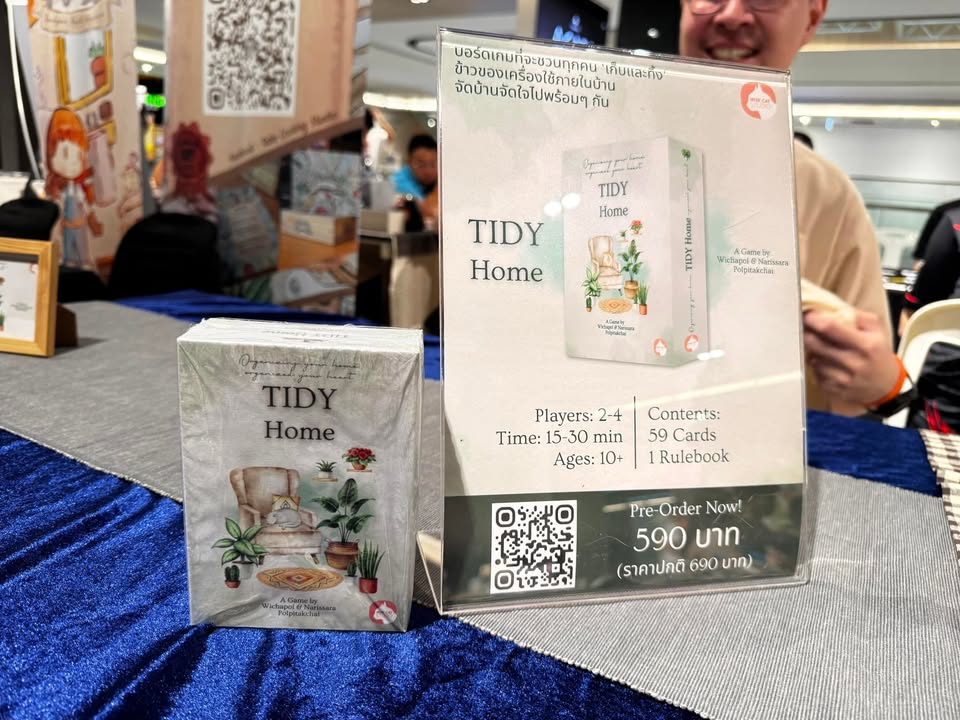
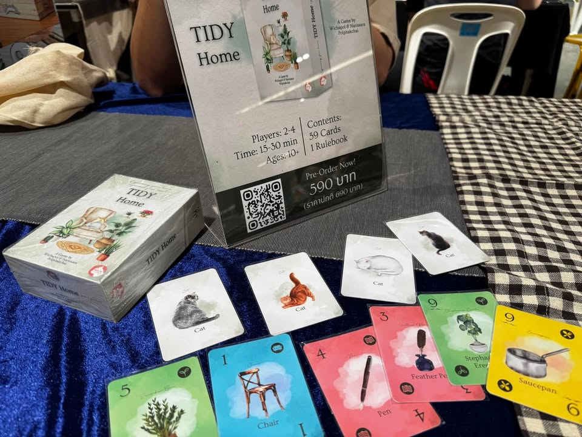

TIBM quick #6 

Cook Combo -   เกมแนวสะสมวัตถุดิบทำแฮมเบอเกอร์ที่เน้นการเรียงคอมโบเพื่อทำคะแนน แต่ว่าต้องระวังให้ดีเพราะมันมีการ์ดแกล้งเพื่อนจำนวนมากที่จะขัดขวางการทำคอมโบของเรา , ไอเดียสั้นๆคือจั่วเติมมือหรือเล่นนั้นแหละแต่จะมีลีลาตรงการลงการ์ดทำเชนมันต้องไล่ไอคอนไปเรื่อยๆ อย่างเริ่มจากขนมปัง ตามด้วยผัก ต่อจากผักก็ต้องไล่ไอคอนต่อๆกัน แต่ตอนกำลังเล่ามันส์ๆโดนเพื่อนยัดการลบก็จะเหงาหน่อย,pre order 590

Space Hunt - เกมของอาร์ม dnr เจ้าเก่าเกมนี้ออกใหม่ เป็นเกมทรงเด็กหน่อยแต่แอบตัดกันเดือดอยู่นะ ไอเดียคือเรามีการ์ดปืนที่จะต้องยิงเอเลี่ยนสีเดียวกัน แต่ว่าราสามารถเก็บไทล์ได้ 2 สีคือสีที่ยิงกับสีที่การ์ดบอก ไอเดีัยคือไทล์สีมีจำกัดและจะมีการวัดคะแนน majority คู่สีที่แตกต่างกันไปในแต่ละเกม, พร้อมจำหน่าย 550

Djinnchilla - เกมจากงาน tibm ปีที่แล้วแต่มีการปรับกติกาใหม่ให้ลีนขึ้นมาก ไอเดียคือเราจะมีการสะสมน้องภูติน่ารักหลากสี แต่การเก็บเพื่มนั้นเราจะต้องเอาน้องสองเพศมาผสมพันธ์กันถึงจะหยิบการ์ดจากกองกลางได้ แล้วตัวภูติก็ต้องมีที่เก็บเป็นของตัวเองด้วยก็จะต้องมาบริหารมือกันหน่อย พร้อมจำหน่าย ซื้อคู่กับเกมทำขนมปัง 1000 ถ้วน

Tidy Home -  เกมจากงานปีที่แล้วเช่นกัน เป็นแนว tick tacking  ที่จะให้เรามาสะสมของทิ้งจากในบ้านกัน ของมีสี่หมวดแต่ว่าถ้าใครเก็บแล้วไม่เยอะสุดก็จะกลายเป็นแต้มลบแทน, พร้อมจำหน่าย 590

