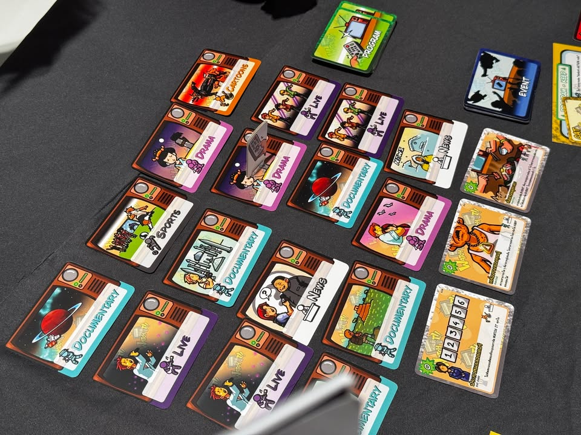
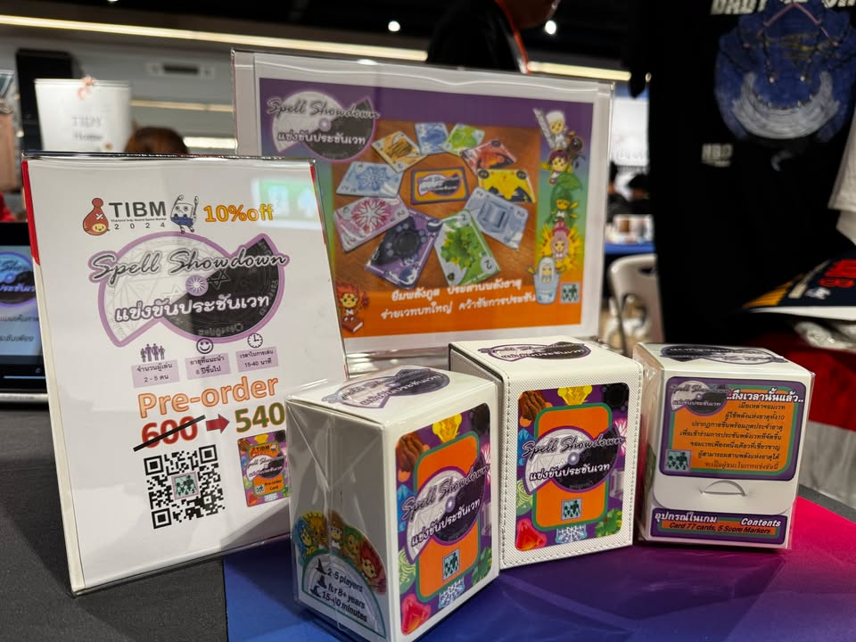
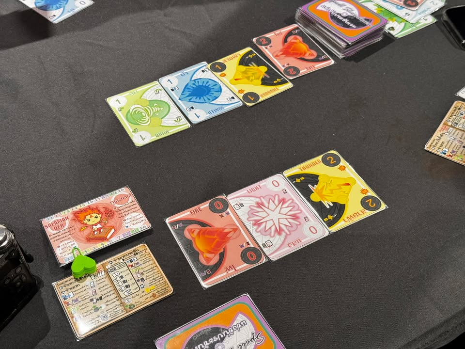
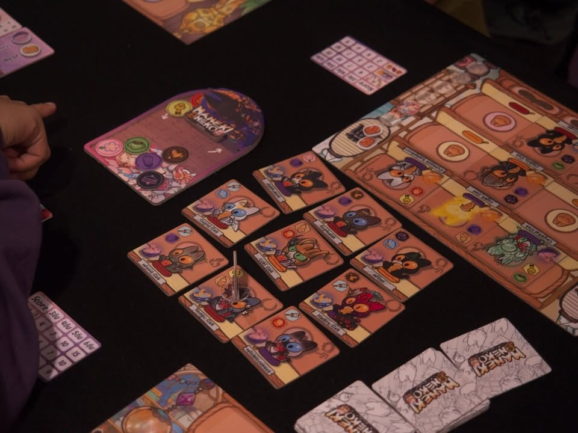

tibm quick #8 หมดละต้องขออภัยหลายเกมที่ลงช้าหรืออาจจะถ่ายไว้แต่ลืมลงด้วยครับ หมดวันไปแบบงงๆเก็บตกเกมได้น้อยกว่าที่คาดไว้เยอะเลยสองวันได้เล่นแค่ 30 เกมนิดๆเอง -_-

PZZLE - เค้าบอกว่าไม่ได้ขายเกมแต่เป็น platform ถ้าพูดแบบง่ายๆเวลาซื้อก็คือเราจะได้อุปกรณ์กลางมาชุดหนึ่งเอาไปเล่นเกมที่เค้าออกแบบมาได้หลายๆเกม ตอนนี้มี 8 เกม แต่เป้าหมายคือจะไปถึง 100 เกมทั้งจากผู้ออกแบบเองและคอมมูนิตี้ เนื่องจากไม่ได้เล่นทุกเกมเรื่องความสนุกคง justify ไม่ได้เพราะต้องพูดแยกเป็นรายเกม เท่าที่ลองหัวหอกสองเกมแล้วคิดว่าไอเดียการออกแบบค่อนข้าง unorthodox (ขอโทษที่ใช้คำยาก) อยู่เหมือนกันถ้ามองจากมุมบอร์ดเกมสมัยใหม่ แต่ถ้าใครชอบเกมแนวคิดอะไรเยอะแยะ แต่ต้องเดาใจดักทางทรงๆ poker ก็น่าจะถูกใจกับเกมตั้งต้นที่ออกแบบมานะ กล่องมีหลายธีมทำภาพใช้เทคนิค ai generate ที่คุมโทนภาพมาได้ดีทำให้งานออกมาสวยทุกใบ, พร้อมจำหน่าย expansion (card only) 880, starter (token/board etc) 680

Watch It - เกมออกมาซักพักละแนวเด็กโข่งยุคที่ทั้งบ้านมีทีวีเครื่องเดียวและยังไม่มี smartphone จะได้รำลึกความหลังกันเพราะเราจะมาแย่งชิงรีโมททีวีเพื่อเปลี่ยนช่องรายการทีวีให้เป็นไปตามเป้าหมายการรับชมของเรา เป็นแนวเลือกหยิบการ์ดจาก grid, พร้อมจำหน่าย 750

Spell Showdown - ประชันเวทผ่านธาตุทั้งสิบ เกมจะมี 2 ขยักคือจังหวะรวบรวมพลังธาตุที่จะเปิดแบบ push your luck พร้อมกับสำแดง effect ของการ์ดไปเรื่อย ถ้าเลือกหยุดก็จะได้เก็บการ์ดไว้แต่ถ้าเปิดซ้ำก็ว่าวหมด ในขณะที่อีกส่วนคือการรวมรวมการ์ดที่เก็บมาได้เรียกรวมชุดแนว poker  เพื่อทำคะแนน effect มีความซับซ้อนในระดับหนึ่งเพราะมีจังหวะใช้ 2 ขยัก,  pre-order 540

Maneki Neko - เกมแนว set collection ธีมอิงจากการจัดวางแท่นตุ๊กตาของญี่ปุ่น แต่เกมนี้เปลี่ยนเป็นแมวน่ารักๆแทน มีระบบการสะสมตามแนวตั้งนอนทั้งจากสีและรูปผ่านระบบการดันคิวสี, pre-order 1450

