มาคุยเรื่องเกมที่เปิดตัวของค่าย Siam Board Game (และค่ายอื่น) กันซักหน่อย แต่เอาจริงๆเชื่อว่าทุกคนที่ตามเพจนี้ก็น่าจะรับรู้ไปกันหมดละ ก็เลยอยากจะเล่าความรู้สึกถึงเกมที่เค้าเปิดตัวงานแล้วผมได้เล่นแล้วอยากจะ highlight มาดีกว่า (ที่ไม่ได้ลงก็คือไม่ได้เล่นนะ ไม่ใช่ไม่น่าสนใจ)

## Siam Board Game 
---
เริ่มที่ฝั่ง Siam Board Games สยามบอร์ดเกม แม่งานก่อน ในปี 2025 ก็สามารถมองได้ว่าเปิดตัวเกมค่อนข้างน้อยคือเพียง 11 ปกเท่านั้นเอง แต่ก็เรียกได้ว่าคัดมาแล้วมากขึ้น โดยเกมที่ผมขอบอกเลยว่าแฟนเพจผมน่าจะชอบแน่ๆได้แก่

---
สงครามซามูไร (Rumble Nations) - เกมนี้เคยหยิบมารีวิวแล้ว เรียกได้ว่าเป็น El Grande ฉบับ speed game ที่ผมหยิบมาเล่นกับเพื่อนบ่อยมาก และทุกครั้งก็มีคนอยากได้ตามเสมอ ติดนิดเดียวมันต้องไปซื้อที่ญี่ปุ่น อย่ากระนั้นเลยปีหน้าเข้าไทยแล้วจ้าาาา

ไอเดียคือเกม majority control ที่ 1 ตาเราจะทอยเต๋า 3 ลูกแล้วเลือก 2 ลูกเป็นทำเลเลข 2 - 12 และอีก 1 ลูกเพื่อบอกว่าจะวางทหารได้กี่ตัว จุดที่สนุกมากคือการชนะในแต่ละพื้นที่เราจะได้โบนัสทหารฟรีไปยังพื้นที่ข้างๆด้วย

เป็นเกมเล่นง่ายและสนุกครับ แนะนำ

---
Castle Combo - การ์ดเกมที่ระดับมือใหม่ก็เล่นได้ แต่ฝั่งเกมเมอร์อาจจะโบ๊ะบะมากกว่า การ์ดเกมขนาดเล็กที่เราจะผลัดกันหยิบการ์ดทั้งเกมเพียง 9 ใบ แต่ว่าด้วยความที่แต่ละใบมันมี combo ที่เกี่ยวเนื่องกับใบอื่นๆไปเรื่อยๆทำให้การหยิบและตำแหน่งที่วางการ์ดในแต่ละเกมนั้นต้องคิดอยู่ตลอด

เหมาะกับเป็นเกมคั่นเวลาเพลินๆมากเกมหนึ่งครับ ใน essen คือคนต่อคิวแย่งกันหยิบหมดแบบไวจัดๆ

---
แบตเทิ้ลรอเยี่ยว (Texas Hold it) - เรียนตามตรงผมไม่คิดว่าจะต้องมาเขียนเกมนี้ เพราะแม่งเป็นเกมธึมเฮฮาจัญไรมาก เกมไม่มีไรธีมว่าเราปวดฉี่ก็เลยต้องไปแย่งกันเข้าซอง แต่ว่าเราดันไม่รู้ว่าไอ้คนที่อยู่ข้างๆทั้งสองฝั่งมันปลดกระเด็นไปทางซ้ายหรือขวาแล้วมันจะปล่อยมารดใส่เราไหม

เกมก็เลยให้เราแอบดูกับบลัฟเบาๆ หรือสลับที่คนยืนข้างๆบ้าง ส่วนจะรีบวิ่งเข้าซองหรือจะอั้นไว้ก็แล้วแค่คุณละ

ในเชิงเกมอาจจะไม่มีอะไรมากแต่ธีมมันตลกสัปดนจัดๆ เชื่อว่าสายร้านเกมหรือหยิบไปขำๆวงเหล้าน่าจะเฮฮา

---
มอนสเตอร์อีทเตอร์ กับ Rebirth - เสียดายเหมือนกันแต่ไม่ได้เล่นฮะ

---
## NK Board Game

NK Board Game Seacon Bangkae - เอ็นเคบอร์ดเกม ซีคอน บางแค จัดเป็นร้านน้องใหม่ที่เรียกได้ว่ามาแรงพอตัว และตอนนี้เค้าก็พร้อมเปิดตัวเกมใหม่เกมแรกละด้วยเกม เจ้าหญิงจอมแก่น อันเป็นเกมแนว classic Tick-Taking เลย แต่ธีมเล่าถึงบรรดาเจ้าหญิงธีมดิสนีย์ที่เป็นสาวแกร่งไม่ง้อชายใด ถ้าเล่นแล้วหยิบทริคเป็นบรรดาเจ้าชายละก็แต้มจะลบแทน 

ทวิสที่น่าสนใจของเกมนี้คือมันมีกติกาใหม่หมุนเวียนกันไปเยอะมากเรียกว่าซื้อกล่องเดียวได้เล่น Tick-Tcking หลายสิบกติกาเลย

---
## Box & Brew Café and Board Games X Board Game Academy

---
Cat Between Us - ของดี!! การ์ดเกมที่จะให้ผู้เล่นทิ้งการ์ดเพื่อปรับมูลค่าของดอกการ์ดจากนั้นทุกคนจะหงายเอามูลค่ารวมของการ์ดที่เหลือในมือมาดูว่าใครมีผลรวมใกล้น้องแมวมากที่สุด เกมง่ายๆที่เพลินและมีเสียงอื้ออึงตลอดการเล่น

---
Monster on Hex - เกมวางไทล์ล้อมพื้นที่แบบมีสกิลเรียกว่าเป็น 'Samurai' แบบที่เรียบร้อยในการวางแต่กวนตีนจาสกิลของเผ่าแล้วก็การบริหารการวางเหลี่ยมมุมของไทล์ละกัน

---
Thrill Bomb - อันนี้ออกแนวของเล่นเกมโชว์มากกว่า ไอเดียฟังดูง่ายแต่ตื่นเต้นอยู่เพราะมันจะปล่อยลูกเหล็กให้หมุนติ้วๆๆๆก่อนจะที่ร่วงลงท่อ ผู้เล่นจะต้องกะจังหวะปล่อยลูกเหล็กของตัวเองให้ไปอยู่ด้านหลังของลูกเหล็กส่วนกลาง

---
ลูปรูป คลำคำ - อ่านดีๆนะแต่เป็นการ์ดเกมปาร์ตี้ที่สนุกดีคือด้านหนึ่งจะมีรูป 4 แบบแล้วให้เรามาทายว่าอีกด้านคือรูปไหน แต่เราจะรู้ได้จากแค่การ 'ลูบ' ส่วนที่พิมพ์นูนของการ์ดด้านล่างเท่านั้น

---
Feed The Kraken - ไม่ต้องพูดเยอะละกันกับอวาลอนร่างสมบูรณ์

---
Yeti Snack! - ไม่ได้เกี่ยวไรกับเกมเยติสปาร์เก็ตตี้ ไอเดียใกล้เคียงน่าจะ Fold it เป็นเกมที่แข่งกันพับทบถาดนำ้แข็งเพื่อให้เกิดการเรียงตัวที่ต้องการ เป็นเกมที่ต้องใช้ตรรกะวางแผนเยอะกว่าที่ตาเห็นอยู่นะ จุดขายที่ไม่รู้จะบอกทำไมแต่ควรค่าแก่การบอกคือถาดน้ำแข็งเป็น food grade เกมไม่ใช่ก็เอาไปทำน้ำแข็งต่อได้!!!

## Board Game Everyday Cafe x  Box & Brew 
---
Tower Up - เล่นแล้วให้อารมณ์เหมือน Ticket To Ride X Manhattan ระบบเกมเข้าใกล้ความ classic ในระดับ gateway มากๆ ในตาหนึ่งเราจะเลือกระหว่างหยิบไทล์ตึกสีหรือเลือกที่จะวางเพื่อต่อชั้นตึกให้สูงขึ้น ความสนุกอยู่ที่การบริหารทรัพยากรเพราะว่าสร้างตึกที่ไหนก็ต้องไปต่อเติมตึกข้างๆด้วย เล่นแบบครอบครัวก็มีหัวอุ่น เล่นแบบเกมเมอร์ก็มีกำหมัดอยู่บ้างแหละ ถ้ามองหาเกมสไตล์ล้อมโต๊ะเล่นกันแบบครอบครัวก็เป็นตัวเลือกที่น่าสนใจ

---
disclosure - ทางค่าย Siam Board Game เค้าเชิญไปงานเปิดตัวที่พัทยาในฐานะสื่อไม่ได้รับเงินจ้างวานและไม่ได้รับเกมกลับมาครับ

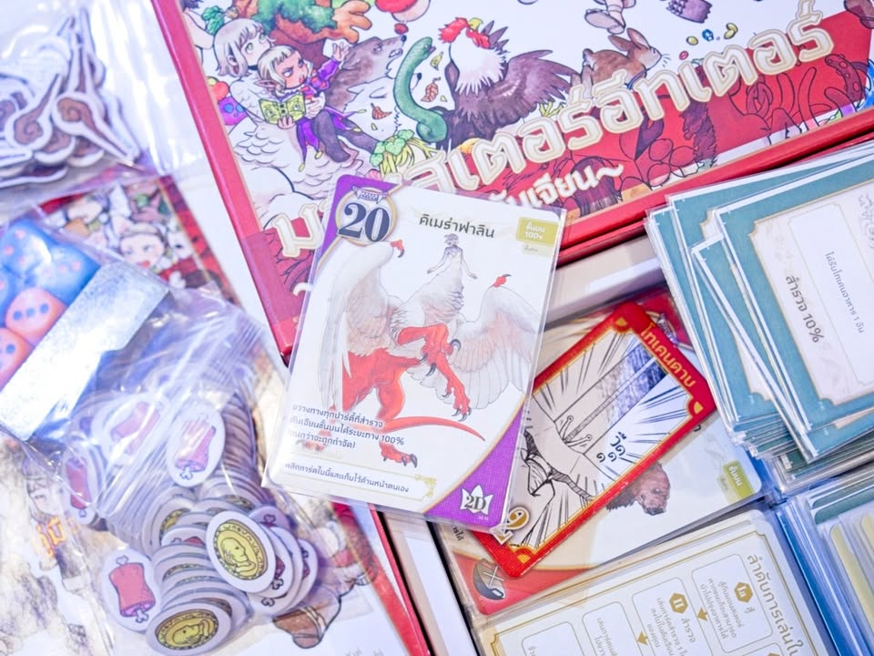

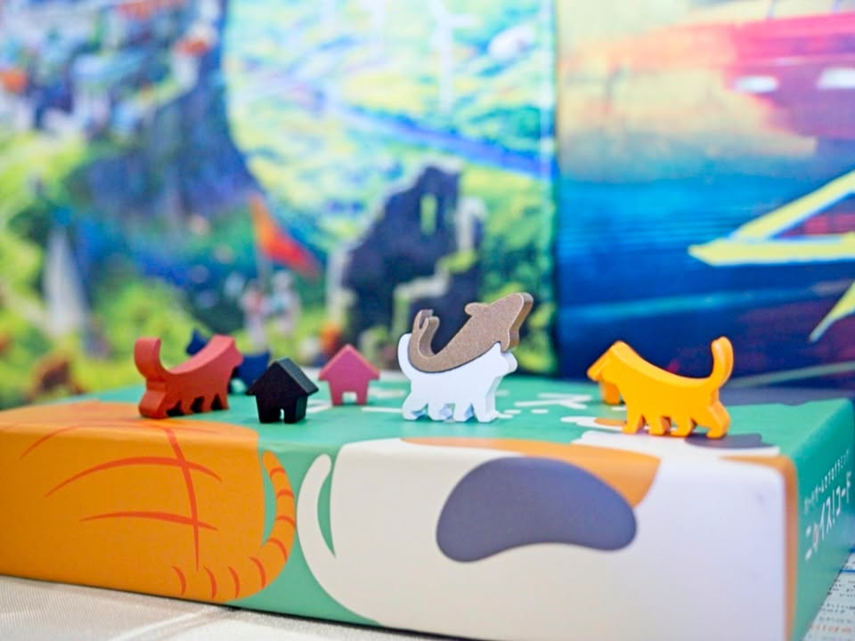

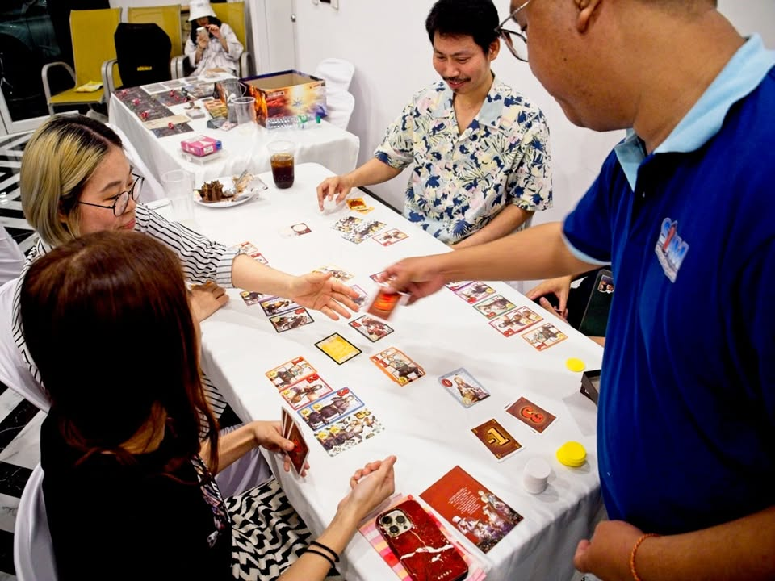

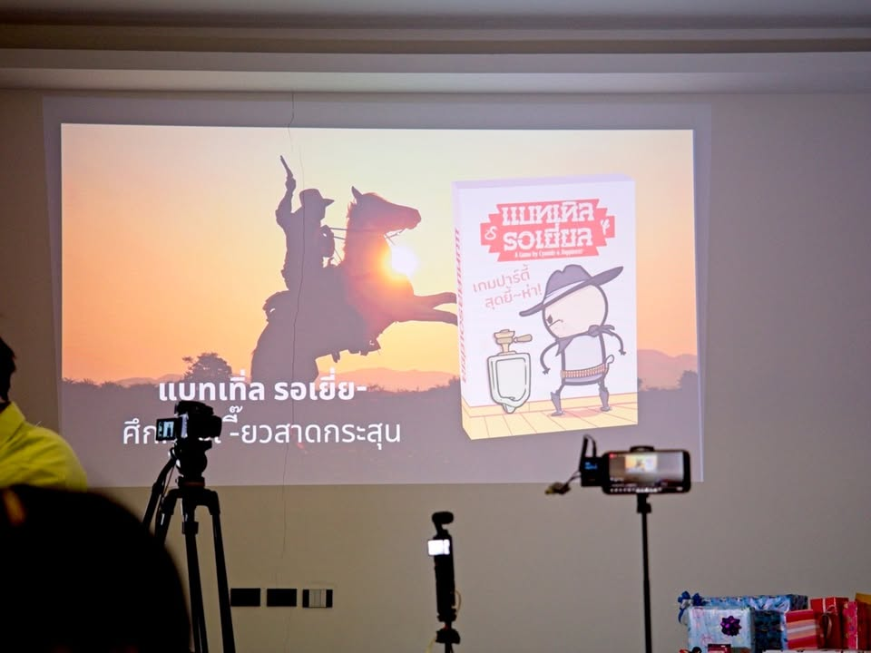

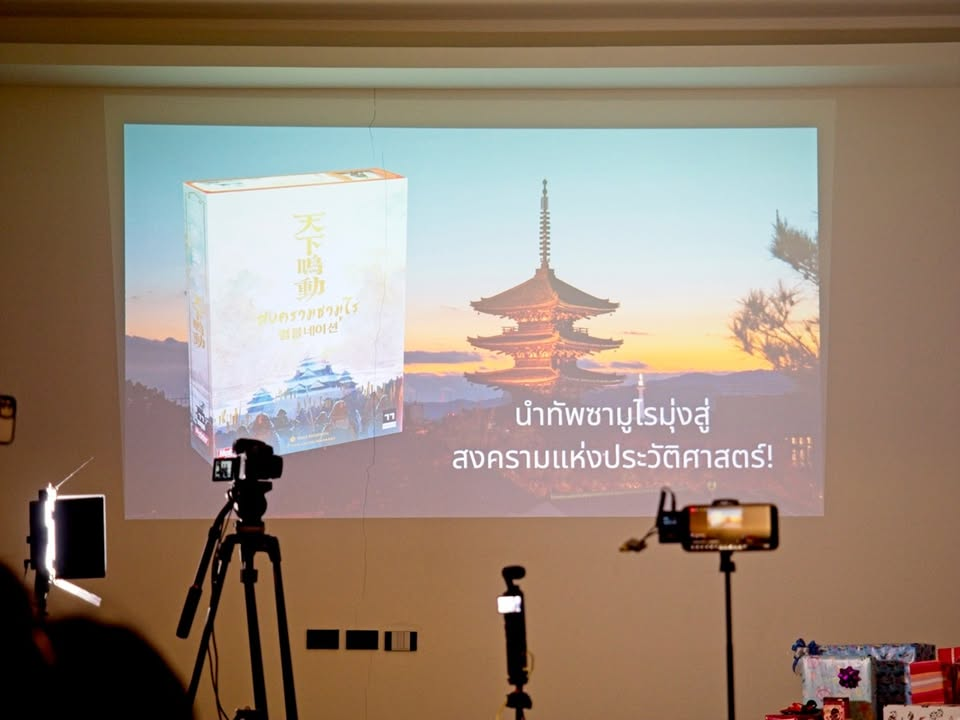

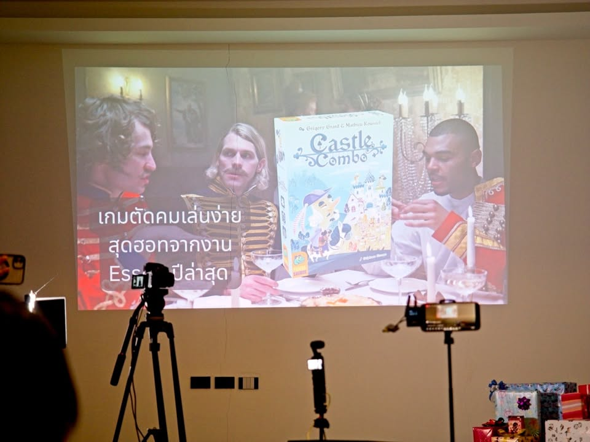

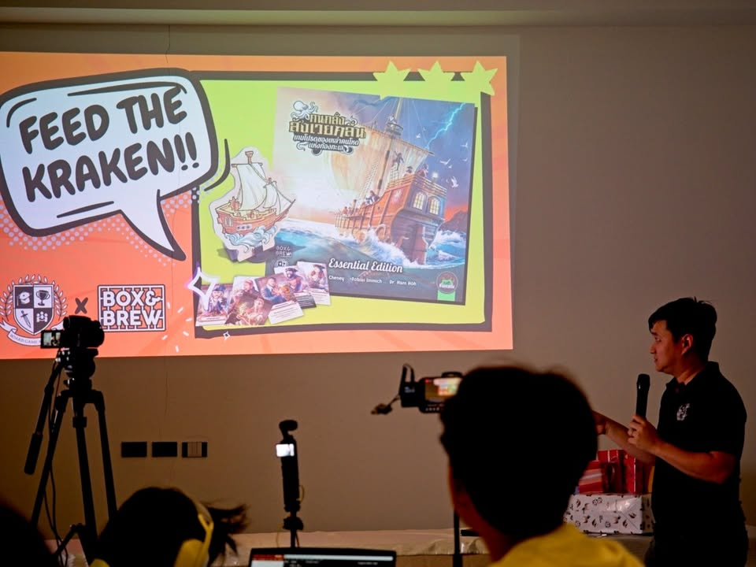

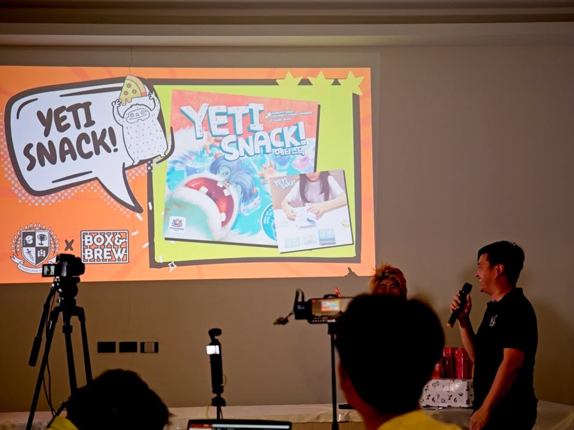

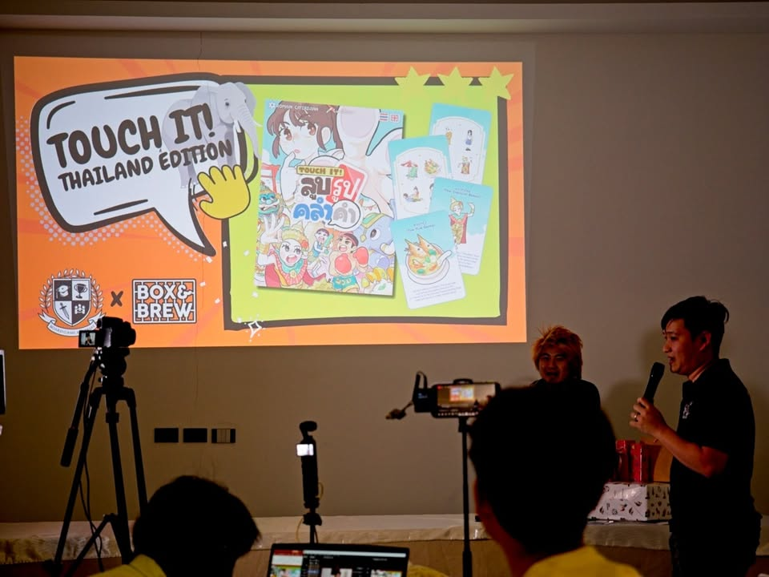

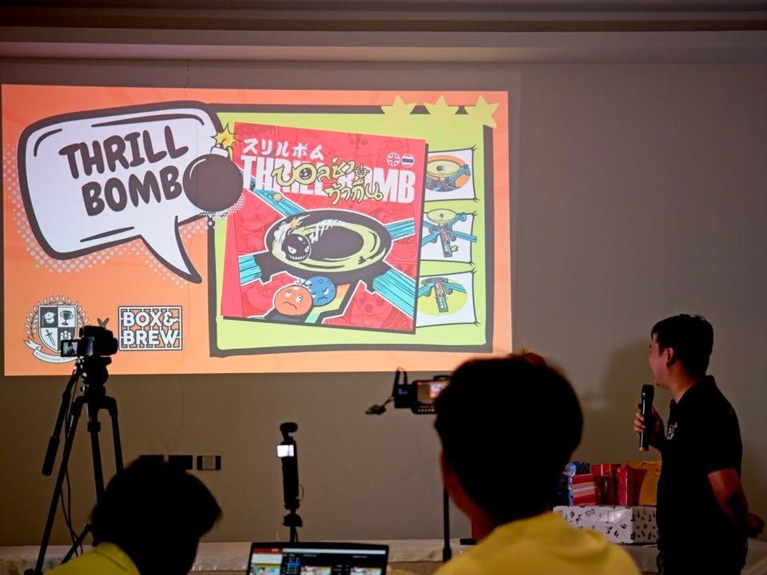

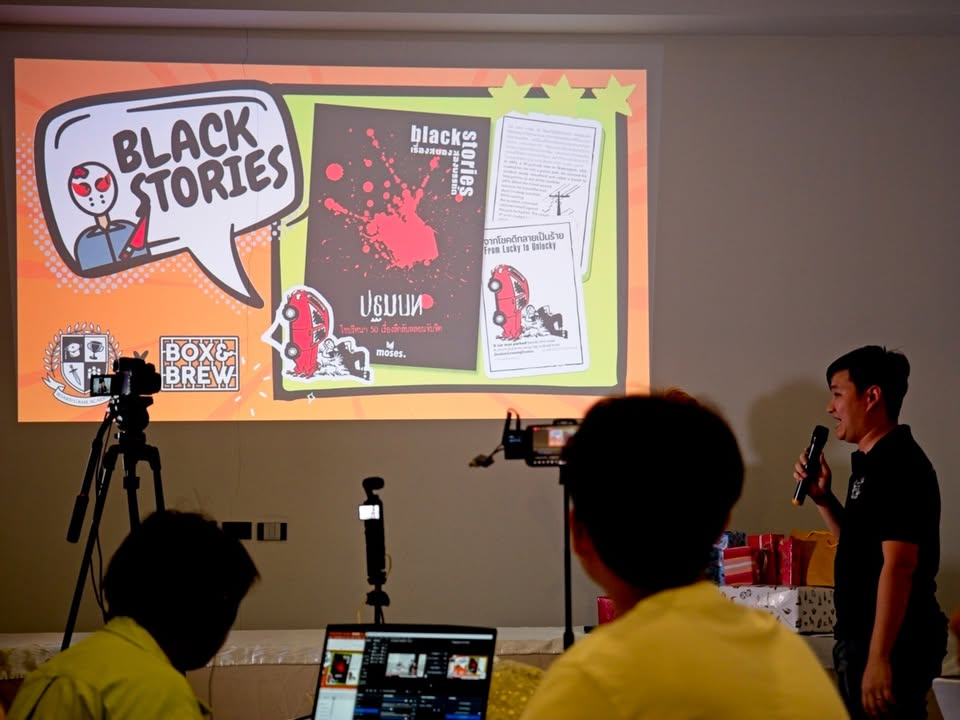
