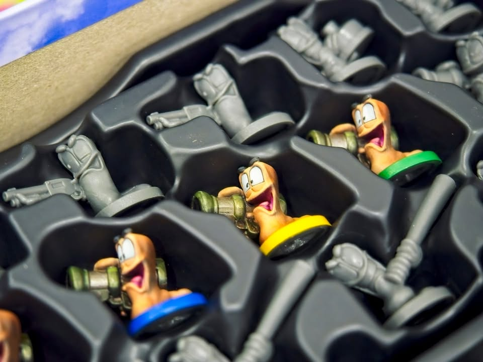
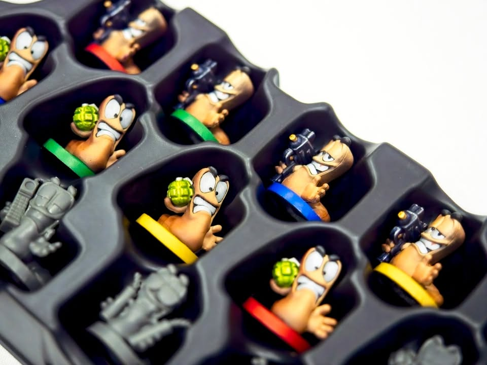

Worms: The Board Game - ฮาาาา เลลู่ยะ ฮาเลลู่ยะ ฮาเลลู่ยะ....

หนึ่งในเกมสุดฮิตของวัยรุ่น 90 ผมคิดว่า Worms เนี่ยก็จัดว่าเป็นตัวเด่นอยู่เหมือนกัน ไอเดียเกมฉบับดิจิตอลจะเป็นฉากมองด้านข้างที่จะให้ผู้เล่นควบเหล่าหนอนติดอาวุธมาห่ำหั่นกันจนเหลือทีมเดียว ความสนุกคือมันยิงอาวุธหนักทำให้ฉากแหว่งมั่วซั่ว พร้อมกับการเดินทางขยับตัวไปตามฉากอย่างการโหนเชือกประหนึ่งสไปเดอร์แมนพร้อมกับหวดไม้เบสบอลฟาดโฮมรันตกฉากแม่งเข้าให้งี้

---
เอาจริงๆระบบเกมไม่มีไรเลย มีแค่ถึงตาตัวเองก็เลือกหนอนทีมเรามาตัวแล้วกระดื๊บๆเดินจากนั้นก็เล่นการ์ดอาวุธยิงคนอื่นแล้วเราก็อยากจะเหลือเป็นทีมสุดท้าย จบ...

อาวุธก็มี effect ไปตามเรื่องยิงบาซูก้าก็จะมีทอยเต๋าก่อน 4 ลูก (ยิงไกลได้แต่ทอยเต๋าได้น้อยลง) ถ้ามีรูปเป้าอย่างน้อยอันหนึ่งก็จะถือว่าโดน จากนั้นก็ค่อยไปทอยต่อว่าไอ้พวกที่โดนๆน่ะกระเด็นไปไหนต่อมั้ง ยิงพื้นที่เดิมซ้ำเยอะๆมันก็จะจมกลายเป็นบ่อน้ำไปเฉย แต่ถ้าทอยไม่ได้เป้าเลยเป้าก็จะเลื่อนไปขึ้นอยู่กับว่าออกหน้าอะไร

---
ว่ากันตามตรงถ้าดูแค่ระบบการเล่นแล้วมัน 'วินเทจ' เอามากๆเต็มไปด้วยระบบที่เรียกว่าถ้าใครหยิบระบบมาเล่าจะโดนกา F พร้อมกับบอกไปออกแบบมาใหม่ นายน่ะไม่ได้เข้าใจในการออกแบบเกมสมัยใหม่แม้เพียงกระพี้ ทำเหี้ยอะไรก็เช็คทอยสุ่ม เช็คทอยสุ่มอยู่นั้น ตอนฟังก็แบบ.....ไรว่ะเนี่ย เจอคนเล่นด้วยกันสั่งกระโดดแล้วทอยเต๋าทำให้ลมพัดออกนอกฉากตายไปตัวนึงก็ได้แต่มองหน้ากันเลิกลัก

แต่ทันทีที่เกมสวมธีม Worms เข้าไป ทุกสิ่งที่แม่งอิหยั่งว่ะกลับเล่าความเป็น Worms ออกมาได้แบบทุกโมเม้นในเกมที่เคยเล่นตอนเด็กๆมันแฟลชแบ็คกระแทกกลับมาทันที การยิงเล็งลูกระเบิดหวังให้กระเด็นเกิด chain ระเบิดตูมตามก็เป็นอะไรที่อยากเล็งอยากทำขึ้นมาในเกมนี้ขึ้นมาทันที เรื่องความไม่สมเหตุสมผลมั่วฉิบหายทั้งหลายก็ล้วนทำให้เกิดอารมณ์ร่วมที่ดีมากๆ

สิ่งเดียวที่ดูจะหยิบความเป็นสมัยใหม่มาและเลือกมาได้ดีมากๆคือเกมจบไวสุดๆ วนแค่คนละประมาณ 2-3 รอบก็จบละ เพราะ event ท้ายเกมจะเข้าสู่โหมด sudden death (ตรงธีมตามเกมตันฉบับ) ที่โดนสะกิดนิดหน่อยก็ตายทันที

---
(My) Collection Fit: ผมคิดว่ามันเป็นเกมที่เหมาะมากสำหรับคนที่เคยเล่นเกม Worms มาก่อนเท่านั้น ถ้ามองแค่ระบบการเล่นคือมันล้าหลังมากถ้าไม่รู้จักธีมคือเอาเกมเหี้ยนี้ไปเผาได้เลย แต่ด้วยธีมที่สมกับเกมแบบไม่น่าเชื่อมันเลยทำให้จุดด้อยที่ว่าหายไปทันที (แบบทันที!!) หรือถ้าเอาไปเล่นกับคนที่ไม่ผ่านการเล่นบอร์เกมสมัยใหม่มาก่อนก็สนุกเพลินๆได้นะ เพราะมันเฮฮามั่วซั่วมาก
  
What I like: สำหรับแฟนเกม Worms แล้วเกมถอดบรรยากาศมาได้ดีอย่างไม่น่าเชื่อ ตัวมินิแม้จะไม่ได้ใช้ประโยชน์อะไรแต่ทำท่าทางตอนใช้อาวุธออกมาได้แบบดีสุดๆ
  
What I dislike: ระบบการเล่นที่ล้าหลัง
  
I think this game might be a good fit for...:  แฟนเกม Worms ที่เข้าใจคำว่า incomingggggggggg, เอ๊วๆๆๆๆๆๆๆ, การยิงบาซูก้าเลี้ยวย้อนลม, เสียงแกะร้อง หรือ  ฮาาาา เลลู่ยะ ฮาเลลู่ยะ ฮาเลลู่ยะ....
  
I think this game might NOT fit for...: ไม่เคยเล่น Worms ก็ข้ามๆไปได้ แต่ถ้าอยากได้เกมยิงมั่วซั่วเอาสะใจโอลี่ก็ไม่ว่ากัน

