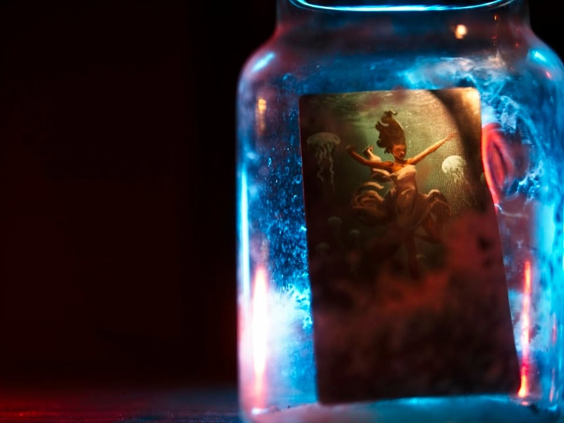
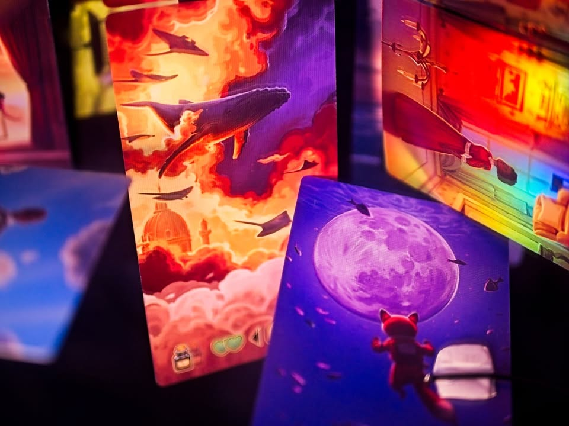
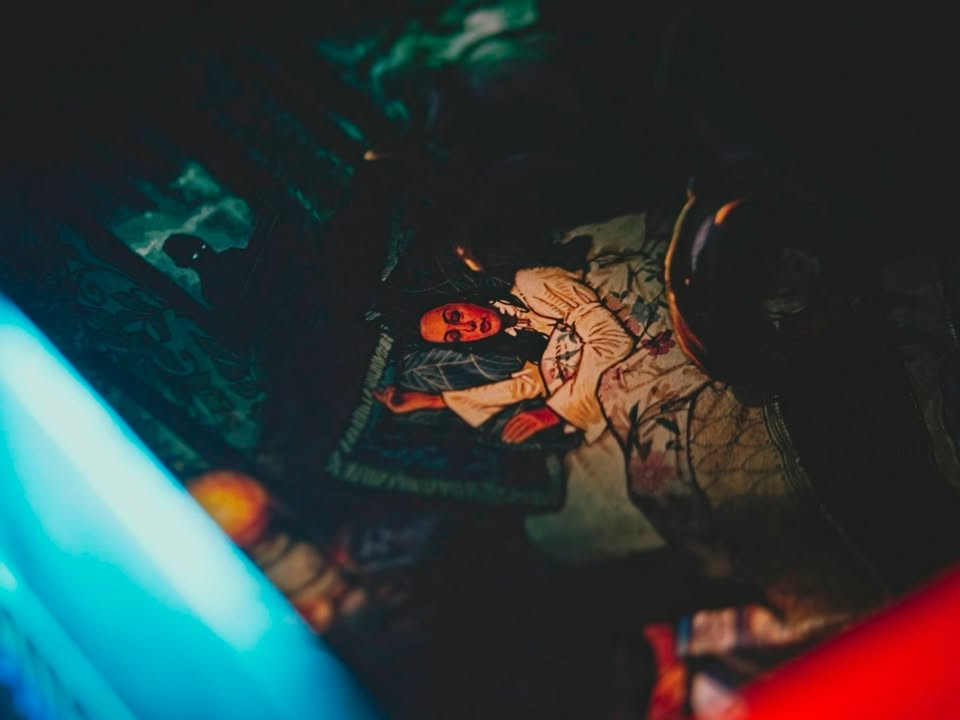
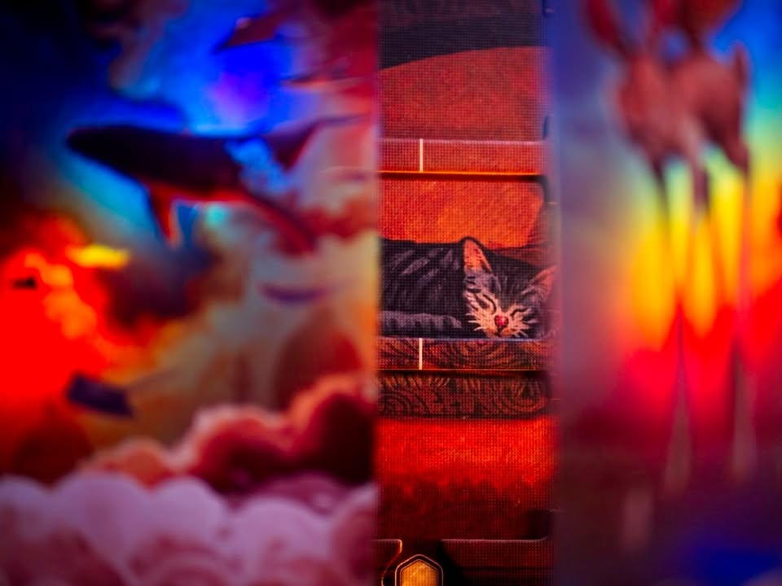
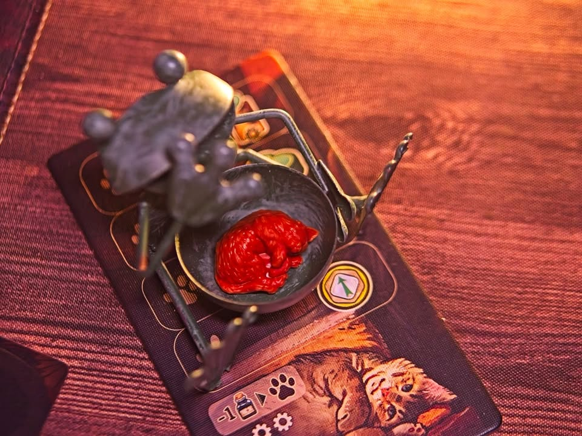
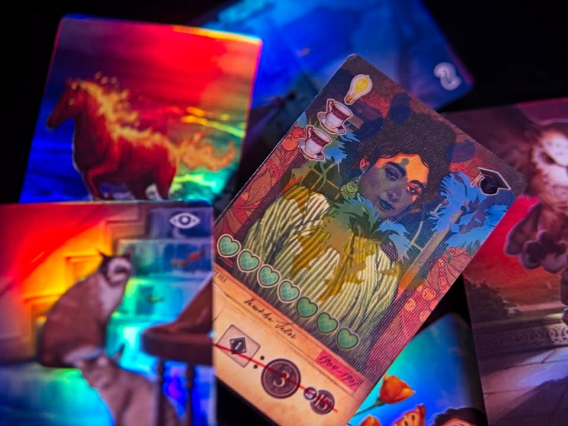
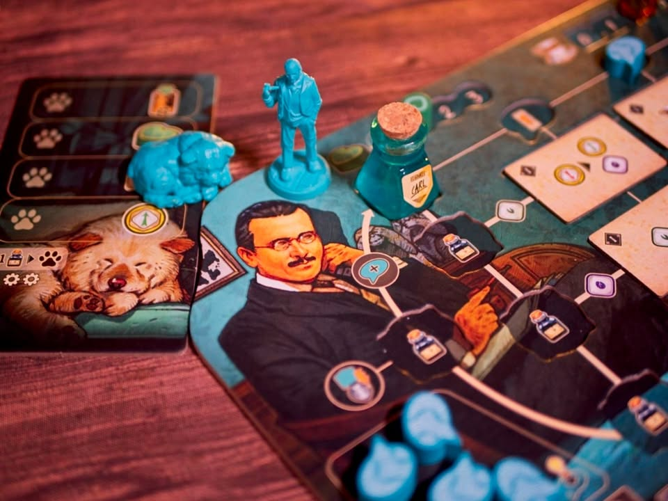
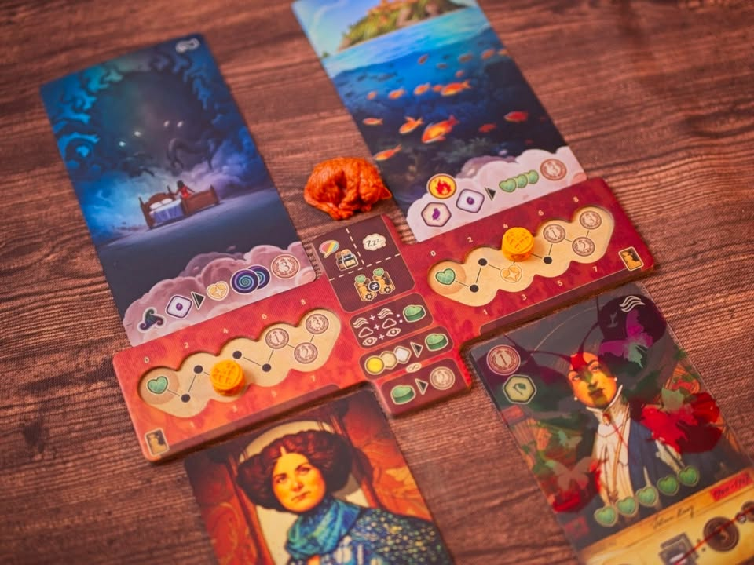
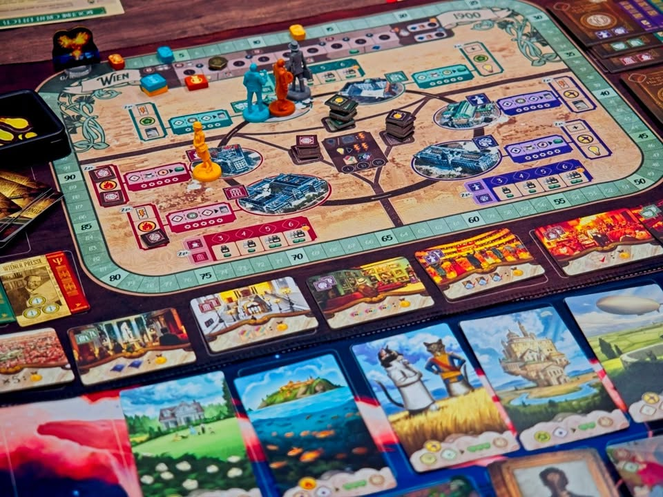

ลึกลงไปในห้วงฝัน - Unconscious Mind 

---
"ซิกมุนด์ ฟรอยด์" เป็นนักจิตวิเคราะห์ผู้บุกเบิกแนวคิดเกี่ยวกับจิตใต้สำนึก (unconscious mind) โดยเชื่อว่าจิตใจมนุษย์แบ่งเป็นสามส่วนหลัก ได้แก่ **จิตสำนึก** (conscious mind) ที่เราตระหนักรู้, **จิตก่อนสำนึก** (preconscious mind) ที่เก็บข้อมูลที่เข้าถึงได้ง่าย และ **จิตใต้สำนึก** (unconscious mind) ซึ่งซ่อนความคิด ความปรารถนา หรือความทรงจำที่กดไว้ (repressed) อันมีอิทธิพลต่อพฤติกรรมโดยไม่รู้ตัว ฟรอยด์อธิบายว่าจิตใต้สำนึกทำงานผ่านแรงผลักดัน เช่น สัญชาตญาณทางเพศ (libido) และแรงขับทางความรุนแรง (thanatos) ซึ่งถูกควบคุมและประนีประนอมโดยโครงสร้างจิตสามส่วน คือ **อิด** (id), **อีโก้** (ego) และ **ซูเปอร์อีโก้** (superego) แนวคิดนี้เปลี่ยนมุมมองต่อจิตวิทยาและการบำบัดอย่างลึกซึ้ง.

---
ส่วนเกมนี้ไม่ได้เกี่ยวอะไรกับฟรอยด์ แต่ว่าเราจะเล่นเป็นนักจิตวิเคราะห์ที่อยากดำเนินรอยตามฟรอยด์แทน ซึ่งก็เป็นนักจิตวิเคราะห์ชื่อดังในประวัติศาสตร์นั้นแหละ 

ไอเดียเกมคือการที่เราจะไปเก็บสะสม insight ทั้ง 3 แบบ (การเติบโต, ความอิสระ, ความหลงไหล แต่เอาจริงๆมันก็คือสีสามสีน่ะ) โดยแต่ละแบบมีได้ 3 ระดับ (รวมเป็นมีทรัพยากร 9 ชนิด) เอามารักษาคนไข้ พอรักษานอกจากจะได้แต้มแล้วเราก็จะได้รับพวก tags สถานที่มาด้วย ซึ่งเราจะเอา tags ที่ว่าไปเคลมแต้มโน้นนี้ต่อยอดอีกที

---
ระบบที่น่าสนใจของเกมคือมันเดินด้วย worker placement ที่คนงานของเราคือ token ไอเดีย เวลาเล่นเราก็เอาไอเดียไปจองช่องแอคชั่น ซึ่งหลักๆก็คือไปผลิตพวกทรัพยากรไว้คุยกับคนไข้ แล้วก็เอาไปเดินตัวเราในแผนที่เพื่อเก็บของทำโบนัสไปตามเรื่อง พอเราใช้คนงาน (ไอเดีย) หมดอีกสิ่งที่เราทำได้ก็คือการเรียกเก็บไอเดียกลับมา โดยที่การเรียกเก็บมันก็จะมีจังหวะการเคลมโน้นนี้ต่อ ทำให้จริงๆแล้วเกมต้องการการวางแผนเยอะพอดูเพราะอยากทำให้คุ้มทุกอย่าง

จุดที่น่าสนใจอีกอย่างคือระบบหมุนขวดหมึก คือในบอร์ดเราจะมีช่องว่างเอาไว้วางไทล์แอคชั่นเพิ่มเป็นตาราง 3x3 ทุกครั้งที่เราทำแอคชั่นหลักแล้วมีการเดินขวดหมึกมันก็จะวนๆไปลงตามแถวแนวตั้งนอนเพื่อทำโบนัสแอคชั่นต่อ เรียกว่าเชนแอคชั่นรำวนกันไปเรื่อย

---
คนไข้ในเกมมันจะสุ่มโจทย์หลายขั้นหน่อย อย่างแรกก็จะมีการ์ดคนไข้ พอได้มาเราจะสุ่มแผ่นใสซ้อนทับไปอีกที (เรียก Grief layer ซึ่งมันก็จะเป็นรูปหมึกหยดสีที่เค้าเอาไว้ทดสอบเกี่ยวกับเรื่องจิตวิทยาน่ะ) สองตัวพอรวมกันก็จะสร้างเงื่อนไขความยากในการรักษาให้กับเรา แต่ว่าการจะรักษาจริงๆเนี่ยเกมมันจะให้เราจั่ว 'ความฝัน' ของคนไข้มา ซึ่งมันก็ต้องการทรัพยากร 9 แบบของเรานั้นแหละมาจ่ายเพื่อรักษา พอรักษาเยอะพอก็เปลี่ยนคนไข้แล้วก็วนลูปไป

ระบบที่เหลือมันก็จะ build around กับมินิเกมอีกฝั่งที่ให้เราสะสม tags พื้นที่ 6 ชนิดไปทำคะแนนแลกแต้มโน้นนี้อีกต่อ เกมจะจบลงเมื่อผู้เล่นทั้งวงเคลียร์เงื่อนไขสุดสายร่วมกันถึงจำนวนหนึ่ง

---
(My) Collection Fit: ไม่ค่อยคลิกเท่าไร มันเป็นเกมที่แปลกตรงดูเหมือนจะมีอะไรให้ทำแต่ก็ดูแล้วไม่เกี่ยวกับใครและไร้ซึ่งความรู้สึกว่าระบบมันจะสอดประสานกัน อารมณ์แบบขยับแล้วขยับอีกแต่มันจะสนุกกี่โมงงงงงง แบบทำเอาเสียดายอุปกรณ์เลย ทำมาโคตรรรรสวย ไปอ่านตัวเสริมก็โอเคเกมเหมือนเดิมเพิ่มเติมคือหยุบหยับมากขึ้น ส่วนตัวคิดว่าเหมาะมากที่จะเป็นเกม solo นะ นั่งคิดแก้ปัญหาไปเรื่อยๆคือน่าจะเพลินดี แต่พอเป็นเกมหลายคนมิติการแข่งขันมันไม่โดดเด่นเท่าไร มีแค่มาแย่งเคลมมิชชั่นกลาง
  
What I like: อุปกรณ์และการนำเสนอสวย แบบสวยมากกกกกกกกกกกกกกกก, ระบบแม้จะดูหยุบหยับแต่ก็ทำแกนกลางมาได้คลีนและคู่มือเขียนได้ดี empathy เข้าใจคนอ่านสูง
  
What I dislike: มีอะไรทำเยอะแยะระบบก็ดูน่าสนใจแต่ตอนเล่นมันดันไม่สปาคร์กัน เกมมันเลยนิ่งเรียบอย่างไม่น่าเชื่อ ส่วนหนึ่งคือมันสื่อไม่ได้ว่าเรากำลังรักษาคนไข้ แค่เหมือนหยิบๆของไปส่งเคลมแต้มจบ.... เกมก็ค่อนข้างงึมงำกับตัวเองเยอะ ไม่รู้ว่าคนอื่นทำไรได้บ้าง
  
I think this game might be a good fit for...: สายยูโรชอบของสวย ที่โอเคกับเกมที่ player interaction ไม่สูง
  
I think this game might NOT fit for...: ยูโรสายเข้มเน้นตบตีหรือทำคอมโบอวดเพื่อน

