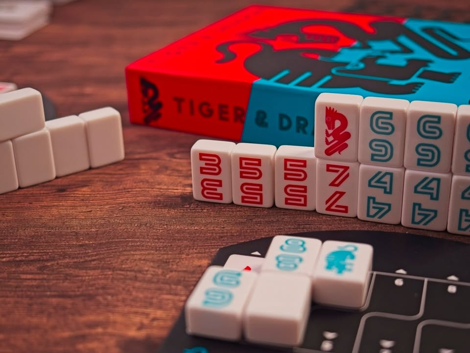
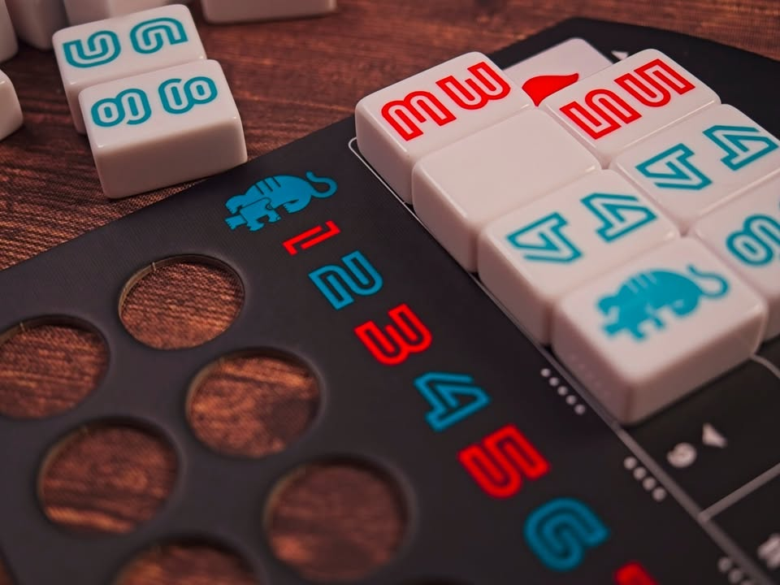

ถ้าบุกแล้วจะมีใครรับไหมละ? - Tiger & Dragon

เกมสไตล์ hand management ที่กติกาเรียบง่าย ผู้เล่นหนึ่งคนลงไทล์เพื่อ 'จู่โจม' ถ้าผู้เล่นคนถัดไปมีไทล์เลขที่เหมือนกันก็จะสามารถวางในบอร์ดตัวเองเพื่อ 'ป้องกัน' จากนั้นคนที่ป้องกันสำเร็จก็จะเริ่มจู่โจมรอบใหม่จนกว่าจะมีคนหมดมือ 

ดูไม่มีอะไรใช่มะ? แต่กิมมิคของเกมนี้คือจะมีไทล์เลข 1-8 ไทล์ 1 มี 1 ชิ้นทั้งเกม ไทล์ 2 มี 2 ชิ้น ...... ไล่ไปจนไทล์ 8 มี 8 ชิ้น หมายความว่ามันมีกลยุทธ์ในการ 'เรียก' เลขจากคนอื่นอยู่ เพื่อที่เราจะได้เป็นคนแรกที่หมดมือพร้อมกับไทล์พิเศษที่มีผลกับเกมมากคือไทล์เสือ ที่ใช้ป้องกันเลขคู่ และไทล์มังกรที่ใช้ป้องกันเลขคี่ ทำให้การลงไทล์นั้นไม่ได้การันตีว่าเราจะชนะวนรอบได้โดยไม่มีใครขวาง

เกมจบรอบเมื่อผู้เล่นหมดมือผู้ชนะเท่านั้นที่จะได้คะแนน และจะเล่นกันจนกว่าชนะกันที่ 10 แต้ม จุดที่ทำให้เกมน่าสนใจอีกอย่างคือมันมีแผ่นกำหนดกติกาการได้แต้มในแต่ละเกมหลายแบบ อย่างบางเกมถ้าจบด้วยเลขเยอะก็จะได้แต้มมากว่าปกติไรงี้

---
(My) Collection Fit: ผมได้เกมนี้มาตอนลดราคารู้สึกว่าคุ้มมาก ตอนแรกอ่านรูลคิดว่าไม่น่าจะสนุกเพราะแค่หยิบไทล์มาวางจับคู่แล้วจบ แต่พอเล่นจริงคือมันมีจังหวะการมองหน้ากับการเลือกว่าจะ 'ตั้งใจผ่าน' ตอนไหนดี เกมเพลินกว่าที่คิดไว้เยอะ
  
What I like: component เป็นไทล์พลาสติกแนวๆมาจองสวยดี กติกาง่ายแต่มีกลยุทธ์อยู่เบาๆ เกมทำ UX/UI มาใส่ใจดี เลขคู่สีหนึ่ง เลขคี่สีหนึ่ง
  
What I dislike: ไทล์มันพลิกง่ายไปหน่อย ถุงให้ใส่ก็ไม่มีจะใช้ก็ไม่ได้เพราะกล่องมันบาง
  
I think this game might be a good fit for...: คนที่มองหาเกมฟิลเลอร์หรืออยากได้เกมไปสลับบรรยากาศวงไพ่ของคนที่ไม่รู้จักบอร์ดเกมเพราะเกมง่ายมาก

