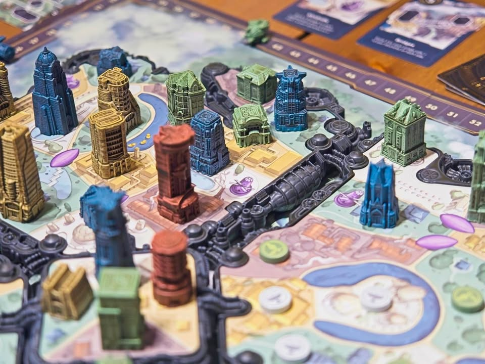
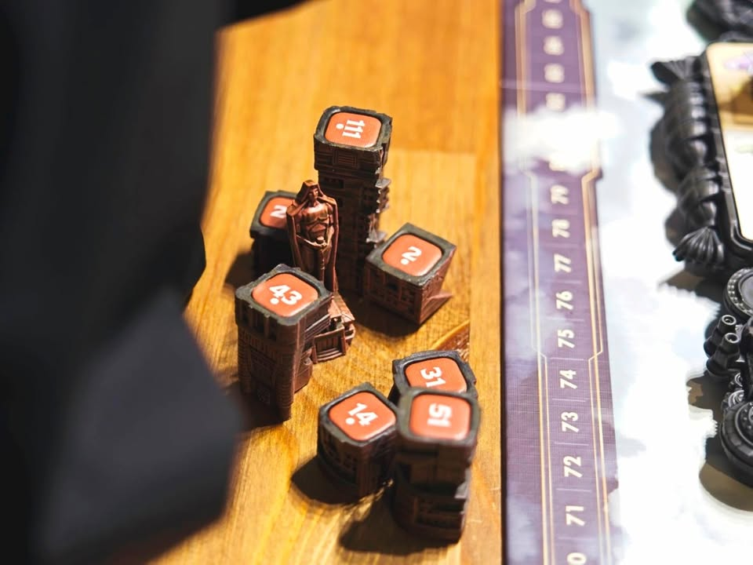
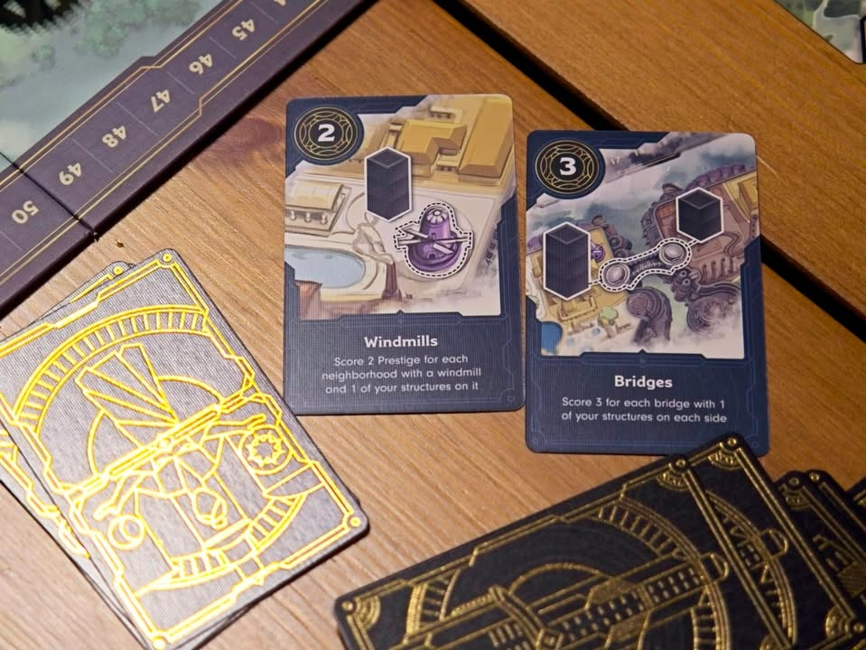
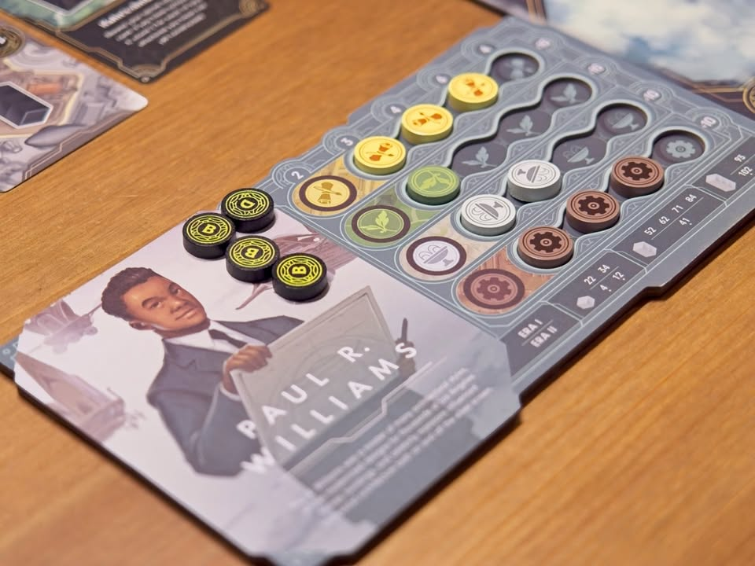

Skyrise - วางตึกเลื้อยไปเรื่อย

เกมธีมสร้างเมืองบนนครลอยฟ้า (แล้วไปสร้างตึกสูงๆทำไมบนนั้น?) ที่ผู้เล่นจะมาประมูลพื้นที่เพื่อสร้างตึกระฟ้าของตัวเองไปยังส่วนต่างๆของเมือง

เกมนี้คะแนนหลักจะมาจากการยึดพื้นที่สีโซนต่างๆในเกม โดยที่คะแนนของแต่ละโซนของเรานั้นจะมาจากการดูว่าตอนที่เราไปสร้างๆพื้นที่ไว้เนี่ยมันมีไทล์ตัวคูณสะสมอยู่เยอะไหม มีเยอะก็คูณเยอะไรงี้ แต่ว่าไอ้ไทล์ตัวคูณแต้มมันก็จะสุ่มๆกระจายไปตามพื้นที่สีต่างๆคละกันไป ทำให้ต้องแบ่งสมองกันนิดหน่อยระหว่างจะเอาสีพื้นที่กับจะเอาไทล์คูณแต้ม

---
ส่วนที่ทำให้เกมนี้แตกต่างและน่าสนใจ (นอกจากความสวยงามแล้ว) คือตัวตึกแต่ละคนจะมีแต้มสำหรับประมูลอยู่และเลขจะไม่เท่ากันซักคน (นึกถึงไทล์ใน Ra น่ะ) คนเริ่มจะทำการปักตึกไว้ตรงจุดที่ต้องการ และคนที่อยากจะ outbid ก็จะหยิบตึกเลขที่สูงกว่าไปวางที่ข้างๆ ใครอยากจะบิดทับก็เอาเลขสูงมาวางต่อตึกเลื้อยไปเรื่อย พอผ่านกันหมดเจ้าของตึกสุดท้ายที่วางก็จะได้สร้างตึกกับหยิบแต้มคูณไป

ถ้าพูดให้ง่ายหน่อยคือกลยุทธ์ของเกมคือจุดที่วางตึกตอนแรกก็มักจะไม่ใช่จุดสุดท้ายที่จะได้สร้างจริงๆเพราะคนอื่นมันจะบิดทับแล้ววางตึกเลื้อยไปไหนก็ไม่รู้

ตัวตำแหน่งตึกยังมีผลต่อคะแนนโบนัสโน้นนี้จำนวนหนึ่งแล้วแต่เกมจะสุ่มมาอย่างติดสะพาน ติดบ่อน้ำไรงี้ แล้วก็จะมีตึกสูงพิเศษที่จะมีท่ายากทำคะแนนของตัวเองอีก

---
ส่วนที่ไม่โดนใจเท่าไรก็คือเกมมัน familyyyyyyyyyy แบบใสกิ๊งเกิ๊นนน.. ไทล์ตึกการันตีวางครบทุกคน ใครวางหมดมือก่อนก็ไปนั่งๆนอนๆเหงารอไป ทิศทางตึกที่จะวางก็คุมอะไรไม่ได้ เลื้อยไปเรื่อย และต่อให้ไม่เป็นไปทางที่ต้องการก็ช่างมันก็ได้ เดี๋ยวก็มีที่ลงเพราะเกมมันมีที่ว่างให้สำหรับทุกคน แต้ม majority ก็นิดเดียวทำให้บรรยากาศการแข่งขันแทบไม่มี

และระบบไทล์แต้ม A B C D ที่ให้เก็บๆไปก่อนแล้วมาเฉลยทีหลังว่าคะแนนแต่ละหมวดเท่าไรนี้ let down มากทำเป็นเกมดวงๆไปเลยเพราะคะแนนสูงต่ำต่างกัน 2.6 เท่าเลยนะ ( 3 vs 8 )
---
  
(My) Collection Fit: เกม friendly ไปหน่อยทั้งๆที่เปิดมาเป็นเกมทรงประมูลแย่งที่ ถ้าไม่มองเรื่องของสวยอารมณ์กับสล็อทประมาณนี้ชอบ Founder of Metropolis (แต่มันไม่มีประมูลนะ) มากกว่า
  
What I like: component สวยจัด สวยมากๆ รายละเอียดตึกดี การ์ดมีลายทองสะท้อนแสง ระบบการเล่นไม่ยุ่งยาก
  
What I dislike: เกมเป็นมิตรมากเกินไป ซึ่งไม่ผิดแต่ดันทำทรงประมูลและแย่งของกันแล้วขับความเข้มของการแย่งชิงมาไม่ได้ 
 
I think this game might be a good fit for...: สายครอบครัวอยากได้เกมของสวย กางง่ายสอนง่ายไว้รับแขก (แต่ถ้ามีงบไป Founder of Rome เลยก็ได้นะ)
  
I think this game might NOT fit for...: ถ้ามาเพื่อหาเกมเพลย์ประมูลเนื้อๆก็ข้ามไปเลย

How I felt about rulebook : เขียนดี อ่านง่าย จบไว

