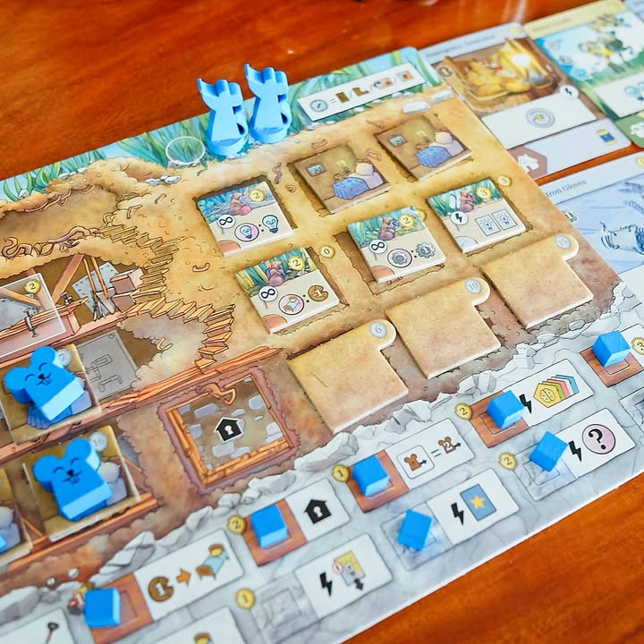
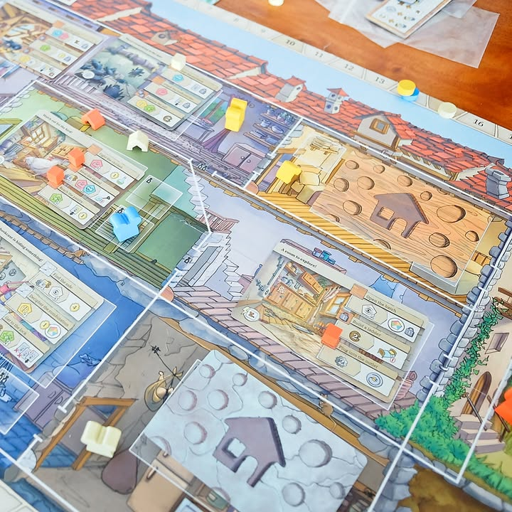

Rats of Wistar

---
Worker Placement จากตัวตึงอิตาเลี่ยน Simone Luciani (Tzolk'in, Nucleum), Danilo Sabia (Wendake) ที่ธีมเล่าถึงเหล่าหนูมีอารยะที่จะมาพัฒนาที่อยู่อาศัยและสร้างสรรสิ่งใหม่ๆจากเศษซากของเหลือใช้จากเหล่ามนุษย์

---
แกนเกมเป็น worker placement แบบที่ทวิสไอเดียอีกเลเยอร์ คือผู้เล่นมีสิทธิ์ทำแอคชั่นได้ 3 ครั้งเท่ากันทุกคนในทุกๆรอบ ตัวแอคชั่นจะแบ่งออกเป็น 3 โซนและเราจะทำแอคชั่นในโซนไหนได้เยอะมากน้อยก็ขึ้นอยู่กับว่าเราแบ่งเอา 'คนงาน' ไปอยู่ในโซนนั้นๆกี่ตัว 

และด้วยความที่จำนวนคนงานมันมีจำกัดเราก็นอกจากจะต้องวางแผนเลือกช่องทำแอคชั่นแล้วก็ต้องแบ่งหาทำเดินคนงานไปมาให้อยู่ตามโซนที่เราอยากทำเยอะๆด้วย

---
แน่นอนว่าคนงานมันก็เพิ่มมาจากการสร้างบ้านเพิ่ม โฟลวของเกมนี้คือต้องไปหยิบของมาเพื่อขุดดินในมีห้องว่างจากนั้นก็สร้างห้องเพิ่มก็จะได้คนงานมาเพิ่มพลังทำแอคชั่น แกนไอเดียหลักๆก็คือวนหยิบของแลกโน้นนี้ทั่วไป

---
ระบบที่คิดว่าทำให้การสุ่มมันสวยดีก็คือระบบวงล้อ คือแอคชั่นมันจะมี 6 แบบให้ทำ (มีโซนละ 2 แอคชั่น) แต่ว่าวงล้อในการลงช่องแอคชั่นนั้นๆมันจะหมุนไปในทุกรอบทำให้แอคชั่นมันจะทำได้แค่ 1-3 ครั้งเท่านั้นเองแถมโบนัสเสริมไม่เหมือนกันอีก ตรงนี้เราก็ต้องวางแผนด้วยว่าอยากทำแอคชั่นอะไรตอนไหน ถ้าอยากทำบางอย่างมากๆแต่ตาหน้ามันทำได้รอบเดียวก็ต้องไปแย่ง 1st player ไรงี้

---
ระบบอื่นๆก็ทำตามธีมและยกระดับการทำ mission กลางแข่งกันได้ดีก็คือส่งหนูไปเดินเปิดแผนที่ให้บ้าน พอเปิดก็จะได้โบนัสไปตามเรื่องพร้อมกับ mission ที่เคลียร์ได้ก็จะได้วาง cube ปลดล็อกต่อ 

อีกระบบก็คือการ์ดที่ก็ไม่ได้แฟนซีแต่ทำงานได้ดีหยิบๆแล้วก็เล่นได้โบนัสไปตามเรื่อง แต่เกมมันทำมาให้มีความเป็นคอมโบเก็บสะสมของทำไอคอนไปปลดล็อกโน้นนี้ด้วยทำให้เกมมันลื่นไหลลงตัว

---
Frog-o-Meter: กบชอบ 
  
(My) Collection Fit: น่าจะข้ามไปก่อน (แบบเสียดายนิดๆ แต่ถ้ามีมือสองมาน่าจะเก็บไว้) คือเกมมัน 'กลาง' ไปหน่อยจะเบาก็ไม่เบาขนาดนั้นกำหมัดแน่นอยู่ พอมันเป็นเกมกลางหนักจะข้ามมาผมก็มีรุ่นพี่ WP ที่ระบบคลีนแต่หนักอยู่แล้วหลายตัว จะหยิบมา replace เกมกลางอื่นๆที่มีมันก็ไม่ได้ยูนิคเท่า แต่ก็ยังคิดว่าถ้าเล่นซัก 3 คนบ่อยก็น่าสนอยู่รู้สึก 4 คนมันรอนานไปหน่อย
  
What I like: คลาสสิค Worker Placment เข้มแบบอย่าโดนปกหลอก ทวิสระบบสวย ดักล็อกช่อง พ่วงด้วยระบบบริหารคนงานในการทำช่องที่เห้ย จีเนียส! คอมโบปลดโน้นนี้ก็มีหลายจุด ธีมก็ถือว่าทำมาได้ดีเล่าระบบเกมได้ คือแบบใครแฟนนักออกแบบคนนี้แล้วอยากได้เกมกลางที่ตัดช่องกันก็ไม่ผิดหวังแน่ๆ
  
What I dislike: ไม่ค่อยรู้สึกเท่าไร แต่อาจจะตรงมันไม่ใช่แนวมี victory path จ๋าๆแบบที่ชอบมั้ง คือมีแหละแต่มันออกแนวหน้างานนิดนึง แต่ก็ไม่ได้รู้สึกมีปัญหาอะไร
  
Not for... : คนที่ไม่ชอบเกมกำหมัดเวลาช่องแอคชั่นโดนตัดแล้วบ้านแตก....
  
Interaction Area: วิ่งแย่ง first player พร้อมกับลงช่องทำแอคชั่นรูที่ว่าง  ลีลามากก็อดไป พลาดช่องแต้มแล้วบางทีคือไปต่อไม่เป็นเลยคอมบงคอมโบ

