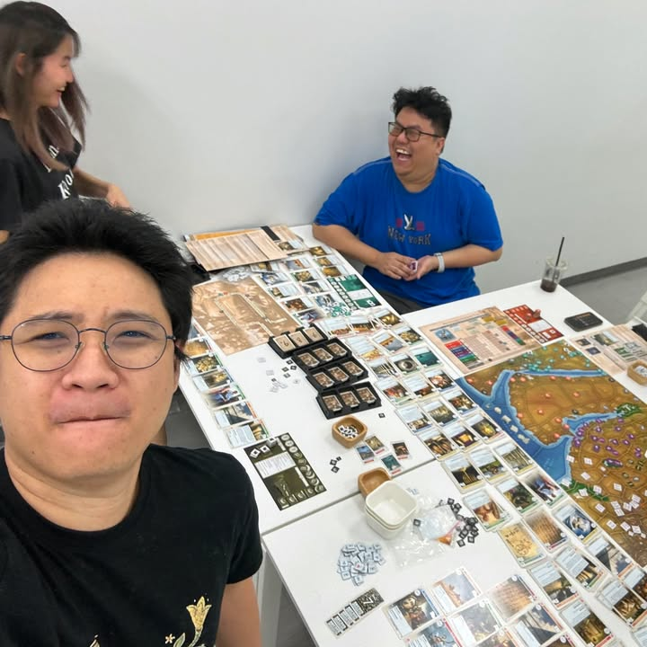

วันนี้ไปย้อนรอยเกมต้นกำเนิดของสุดยอดเกม turn base ที่เล่นทีไรเป็นเปิดวาร์ปฝั่งเกมคอมอย่าง Sid Meier's Civilization ด้วยเกม Eestern Empire แบบอิ่มเอม 12 ชม. รวด เจรจากันจนแสบคอ ขอบคุณทีมงานกับเกมที่ผมคงไม่ได้มีประสบการณ์มาเล่นบ่อยๆ ขอบคุณ NK Board Game Seacon Bangkae - เอ็นเคบอร์ดเกม ซีคอน บางแค สำหรับสถานที่เที่ยงวันยันเที่ยงคืน 😀

---
เผื่อมีคนงง คือ time line มันจะประมาณนี้

- (1980) Francis Tresham ออกเกมกระดานชื่อ Civilization ที่หน้าตาก็ประมาณแบบในรูปนี้แหละ แต่เก่าๆเชยๆตามยุคโน้น และเป็นเกมที่นำระบบ tech tree มาให้เรารู้จักกัน
.
- (1989) Sid Meier ออกเกม PC ชื่อ Civilization ที่ก็หน้าตาทรงแบบที่เราเห็นๆกันตามแบบ Turn Base PC แต่ว่ามีฟ้องร้องกันยับๆเรื่องชื่อที่เหมือนไม่พอ ยังมีแนวคิดเรื่อง  tech tree อะไรตามมาอีก แม้ว่านอกนั้นจะไม่มีอะไรเหมือนเพราะมันเล่าตั้งแต่ยุคหินยันปล่อยจรวด มีเปิดแผนที่ ไรงี้ซึ่งพอไปซักช่วงหนึ่งของตอนทำคดีก็มีหลุดๆมาว่าไม่ได้ตั้งใจลอกแต่ทีมงานน่าจะเคยเล่นตัวเกมกระดานมาก่อนเลยเอาแรงบรรดาลใจมาทำต่อ
.
- (2015) คือเกมมันติดเรื่องชื่อแล้วขาดตลาดไปนานมาก กล่องเก่าๆขาดๆขายวนๆกันไป ก็มีแฟนพันธุ์แท้ทำแบบว่ากันตรงๆก็โคลนมาดื้อๆแต่แต่งหน้าตาปากใหม่ปรับโน้นนี้ให้มันทันสมัยขึ้น แล้วทำให้มันเล่นได้ 18 คนไปเลยจ้าในชื่อ Mega Civilization
.
- (2018) ค่าย Gibsons ไม่รู้กินอะไรมาอยู่ๆก็หยิบเอาฉบับ 1980 มา reprint ขายเฉย แต่เอาเป็นว่ากระแสไม่ได้ดีอะไรมากเพราะเป็นฉบับเก่าแถมทำออกมาแบบดูเหมือนของเล่นวินเทจ
.
- (2021) ค่ายที่ทำ Mega Civilization พอจะ reprint ใหม่ก็ทำตามเสียงแฟนๆที่บอกว่ากรูจะไปหาคนเล่น 18 คนจากไหนมานั่งเล่นเกม 8-12 ชั่วโมง ค่ายเลยแบ่งแผนที่ออกเป็น 2 กล่องเล่นแยกกันได้เหลือกล่องละ 9 คนพอ แต่ว่าคงติดเรื่องลิขสิทธิ์แหละเลยมาเรียกชื่อ Western/Eastern Empire แทน

---
เกมนี้จริงๆเคยเขียนถึงไว้หลายทีละ แต่ไว้โพสหน้าอาจจะเอามาสรุปให้อ่านกันอีกทีละกัน

---
ส่วนภาพถ้าดูเก่าๆคือช่วงนี้ไปตามกระแสหยิบเอาพวกกล้อง digicam อายุ 15-20 ปีก่อนมาถ่ายเล่นกัน ก็เออสวยแบบรำลึกความหลังดีเหมาะกับธีมเกม

