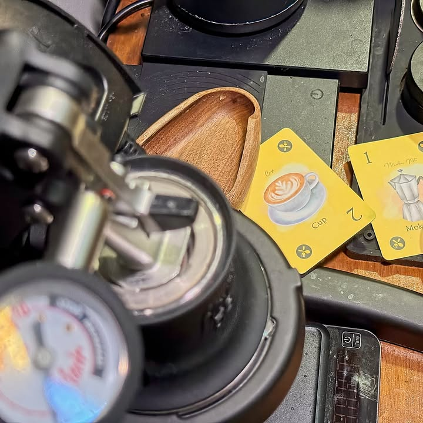

Tidy Home 

.
จงเก็บแต่สิ่งที่สปาร์คจอยให้กับเราเท่านั้น - นี้คือวลีที่อาจเปรียบได้กับคำสั่งสอนของปีศาจสำหรับชาวเก็บทุกสิ่งเผื่อได้ใช้วันหน้า คำกล่าวนี้ถือว่าเป็นคำนำหน้าที่เด่นดังมากของนักจัดบ้านชื่อดังคุณมาริเอะ คนโดะ (ที่สุดท้ายก็สารภาพว่ากับลูกตัวเองทำรกก็ปล่อยวางเหมือนกันละว้าาาาาา)

.
แต่ว่าเกมนี้ไม่ได้เกี่ยวอะไรกับนาง แต่ว่ายกมาเพราะมันเป็นธีมจัดบ้านทิ้งของรกไปพลางพร้อมกับสู้กับจิตใจหวงของที่อยากจะเก็บกลับมากองไว้ให้อุ่นใจ

.
คือธีมเกมเนี่ยการ์ดในมือเราก็คือของรกๆในบ้านที่เราอยากจะเอาไปเททิ้ง ซึ่งจะมีอยู่ 5 หมวด เลขไม่ซ้ำกัน ตาหนึ่งๆเราทำแค่อย่างเดียวคือทิ้งของลงกองกลางแล้วก็จั่วใหม่เท่านั้นเอง

.
แน่นอนว่าความที่มันเลขกับสีไม่ซ้ำกันแปลว่ามันต้องมีลีลาในการลงกันหน่อย ไอเดียคือเวลาลงมันจะไปอยู่ในกองสีของมัน ถ้าเราลงเลขน้อยกว่าใบล่าสุดก็ไม่เป็นไรทิ้งไว้นั้นแหละ แต่ถ้าเลขที่เราลงเยอะกว่าเลขล่าสุดเมื่อไรเราก็ต้องกวาดกองนั้นมากับไว้ที่บ้านรกๆของเรา

.
เกมเล่นกันแค่นี้แหละแต้มลบจะมาจากเลขที่ใหญ่สุดของแต่ละชนิดที่เรามี แต่ถ้าเราดันมีหมวดนั้นๆจำนวนเยอะกว่าคนอื่นในวงหมวดนั้นจะนับแต้มลบเหลือแค่นิดเดียวแทน เรียกว่าถ้าจะเก็บก็ต้องกวาดมาให้เยอะนั้นแหละ

.
ไอเดียหลักของเกมก็เลยอยู่กับการบริหารการ์ดในมือเลขเยอะก็เลี้ยงเก็บไว้ตบการ์ดมาเก็บแล้วก็ต้องมองกับนับการ์ดคนอื่นด้วยเพราะถ้าเอามาต้องชนะให้ได้ การ์ดเล็กก็เลี้ยงๆมุดๆรอจังหวะเอา เกมมีการ์ดแมวให้คนละใบเอาไว้ทิ้งคั่นจังหวะเพื่อช่วยให้บริหารดวงสะดวกขึ้นอีกหน่อย

.
ผมเล่นเกมนี้ครั้งแรกตอนยังเป็นตัวทดลองเล่นก่อนให้ pre-order ในงาน TIBM - ตลาดนัดบอร์ดเกมอินดี้ เผลอแป๊บเดียวเกมออกวางจำหน่ายละ แกนเกมไม่ได้มีอะไรเปลี่ยนแต่ว่าก็มีการปรับปรุงส่วนเล็กๆน้อยๆหลายจุดเพื่อให้เล่นได้อย่างสบายมากขึ้น จำพวกไอคอนที่ช่วยให้ผู้มีปัญหาในการแยกสีเล่นง่ายขึ้นไรงี้

.
จุดที่ขัดใจเล็กๆไม่ใช่ตัวเกมแต่เป็นคู่มือ คือไม่ค่อยชอบเกมที่เรียกการนับแต้มว่าเป็นแต้มบวกแล้วมาบอกว่าใครแต้มน้อยสุดชนะไรงี้เท่าไร แบบทำไมไม่เรียกแต้มลบแต่แรกฟระ แต่อันนี้เป็นความงึมงำส่วนตัวไม่ได้เกี่ยวไรกับเกม

.
สนใจหาเกมโคซี่เล่นเพลินๆได้ทั้งระดับครอบครัวหรือ thinky filler สำหรับเกมเมอร์ก็ติดต่อสั่งได้โดยตรงกับ Wise Cat Studio ได้โดยตรงครับ ทางค่ายส่งเกมฉบับปรับปรุงแล้วมาให้ลองเล่น แต่ข้อเขียนนี้ไม่ได้รับการสนับสนุนเป็นตัวเงินใดๆ และเขียนตามความรู้สึกโดยมิได้ทำเพื่อการโฆษณา

---
Frog-o-Meter: กบโอเค  
  
(My) Collection Fit: เอาไปรวมๆกับ collection การ์ดเกมเล่นง่ายคั่นเวลา เกมวาง position ตัวเองไว้ค่อนข้างดีเลย ไม่ตื้นไปแล้วก็ไม่ได้ฟุ้งไปด้วยความยุ่งยากเพื่อฉีกให้ต่าง
  
What I like: กติกาง่าย แต่จังหวะหยุดคิดเลี้ยงเกมก็ต้องใช้ชั้นเชิงอยู่พอตัว จะว่าไปน่าจะเป็นเกมภาพโคซี่ๆไม่กี่เกมที่โคซี่สนุกตามปกไม่ใช่เล่นละหัวอุ่นแบบคาลิโก้ , วาเด้น ไรงี้
  
What I dislike: ไม่ได้มีอะไรที่ไม่ชอบเป็นพิเศษ ก็มันเกมกล่องเล็กเล่นคั่นเวลาแป๊บๆน่ะ
  
Not for... : คนที่มองหาเกมง่ายๆเน้นดวงลงการ์ดขำๆ
  
Interaction Area: มองการ์ดที่เพื่อนลงมองของที่เค้ามีตรงหน้า บริหารความเป็นไปได้ว่าจะไปแข่งเก็บของสีไหนใครถืออะไรในมือ

