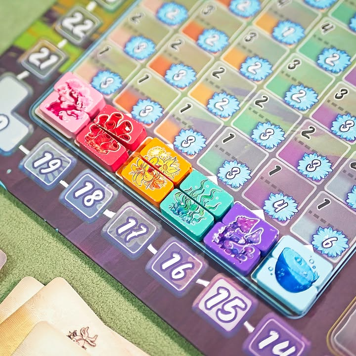

Arborea

เกมนี้จะให้เราเป็นภูติมาร่วมพลิกฟื้นดินแดนที่สูญสิ้น นำพาธรรมชาติและสัตว์มายาให้กลับสู่บ้าน ถ้าว่ากันโดยไอเดียแล้วก็คือเกมเก็บทรัพยากรไปซื้อการ์ดดินแดนแล้วก็ไปหยิบสัตว์มาวางเพื่อเป็น patten ทำแต้มอีกที

---
ระบบเก็บของในเกมจะเป็นการให้เราเอาคนงานไปวางไว้บนแทรคเดินทางหนึ่งใน 4 อัน โดยทุกรอบที่ผ่านไปตัวของเรา (และคนอื่น) ที่อยู่บนแทรคจะได้เดินหน้าไปเรื่อยๆ พอเราคิดว่าพอใจก็เอาคนงานกระโดดลงเดินไปตามทางเพื่อเก็บของในเส้นทางนั้นๆ ซึ่งแน่นอนว่ารอนานกว่าก็ได้ของดีกว่า (พูดแบบง่ายๆหน่อยก็แบบวงล้อใน tzolkin นั้นแหละ แน่เป็นเส้นตรงและไม่มีเตะตกล้อ)

---
ไอเดียที่น่าสนใจคือการทวิสระบบเก็บทรัพยากรใหม่ คือเวลาเดินตามแทรคเราก็จะได้ทรัพยากรแต่ว่ามันเป็นของส่วนกลางที่ใช้ได้ทุกคนแทน แต่มันจะมีส่วนการตัดสินใจว่าเราไม่ใช้เราจะได้แต้ม แต่ถ้าจะใช้ก็คือเอาไปสร้างดินแดนไว้รอรับสัตว์มาเลี้ยง ตัวสัตว์เองก็จะมีรูปแบบการทำคะแนนในพื้นที่ที่แตกต่างกันไป

---
สิ่งที่ผมคิดว่าทำให้เกมนี้น่าสนใจคือมันแทบไม่ได้นำเสนออะไรที่ซับซ้อนหวือหวาแต่ยัดมาได้เยอะโดยที่ตำแหน่งของแต่ละอย่างให้มันผสมกันได้เหมาะเจาะ ระบบบริหารคนงานมาใส่กับเวลาและมีจังหวะที่ต้องเลือกว่าจะส่งคนงานไปที่ไหน รอนานเท่าไรและในจุดสุดท้ายของการรอแต่ละแทรคเราต้องเลือกว่าจะเดินไปเส้นทางไหนอีก อีกอย่างที่ชอบคือไอเดีย engine ของเกมที่ทุกครั้งที่เราเดินเก็บของจะได้โบนัสประจำเส้นทางซึ่งให้ของที่แตกต่างกัน คือมันเป็นเกมที่มีแต่ของเดิมๆแต่ไม่ได้หยิบมาใส่แบบไม่มีที่มาที่ไปซักชิ้นเลย ใส่มาแบบไม่มีตรงไหนที่รู้สึกว่ามากไปหรือน้อยไป ผมชอบตรงนี้มาก

---
เป็นเกมที่นึกจุดที่ไม่ชอบจริงๆไม่ค่อยออก จะมีก็กระดานที่ดูลายตาจัดๆ กับเกมมันลีลาสูงทำให้รอนานเพราะต้องค่อยๆทำ step เล็กๆทีละขั้นกันงง (แต่ตอนที่ไม่ได้เก็บของอะไรก็ไวจัดๆนะ) ทำให้รู้สึกว่าถ้าต้องเล่น 4 - 5 คนก็คงไม่อยากเล่นเพราะมันนานเกินกว่าที่ชอบไปมาก (แบบมากๆ) แต่ถ้า 3 คนนี้กำลังดีเลย 

---
มีสิ่งหนึ่งที่ชอบมากจนต้องเขียนแยกมาอีกหัวข้อคือการเรียบเรียงคู่มือเป็นแบบที่ผมชอบเลย คือมีการอธิบาย 'key concept' ก่อน พร้อมกับวิธีชนะ ตามด้วยในแต่ละ secion จะมีการสอดแทรกจุดความคิดเชิงการตัดสินใจของเกมเอาไว้ให้ด้วยประนึงรู้ว่าคนอ่านเห็นแล้วจะถามว่าอะไร

---

Frog-o-Meter: กบชอบถ้าเล่น 3 คน (แบบเอาจริงๆขยับจมูกไปอีกหน่อยจะให้กบโปรดละ) แต่ถ้าเล่น 4-5 คนเอาไปเผารอนานฉิบหาย
  
(My) Collection Fit: เอาที่วางในชั้นไป ระบบดีเล่นสนุก คู่มืออ่านง่าย รื้อมากางสบาย
  
What I like: ระบบสวย เข้าใจง่ายทุกอย่างแต่ผสมมาแล้วเห้ยเจ๋งเลย ระบบผลิตทรัพยากรกลางเพื่อทำแต้มหรือจะหยิบเอามาเพื่อใช้สร้างดินแดนก็มีน้ำหนักการคิดที่ดี คู่มือเขียนและเรียบเรียงระดับ A+ พวกเจ้าจงมาศึกษาวิธีการเขียนคู่มือเกมนี้
  
What I dislike: เล่นเกิน 3 คนม่ายไหว จะรอนานเกิ๊นหลับรอได้เลย กับบอร์ดดูตอนแรกๆลายตาฉิบหาย แต่เล่นๆไปก็ function อยู่ (อารมณ์บอร์ดของ Bitoku)
  
Not for... : คนที่ชอบเกมแบบ highly interaction ตัดกันเข้มๆ และคนที่ไม่ชอบเกมที่ downtime เยอะ
  
Interaction Area: อยู่กับตัวเองซะเยอะ จังหวะไปด้วยกันไปด้วยไกลมีแบบเบาบาง ส่วนที่แย่งกันจริงๆจะเป็นจังหวะการหยิบทรัพยากรกลางมาสร้างดินแดน กับการแย่งชวนสัตว์บางชนิดมาเก็บไว้

