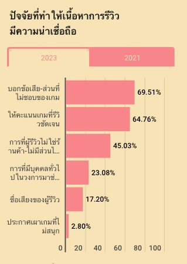
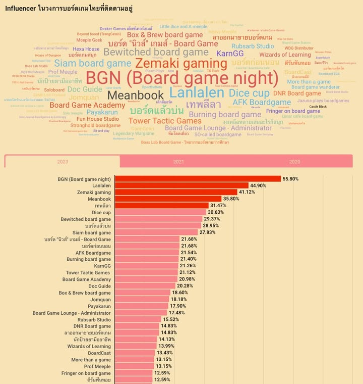

ในวงการเกมกระดานนั้น กลุ่มคนหลักร้อย หรือแค่ 715 คนมีมูลค่าเกมรวมกันทั้งหมด 100 ล้านบาท แต่ตัวเลขที่ว่านั้นเป็นแค่การประเมินขั้นต่ำที่ในความจริงอาจจะสูงเกิน 150 ล้านเสียด้วยซ้ำ

---
เป็นอีกหนึ่งผลงานการสำรวจจากทาง Lunar Gravity ที่ทำมาหลายปีและนี้ก็เป็นผลการสำรวจของปีนี้ครับ ใครที่อยากดูข้อมูลทั้งหมดมีลิงค์ด้านล่าง

และต่อจากนี้เป็นความเห็นของผมในบางแง่มุมเกี่ยวกับผลการสำรวจครับ ผิดถูก เห็นด้วยเห็นต่างตรงไหนก็มาคุยกันนะ 😀

---
1 - แหล่งที่มาของข้อมูล : อย่างที่ทราบกันว่าจำนวนไม่น้อย (เดาว่าเกิน 70%) จะมาจากบอร์ดเกมเล้าจ์ที่ประชากรจำนวนมากก็จะจริงจังเกมมิ่งประมาณหนึ่ง ผลที่เห็นก็อาจจะไม่ได้สะท้อนภาพรวมทั้งหมด แต่มันก็น่าจะสะท้อนกลุ่มที่ step up จากการเล่นตามร้านได้ดี (คือคนที่ชอบเล่นบอร์ดเกมจนตามมาอยู่กลุ่มบอร์ดเกมมันก็ต้องชอบมากประมาณหนึ่งละ)

ในแง่มุม active community ผมค่อนข้างผิดคาดเล็กน้อยที่คนร่วมตอบแบบสอบถามมีเพียง 715 คนเท่านั้นเอง ถือว่าน้อยมากเทียบกับ sizing ประชากรเพจบอร์ดเกมเล้าจ์ (BGL) ที่มีสมาชิกเกือบ 30,000 คน แถมด้วย refer ว่าทราบเรื่องแบบสอบถามมาจากคุณจอมขวัญที่เป็นเพจแมสยังมาเป็นอันดับหนึ่ง เลยน่าจะพออนุมานได้อีกว่าคนใน BGL ที่มาร่วม active จริงๆก็น้อยลงไปอีก

ซึ่งถามว่าน้อยไหมก็คงไม่ เพราะเปิดฟีดดูวันๆก็วนถามกันในกลุ่มก็เห็นจำนวนแถวๆนั้นแหละ แต่รู้สึกเสียดายที่สมาชิกกลุ่มที่ไม่ค่อย active รวมไปถึงคนนอกในมุมกว้างนั้นไม่ค่อยสนใจในแบบสอบถามนี้ซักเท่าไร

---
2 - มูลค่าเกมโดยรวม : จากข้อแรกผมคิดว่ามูลค่าเกมนี้น้อยเกินจริงไปเยอะ อันเกิดจากการขี้เกียจนับเกมจำนวนมากที่มี หลายท่าน (ผมด้วย) ก็กะๆเอาเกมที่มีคูณด้วย เลขซัก 2,000 เผื่อตีเป็นมูลค่าเกมมา แต่อย่างที่รู้ๆกัน ซื้อเกมช่วงนี้มันก็ไปเริ่มกันที่ 2500-3500 แล้วไหนจะพวก all-in ที่เริ่มกันที่ 5,000 - 10,000+ อีก พ่วงกับคนที่ดึงมีนมีไม่มาก (อิงจากข้อ 1) แปลว่ารวมกันถึง 150 ล้านบาทผมก็คิดว่าไม่เกินจริง 

รวมไปถึงเรื่องจำนวนเฉลี่ยราคาเกมต่อคนที่ถ้าอิงจากมีสายตามเล่นไม่ค่อยซื้อในจำนวนที่น้อยแล้ว ถ้าตัดกลุ่มนี้ออกไปค่าเฉลี่ยก็จะสูงขี้นอีก

---
3 - ขอบคุณครับ : คือจากผลแบบสอบถามก็จะเห็นว่ามีคนติดตามเพจบอร์ดแล้วบ่น 28.95% แล้วถ้าดูใกล้อีกหน่อยผมก็ไปอยู่ในดงของกลุ่มระดับแมส / ร้านค้า / คนทำ content ถี่ๆ และอย่างที่น่าจะรู้กันว่าเพจผมมันเฉพาะทางประมาณหนี่งเป็นแค่คนบ่นเรื่อยเปื่อย ไม่ชอบบอร์ดเกมในมุม sideway อื่นๆก็ไม่น่าจะมาสนใจ การที่ไปอยู่ตรงนั้นได้ก็น่าอาจจะตีความได้ว่ากลุ่มที่เล่นเกมจริงจัง (อยู่ใน BGL) และเป็น active member และพร้อมช่วย contribute ทำแบบสอบถามนั้นก็ติดตามความเห็นผมอยู่เรื่อยๆ สำหรับ introvert ขี้บ่นแล้วเรื่องนี้คือสิ่งที่ผมดีใจที่สุดครับ

---
4 - 'ข้อเสีย' คือยาขมที่ขาดไม่ได้ในการรีวิว: อิงจากข้อ 1 เนื่องจากคนในแบบสอบถามน่าจะจริงจังเกมมิ่ง การรีวิวอวยๆบวกยับๆโม้ๆปั่นๆนั้นหลายครั้งผลตอบรอบไม่ดีเท่าไร เพราะคน(ในกลุ่มที่ตอบแบบสอบถาม)อยากได้ข้อมูลรอบด้านไปช่วยตัดสินใจ 

ในฐานะคนที่ชอบแสดงความเห็นก็พบว่าการเขียนข้อเสียนั้นเป็นเรื่องที่ไม่สนุกตั้งแต่ไม่ชอบก็ต้องมาเขียนแถมต้องอธิบายอีกไม่งั้นจะกลายเป็นบ่นโง่ๆที่ดูแล้วเป็นไอ้งั่งขี้บ่น และมันต้องการจิตใจที่มั่นคงพอที่จะรับผลของการแสดงความเห็นตัวเอง ไม่ได้เอาแต่หลบอยู่ในร่ม 'ความเห็นส่วนตัว' ซึ่งก็เพราะแบบนี้แหละเราเลยเห็นแต่รีวิวสไตล์สนุกอย่างเดียวเสียเยอะ ซึ่งก็ไม่ได้ผิดอะไร แค่รู้สึกเสียดายแต่ก็เข้าใจได้ว่ามันเหนื่อย

ในมุมของผมแล้วคิดว่าสิ่งที่สำคัญคือการ set style ของตัวเองให้มั่นคงแล้วพูดอิงจากสิ่งที่เราตั้งไว้ครับ กลุ่มคนที่ไม่เข้าใจเรื่องสไตล์นั้นไม่จำเป็นต้องสนใจก็ได้เพราะเค้าไม่ได้เข้าใจแต่แรก แต่ว่าถ้าเราสื่อสารไม่ชัดเจนเองว่าเราแนวไหนอันนี้ก็ไม่ดีนะ

---
5 - สิ่งที่ไม่ชอบระหว่างเล่น : ผมสนใจตรงนี้ในแง่มันน่าจะเป็นครั้งแรกในแบบสอบถามที่มีเสียงสะท้อนจากกลุ่มคน AP (ขออนุญาตเหมารวมเพื่อความสะดวก) คือเราจะเห็นกันอยู่เสมอว่าการคิดช้าคิดนานนั้นไม่ดี (โดยเฉพาะคนในกลุ่มอาการ ADHD แบบผมนั้นการรอนานเป็นเรื่องทรมาร) แต่ความเห็นที่ว่า 'ไม่ชอบถูกกดดันในรีบตัดสินใจ' ก็มียอดแสดงความเห็นที่ดีทีเดียว

คือผมเองก็มีแนวคิดว่าใช้เวลามากน้อยไม่สำคัญเท่ากับ อยู่ใน pacing เดียวกันทั้งวง คือชอบคิดนานทั้งวงใครไม่ชอบรอก็ย้าย (เล่นมือถือรอก็ผิดอีก) หรือถ้าเป็นคนช้าสุดก็ถ้าไม่ย้ายก็ต้องเรียนรู้ที่จะตัดจบแล้วเลือกเดินเหมือนกัน

อีกอันที่สะดุดใจนิดๆคือวิเคราะห์ให้ระหว่างเล่น อันนี้ไม่แน่ใจว่ามองกันในมุม alpha ช่วยมูฟไหม แต่ในฐานะที่ปกติผมคิดเร็วผมพบว่าตัวเองจะเป็นคนคิด solution ของคนอื่นได้ไวในแบบที่เค้าได้ประโยชน์สูงสุดด้วย ถ้าเค้าทำท่าจะช้าผมก็มักจะสาธยายให้ฟังไรงี้ และหลายทีมันก็เป็นสิ่งที่คนคิดว่าขู่ อย่างเช่นมาตรงนี้ผมคิลแน่ ซึ่งผมไม่ได้ขู่นะ มันแค่ fact ที่จะเกิดในอีก 3 ตาเฉยๆถ้าคุณเลือก choice A ไรงี้ (เออน่าเอามาเขียนมุมนี้เหมือนกัน) แต่ก็เข้าใจว่าหลายคนอยากคิดเอง ซึ่งในบริบทของผมนั้นถ้าเล่นละมูฟห่วยก็อย่าเล่นเลย......

---
จบล่ะ สามารถไปดูข้อมูลแบบสอบถามเต็มๆได้ที่นี่นะครับ - https_://infogram.com/thaiboardgame-community-survey-2023-1h0n25oywe7ll4p

