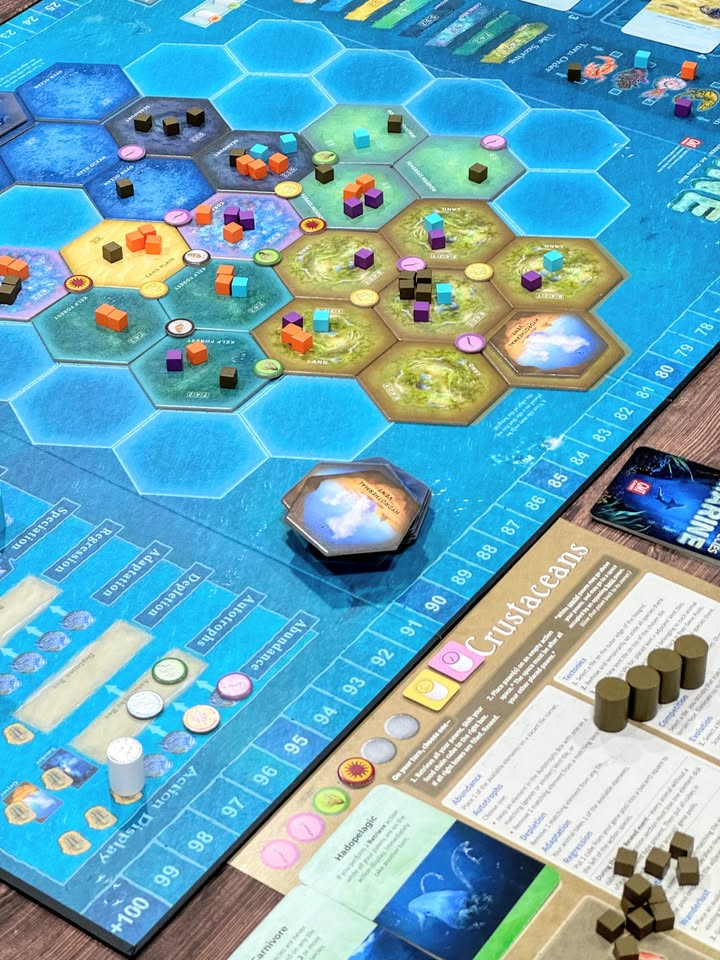

#หยิบมาเล่า วันก่อนผมพึ่งขุด Dominant Species ที่ไม่ได้เล่นมานานแล้วมาเล่นอีกรอบ แล้ววันต่อมาก็เลยอ่ะหยิบ Dominant Species : Marine มาซ้ำด้วยละกัน ซึ่งพอได้เล่นติดๆกันก็พบว่าความเห็นผมเปลี่้ยนไปจากเดิมหลายอย่างเหมือนกัน

---
เล่าก่อนว่าทั้งสองเกมก็เล่นคล้ายๆกันแค่ตัว DS:M มันเอาตัวเดิมมาปรับใหม่ เกมนี้เป็นเกมแนว majority / area control ที่ให้เราส่งตัว species ของสายพันธ์ดึกดําบรรพ์ (พวกนก แมลง ไรงี้ไม่ใช่ไดโนเสาร์) ไปยึดพื้นที่แล้วทำแต้มตามจำนวนพวกมากลากไป ตามแบบเกมแนวนี้

แกนที่สำคัญของเกมคือมันมีระบบหาข้าวกิน ที่สัตว์ของเราจะอยู่ได้จากแหล่งอาหารแตกต่างกันแต่สามารถเพิ่มลดได้ระหว่างเกม แล้วด้วยพื้นผิวโลกที่เปลี่ยนแปลงตลอดเวลาอาหารในกระดานมันก็เพิ่มลดไปเรื่อยอีก ทำให้เกมมีมิติของความอยู่รอดเยอะ รวมไปถึงการชิงเป็นคนที่ 'กินเก่ง' ที่ไม่เน้นจำนวนแต่เน้นความเข้ากันได้ในการหาอาหารเพื่อทำโบนัสเพิ่มอีก

อีกจุดสำคัญคือการ์ด event ในเกมที่ให้ผู้เล่นเลือกใช้นั้นมักจะมีผลรุนแรงในแบบที่กะจังหวะผิดอาจจะมีตายยกแผงได้ง่ายๆ จึงทำให้เป็นเกมที่ต้องกำหมัดกันแน่นเกมหนึ่ง

---
สองภาคนี้หลักๆจะต่างตรงวิธีการ resolve ผล คือใน DS ดั้งเดิมจะให้เราผลัดกันจองช่องแอคชั่นจนครบทุกคนจากนั้นค่อยไล่ reslove จากบนลงล่างแอคชั่นเองไม่ได้ยุ่งยากอะไรแต่ด้วยความที่ต้องคำนวนไว้ก่อนว่าถ้าทำอันนี้แล้วจะทำอันโน้นต่อ ทำให้เกมกินแรมค่อนข้างเยอะอยู่ ในขณะที่ DS:M จะใช้วิธีลงแอคชั่นแล้วทำเลย แต่ว่าต้องเสียจังหวะทำแอคชั่นดึงตัวกลับขึ้นมือเอง ก็ทำให้รูปเกมโดยรวมฉับไวกว่า 

ด้วยความที่ action flow ต่างกันไม่มากถ้าเล่นกล่องนึงมาแล้วก็ปรับตัวเล่นอีกกล่องไม่ยาก แต่ mindset ทำคะแนนจะต่างกันเยอะเนื่องจาก resolve ไม่เหมือนกันทำให้จังหวะของผู้เล่นแต่ละคนแตกต่างกันโดยสิ้นเชิง

---
คือก่อนหน้าผมเล่น DS:M ก็เออคิดว่าสนุกดีเกมไวกว่าด้วย แต่พอกลับมาเล่นตัวหลักแล้วสลับมาเล่นติดๆกันแล้วพบว่าผมชอบตัวเก่ากว่ามากๆเลย (ในกรณีทีเล่น 4 คนเหมือนกัน) คือด้วยความที่ event ในเกมมัน chaotic อยู่แล้วแต่จำนวนการ์ดมันแน่นอนทำให้เราเน้นไปที่การบริหารความเสี่ยงกับคำนวนวิธีการเล่นได้นิ่งกว่า เทียบกับ DS:M ที่อยู่ๆเดี๋ยวก็มี event อยู่ๆเดี๋ยวก็รอบเช็คคะแนนที่ไม่แน่นอนทำให้วางแผนอะไรไม่ได้เลยเพราะต้องลุ้นไปกับความเสี่ยงแทน

แล้วเอาจริงตัวเก่ามาเล่นตอนนี้ก็เอ๊ะไม่ได้ยากเหมือนที่เราจำได้นิหว่า ส่วนหนึ่งก็อาจจะเป็นที่ผมคล่องมากขึ้นกับอีกส่วนก็อาจจะเพราะไม่ได้เจอวง AP ที่รอนานจนเหนื่อยก็ได้

---
ใดๆก็แล้วแต่ผมมองว่ามันเป็นเกมที่ดีทั้งคู่ครับแม้ไอเดียจะคล้ายกัน แต่ก็มีจุดเด่นจุดด้อยในแบบที่้มี 2 กล่องก็ไม่เกะกะ แต่ถ้าเทใจช่วงนี้ผมก็คงให้ DS ตัวหลักนี้แหละ (จะแปลไทยกี่โมงงงงงงงงงงง) ถ้าใครมองหาเกมแนว majority control เบียดๆสำหรับ 4 คน (ไปๆมาๆผมชอบ DS 4 คนมากกว่า 6 คนเยอะเลยแฮะ) ก็แนะนำให้ลองดูครับ

