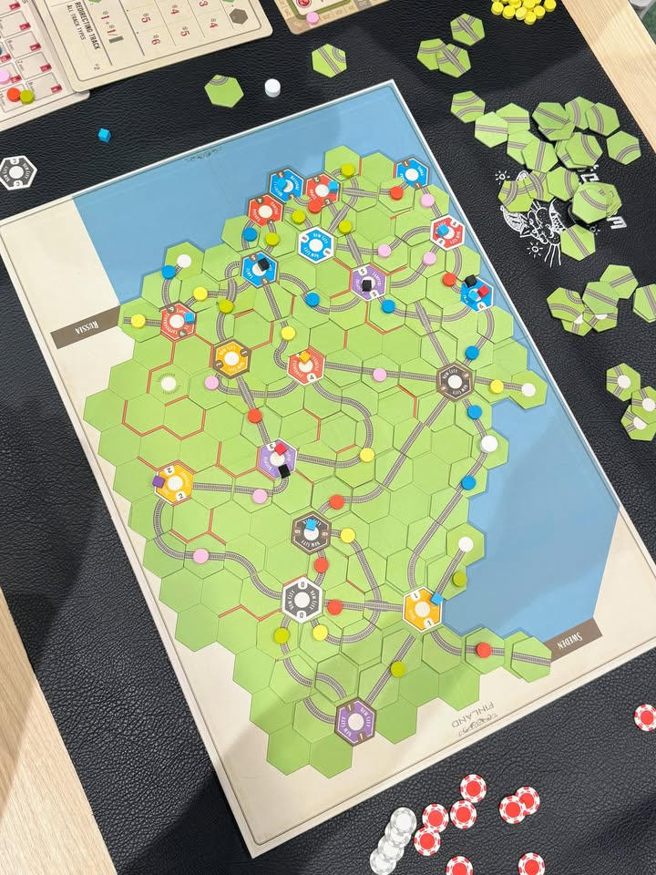
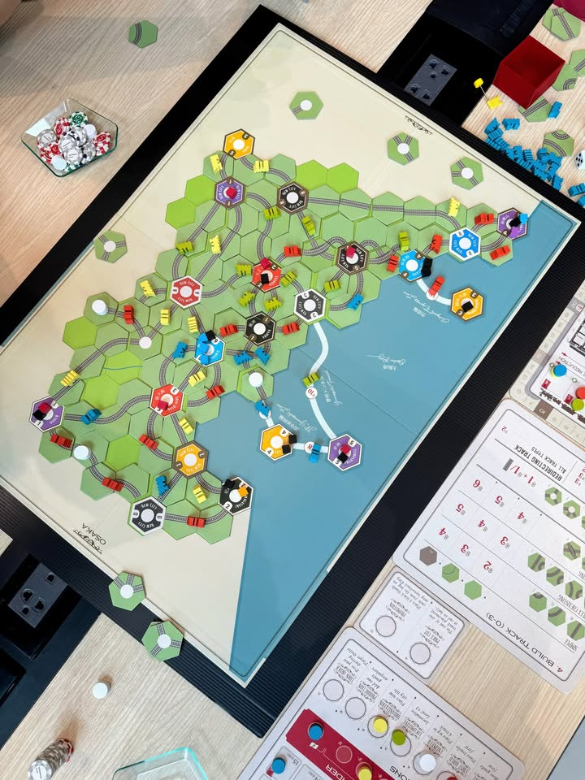

Age of Steam: Disco Inferno และแผนที่อื่นที่เล่นมาในงาน AoS CON

---
Disco Inferno - ธีมกาวๆว่าด้วยการส่งนักเต้นไปตามผับมีกติกาที่ไม่ต้องใช้ก็ได้คือใครฮัมเพลงนอกตาตัวเองต้องเสีย income 1 ทุกครั้งแต่เราจะข้ามสิ่งนี้ไปเพราะมันนำเสนอสิ่งที่เจ๋งมากๆให้กับเกม Age of Steam

--- the floor is lava ---

1. ระบบส่งของแบบ chain ชิ่งไปเรื่อย- ถ้าส่งของแล้ว locomotive point เหลือ + เมืองปลายทางมี cube ที่สามารถส่งต่อด้วย locomotive point ที่เหลือได้ก็สามารถหยิบส่งต่อได้ในแอคชั่นนั้นเลย มีแล้วทำให้วิธีคิดเปลี่ยนไปเยอะมาก cube โดนดักก็ยังสามารถส่งต่อได้ถ้าวางลำดับไว้ดี

2. เมือง cube หมดไม่รับของ - เมื่อส่งได้เยอะเมืองจะว่างไว แต่สิ่งที่เกิดขึ้นคือเมืองนั้นจะเอา token ไฟมาวางทำให้มีสภาพคล้ายๆกับเป็น town คือไม่สามารถรับ cube ได้อีกแต่สามารถวิ่งผ่านได้ไม่ดักสีด้วย ตรงนี้ทำให้การเลือกว่าจะเหลือ cube ไว้หรือการแกล้งโดยการหยิบ cube สุดท้ายออกทำให้มิติของกระดานเปลี่ยนไปได้อีก เพิ่มเลเยอร์ในการคิด

3. ไม่ต้องเติมของ - เอาระบบทอยเติมของออกไปเลย แต่ใช้วิธีสุ่ม cube วางไว้พร้อมกับ tile urbanization เลย พอสร้างก็เอา cube ไว้ด้วย ทำให้ภาพรวมเกมกระชับกันมากขี้น ส่วนแอคชั่น production ก็ยังอยู่แต่ว่าให้เราสุ่มแล้วเลือกได้เลยจะวางที่เมืองไหน แต่ห้ามวางเมืองที่เคยว่างไปแล้ว

4. และใช่แล้วในรอบที่ผมเล่นมีคน -4 income จากการฮัมเพลง....... แต่คนปกติเล่นกันไม่ต้องใช้หรอก เหมาะกับแก๊งคนเพี้ยน ฮาๆ

5 - ชอบไอเดียน่าลองเอาไปเล่นแผ่นที่อื่น 

---
Osaka - ไอเดียใช้ได้แต่แอบวุ่นไปหน่อย ธีมบอกสินค้าของเราคือคณะตลกจะไปเดินทางจัดแสดง แผนที่เล็กเน้นที่ดินราคาแพง เพิ่มแอคชั่นมา 2 อันคือเติม cube ดำ และวางไทล์จ่ายครึ่งราคา ทำให้การแย่งไทล์ไม่อึดอัด ความโบ๊ะบะคือเวลา cube ที่เราส่งเนี่ยถ้าระหว่างทางเจอสีเดียวกันตามเมืองเราจะได้เงินเพิ่มด้วย กับถ้าปลายทางไม่มี cube สีดำเงินได้จะลดลง 1 และรางคนอื่นที่เราใช้ทางด้วยจะไม่ได้รับเงิน

---
Finland - เฉยๆ เป็นแผนที่ที่จะมีเส้นกั้นที่ห้ามข้ามผ่านวางซับซ้อนเป็นเขาวงกต ปัญหาคือพอวางๆไทล์ไปแล้วมันมองไม่เห็นทำให้เล่นยากเกินจำเป็น ตัวกติกาของแผนที่จะเน้นให้ฝั่งหนึ่งของแผนที่เป็นแหล่งกระจุกตัวสินค้าที่รู้สึกเหมือนมัน scripted ไปหน่อยเพราะเมืองมันรับของอะไรก็ได้แต่จำกัดจำนวนครั้ง

