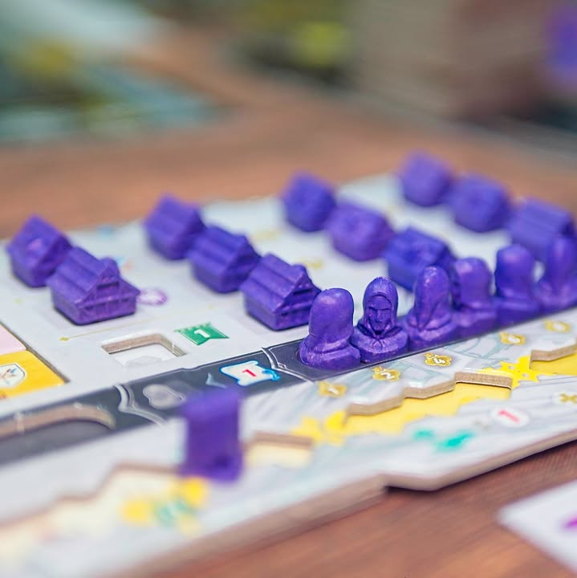
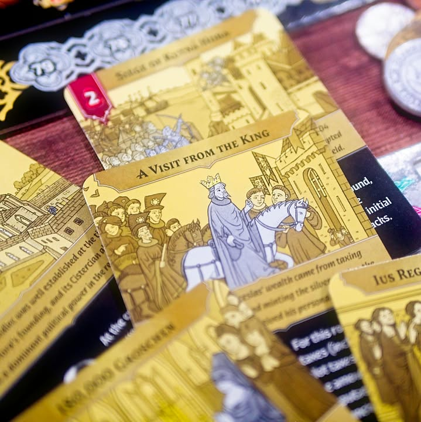

Kutná Hora: The City of Silver 

เกมเล่าเรื่องของเหมืองเงินที่เป็นแหล่งแร่เงินสำคัญของยุโรป ที่ศตวรรษที่ 14 แร่เงินของยุโรปกว่าหนี่งในสามมาจากเหมืองแห่งนี้

---
ตัวเกมจะเล่าถึงจุดเริ่มต้นของการเจอเหมืองและการขยายตัวของเมืองที่จะมารองรับการไหลบ่าของประชาชนที่เข้ามาตั้งรกรากผู้เล่นจะได้รับบทเป็นสมาชิกสมาคมการค้า (กิลด์) ต่างๆที่จะมาช่วยพัฒนาเมืองและทำธุรกิจกัน

---
ระบบเกมจะเป็นการทำแอคชั่นจากการ์ดในมือ เรามี 6 ใบรอบหนึ่งเล่น 5 ใบ แต่มีกิมมิคว่าในหนึ่งใบนั้นจะมี 2 แอคชั่นให้เลือกถ้าใช้ด้านหนึ่งจะใช้อีกด้านไม่ได้ ทำให้ต้องวางแผนลำดับนิดหน่อยเพราะแอคชั่นมันใส่มาไขว้ๆกัน

ตัวแอคชั่นโฟลวค่อนข้างตรงไปตรงมาคือมี จองที่ดิน, ซื้อแปลนตึก, เอาตึกไปวาง, วางไทล์เหมือง แล้วก็เสกรายรับเข้าตัว

---
ระบบ economic ในเกมเล่าเรื่องค่อนข้างฉลาดดี เกมจะมีถาดใส่การ์ดกับที่คาดมาให้ พอเราสร้างตึก สมมุติว่าโรงเลื่อยละกัน บางตึกจะบอกให้เพิ่มประชากร เราก็จะเปลี่ยนการ์ดไปตามจำนวนคนที่เพิ่มทำให้ราคาสินค้าที่เกี่ยวข้องอย่าง ไม้/อาหาร/เบียร์ ราคาก็จะเพิ่มไปด้วย แต่ด้วยความที่มันเป็นโรงเลื่อยไง ราคาไม้ก็จะลดลงเพราะผลิตได้มากขี้น พอมีคนทำตึกกิลด์อื่นๆมันก็จะมี impact กับราคาสินค้าทรงๆนี้แหละ 

ตรงนี้เกมจะจำกัดเราอีกหน่อยคือเกมมีถึง 6 กิลด์แต่เราจะสร้างตึกได้แค่ 3 กิลด์นะเกมจะสุ่มกลุ่มที่เราจะสร้างได้มาให้ ในเชิงเกมก็ค่อนข้าง make sense คือบังคับผู้เล่นให้กระจายสร้างไปกลายๆ แต่ก็มีข้อเสียว่าจะไม่มีสายการเล่นอะไร เมืองจะค่อยๆโตแบบไม่กระโดดนัก

---
ตัวสินค้าในเกมจะมีหลายแบบก็จริงแต่เกมไม่มี token ให้ คือมีแต่ราคา เวลาจะซื้ออะไรที่ใช้ของนั้นๆก็ใช้เงินตามเรทเลย อย่างบอกไม้ราคาชิ้นละ 2 ถ้าตึกต้องการ 5 ไม้ก็จ่าย 10 บาทไรงี้ กับพอเราเป็นเจ้าของกิจการใดๆจะมีการเดินแทรคเอาไว้ถ้าเราเลือกแอคชั่น income เราก็จะได้เงินตามราคาสินค้าที่เราผลิตได้ ณ ตอนนั้น เอาจริงๆผมคิดว่าฉลาดดีไม่ต้องผลิต token อะไรมาเยอะแยะ

---
เกมนี้ใช้วัสดุพิเศษที่เรียกว่า re-wood อันเป็นไม้ recycle นี้แหละทำ token มาได้รายละเอียดดีมากเลย กับพวกไทล์พวกการ์ดเกมพยายามใส่สีสะท้อนแสงโทนเงินโทนทองเข้ามาตลอดเวลาคือแบบเล่นละรู้สึกดี สวยแบบไม่ดู look cheap ทรงสะท้อนวิ้งวับ

---
Frog-o-Meter: กบเฉย  
  
(My) Collection Fit: ไม่เก็บ, decision making space เบากว่าที่ชอบ ก็ค่อนข้างเสียดายเพราะเป็นเกมที่ออกแบบวัสดุการใช้งานกับอาร์ทได้ดีมากๆ 
  
What I like: งานศิลป์ดี การเลือกใช้วัสดุก็น่าสนใจ เล่าเรื่องความสัมพันธ์ของเกมและเมืองได้แบบเป็นรูปธรรมดี ระบบแทรคราคาแบบ 2 มิติที่มีตัวช่วยดีๆ รูปแบบการเล่นมีจุดที่ต้องตัดสินใจในการเลือกแอคชั่นเพราะ 1 ใบมันมีสองแอคชั่นที่ทำได้อันเดียว
  
What I dislike: เกมเล่าเรื่อง econimic ที่ไม่ได้ให้ผู้เล่นไปมีส่วนร่วมแบบตั้งใจ สร้างตึกแล้วราคาเปลี่ยนประชากรเพิ่มแต่ก็แบบกรูต้องสร้างอยู่แล้วป่ะว่ะ เรื่อง timing เลยไม่ได้มีผลอะไรมาก แบบฉันจะสร้างไอ้นี้ราคาจะได้เพิ่มฉันจะได้รวยไรงี้ ไม่มีแบบนั้น.. ระบบทำแต้มค่อนข้างลีลานับหลายขยักนับโน้นนี้หลายจุด ชิงเมเจอร์ขุดเหมืองก็ดวงแท้ๆ โบนัสกลางเป็นแบบคูณแต้มรวมได้เหมือนๆกันทุกคนอยู่ที่เกาะรถทันไหมไม่มีสายเฉพาะ อีกอันคือบอร์ดมันต่อกันด้วยระบบจิ๊กซอร์ไม่ได้เป็นแบบพับ ไม่ค่อยชอบเท่าไร
  
I think this game might be a good fit for...: ผู้เล่นระดับกลางที่พ้นระดับครอบครัวมาแล้วอยากได้เกมสวยๆ ใช้ความคิดแต่ไม่ได้ระดับตัดกันเหี้ยมๆ ตอนเล่นมี narative ของการพัฒนาเมืองที่เข้าถึงได้ไม่ได้เป็นยูโรแห้งแล้ง
  
I think this game might NOT fit for...: สายยูโรหนัก เกมไม่ได้ให้  decision space ลุ่มลึกอะไร อย่าให้ใครมาบอกคุณว่านี้เป็นเกม economic (โอเคมันใช่แหละ แต่นะ....เรียกว่าเอา economic มาเล่าเรื่องจะตรงกว่า)
  
Interaction Area: ชิงจังหวะจองพื้นที แย่งทำเลขุดเหมือง

