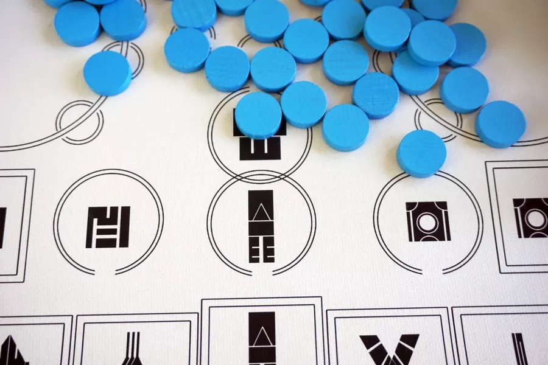
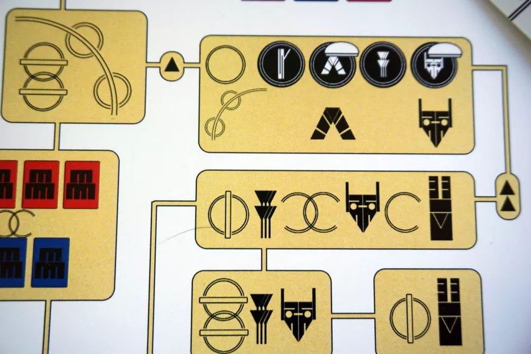

มีใครใจดีแปลเกมนี้หรือยัง / มีใครทำคลิปสอนหน่อยอ่านละงง ... หลบไปได้เลย เจอเกมที่เราต้องมา 'แปล' เกมกระดานที่เจอในต่างดาวหน่อยเป็นไง!!

เป้าหมายของเกมก็คือการถอดรหัสวิธีการเล่นเกมของคู่มือการเล่นนี้แหละ ซึ่งค่ายก็บอกแน่นอนว่ากรูจะไม่แปลรูลให้ แล้วก็จะไม่ตอบคำถามใดๆเกี่ยวกับกติกาด้วย ก็มันของจากต่างดาวนินา!!

---
อ่านล่ะโคตรล้ำ เสียดายว่าเป็นค่ายที่มีเงินไม่พอแต่ต้องชอบเกมอินดี้มากเพราะเป็นเจ้าเดียวกับที่ทำเกมอย่าง Doubt Is Our Product ที่เล่นเป็นบริษัทค้าบุหรี่มาต่อสู้กับนักรณรงค์ ราคารวมส่งมาที่มี 3-4 พันกับเกมอุปกรณ์ทำมี๊อทำมือ

กับเกมนี้เล่นได้คนเดียวนะ

---
เกมแนวนี้อีกเกมที่หาง่ายกว่าแล้วผมค่อนข้างชอบมากก็คือ First Contact เกมแนวใบ้คำที่ผู้เล่นมีสองทีมคือเอเลี่ยนจากต่างดาวที่ยานมาตก ต้องหาทางให้ทีมมนุษย์หน้าโง่เรียนรู้ภาษาต่างดาวจะได้ช่วยหยิบของถูกชิ้น ซึ่งไอเดียมันจะประมาณ codename นั้นแหละแต่เพิ่มเลเยอร์การใช้สัญลักษณ์มาแทนการใบ้ด้วยคำพูด

---
อ่าน designer diary ได้ที่นี้: 
https_://boardgamegeek.com/blogpost/162133/designer-diary-city-of-six-moons

