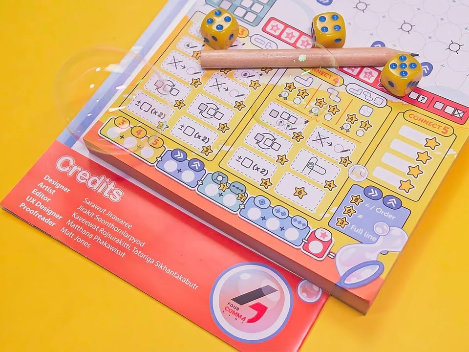

CoNNNect (มี N 3 ตัว)

เกม Roll & Write เกมแรก (แต่เปิดตัวอันดับสอง) จากค่ายน้องใหม่ Four Comma Game (ของแท้ไม่เติม s) ค่ายเกมไทยที่เป้าหมายคือระดับโลกตั้งแต่แรก เกมนี้ออกแบบโดยคุณ Sarawut Jirawaree คนเดียวกับที่ทำ Defuse เกม R&W ที่เรียกได้ว่าได้รับความสนใจเป็นอย่างมากในงานตลาดนัดบอร์ดเกมอินดี้ครั้งที่หนึ่ง

---
ไอเดียจะพูดไงดี เรียกมันว่าโคตรแอดวานซ์บิงโกละกัน คือในตาหนึ่ง active player จะทอยเต๋ามา 3 ลูก จากนั้นจะเลือกลูกหนึ่งเป็น zone แนวตั้งหรือแนวนอนและที่เหลือเป็นเลขไว้เขียน ผู้เล่นทุกคนก็จะโดนบังคับ zone ที่เขียนได้แต่ว่ามีอิสระว่าจะเขียนเลขที่ออกตรงไหนก็ได้ใน zone นั้นๆ

เออเกมเล่นแค่นี้แหละจบ... เปลี่ยนคนทอยไปเรื่อยๆ 12 รอบนับแต้ม

---
จุดสนุกเกมมันอยู่ที่พอเราเอาเลขมาเรียงติดกันได้ 3/4/5 ตัวในรูปทรงที่กำหนดแล้วมันจะไปเช็คถูกเอาเอาความสามารถพิเศษเพิ่มได้ ทีนี้คือแม่งบันเทิงจัดเพราะมันจะแบบช่วยให้เราย้ายเลขได้ หรือปรับหน้าเต๋าหรือเขียนเลขเพิ่มเอาไปทำเชนคอมโบต่อ บลาๆ

---
จุดที่น่าสนใจก็คงเป็นเอาแต่งึมงำก็ไม่ได้เพราะมันมี objective กลางอยู่ต้องไปแย่งกันนิด แต่ในขณะเดียวกันระบบทำคะแนนเกมแม่งเยอะสิ่งมาก มีเติมเต็มแถว มีล้อมจุด มีล้อมจุดให้มันเรียงกันไรงี้ แล้วไอ้เติมเต็มแถวแต็มไม่เท่ากันอีก แต่อ้าวเลขกูก็จะเรียง โว๊ะ!! 

---
ใดๆก็แล้วแต่ตามแบบเกม r&w ทั่วไปคือเอาไฟล์ลง tablet แล้วขีดเล่นสะดวกกว่าเยอะ ไม่ก็เอาแผ่นมาขยายให้ใหญ่อีกนิดมาเคลือบแล้วใช้ปากกาไวท์บอร์ดเขียนดีกว่าลบง่ายเวลาพลาด

---
ตัวที่เอามาเขียนถึงเป็นตัว Pre Production Copy ที่ค่ายส่งมาให้ด้วยความพิศวาส ส่วนเกมที่จะผลิตระดับแมสกำลังตามมาสามารถไปพรีออร์เดอร์ที่เพจของค่ายหรือร้านค้าได้เลยครับ ข้อเขียนกับรูปนี้ (และไลฟ์ก่อนหน้า)ทำด้วยอารมณ์ส่วนตัวไม่ได้มีว่าจ้าง (no money changed hand, free product, honest opinion )

---
Frog-o-Meter: กบโอเค  
  
(My) Collection Fit: เกม roll & write อันเล็กเล่นไม่ยากสอนไม่นาน เก็บได้
  
What I like: ของที่อยากทำแม่งเยอะจัดไปได้หลายท่าโคตรโลภ
  
What I dislike: จริงๆก็ด้วยความที่มันเยอะเลยกลายเป็นอยู่ผิดวงนี้จากเกมง่ายๆขำๆอาจจะกลายเป็นเกมนานจนน่ารำคาญได้ถ้ามีคน AP กับอีกอันคือเวลาเล่นหลายคนถ้าเพื่อนเลือกโซนไม่ตรงกับที่เราอยากได้มันจะแบบค่อนข้างเซงไปจนถึงน่ารำคาญอยากเลิกเล่นเอาดื้อๆ กำลังว่า solo varient ที่กำลังจะมาตามมาจะสนุกเพราะตอนได้นั่งคิดอันล็อกโน้นนี้คนเดียวคือเพลินใช้ได้เลย ไม่ก็เอาจริงๆชอบตอนมันซัก 2 คนมากกว่ามั้ง?
  
I think this game might be a good fit for...: ขาเกม r&w ที่สนใจเกมระดับเข้าถึงง่ายอธิบายไม่หยุบหยับ
  
I think this game might NOT fit for...: คนที่ไม่ชอบการ multitask แต่ก็อยากทำแต้มให้ดี แต่ว่าไม่ชอบความเสี่ยงที่คุมอะไรไม่ได้มาก 
  
Interaction Area: แย่งเป้าหมายกลางนี้จ้องกันจริงจัง กับนั่งดูเพื่อนออกลีลาต่อคอมโบ

