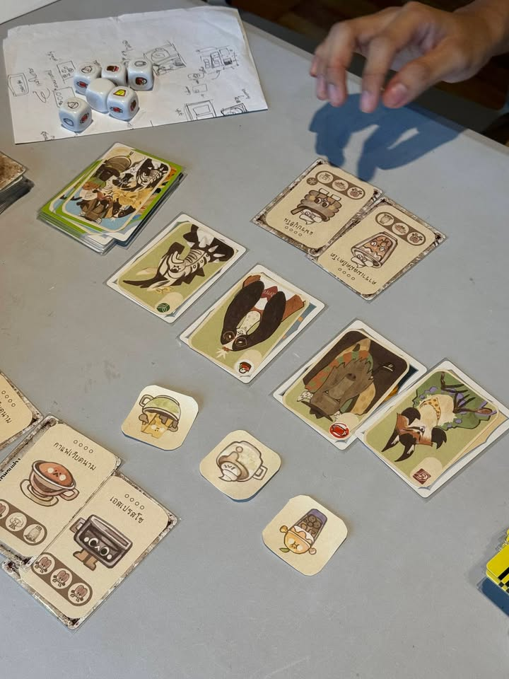
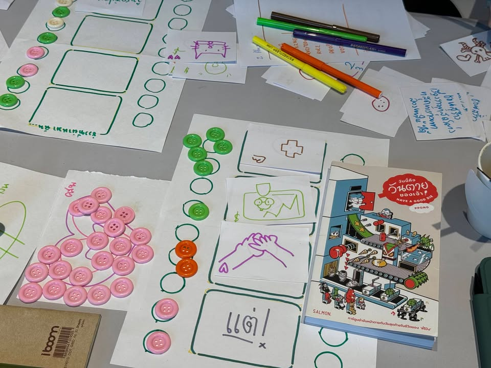
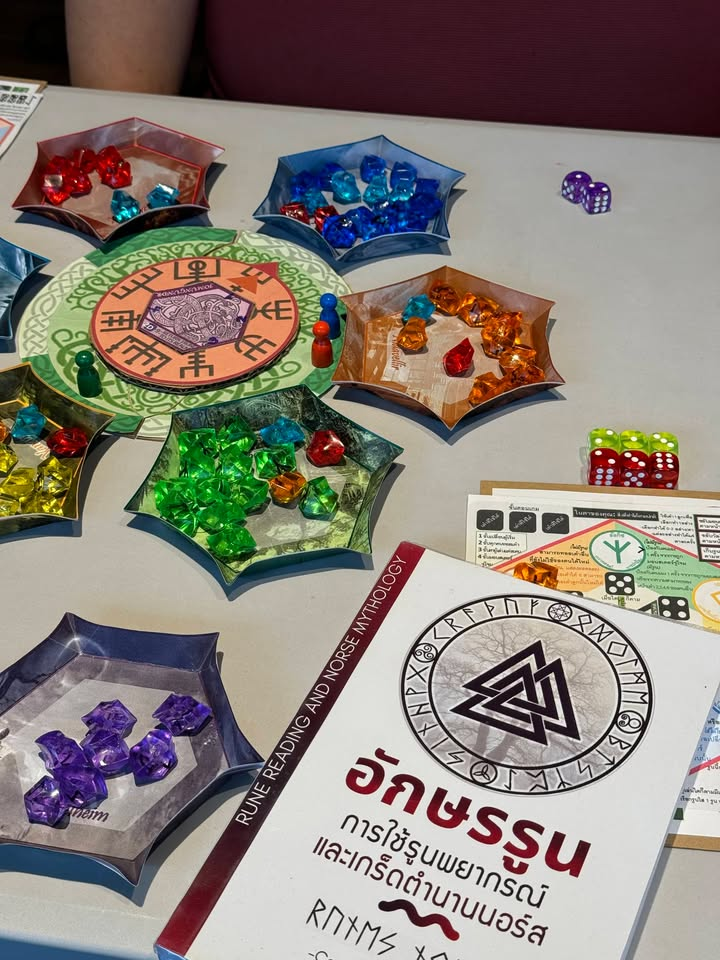

วันนี้ไปเป็น Mentor ให้กับงาน Book on Board ปี 3 จัดโดย TK Park อุทยานการเรียนรู้ กับ สถาบันบอร์ดเกมเพื่อการเรียนรู้ - Institute of Board Game for Learning มาครับ

ตัวกิจกรรมจะว่าด้วยการออกแบบเกมกระดานจากหนังสือ โดยวันนี้ผู้ที่ผ่านเข้ารอบทั้ง 10 ทีมได้มาทำ workshop กัน ในพาร์ทของผมเองก็จะมาช่วยกับ mentor ท่านอื่นๆในการให้ความเห็นตัวงานต้นแบบที่เรียกได้ว่าร้อนมือพองจัดๆ เพราะของหลายๆทีมนั้นพึ่งทำกันเสร็จหลังอบรมรอบเช้านี้เอง

เวลาค่อนข้างจำกัดผมเองเลยมีโอกาสเล่นไม่ครบทุกทีม บางทีมก็มัวแต่คุยทำเวลาจนลืมถ่ายเฉย แต่ก็พบว่าไอเดียแต่ละทีมน่าสนใจเอามากๆแม้ว่าในรายละเอียดอาจจะยังต้องไปรอความคิดให้ตกตะกอนดีก่อน

---
อย่างที่ผมคิดว่าไอเดียตั้งต้นน่าสนใจจะเป็นเกมจากหนังสือ 'สมุดบันทึกของฆาตกร' ที่เล่าถึงอดีตฆาตกรต่อเนื่องที่หันหลังให้กับสิ่งที่ตัวเองเคยทำ พอรู้ตัวว่าเป็นอัลไซเมอร์ก็เลยเขียนไดอะรี่ไว้ ต่อมาดันมีคดีเกิดขึ้นแล้วคิดว่าอ่ะหรือว่าตัวเองจะเป็นคำทำว่ะ? .... ซึ่งนักออกแบบถ่ายทอดออกมาเป็นเกมสไตล์บลัฟที่จะมีคนร้ายตัวจริงกับผู้เล่นที่ตอนแรกไม่มีใครรู้ว่าตัวเองเป็นคนร้ายหรือเปล่ามาร่วมกัน deduct จากข้อมูลการของเหยื่อที่เหลือรอดกัน

---
อีกเกมจะหยิบเอา HAVE A GOOD DIE วันนี้คือวันตายของเจ้า! ที่เป็นการ์ตูนแก๊กสี่ช่องที่เล่าเรื่องตลกแบบทวิสในตอนช่องสุดท้ายเสมอ มาหยิบเป็นสื่อแนวกิจกรรมเพื่อการตระหนักรู้ว่าความตายอยู่ใกล้กับเราเหมือนกันนะ ฟังดูอาจจะน่าเบื่อแต่ในความจริงแล้วไอเดียตั้งต้นมันเจ๋งมากเลยนะ เพราะมันเปิดโอกาสให้เราพูดเรื่องหนักๆของชีวิตได้อย่างเป็นธรรมชาติและไม่น่ากลัวเลย

---
กิจกรรมจะแบ่งออกเป็นรุ่นมือใหม่ที่ไม่เคยประกวดอะไรมาก่อน และมือโปรที่เคยส่งประกวดมาแล้ว แต่ส่วนตัวคิดว่าทั้งสองฝั่งที่ผมเจอนั้นไม่ได้แตกต่างกันเท่าไร (ส่วนหนึ่งน่าจะเพราะคัดมาแล้ว) เรียกว่าต่างกันแค่เคยหรือไม่เคยส่งประกวดเลยก็ยังได้ ทุกทีมอย่างน้อยก็เคยไปเล่นเกมกระดานตามร้านมาบ้าง มีความเข้าใจในกลวิธีการใช้กลไกเกมในระดับที่คุยกันรู้เรื่อง (ส่วนหนึ่งก็น่าจะเพราะตัว workshop ให้ความรู้มาดี) แต่สิ่งที่คิดว่าน่าสนใจคือไอเดียการพยายามนำเสนอเกมจากหนังสือที่ตัวเองยกมานั้นน่าสนใจเอามากๆ ไม่เจอเกมไหนเลยที่แนวๆเอาไอเดียเก่าๆมาบิดเข้าธีมส่งประกวด

---
อีกข้อสังเกตที่พบเจอคือ เวลาเป็นงานประกวดเนี่ยผมต้องแยกการให้คำแนะนำเป็น 2 มุมพร้อมๆกัน อย่างแรกก็แน่นอนคือเรื่องกลไกเกมและความสนุก และอย่างที่สองคือ 'เกมที่ทำมันตอบโจทย์การประกวดแค่ไหน' อย่างเช่นบางเกมอาจจะสนุกกว่าอีกเกมแต่ว่ามันดันแทบไม่ได้เล่าถึงหนังสือที่ยกมา ในแง่หนึ่งมันอาจจะต่อยอดเป็นเกมที่สนุกกว่านี้ได้อีก แต่ในมุมการประกวดที่มีหัวข้อชัดเจนแล้วถ้าให้ผมลงคะแนนก็อาจจะต่ำก็ได้

---
หวังว่าวันนี้จะได้ให้คำแนะนำที่เอาไปใช้ประโยชน์ได้ครับ (ฮา) ขอบคุณผู้จัดที่ชวนไปครับ ผมเองก็ได้เปิดโลกเห็นไอเดียน่าสนใจหลายอย่างแถมได้กดซื้อหนังสือเพิ่มหลายเล่มเฉยเลยเพราะกิจกรรมที่คนเค้าเอาเกมมาเล่าเนี่ยแหละ :)

