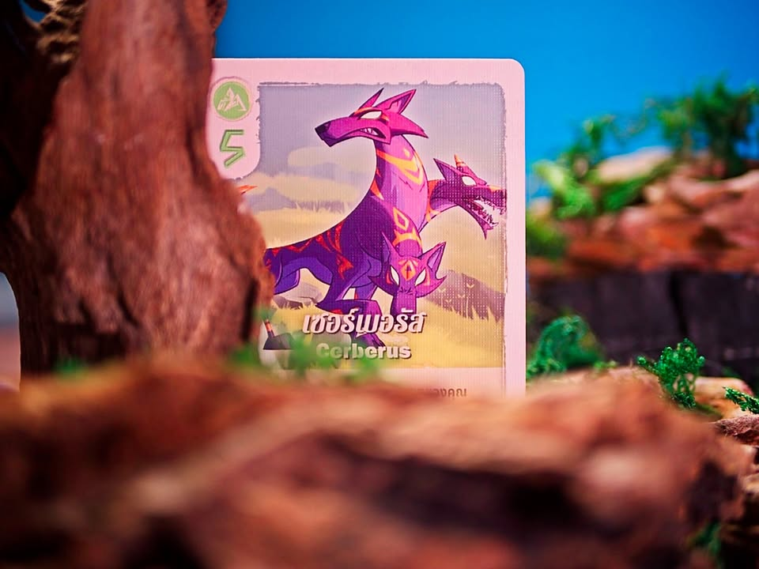
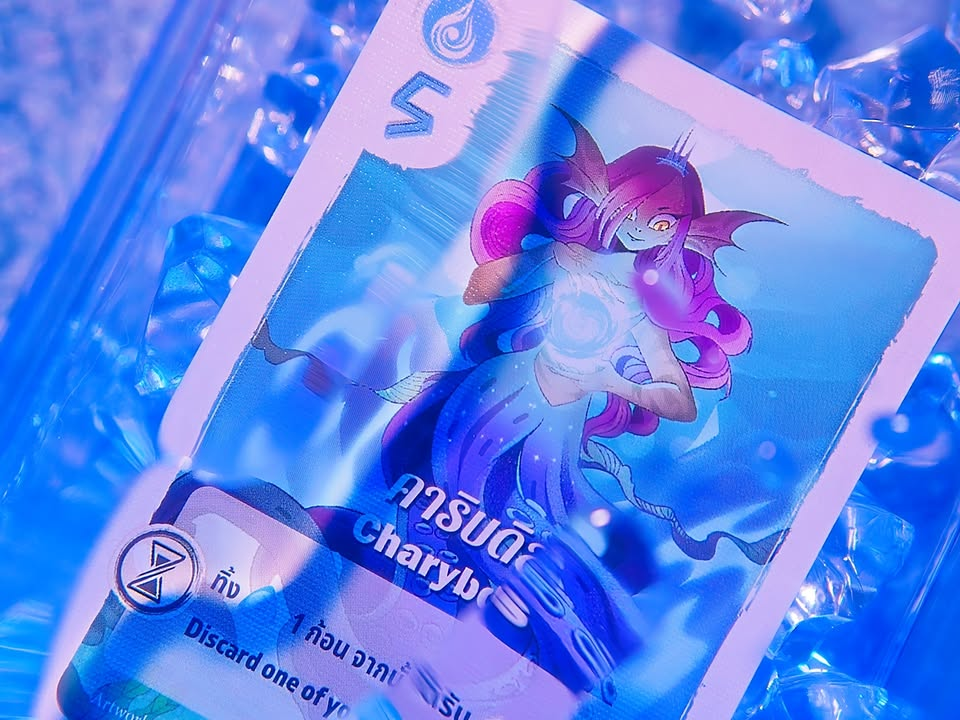
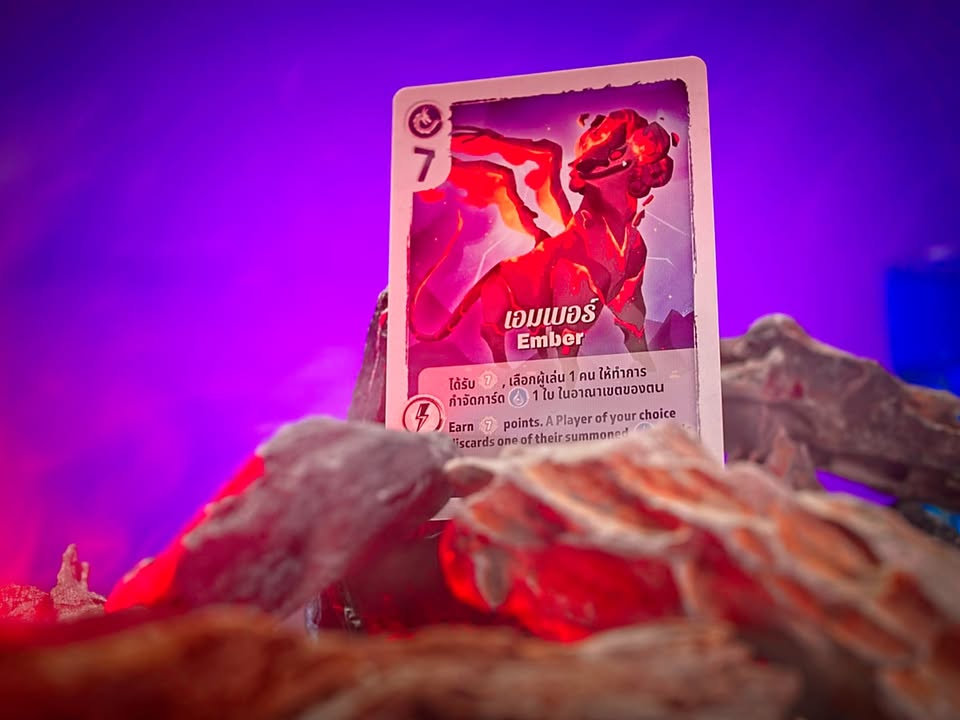
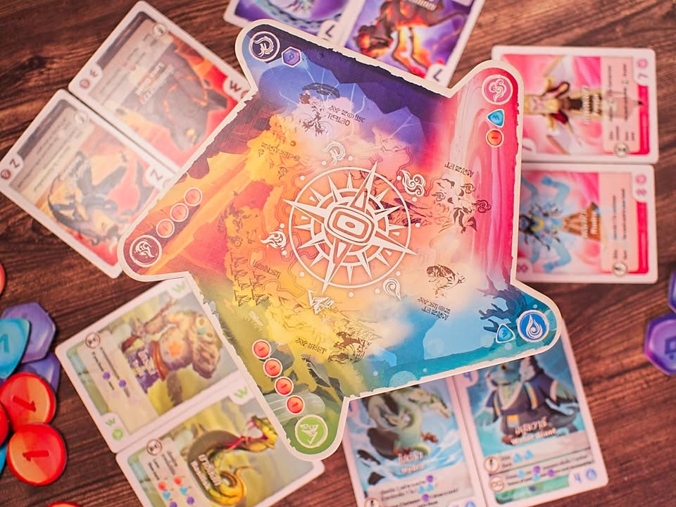
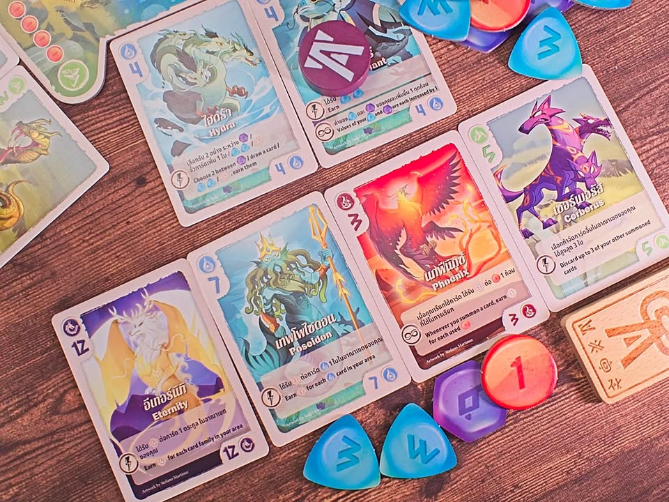

การ์ดเกมแนวทำคอมโบที่เราจะได้ออกล่าสัตว์ในตำนานแห่งหุบเขาลี้ลับมาระเบิดพลังแข่งกัน -  The Vale of Eternity : หุบเขาแห่งตำนาน

---
เกมกติกาเป็นมิตรกับมนุษย์ ADHD มาก ง่ายจนงง เริ่มตาผลัดกัน draft การ์ด เข้าตาหยิบมาทำท่าปั่นๆเอาคะแนน ถึง 60 แต้มก่อนจบเกม.....

---
โอเคส่วนที่ทำให้เกมนี้มันน่าสนใจคือระบบจัดการคอมโบนี้แหละคือพอเกมมันสุ่มการ์ดมาให้ผู้เล่นผลัดกัน draft แล้วถึงตาตัวเองก็อยากเล่นอะไรก็เล่นไป มันจะมีตั้งแต่ทิ้งการ์ดไปเพื่อแลกเป็นมานา (ข้อใช้คำนี้ละกันพิมพ์ง่าย) แล้วก็เอามานาไปเป็นค่าร่ายการ์ด  ทีนี้มันก็ว่ากันตามการ์ดเลยบางใบก็ effect รอบเดียว บางใบก็มี passive

---
สิ่งที่น่าสนใจที่เป็นเรื่องง่ายๆแต่เกมทำมาคุ้มเพราะเล่นกับตรงนี้จริงจังคือระบบมานา ตัวมานามันจะเป็นไทล์ก้อนหินที่เราสามารถมีได้แค่ 4 ชิ้นเท่านั้น ห้ามเกินเด็ดขาด แต่ละก้อนเลขไม่เท่ากัน ใช้แล้วไม่ทอนด้วย เกมมันเลยเน้นให้เราวนอยู่กับการแลกไปมาหรือมีความสามารถที่จะช่วยให้เราผลิตของที่ดีขี้นจะได้เรียกการ์ดที่มันจะเปลี่ยนอะไรซักอย่างของเราในกระดานในเป็นแต้มจริงๆอีกที

---
ระบบกำกับจังหวะเกมก็ถือว่าทำได้ดี เดาว่าน่าจะหยิบมาจากพวกการ์ดเกมคือระบบจำกัดพื้นที่เอาไว้เลี้ยงสัตว์ตรงหน้าเรา ซึ่งมันจะค่อยๆขยายไปตามรอบการเล่น ข้อดีของวิธีนี้คือทำให้ผู้เล่นแต่ละคนโตไปด้วย pacing พอๆกัน ตาแรกๆก็ไม่ค่อยมีอะไรการ์ดคนละใบสองใบ แต่พอตาหลังๆมันก็จะมีข้อเสียนิดหน่อยว่าพอการ์ดเต็มหน้าตักจะเล่นไรที่แม่มรอคนก่อนหน้าเล่านิทานกันไปจบแล้วปลุกกรูด้วย ส่วนตัวเลย happy ที่มากสุด 3 คนนะ 4 คนการ์ดเยอะขึ้นก็จริงแต่ผมไม่ค่อยชอบรออ่ะ

---
(My) Collection Fit: เป็นสไตล์ที่ปกติไม่ค่อยได้เล่นเพราะส่วนมากขี้เกียจรอเพื่อนคิด พอดีได้กล่องไทย ที่มันมีทั้ง TH/EN ก็ลดปัญหาเรื่องเพื่อนไม่ถนัดภาษาได้อยู่ กับความที่กาง 3 คนรู้สึกว่าน่าจะพอดีก็โอเคเก็บไว้เป็นเกมคั่นเวลาได้
  
What I like: กติกาอธิบายง่ายต่อคอมโบแล้วสนุก 
  
What I dislike: ไม่เชิงว่าเป็นปัญหาของเกมแต่พอการ์ดมันเยอะคอมโบมันแยะ ยิ่งเครื่องติดนี้ขอหยิบอันนี้จะได้อันโน้นแล้วขอใช้อันนั้นจะได้อันนี้ บลาๆ มันสนุกแหละแต่รอนานนนนนนนนนนน (เอาเป็นว่าผมไม่เล่น 4 คนแน่ๆ) ซึ่งก็กลับมาที่พอมันทำเชนได้เยอะคนก็จะพยายามอ่านกับตีความการ์ดนานเพื่อมาทำคอมโบ อีกนิดคือการ์ดตอนแรกเหมือนจะเยอะแต่พอเล่นซ้ำๆไปมันเริ่มจับทางได้ ในแง่นี้เกมจะต้องออกตัวเสริมมาเลี้ยงไปอีกซักพัก แต่ถ้าไม่ได้กะเล่นติดกันบ่อยๆก็ไม่ต้องคิดมาก (ซึ่ง ณ ตอนที่เขียนก็มีประกาศตัวเสริมแล้วนะ)
  
I think this game might be a good fit for...: คนสายคอมโบมองหาโน้นนี้มาต่อยอด engine ในมือ
  
I think this game might NOT fit for...: ไม่ชอบอ่านเยอะ ไม่อยากคิดคอมโบ เป็นสายรีบแล้วมีเพื่อนคิด คนที่มองหาเกมตัดกันยับๆ
  
Interaction Area: เล่านิทานอยู่กับตัวเองเป็นส่วนมาก มีชะโงกดูเพื่อนนิดนึงว่าจะหยิบใบไหนตัดมันดี หว่ะฮะฮะ 

---  
this is a gifted product from Box & Brew Café and Board Games, no money changed hand for this content. ได้รับสินค้าฟรี คอนเทนต์ทำเพื่อแสดงความเห็นส่วนตัวเกี่ยวกับเกมโดยไม่มีการจ้างวาน

