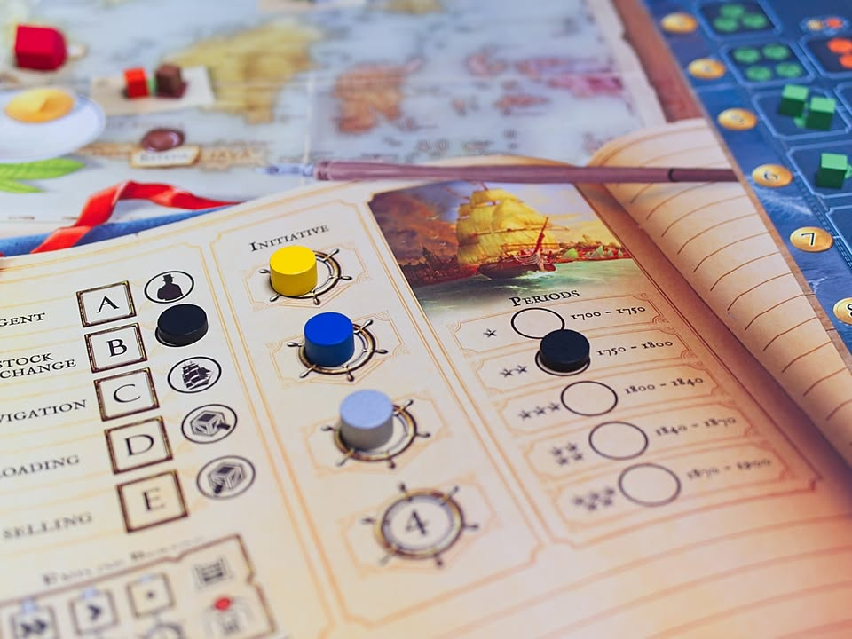
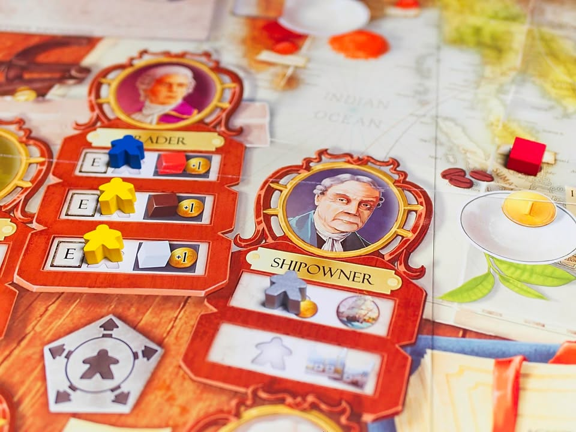
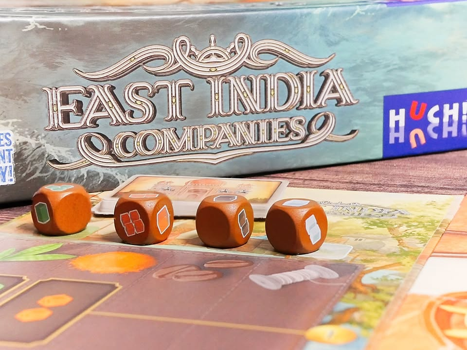
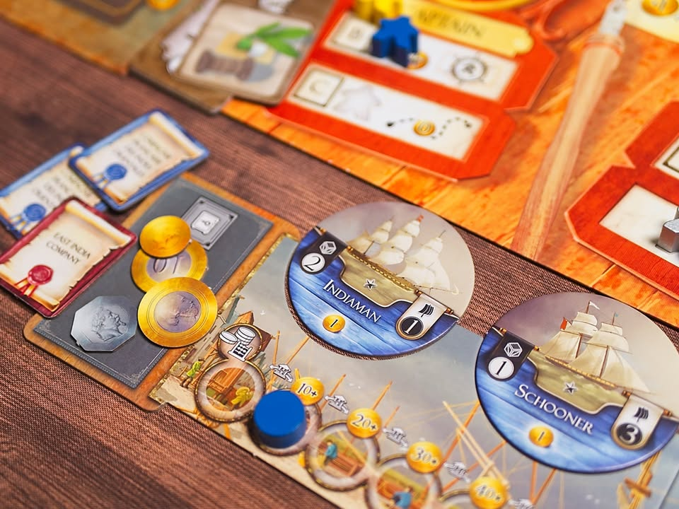

เกมระดับกลางที่ว่าด้วยการแข่งขันการค้าทางทะเลของเหล่าบริษัทที่ควบคุม 'โลก' ในศตวรรษที่ 19 - East India Companies

---
ไอเดียของเกมคือเราจะเป็นหนึ่งในบริษัทการค้าของเหล่ามหาอำนาจในยุคนั้น หลักๆก็ไม่ได้ยุ่งยากอะไร มีซื้อเรือ => ส่งไปหิ้วสินค้าจากเอเชีย => กลับมาขายที่ยุโรป => ดันราคาหุ้นจ่ายปันผล แล้วก็วนลูป

---
ระบบเกมจะรันด้วย worker placement ที่มีทวิสนิดหน่อยคือแอคชั่นมันจะแบ่งออกเป็น 5 กลุ่มเรียงกันเป็นวงกลม ถ้ารอบก่อนเราทำแอคชั่นอะไรไปแล้วคนงานเราจะเดินไปได้แค่ช่องข้างๆเท่านั้น แต่ถ้าไม่อยากเดินไปก็ไปตรงกลางแทนได้ แต่อดทำแอคชั่นนะ ตรงนี้ก็เลยต้องมีวางแผนนิดนึงว่าจะวนไปไหนดี พ่วงกับถ้าไปทำช่องซ้ำคนอื่นต้องจ่ายตังเพิ่มด้วย

---
ระบบตลาดในเกมนี้มันจะกึ่งๆ drive ด้วยผู้เล่น กึ่งๆสุ่มนิดนึง คือมันจะมีสินค้า 4 แบบอยู่ในยุโรปกับอินเดีย ตอนเราไปซื้อที่อินเดียก็จะมีการสุ่มผลิตของเพิ่ม พอเราหยิบมาของมันก็จะลดลง (และแพงขึ้น) พอกลับมาขายที่ยุโรปก็จะมีสุ่มหยิบออกไปจำนวนหนี่งก่อน ให้เราค่อยไปขาย

---
ตัวเอกในการเดินเกมของเราก็เลยจะเป็นเรือนั้นเอง เกมมี pooling เรือให้เราซื้อของใครของมันต่างกันที่ ขนาด กับ ความเร็ว ซึ่งก็ตาม concept คือจุมากก็วิ่งช้า จุน้อยก็วิ่งเร็ว แถมแต่ละยุคเรือก็ดีขึ้นเรื่อยๆ

ในเฟสเดินทางเนี่ยเราจะต้องเอาเรือมาว่าคว่ำไว้ว่าเราจะเอาลำไหนไปลงช่องไหน มีอยู่ 3 ตลาด ทีนี้ในแต่ละตลาดก็จะเอาเรือมาวัดกันใครเร็วกว่าก็ซื้อก่อนไรงี้ พอครบทุกตลาดก็เอากลับมาขายที่ยุโรปโดยคง concept เดิมคือเรือไวกว่าขายก่อน

---
ที่เหลือก็พวกบริหารจัดการเรื่องท่าเก็บเรือ เอากำไรมาจ่ายเงินปันผลในผู้ถือหุ้น ไปซื้อหุ้นเพิ่ม หรือจอดเรือรอซื้อของก่อนเพราะสินค้าราคาไม่ถูกใจไรงี้ ก็วนๆกัน 5 รอบใหญ่ก็จบเกมละ

จุดที่น่าสนใจก็จะเป็นการเดินหุ้นในเกมจะใช้วิธีว่าใครผลกำไรประจำรอบเยอะก็ได้เดินหุ้นเยอะ แต่ถ้ากำไรน้อยสุดหุ้นจะร่วงแทน

โดยโทนรวมๆของเกมจะหนักไปทาง tactical หน้างานมากกว่านะเพราะพวกราคาไรงี้วางแผนล่วงหน้าไม่ได้ต้องดูกันรอบต่อรอบ

---
ส่วนที่ไม่เกี่ยวกับเกมแต่มันจะมีพวกฝรั่งสายตื่นรู้มาโวยวายเรื่องธีมอยู่เยอะเหมือนกัน เพราะยุคสมัยนั้นคือจุดเริ่มต้นของการล่าอาณานิคมกันแบบฉ่ำๆของเหล่าชาติยุโรป เกมเลยจะเจอคนพวกนี้ไปกดคะแนนต่ำๆใน BGG กันพอควร

---
(My) Collection Fit: ปกติผมจะเล่นเกมทรง economic ที่หนักกว่านี้ (กลุ่ม 3 ชั่วโมง+) หรือไม่ก็เล่นแบบเบาๆขำๆไปเลย (กลุ่ม 30 - 45 นาที) ส่วนเกมนี้ก็จะเหมาะกับคนที่พึ่งพ้น gateway มาแล้วมองหาเกมสไตล์ลงทุนมีหุ้นที่ธีมมันดูครบวงจรหน่อย

What I like: รูปแบบการ present ระบบบริษัท ที่ลงทุนวางแผนซื้อเรือไปซื้อสินค้าและไปซื้อหุ้น
  
What I dislike: สำหรับเกมระดับกลาง แอบรู้สึกว่าเฟสมันหลายขยักไปนิด โดยเฉพาะตอนไล่ resolve ว่าเรือใครจะได้ซื้อขายของก่อน ต้องมาไล่ดู speed กันทีละลำ เป็นผลทำให้เกมใช้เวลาค่อนข้างนานสำหรับเกมขนาดกลาง (มี 120 นาที ในขณะที่เกมทรงนี้ปกติจะจบซัก 90 นาที ถ้าเป็นพวกเกมแนว Cube Rail นี้ 60 นาทีก็จบละ) ระบบหุ้นแอบคิดว่าต่อให้เกมระดับกลางก็น่าจะมีลูกเล่นเยอะกว่านี้อีกหน่อย แต่ก็ถือว่า manage ได้ make sense พอควรสำหรับเกม weight ระดับนี้
  
I think this game might be a good fit for...: คนที่สนใจเกมที่มีกลิ่นของการลงทุนค้าขายเดินทางไปซื้อถูกขายแพง มีระบบการลงทุนในกิจการเพื่อการเติบโต แบบที่ไม่ต้องมาคำนวนเลขนับทุกเศษบาท
  
I think this game might NOT fit for...: คนที่มองหาได้เกมแนว economic เข้มๆตัดราคาขายของกันยับๆ หรือมองหา demand/supply แบบที่ผู้เล่นควบคุมกันเอง 100%

---  
this is a gifted product from Box & Brew Café and Board Games, no money changed hand for this content. ได้รับสินค้าโดยไม่มีค่าใช้จ่าย คอนเทนต์ทำเพื่อแสดงความเห็นส่วนตัวเกี่ยวกับเกมโดยไม่มีการจ้างวาน

