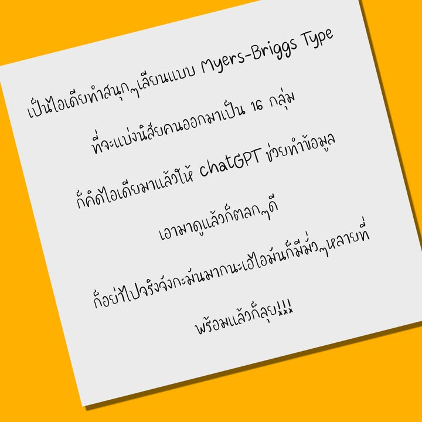
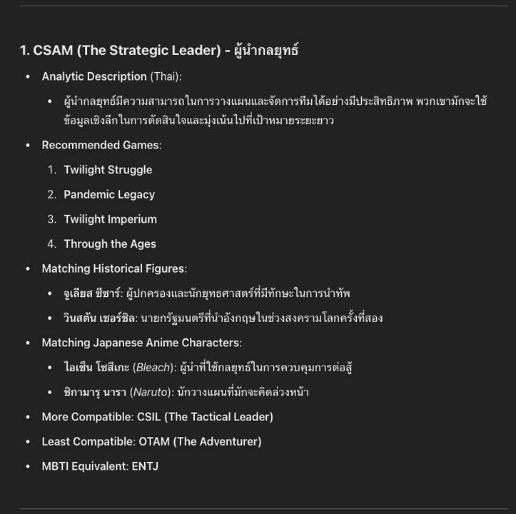
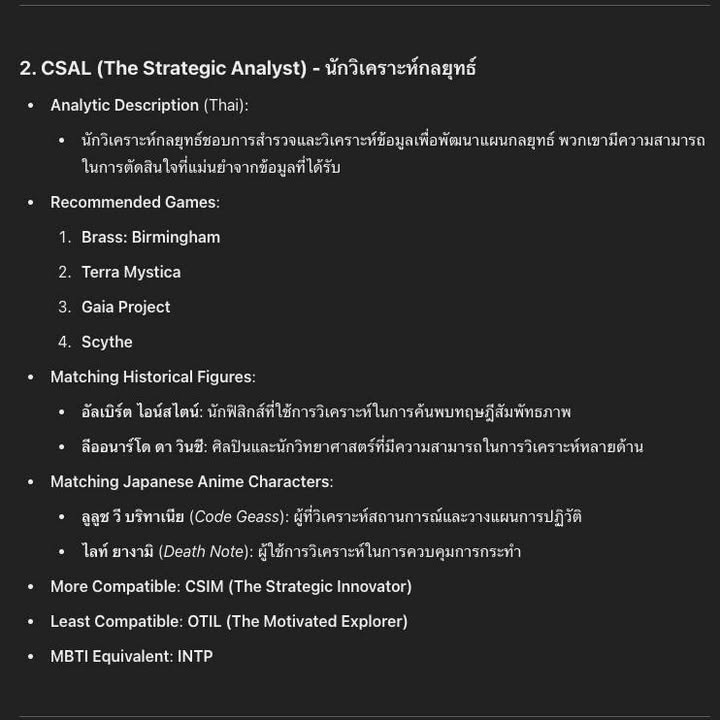
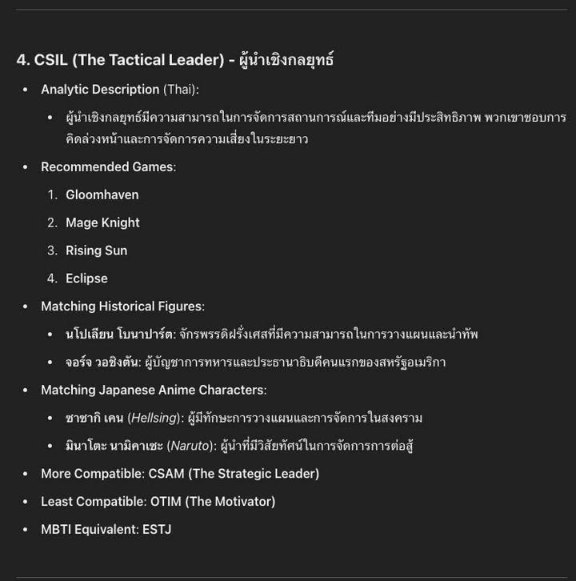
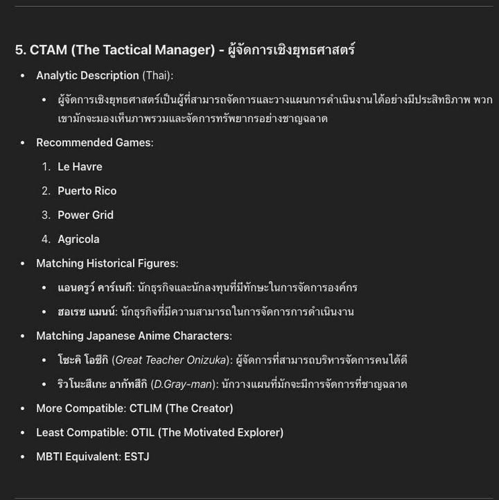
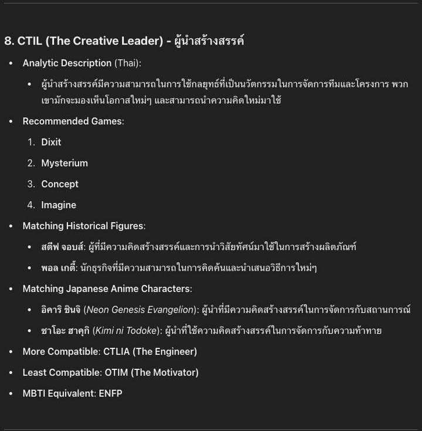

ทำขำๆ แต่พอเริ่มไปหน่อยก็อ่ะ...ขี้เกียจละเพราะไร้สาระจัด แต่จะลบทิ้งก็เสียดายไอเดีย เลยโพสๆไว้แหละเพื่อใครได้ไอเดียไปทำต่อ ใครได้อะไรก็ฝากกดไลค์รูปแล้วบอกทีว่ามันมั่วยังไงละกัน (น่าจะตลกดีมั้ง?)

รูป bing ai ส่วนเนื้อหาส่วนมากใช้ chatGPT

prompt เนื้อหา

"- group board game players into different playstyles 
- make it look like Myers & Briggs MBTI where it has different key aspect combinations related to playstyle"

ตามด้วย

"from these 16 types summary in this format

- title in both Thai and English
- analytic description only in Thai in tone of the doctor
- recommended at least 4 titles of related board games
- matching historical figures with descriptions in Thai
- matching Japanese anime with descriptions in Thai
- type the more compatible 
- type with least compatible
- which Myers Briggs Type MBTI(s) is more likely to be this type"

