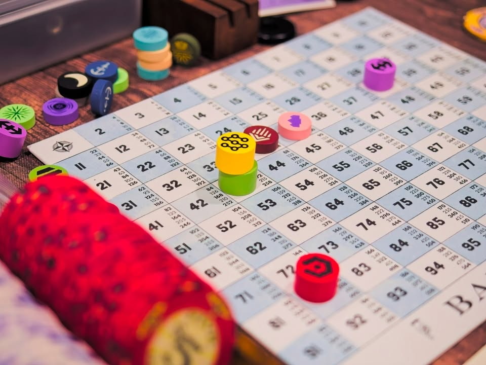

Railways of the Lost Atlas

---
My Impression - เกมสไตล์ 18XX ที่หยิบเอาโครงสร้างหลักของเกมแนวนี้มาใส่มุมมองแบบยูโรซักหน่อย แผนที่แบบสุ่มทุกรอบ ใส่ความสามารถพิเศษของบริษัทให้หวือหวาซักนิดเพราะเอามาผสมกันได้ เร่งโครงสร้างเกมให้เร็วขึ้นด้วยการ fixed รอบการเล่นแล้วทำให้บริษัทเปิดตัวแล้วทำเงินได้เร็ว สำหรับผมแล้วก็คือการหยิบเอา 18XX มาลีนส่วนที่ฝั่งยูโรมองว่าฟุ่มเฟือยออกไปนั้นแหละ

ด้วยความที่มันโมดูลล่ามากๆก็เลยทำให้มันน่าจะกลายเป็น introduction to 18XX ที่ฝั่งยูโรน่าไปลองดูซักหน่อยเพราะส่วนที่คุณน่าจะทำให้คุณยี้มันโดนคลีนออกไปก่อน แล้วให้เรามาสนใจแต่แกนไอเดียของเกม 18XX กันว่าจะไปด้วยกันได้ไหม ในขณะเดียวกันเกมมันก็แกร่งในแบบตัวเองที่เราจะเล่นมันในฐานะเกม 18XX ได้อย่างไม่เคอะเขิน

ส่วนตัวคิดว่าเกมมันเอียงไปทางสาย operation ที่เน้นการออกรางทำเงินมากกว่า คือการตัดกันผ่านระบบเทขายหุ้น แล้วก็โอนทรัพย์สินได้ยังไม่โหดนัก จะให้ซื้อหุ้นมาลงทุนก็ไม่ค่อยสนุกเท่าตั้งบริษัทมาบริหารเองก็เลยคิดว่าเกมมัน friendly ในแบบที่ไม่ได้โดนใจมากนัก กับแม้จะบอกว่าเกมมันลีนและคลีนขี้นแต่ก็ยังเป็นเกมที่เล่นนานอยู่ดี คือ full game ซัดกันไป 5-6 ชั่วโมง แต่ยังดีที่เกมมีสิ่งที่เรียกว่า micro/short game ที่ช่วยให้เราจบเกมในเวลาประมาณ 3-4 ชั่วโมงได้อยู่ แต่มันก็ยังนานอยู่ดีนะสำหรับเกมยูโรที่ปกติเล่นกันราวๆ 1.5 - 3 ชั่วโมง

---
Game Overview - เผื่อไม่รู้จักเกมแนว 18XX ไอเดียมันคือเกมแบบที่จะให้เราไปลงทุนในกิจการรถไฟ ซื้อหุ้นให้มันถึงจำนวนที่กำหนดแล้วก็จะได้บริษัทไปซื้อรถวางรางทำเงินปันผลให้ผู้ถือหุ้นงี้ เอาเป็นว่าอย่าพึ่งไปบอกใครว่าชอบเกมแนว economic / money management / investment ถ้ายังไม่เคยเล่นเกมแนวนี้ก่อนเดี๋ยวไม่ครบหลักสูตร ปัญหาหลักที่ทำให้คนถอยก็คงเป็นที่เวลาการเล่นที่ต่ำๆก็ต้องขอมี 3-4 ชั่วโมงนี้แหละ (แต่ปกดังๆหลายเจ้าก็คุยกันที่ 6 ชั่วโมงเป็นปกตินะ)

ซึ่งเกมจะแบ่งออกเป็นเฟส Stock Round ที่ให้ผู้เล่นผลัดกันเอาเงินมาซื้อขายหุ้น ถ้ามีการขายหุ้นก็ตกถ้ามีการซื้อแบบผู้เล่นถือครอง 100% ก็ราคาจะขึ้นไรงี้ แล้วก็สลับกับ Operation Round ที่จะให้เรามาต่อรางแล้วก็ซื้อรถไฟมาเดินรถเพื่อทำเงินกัน รถไฟก็เล่นๆไปมันก็แรงขึ้นวิ่งได้ไกลขึ้นแต่พอถึงบางระยะรถไฟเก่ามันจะหมดอายุ (rust) ก็ต้องไปจ่ายเงินซื้อรถใหม่มา ความเหี้ยมคือมันเป็นจังหวะที่ทำคนล้มละลายมาเยอะแล้ว

ทีนี้เกมนี้มันต่างจาก 18XX เกมอื่นยังไง ไอเดียที่น่าสนใจนอกจากการที่ผู้เล่นจะค่อยๆหยิบไทล์มาปั้นแผนที่เริ่มเกมแล้วก็คือระบบ minor company ที่ปกติเกมอื่นมันจะเป็นแค่ทรัพย์สินแต่เกมนี้มันก็คือบริษัทปกติเนี่ยแหละ ซื้อขายหุ้นได้ มีรถไฟทำเงินได้ แต่เพิ่มเติมคือมันมีความสามารถพิเศษแหกกติกาของตัวเองอยู่ แล้วก็มันจะบังคับจุดเกิดอยู่กับไทล์ที่เราสุ่มๆหยิบมานั้นแหละ

ไฮไลท์สำคัญของเกมก็คือเราสามารถควบรวมเอา minor company 2 อันมาประกอบร่างเป็นบริษัท major company ได้ ซึ่งเวลารวมกันก็จะเปลี่ยนหุ้นเปลี่ยนโทเคนกันไป ที่เพิ่มเติมคือได้วาง station กับมีรถไฟได้เพิ่มมากขึ้น และที่เด็ดคือมันยังคงความสามารถเดิมของทั้ง 2 อย่างไว้อย่างครบถ้วนแล้วเกมก็มีถึง 12 minor company ก็ทำให้เราสามารถเจอ combination ได้หลายสิบแบบเลยนะ!! และส่วนที่น่าสนใจคือ minor company มันจะโดนสุ่มออกมาเป็น 3 แถวที่ผู้เล่นสามารถซื้อได้แค่บริษัทที่อยู่หัวแถวเท่านั้น ทำให้ลำดับการเกิดของแต่ละบริษัทนั้นแตกต่างกันมากๆในแต่ละเกม

เกมนี้เล่นกันแบบ fixed รอบคือ 4 รอบสำหรับเกมสั้นและ 6 รอบสำหรับเกมยาว ตีเฉลี่ยๆก็ซัก 30-60 นาทีต่อรอบละกัน

---
Game Flow & Experience - ว่าด้วย 18XX กับ Euro เนี้ยผมคิดว่ามันมีไอเดียหลวมๆอยู่ในแง่ว่าเกมแนว 18XX มันมีจารีตแบบเกมแห้งๆคิดเลขวนๆซ้ำๆทำเกมยาวไปเรื่อย ซึ่งถ้ามองจากกรอบของยูโรก็จะมองได้ว่าเกมมันวนลูปซ้ำซาก มีขั้นตอนยึกยักไม่เข้าประเด็นซักทีเกินจำเป็นแล้วก็ไม่ลีนเท่าไร คืออย่างเทียบเกมอย่าง 1830 ตัวคลาสสิค เริ่มมาต้องมาเล่นมินิเกมประมูลบริษัทที่กว่าจะรู้ว่าสำคัญไหมก็ต้องเล่นไปหลายรอบ กว่าจะได้เปิดบริษัทต้องมาสะสมหุ้นรอ float กว่าจะได้ทำเงิน เกมก็ต้องวนรอบเปล่าๆไปหลายรอบแล้ว และด้วยความที่เกมสไตล์นี้วิ่งกันแบบจบที่เงินหมด pool กลางก็ทำให้ผู้เล่นต้องมานั่งวนๆนับเงินทอนเศษหารเลขซ้ำๆไปเรื่อยๆจนกว่าจะจบ ซึ่งผมก็รู้ละว่ามันมีความสนุกของมันไม่งั้นคงไม่สามารถมีแฟนเบสจำนวนขนาดนี้ได้แต่ถ้ามองจากขนบของฝั่งยูโรแล้วก็เรียกได้ว่าน่าเบื่อฉิบหายเลยล่ะมีของที่ดูแล้วไม่ significant ส่วนเกินย้วยๆ

สิ่งที่ทำให้เกมนี้ 'กระฉับ' จะแทรกอยู่หลายจุดมากทั้งการที่ minor company สามารถทำงานได้ตั้งแต่หุ้นแรกที่ออก (คือไม่ต้องรอ float) เปิดบริษัทมาก็ซื้อรถมาใช้วิ่งได้ตั้งแต่ตาแรก (ปกติต้องรอหุ้นตกทีนึงแล้วค่อยมีรถไฟไปวิ่งตาถัดไป) การที่บริษัทขายหุ้นทิ้งให้แบงค์เพื่อเอาเงินมาใช้ได้ทันทีโดยไม่ต้องรอก็ทำให้ลดการวิ่งไป withhold ไปโดยไม่จำเป็นได้ทันที และแน่นอนว่ารูปแบบ classic อย่างให้หยิบรถไฟออก 1 คันเพื่อเร่งการ rust ก็มีในเกมเช่นกัน 

---
What I Enjoyed

- รอบการเล่นกระชับ ลดเฟสการเล่นน่ารำคาญออกไปเกือบหมด คือสิ่งหนึ่งที่ผมไม่ชอบเอามากๆในเกมแนว 18XX คือ วิ่ง-ปันผล วนๆรอเงินหมดแบงค์ตอนท้ายๆเกมเนี่ยแหละ

- sooo modular!! คือมันเป็น 18XX ที่สุ่มแผนที่ไม่ต้องมานั่งจำเหลี่ยมมุมท่ายาก ทุกเกมล้วนเป็น puzzle ใหม่ๆรอให้เราไปแก้ปัญหา แล้วเกมก็มี option ให้เราเลือกปรับแต่งได้ตามความชอบด้วย

- minor company มีความสามารถและการรวมร่างมันทำให้เกมมี dynamic ดีมากๆ

- อุปกรณ์คุณภาพดีมาก ลายสวยแบบไม่ต้องยึดติดกับขนบแบบเชยๆของคนเล่น 18XX แท้ๆที่เน้นตัวเลขเล่นสายโล่งๆ

- อาจจะฟังดูไม่เกี่ยวแต่เกมทำ UX เรื่องการตั้งชื่อบริษัทมาดีมาก คือตั้งชื่อแบบ overnight เพื่อบอกว่ามันข้ามเมืองได้ resourcesful เพื่อบอกว่ามันเก็บรถไฟที่ rust แล้วได้อีกนิดไรงี้ แบบมันพยายามลดโหลดคนเล่นด้วยการทำชื่อสื่อความหมายดี

---
Not Good, Not Bad—Just Things I Noticed

- เกมมันก็ยังนานอยู่ดีนิหว่า อยากได้ประสบการณ์ครบถ้วนยังต้องเล่นกันเกือบ 6 ชั่วโมง คือตอนแรกผมคาดหวังว่ามันจะเป็น 18XX replacement ที่กางได้ง่ายสำหรับผมอ่ะนะ แบบ 3 ชั่วโมงจบ แต่นี้ก็ยังยาวอยู่ดี เสียดายอยากกางบ่อยกว่านี้ (โอเคเล่นคล่องกว่านี้ก็อาจจะเร็วขึ้นอีกหน่อย)

- friendly advice อย่าเล่นเกมแนว 18XX โดยไม่มี poker chip หรือเหรียญกลางที่วางเรียงไว้เป็นชุดเป็นอันขาด มันจะทำให้ประสบการณ์การเล่นดีขึ้นมากๆกับการไม่เสียเวลานับทอนเงิน

---
What Didn’t Click for Me (ไม่ชอบเป็นการส่วนตัวแต่เรื่องดีไม่ดีก็ตัดสินใจเอาเองนะ)

- คู่มือแม้จะพยายามทำให้ดูอ่านง่าย แต่ก็เป็นสไตล์ตัวหนังสือยาวเป็นพรืดอยากหาอะไรก็ต้องไปงงในดงพารากราฟอ่านยากฉิบหาย คือผมอ่ะอาศัยว่ามีพื้น 18XX มานิดหน่อยก็เลยรู้สึกว่าหลายๆจุดอ่านแล้วเข้าใจ แต่พอมาหาส่วนที่อยากจะรู้จริงๆมันก็รู้สึกว่ายังต้องมางมเกินจำเป็นไปหน่อย การใช้คำหรือการ highlight ส่วนที่ควรมีก็ทำไม่ค่อยดีนัก แต่ใดๆก็ไม่ใช่เกมที่อ่านยากนะ

- เกมมัน friendly กว่าที่ชอบไปหน่อย แบบมาสายเน้นวิ่งบริษัทดีๆสวยๆทำเงิน (หรือเพราะวงผมมัน nice ไปว่ะ?) พอ station น้อยตัวบล็อกมันก็น้อยตามทำให้วิ่งขัดกันยาก แบบอยากให้เกมมันอันตรายกว่านี้หน่อยอ่ะ (เท่าที่อ่านกับฟังคน comment มาก็คิดว่าถ้าใช้โหมดควบรวมกิจการแบบไม่เป็นมิตรก็น่าจะแก้ปัญหานี้ได้นะ)

---
Who Would Like This Game? -  คนเล่น 18XX ที่อยากได้ของใหม่ๆทุกรอบการเล่น และคนสายยูโรที่รู้สึกว่าอยากลองเกมแนว 18XX ซักหน่อย

---
Final Thought - เมื่อก่อนตัว intro ที่คนแนะนำก็คงเป็น 18chesapeake ที่ผมรู้สึกว่าเกมมันเบสิคเกินไป หรือไม่ก็ Shikoku 1889 ที่แม้จะไม่หวือหวาแค่เบียดกันในแผนที่เล็กอัตคัตสนุกดีและของสวย แต่ 2 เกมนั้นมันก็ยังเป็นเกมแบบ 18XX ดั้งเดิมมากๆอยู่ แต่ก็แลกกับข้อดีมากๆที่เกมจบได้ใน 3 ชั่วโมง ถ้าให้เลือกแม้จะรู้สึกว่า Railways of the Lost Atlas มันเป็นมิตรไปหน่อยแต่สำหรับคนที่ไม่ได้เล่น 18XX เป็นประจำแบบผมก็ยังคิดว่ามันเป็นตัวเลือกอันดับหนึ่งของตัวเองนะ ไอ้ตัว minor มีพลังแล้วรวมร่างกันเนี่ยโดนใจมาก อาจจะหยิบ micro / short เกมมาเล่นบ่อยๆแทน

จริงๆก่อนหน้ามีเกมอย่าง 18Lilliput ที่พยายามเอาเกมแนว 18XX ไปแบลนกับแนวคิดแบบยูโรมาละ แต่อันนั้นมันใช้วิธีแบบ tile laying ต่อไทล์แบบขยายไปเรื่อยไม่มีแผนที่แล้วก็ใช้ระบบหยิบการ์ดแอคชั่นแทนตอนเล่นมันก็เลยแอบหลุดอารมณ์ 18XX ไปเยอะเหมือนกัน 

ถ้าให้เลือก ณ ตอนที่เขียนบทความนี้ สำหรับสายชิมแบบผมก็คงอยากมีเก็บไว้แค่ Shikoku 1889 กับ Railways of the Lost Atlas ละมั้ง?

---
Disclaimer -  ซื้อเองจ่ายเอง

