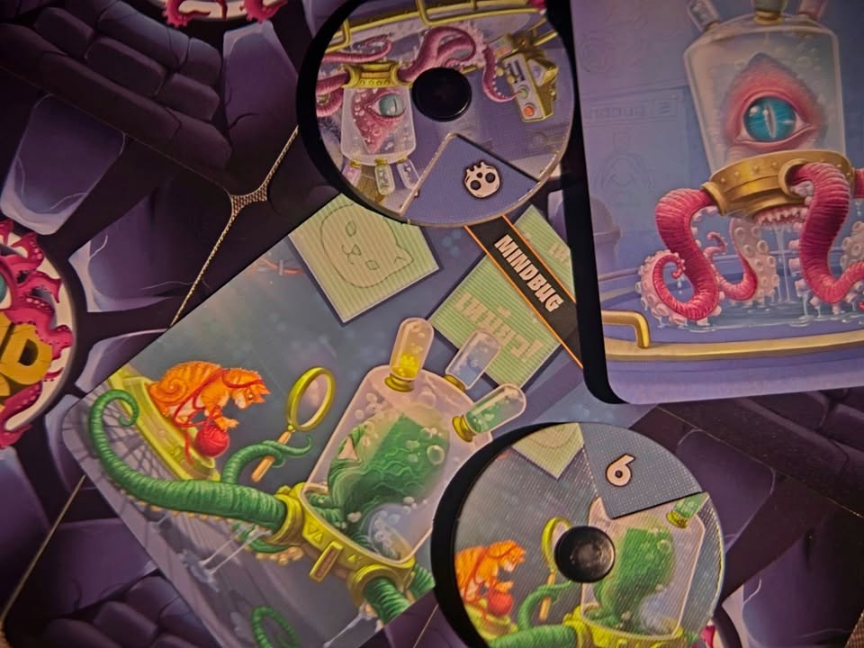

Mind Bug  - โอ้แมลง ข้าไม่ชอบแมลง มันเข้าไปในหัวข้า.......

---
My Impression - การ์ดเกมต่อสู้กันระหว่างผู้เล่นสองคนที่ความสนุกจริงๆไม่ใช่การขนการ์ดขี้โกงมาตบตีใส่กัน แต่เป็นการวัด 'กึ๋น' ว่าใครจะกั๊กและหาจังหวะออกสุดยอดท่าไม้ตายได้ดีกว่ากัน

สุดยอดท่าไม้ตายที่ว่าก็คือ Mind Bug แมลงที่จะควบคุมการ์ดที่อีกฝ่ายเล่นให้กลายมาเป็นของเรา เก่งนักใช้ไหมก็จงมารับใช้ฉันสิ! แต่ว่าผู้เล่นทั้งสองฝ่ายก็มีการ์ดนี้เหมือนกันนะ อาร์แล้วใครจะออกหมัดได้ดีกว่ากันล่ะ?

---
Game Overview - ไอเดียเกมก็คล้ายๆเกมแนว TCG ที่จัด deck มาสู้น่ะ แต่ว่าเกมนี้ไม่ต้องไปซื้อมาเพิ่ม (แต่มีตัวเสริมเพียบเลย......) เพราะใช้วิธีให้ผู้เล่นมีเกมกลางกล่องเดียวแล้วสับแจกคนละ 10 ใบไปทำเด็ค 

ในตาหนึ่งทำได้แค่สองอย่างคือลงการ์ด monster มา ในเกมเรียกครีเจอร์ซึ่งการ์ดทุกใบก็คือครีเจอร์นั้นแหละไม่มีการ์ดเวทย์การ์ดกับดักอะไรทั้งนั้น หรือเอาการ์ดที่ลงมาแล้วไปตีใส่เพื่อน แล้วเค้าจะเลือกเองว่าจะบล็อกหรือปล่อยเข้า ใครโดนตบตายก่อนก็จบ

---
Game Flow & Experience - highlight ของเกมคือสิ่งที่ผู้เล่น MTG มาก่อนอย่างผมจะรู้สึกอินขี้นมาทันที นั้นคือทุกครั้งที่เราเล่นการ์ดลงมาก็ถามอีกฝ่ายว่า 'จะเค้าเตอร์ไหม...' เอ๊ย ถามว่าจะใช้ mind bug ไหม ซึ่งเป็นสิ่งที่ผู้เล่นทุกคนมีอยู่คนละ 2 ใบ ถ้าใช้ละก็เราจะยึดตัวที่เพื่อนเล่นมาใช้ได้ทันที

ตรงนี้มันทำให้เกมยกระดับจากเกมที่ดูง่ายๆแค่ลงแล้วตีดวงดีได้ตัวเก่งก็ชนะไปให้กลายเป็น mind game สนุกๆเพราะกลยุทธ์หลักที่เป็นหัวใจในเกมนี้คือการ 'หลอกล่อ' ให้อีกฝ่ายใช้การ์ด mind bug ไปใส่ตัวหลอกของเรานั้นเอง

---
What I Enjoyed
 
- ดึงประสบการณ์เหมือนสมัยเล่นการ์ด MTG ให้กลับมาแบบไม่ยุ่งยาก จังหวะการคิดและพยายามหลอกล่อให้อีกฝ่ายใช้ mind bug หรือความหงุดหงิดที่ดันตกหลุมพรางเพื่อนคือสนุกดี รู้สึกโดนพลิกเกมได้ตลอด จะเล่นการ์ดเก่งยังต้องคิดว่าถ้าโดนปล้นไปจะรับมือได้ป่ะว่ะ

- กติกาง่ายโคตร แค่ลงหรือตี ที่เหลือไปอ่านความสามารถ keyword เอา ตัวการ์ดความสามารถโกงๆดีแต่ไม่มีตัวหนังสือหยุบหยับ แกะเกมมาให้เล่นได้เลยไม่ต้องสอนไร

- ตัวเสริมเพิ่มการ์ดเยอะ (ตอนนี้แปลไทยยังไม่ครบ) ถ้าชอบก็ซื้อแล้วตามต่อกันยาวๆ

---
Not Good, Not Bad—Just Things I Noticed

- ไม่มีอะไรคิดว่าต้องยกมาพูดถึงนะ 

---
What Didn’t Click for Me

- ไม่มีอะไรคิดว่าต้องยกมาพูดถึงนะ 

---
Who Would Like This Game? - คนที่มองหาเกมสองคนตีกันแบบไม่ยุ่งยากแต่สนุกได้ทันที เด็กเล่นกันตอนพักกลางวัน หรือเล่นสองคนรอเพื่อนงี้ สายการ์ดเกมที่อยากได้อะไรไวๆก็เหมาะเช่นกัน

---
Final Thought - ผมเคยเล่นเกมนี้ครั้งแรกตอนซักต้นๆหรือกลางปีที่แล้วมั้ง ด้วยความที่เป็นเด็ก MTG มาก่อนเล่นแล้วก็ชอบเลยฟีลได้มาก ด้วย position แล้วน่าจะกลายเป็นเกมเล่น 2 คนที่หยิบมาบ่อยสุดเวลาเล่นรอเพื่อนคนอื่นในวงนะ คือมันพกง่ายดีแล้วเกม tense แบบกำลังดีแถมไม่ต้องสอนอะไรเยอะด้วย

---
Disclaimer - I received this game as a gift from Meanbook, but I am not being paid to create this content. All opinions are my own and reflect my honest thoughts about the game.

