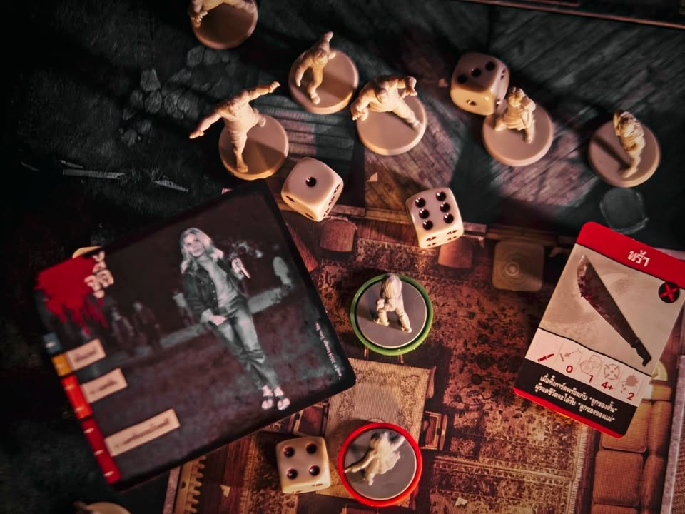
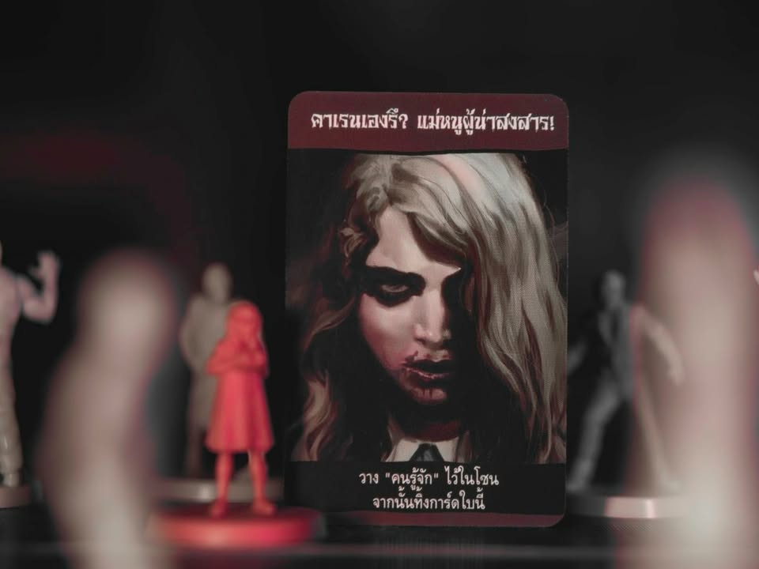

Zombicide: Night of the Living Dead [ฉบับแปลไทย]

ชื่อของ George A. Romero นั้นแทบเป็นไปไม่ได้เลยที่คนที่เคยเข้าโรงหนังจะไม่รู้จัก เพราะเค้าคือเจ้าพ่อหนังซอมบี้ แม้ว่าเค้าจะไม่ใช่คนแรกที่ทำให้โลกรู้จักคำนี้ (หรือเป็นคนแรกที่ทำหนังแนวนี้) แต่เราก็สามารถพูดได้ว่าเค้าคือ trend setter ที่หนังซอมบี้ที่ตามหลังจากหนังเรื่องแรกของเค้าออกฉายจะต้องเดินรอยตาม แฉกเช่นเดียวกับที่ JRR Tolkien สร้างภาพลักษณ์ให้กับเอลฟ์ 

---
Night of the Living Dead เนี่ยเป็นหนังขาวดำออกมาตั้งกะปี 1968 (ก่อนเล่นเกมนี้ผมไป search youtube ดูหนังมาก่อนละ เพราะไม่เคยดูมาก่อน) ตัวหนังเองก็เนื้อเรื่องทั่วไปเนี่ยแหละ (แต่อย่าลืมว่านี้คือต้นฉบับของความทั่วไปที่เราพึ่งมาเจอทีหลัง) คนติดอยู่ในบ้านแล้วอยู่ๆมีซอมบี้ล้อม หนังก็พยายามจับอยู่กับ 'คน' ว่าจะรับมือกับเรื่องพวกนี้ยังไง แล้วก็ถ้าผมเข้าใจไม่ผิดหนังของ George A. Romero มันก็จะมีความเสียดสีประเด็นโน้นนี้อยู่ตลอดและในเรื่องนี้ก็จะแสดงออกถึงการเหยียดสีผิวค่อนข้างชัดเจน

---
นอกเรื่องไปไกลตัวเกม Zombicide: Night of the Living Dead เนี่ยมันก็คือเอา Zombicide เนี่ยแหละออกมาเยอะภาคแล้วมาปรุงใหม่แล้วใส่ธีมของ Night of the Living Dead เข้าไป ซึ่งมันก็ไม่ได้มาแนวตัดแปะให้มันมีธีมแล้วขายนะ เพราะว่าไปขอซื้อสิทธิ์เข้ามามันก็เลยจะพยายามเน้นเรื่องธีม ทั้งตัวละครก็เอามาจากหนังเลย พวกเนื้อเรื่อง (ผมเล่นยังไม่จบแต่แอบขี้โกงอ่านไปล่วงหน้าละ) มีความพยายามให้เกิดความต่อเนื่องเหมือนเป็นฉากเนื้อเรื่อง  (แต่บางอันก็เอ๊ะเหมือนกัน คาตานะงี้ ปืนกลเบาอูซี่งี้)

แต่ใดๆคือ (อันนี้อิงจากการไปดูรีวิวกับอ่านรูลคร่าวๆของภาคอื่นๆประกอบ ) เกมจะเน้นการมีส่วนร่วมโดยการลดความซับซ้อนลงเพื่อให้เข้าถึงง่ายขึ้น ส่วนอารมณ์ก็ทำมาให้เน้นการกระจุกตัววางแผนหนีเอาตัวรอดมากกว่าออกไปบู๊ยิงยับๆไรงี้ เพราะตายง่ายฉิบ

---
ส่วนวิธีการเล่นก็ค่อนข้างเบสิค ตานึงมี 3 แอคชั่นทำวนๆอยู่แค่ เดิน, หาของ, เปิดประตู, สร้างสิ่งกีดขวางแล้วก็โจมตี (บางฉากจะได้ขี่รถวิ่งทับซอมบี้ด้วยนะ) ผลัดกันทำพวกนี้วนๆไป พอครบทุกคนซอมบี้ (ในเกมนี้เรียกกูล- ghoul) ก็ขยับ หลักๆก็มองเห็นใครก็เดินไปทางนั้นแหละ อีซี่

---
ระบบที่คิดว่าน่าสนใจในเชิงธีมคือตัวละครเราจะมี 2 โหมด อันแรกเป็นตัวขาวดำความสามารถง่อยๆหน่อย (ในหนังมันคนธรรมดาอ่ะนะ) แต่พอไปฉากหลังๆมันจะมีเปลี่ยนให้เราพลิกไปอีกด้านเป็นด้าน Zombicide ที่ความสามารถเริ่มเยอะขี้นหน่อย กิมมิคที่คิดว่าเจ๋งดีในการเล่าเรื่องคือมันจะมีซอมบี้ 'คนรู้จัก' เป็นเด็กตัวนึงกับเป็นผู้ใหญ่ตัวนึง ถ้ามีไอ้พวกนี้โผล่มาเราจะกลับไปร่างง่อยเลย แบบขวัญบินสู้ไม่ไหวไรงี้

---
ระบบการต่อสู้เน้นดวงเข้าว่า (เป็นทั้งข้อดีและข้อเสีย) คือทอยเต๋าง่ายๆเลยถ้าเลขมากกว่าที่อาวุธนั้นกำหนดก็ถือว่าโดน ไม่ใช่ก็วืด ส่วนซอมบี้แม่งโกงสัดไม่ทงไม่ทอยอะไรทั้งนั้นกัดกูเลยโดนสามทีม่อง  แล้วที่คิดว่าทำออกมาดีคือเกมคุมให้เราเหนื่อยเท่าเดิมจากการที่จำนวนซอมบี้ที่เกิดเนี่ยมันจะดูว่าตอนนี้เรามี EXP สูงไหม ถ้ามีเยอะก็งอกตัวมาเยอะตาม

พวกอาวุธก็มีกิมมิคตามเกมแบบหยิบของสองชิ้นมาประกอบกันเป็นของชิ้นใหม่ที่แรงขึ้นได้แบบเอามีพร้ามาพรวมร่างกะปืนได้ทำให้ปีนยิงแรงขึ้น (ได้ไงว่ะ?) จะทำระเบิดขวดก็ต้องมีน้ำมันก๊าดกับโหลไรงี้ จุดที่คิดว่าทำได้ดีทำให้เกมไม่จุกจิกไปก็คือกระสุนยิงได้ไม่อั้นจ้าาาา แล้วก็อาวุธบางอันจะสามารถถือสองมือได้

ซึ่งอย่างที่บอกว่ามันเป็นข้อเสียก็ตรงที่ทำให้เกมมันดวงงงงงงงงงงงงงง ใช้ได้อยู่เพราะเน้นทอยสู้ยับๆไม่มีการโมเต๋าอะไรทั้งนั้น ดวงไม่ดีโดนซอมบี้กัดวนไป ปืนก็ใช่ว่าจะหาได้ตลอดวิ่งเข้าวงในก็เวลาเพื่อนยิงมีโดน friendly fire ได้อีก ก็เอาเป็นว่าถ้าอินกับธีมเรื่องพวกนี้ถือเป็นข้อดี

---
ส่วนที่รู้สึกติดๆนิดหน่อยก็คงเป็นกติกาที่เขียนเหมือนจะอ่านเข้าใจง่าย แต่ตอนสงสัยอะไรหน่อยพลิกหาอะไรก็ไม่เจอเฉย กับไม่ค่อยชอบตอนเก็บแบบต้องหยิบมินิมาเรียงๆใส่กล่องเท่าไร ใดๆก็ไม่ใช่เรื่องใหญ่นะ

---
เกมให้เนื้อเรื่องมา 10 ตอน คิดว่าไม่มากไม่น้อย ซึ่งด้วยความที่เกมมันเน้นเนื้อเรื่องเป็นฉากๆ พวกสุ่ม setup จะไม่มี ปล่อยให้ดวงคนเล่นตอนทอยเนี้ยและกำหนดเนื้อหาในเกมเอา แต่มีคนทำพวกฉากกับเนื้อเรื่องเพิ่มแบบ fan made เยอะอยู่ คิดว่าถ้าชอบก็หยิบมาเล่นวนได้เรื่อยๆแหละ แต่ส่วนตัวอิงจาก weight แล้วก็ให้อารมณ์แบบเหมาะกับหยิบมากางเล่นกับเพื่อนที่ไม่ได้เล่นบอร์ดเกมประจำชวนมาเล่นเกมแนวซอมบี้ทอยๆเดินๆเน้นเฮฮายาวๆก็ได้อยู่ เลยคิดว่า 10 ฉากก็กำลังพอดีนะ 

จุดตัดสินใจของเกมนี้ก็คิดว่าต้องดูด้วยว่าจะกางเล่นกับใคร เพราะเกมมันไม่เน้นความซับซ้อนแล้วก็เน้นการเอาตัวรอด ไม่ได้ออกไปบู๊ยิงแหลกราญ กับมันเป็นเกมแนวเอื้อให้ทำ house rule พอตัวก็หยิบไปจูนเอาแบบที่ชอบแหละ 

---
อ่านบทความนี้และบทความอื่นๆได้ที่ https://forum.tinymeepletalk.com/d/34-zombicide-night-of-the-living-dead

---
this is a gifted product from Legendary Wargame, no money changed hand for this content. ได้รับสินค้าโดยไม่มีค่าใช้จ่าย คอนเทนต์ทำเพื่อแสดงความเห็นส่วนตัวเกี่ยวกับเกมโดยไม่มีการจ้างวาน

