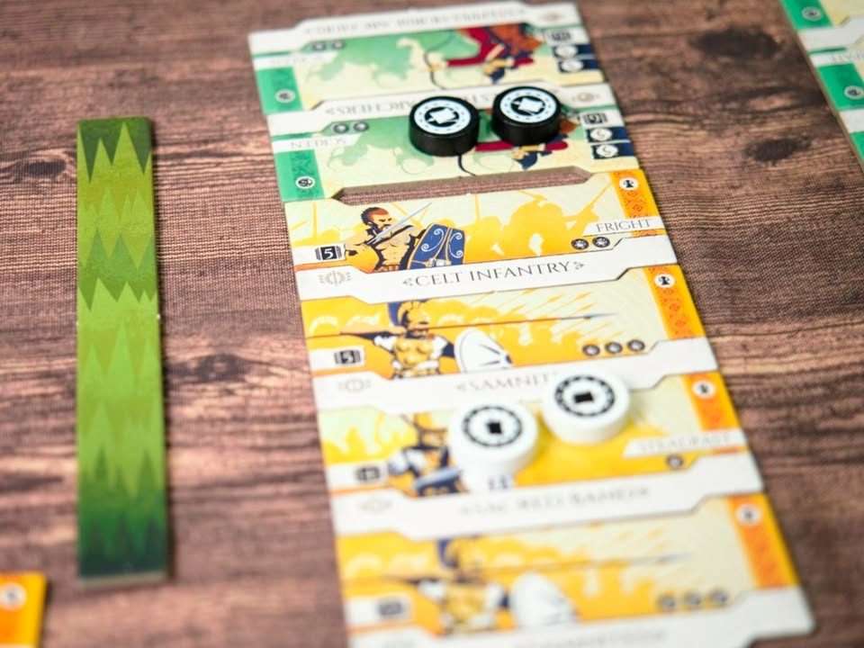

Battalion: War of the Ancients

เกมที่ย่นย่อเอาเกมสงครามตามขนบ (wargame) ให้ออกมาในรูปแบบที่เรียบง่ายเล่นไวของสวยจากนักออกแบบ Paolo Mori (Dogs of War, Ethnos) และ Francesco Sirocchi (Pocket Battles)

---
เกมนี้จะให้ผู้เล่นเป็นสองชนชาติมาตบกัน จะมีเส้นกั้นแบ่งแผนที่ออกเป็นสามส่วน ไอเดียที่น่าสนใจคือในหนึ่งกองรบเนี่ยมันจะเกิดจากการเอาไทล์ยูนิทมาประกอบรวมๆกันเป็นกองรบ แล้วเอามาตบๆกัน 

ระบบที่ทำให้เกมนี้แตกต่างอย่างน่าสนใจคือการบริหาร 'โทเคนคำสั่ง' คือเวลาเราจะสั่งให้ทหารเราทำแอคชั่นอะไรเราก็จะเอาเม็ดนี้ไปวาง ถ้าอยากสั่งซ้ำก็ต้องจ่ายแพงขึ้นเรื่อยๆ ตรงนี้ไม่มีอะไรแปลกแต่ที่เริ่มซับซ้อนคือเวลากองรบเราโดนตีแทนที่เราจะต้องเสียทหารไปเลยแต่เราสามารถเอา 'โทเคนคำสั่ง' มาวางกลับด้านแล้วเรียก 'โทเคนอลหม่าน' มารับ damage แทนได้ อารมณ์จะคล้ายๆกับพลังชีวิตแต่ทำงานคนละแบบกัน ก็ประมาณว่าโดนเค้าตีแล้วเสียกระบวนทัพไรงี้

ฟังดูไม่อะไรแต่ไอ้โทเคนคำสั่งเนี่ยเรามีน้อยมากๆ จำนวนแล้วแต่ setup แต่เรียกว่ามีซัก 10 อันละกัน หยิบวางหยิบแทน damage แป็บๆก็หมดละทำให้ต้องเลือกบริหารกันอยู่ จุดสำคัญคือพอเราใช้หมดเราจะต้องทำแอคชั่นดึงเม็ดกลับมาใช้ต่อเรียกว่า rally ซึ่งนอกจากจะได้เม็ดโทเคนคืนมาหมดแล้วเราจะต้องจั่วการ์ดเทคติกที่แต่ละชาติก็มีลีลาไม่เหมือนกันช่วยให้การรบไม่นิ่ง ฟังดูเหมือนจะดีแต่เกมนี้ถ้าเราจั่วการ์ดเทคติกไม่ได้เมื่อไรจะถือว่าเราแพ้ทันที เพราะฉะนั้นการบริหารจำนวนโทเคนเลยสำคัญมากในเกมนี้

---
ที่เหลือก็ไม่มีอะไรมาก ระบบการต่อสู้ในเกมจะใช้เต๋ายืนพื้น 3 ลูก ได้ถ้าสถานะการณ์แบบมีรุมหรือบวกตามความสามารถของยูนิท ซึ่งมันจะมีเลขบอกว่าต้องทอยได้เลขอะไรขั้นต่ำถึงจะตีโดน ก็ assign damage ไปตามเรื่อง ถ้าตีอีกฝ่ายจนกองรบเค้าหายฝ่ายที่ตายจะต้องจั่วการ์ดเทคติกเพิ่ม (ซึ่งจะทำให้ใกล้ความแพ้มากขึ้น)

---
ส่วนตัวก็คิดว่ามันเป็นเกมสงครามเอาคนสองฝั่งมาตบตีกันนั้นแหละ แต่ไอเดียมันไม่ได้บู๊เดือดจัดเอาไปเล่นสองคนกับลูกกับแฟนได้เน้นทอยขำๆ ส่วนที่คิดว่าดีก็คือด้วยความที่มันเป็นโมดูลล่าที่เติมเผ่าตามหลังได้อีกเรื่อยๆ แต่จุดที่ต้องคิดไว้หน่อยก็คือมันเกมเบาๆเล่นง่ายน่ะ ตัวชนชาติพวกสกิลมันก็จะบางๆไม่ได้หวือหว่า มันเลยไม่ได้เป็นเกมแบบที่ต้องมาจัดการเรื่อง positioning มีตีล้อมตีโอบอะไรแบบนั้น

ส่วนที่เป็นข้อติแบบจริงจังคือโทเคนคำสั่งแม่งดูยากมากกกกกกกกกกกก ว่าด้านไหนเป็นด้านไหน แถมผู้เล่นสองคนดันใช่คนละสีดูแล้วแยกเทบไม่ออกว่าอันไหนด้านไหน แอบเสียเวลานิดหน่อย

---
ใครเป็นแฟนเกมแนวพวก Command & Colors หรือ Memori 44 แต่อยากได้อะไรที่เล็กและเบากว่านั้นอีกก็ลองดูได้

---
🐸 ME - ถ้าเทียบกันแล้วเกมนี้สนุกกว่า Pocket Battles ซึ่งจริงๆก็เล่นคล้ายๆกันแหละแต่ความโมดูลล่าของการสร้างหน่วยรบทำให้เกมเปิดพื้นที่ในการสร้างซีนเยอะกว่ามาก แต่ปัญหากล่องมันใหญ่เกิ๊น เทียบกับ weight และอารมณ์เป้าหมายที่อยากเกมสงครามเล็กๆง่ายๆเล่นไวๆ แต่กล่องนี้เท่าเกมใหญ่เลยรู้สึกแปลกๆ เลยกลายเป็นอาจจะไม่เก็บเพราะดันกล่องใหญ่ ส่วนไอเดียน่าลอกเอาไปใส่เกมแนวแฟนตาซี ใส่สกิลจัดกองรบอยู่นะ 

🟠 regular | 🔴 expert : เกมเบาไม่ต้องคิดอะไรมาก กติกาโครงสร้างสมเหตุสมผลแต่ถ้าอยากได้เชิงกลยุทธ์ขยับพื้นที่เล่น Undaunted ดีกว่า

🧸newbie | 🟢casual/faimly : เกมอาจจะเฉพาะทางนิดๆ ถ้าหาเกมสองคนที่สนุกเข้าถึงง่ายแนะนำพวกเกมแนว Dual ดีกว่า

---
อ่านข้อเขียนนี้และอื่นๆได้ที่ https://forum.tinymeepletalk.com/d/48-battalion-war-of-the-ancients

---
> 🐸 ME - ความเห็นส่วนตัวสำหรับตัวเองเพื่อตัวเอง
> 🔴 expert - ผ่านเกมมาเยอะ อ่านเกมใหม่ตลอด
> 🟠 regular - เล่นบ่อยเล่นประจำออกตระเวนเล่น
> 🟢casual/family - เล่นที่ร้านเล่น หรือกับครอบครัว
> 🧸newbie - ใหม่จัด

---

