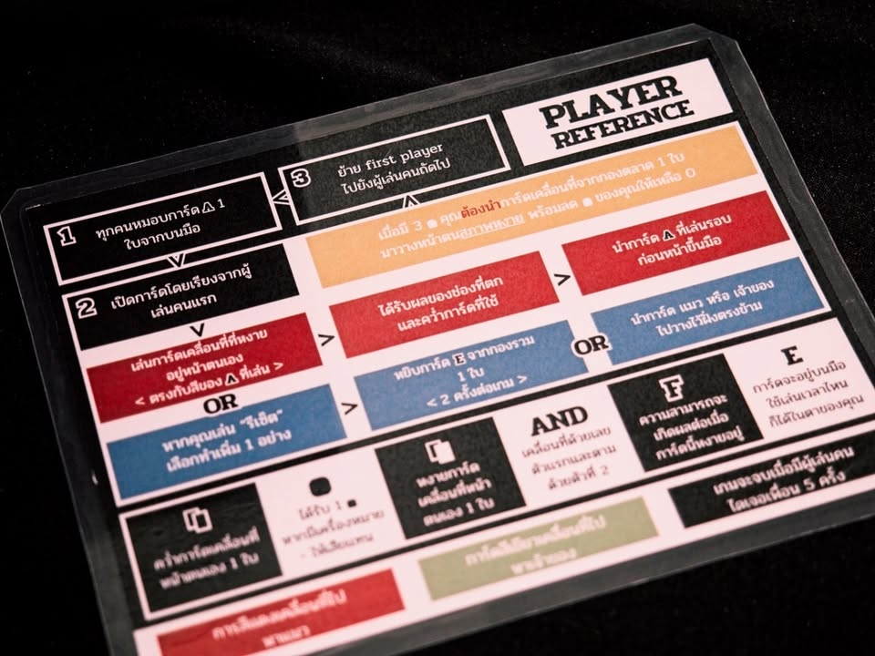
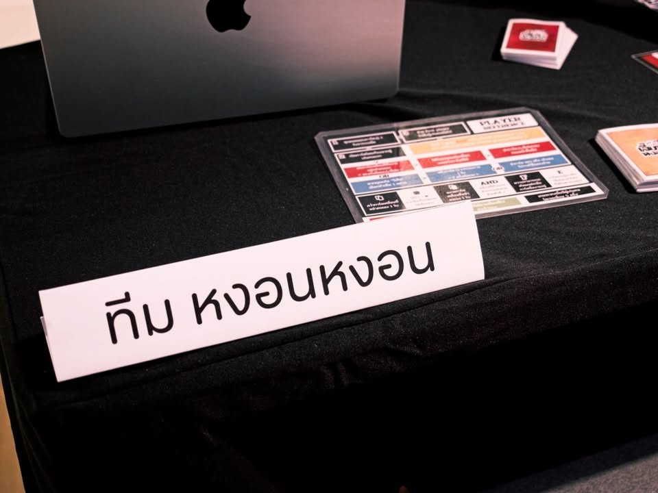

เล่าสั้นๆ (มากๆ) ถึงเกมที่ได้ไปเจอในการประกวด Book on Board ครั้งที่ 4 “เปลี่ยนหนังสือ(ไทย)ที่ชอบ เป็นบอร์ดเกม(ไทย)ที่ใช่”

---
เกม หงอนหงอน โดยทีม หงอนหงอน จากหนังสือ COMBCHICK เจี๊ยบหงอน โดย VAVEE 

พอดีเขียนถึงเกมของ VAVEE สองเกมติดเลยคิดว่าหยิบมาโพสติดกันให้ครบทีเดียวเลยละกัน

---
เวบตูนเรื่องนี้จะเล่าถีงลูกเจี๊ยบตัวหนึ่งและชีวิตประจำวันแบบจบในตอน

ส่วนเกมจะเรียกเป็นแนวชักเย่อละกันผู้เล่นจะพยายามขยับตัวเจี๊ยบหงอนให้เดินหน้าถอยหลังไปยังจุดที่ทำคะแนนได้โดยลูกเล่นคือตรงหน้าเราจะมีการ์ดบอกจำนวนช่องที่เราสามารถเดินได้อยู่ -2 -1 +1 +2 แล้วก็การ์ดความสามารถพิเศษอื่นๆ ในแต่ละตาผู้เล่นจะวางคว่ำการ์ดคำสั่งของตัวเองไว้ว่าอยากเล่นสีในทิศไหนจากนั้นค่อยเปิดมาแล้วเลือกการ์ดที่จะเดินอีกที โดยตัวการ์ดเดินจะใช้แล้วทิ้งจนกว่าเราจะทำแอคชั่นรวบเก็บเข้ามือใหม่

เล่นสองคนจะแนวตัดช้อยส์แต่ถ้าเยอะกว่านั้นจะกลายเป็นแนวปาร์ตี้แทน

---
disclaimer - เป็นเมนเทอร์ไปแนะนำเค้าอย่างเดียวไม่ได้เป็นกรรมการตัดสินหรือมีส่วนได้ส่วนเสียกับทีมไหน ผลงานยังไม่ final มีเวลาปรับแก้ครั้งสุดท้ายก่อนไปนำเสนอกรรมการ เพราะฉะนั้นก็เลยจะไม่เขียนถึงข้อดีหรือข้อเสียใดๆนะ

