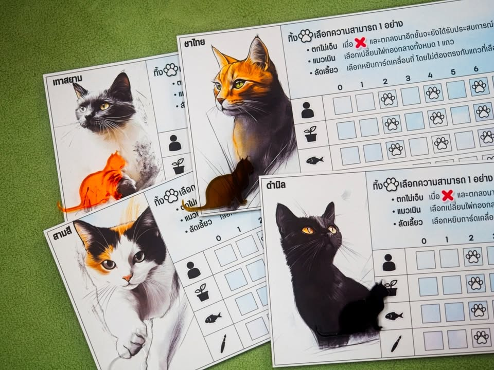
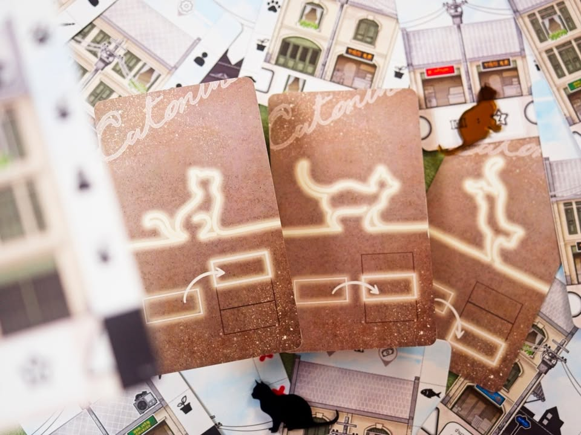
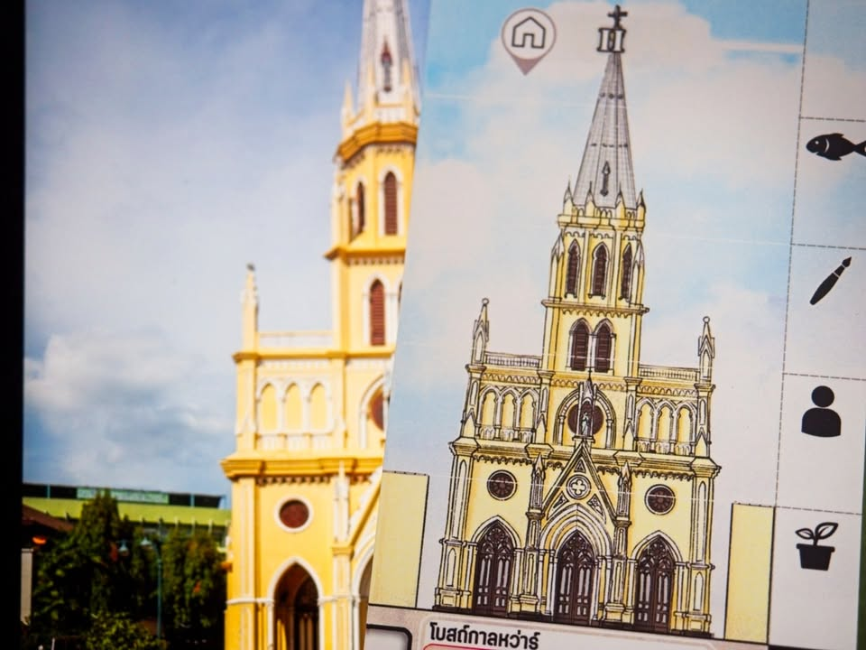
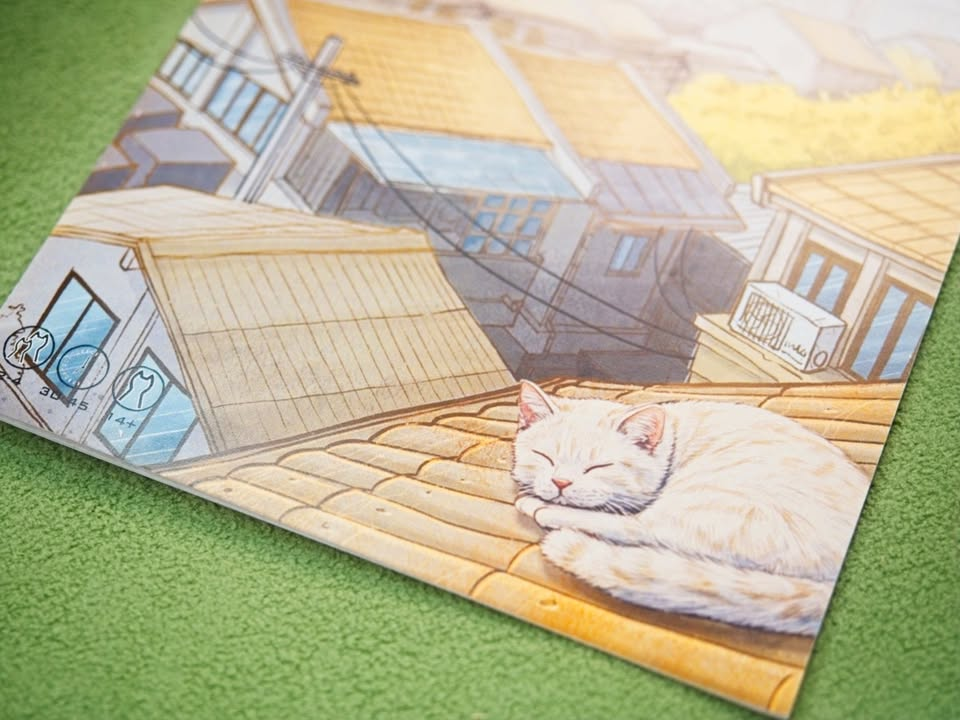

แมวจรท่องเจริญกรุง: Cat on the Roof - Lost in Charoenkrung 

เกมอันดับหนึ่งจากงานประกวดบอร์ดเกม 4 ย่าน โดยทีม Miscellaneous (tag ไม่ติดง่ะ  -_- ) ที่จะให้เรามานำทางน้องแมวของเราเดินไต่ไปตามตึกแถวย่านเจริญกรุง

---
ไอเดียเกมนี้คือมันจะมีรูปตึกแถวสุ่มๆมาให้เราหยิบ แต่ละตึกมันก็จะมีไอคอนที่เผื่อไว้ทำคะแนนแตกต่างกันไปอย่างป้ายร้านค้า เสาไฟฟ้า คอมเพรซเซอร์แอร์งี้ ตัวการ์ดก็จะมีสัญลักษณ์บอกประเภทว่าตึกที่เราหยิบเนี่ยเป็นอาคารที่อยู่อาศัย อาคารพานิช หรือว่าเป็นแนวอุตสาหกรรม

นอกจากตึกแถวธรรมดาแล้วก็จะมีตึกพิเศษให้เราหยิบซึ่งก็เป็น landmark ของย่านนั้นแหละ โดยการ์ดพวกนี้มันจะมี requirement ว่าเราต้องมีตึกแถวบางหมวดถึงจำนวนก่อนถึงจะหยิบได้ และพวกการ์ด landmark นี้มันก็จะให้คะแนนพิเศษกับเราตามเงื่อนไขต่างๆกันไป

กิมมิคที่น่ารักคือตอนหยิบเนี่ยมันจะต้องหยิบคู่กับการ์ดทิศทางน้องแมวด้วยว่าจะกระโดดขึ้นลงหรือเดินตรงไป พอเราหยิบแล้วก็ขยับแมวเราไปตึกข้างๆตามที่ทิศทางบอกเราก็จะแทรคไว้ว่าเดินไปเจอไรบ้าง เพราะอาจจะเป็นแต้มให้เรา

---
ไอเดียเกมนี้ดีเลยนะเพราะมันมาเป็นแบบ system ที่เราใส่ธีมอะไรก็ได้ รอเวอร์ชั่นต่อๆไปเลยไปได้ไกลแน่ การออกแบบก็ฉลาดดีคือใช้ประโยชน์จากการ์ดหน้าหลังคุ้มมาก

---
นี่ๆเกมนี้ตอนประกวดผมเป็นหนึ่งในทีมเมนเทอร์ด้วยนะ (พร้อมอาจารย์ยุ้ยและอาจารย์ตวง) เพราะงั้นผมเลยสามารถเคลมไตเติ้ลเมนเทอร์อันดับหนึ่งได้อย่างไม่กระดากปากละ :D

---
สำหรับเพจ Miscellaneous ติดตามได้ที่นี้ครับ https://www.facebook.com/profile.php?id=100083810885343 

ตัวรุ่น self publish (ตัวนี้แหละ) เข้าใจว่าหมดแล้วมั้ง แต่เหมือนว่าเค้ามีแผนจะออกสเกลใหญ่กว่านี้อยู่ก็รอติดตามดูครับ

ส่วนทีมนี้มีผลงานปีก่อนเป็น Run Zombie Run!! เกมอินดี้วิ่งหนีซอมบี้จากงาน TIBM 2023 นั้นเองงงงง เรียกได้ว่าผมเป็นแฟนผลงานทีมนี้เลยแหละ

---
เกมนี้ซื้อเองจ่ายเงินเองในงาน TIBM 2024 ครับค่ายไม่ได้ให้อะไรมานะ

---
(My) Collection Fit: เก็บไว้ในหมวดคั่นเวลาไม่เกิน 30 นาทีพาน้องแมวเดินสวยๆ น่าจะเป็นเกมที่ได้หยิบมาเล่นบ่อยเพราะกางง่ายกว่ากว่า Parks และ Cascadia (โอเคมันไม่เหมือนหรอกแต่รู้สึกว่า target group มันประมาณนั้นแหละ)
  
What I like: เล่นแล้วโลภอยาก optimized ไปทุกสิ่งไอคอนก็อยากเอา ชนิดตึกก็อยากได้ น้องแมวก็อยากเดินไปที่โปรด ชอบที่เค้าแทรกพวกไอคอนทำคะแนนวางเนียนไปกับการ์ดตึกแถวโดยที่ไม่รู้สึกแปลกแยกแต่ก็ไม่ได้จมหายจนหาไม่เจอ กติกาไม่มีอะไรยุ่งยากแค่หยิบการ์ดมาวางต่อกัน 8 ใบก็จบเกม
  
What I dislike: ไม่ได้มีอะไรที่ไม่ชอบเป็นพิเศษ ก็มันเกมกล่องเล็กเล่นคั่นเวลาแป๊บๆน่ะ แต่ก็มีติดๆเรื่องผมเป็นคนไม่ชอบนับคะแนนเขียนทีละช่องๆเท่าไร กับความสามารถน้องมันเหมือนๆกันหมด ที่ขัดใจจริงๆคือท้องฟ้าดันเป็นรูปเดียวกันเด๊ะๆ! อีกนิดคือสเกล token แมวที่ให้มากับท่านั่งมันวางละแปลกๆเดี๋ยวไปหา 3d print เป็นแมวเดินดีก่า
  
I think this game might be a good fit for...: กลุ่มครอบครัว และเกมคั่นเวลาสำหรับเกมเมอร์

แม้ zombie จะเต็มเมืองแมวก็ยังรอด... token zombie จากเกม run zombie run!! ผลงานก่อนหน้าของทีม

