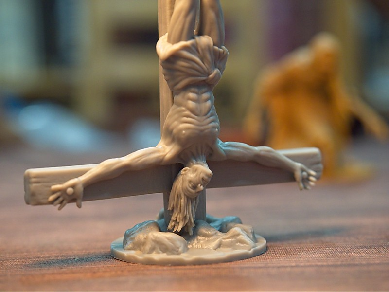
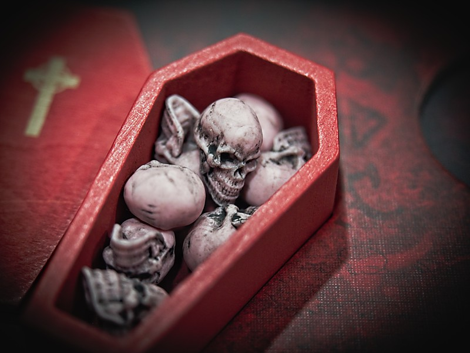
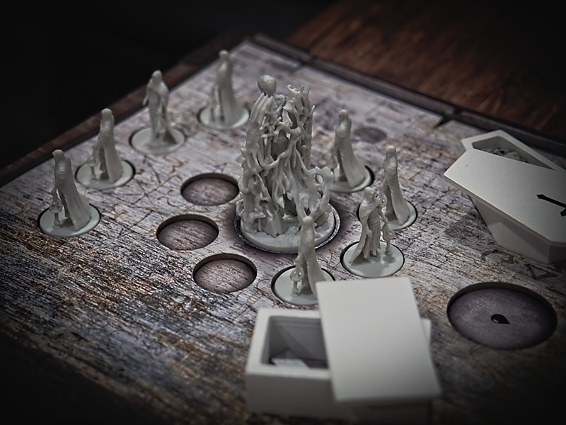
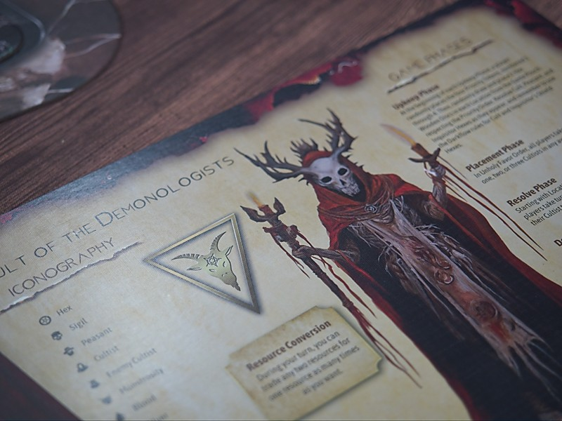
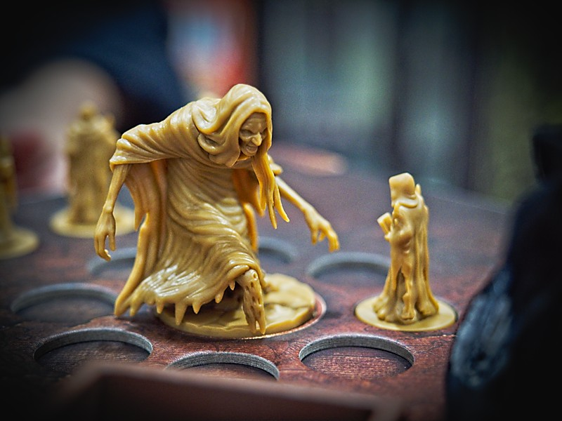
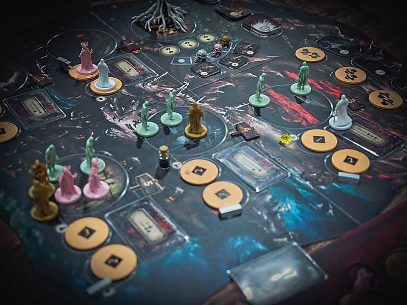
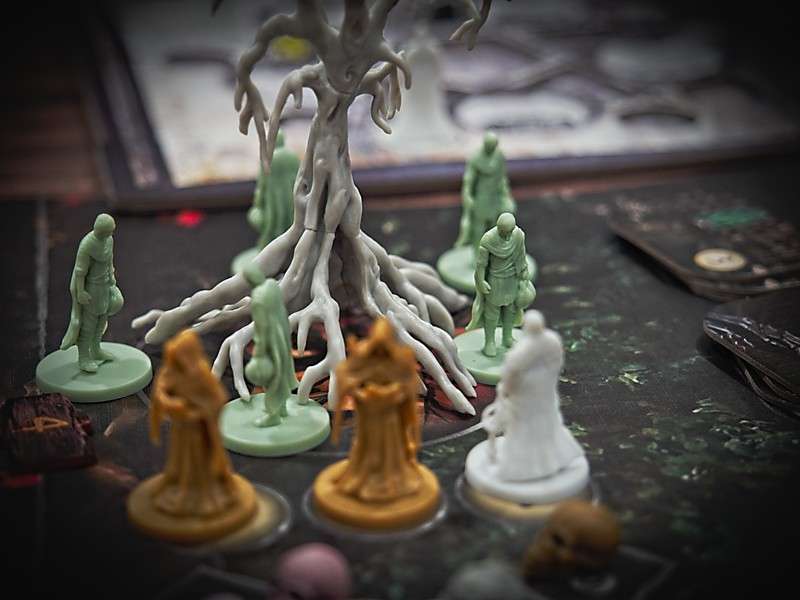
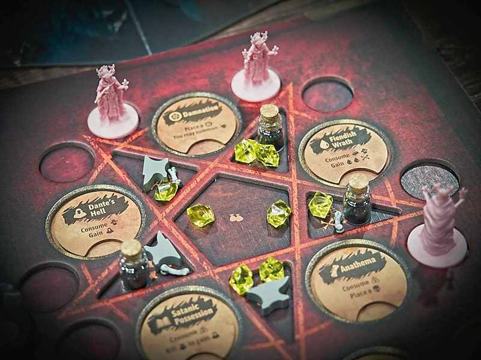

อันนี้เกมระดมทุนของชาวบ้านธีมก็ประมาณว่าเราเป็น cult ที่จะมาแข่งกันสร้างความทุกข์ระทมเพื่อบูชาเทพประจำลัทธิตัวเอง  
  
ไอเดียเกมจริงๆมันคือ euro worker placement ที่ผสมการประมูลเข้าไปสองแบบ คือเราจะมีตัวคนงาน (cultist) อยู่จำนวนหนึ่งก็ผลัดกันเอาไปลงช่องแอคชั่น 5 ช่อง แต่มีกติกาว่าลงครั้งแรกให้ลง 1 ตัว ครั้งต่อไปต้อง 2 ตัว และอีกครั้งก็ 3 ตัว ตรงนี้ก็มียึกยักกันนิดนึงเพราะคนงานจำกัด ค่อนข้างการันตีว่าลงก่อนก็จะมีตัวน้อยกว่าคนอื่น  
  
ทีนี้พอลงครบทุกคนเกมมันจะไล่ resolve ตามเบอร์ช่อง (ที่สุ่มทุกรอบ) ใครลงตัวเยอะกว่าจะได้หยิบคนงานไปทำแอคชั่นก่อน ซึ่งก็จะมีเก็บทรัพยากรประจำช่อง หรือหยิบคนงานกลับมาทำแอคชั่นที่บอร์ดตัวเองก็ได้ เอาจริงๆเกมมันแค่นี้แหละ  
  
---  
จุดที่ทำให้เกมสนุกกับเข้าธีมจะอยู่ที่บอร์ดตัวเองนี้แหละ เพราะแต่ละฝ่ายมันมีท่าไม่เหมือนกันแถมอัพเกรดได้ด้วย แล้วนอกจากทรัพยากรให้หยิบถ้าช่องนั้นมีชาวบ้านเราก็จะสามารถล่อลวงชาวบ้านมาทำอะไรซักอย่างได้ (ก็คือทรัพยากรนั้นแหละแต่ถ้าอยากหยิบก่อนก็ต้องส่งคนมาเยอะหน่อย) อย่างของผมทั่นเทพเป็นสามสาวซัคคิวบัสก็เอาชาวบ้านมาแล้ว 'แปลง' จนเหลือแค่หยดเลือดกับกระดูกได้.....  
  
ความน่าสนใจคือเกมยิ่งเล่นไปช่องทรัพยากรมันจะน้อยลงเรื่อยๆ เกิดจากระบบอัพเกรดท่าของผู้เล่นนี้แหละมันจะไปอุดรูเติมของ กับด้วยกลไกของเกมมันจะมีการประมูลเอาแต้มจากพื้นที่ทุกรอบ (เอาเลือดมาบิดแข่งกันแต่ล่ะฝ่ายก็มีท่าในการหาไม่เหมือนกัน) เราก็ต้องทำวางแผนเอาโทเคนหัวกะโหลกที่นับพลังเป็น 2 เลือดไว้ซ่องสุมไว้ล่วงหน้าไรงี้  
  
---  
เรื่อง production ก็คือมินิสวยงามดี (จากมุมคนเล่นยูโรอ่ะนะ) ตัว player board ทำเป็นสมุดหนาเปิดมาให้ความรู้สึกประหนึ่งกำลังได้ทำการอัญเชิญเทพ มีอันเดียวที่ไม่เข้าพวกคือบอร์ดกลางแม่งดีไซน์อะไรว่ะเนี่ย โล่งๆตุ่นๆ ไทล์คะแนนก็ไม่ได้รู้สึกถึงธีมเชี้ยไรเลย เอาเป็นว่าทีมมินิเจอร์น่าจะร้องไห้อยู่ตอนเห็นบอร์ดกลางกับไทล์คะแนน แต่ overall ไม่ได้รู้สึกว่ามีอะไรไม่ดี (แค่ดูไม่สมดุลย์เท่าไร)  
  
---  
  
🐸 ME - **กบโอเค** (แต่เล่นไปรอบเดียวนะ) เป็นยูโรประมูลที่ตรงไปตรงมากว่าที่เห็น interaction กำหมัดอยู่หน่อยๆจากการไล่กำจัดคนงานฝ่ายตรงข้าม มีจังหวะยึกยักลงคนงานที่ไม่ยุ่งยาก ยิ่งพอทรัพยากรมีน้อยแล้วคนงานหายนี้ยิ่งหงุดหงิดเลย ธีมก็คิดว่า reflect อยู่  
  
แต่ใดๆคือยังเล่นไม่ครบทุกตัวนะ แต่ก็คิดว่า 3 คนพอละ 4 รอนานไปหน่อย  
  
🟠 regular | 🔴 expert : เอาจริงๆก็เกมยูโรระดับกลางเนี่ยแหละ (ค่อนกลางหนักนิดๆจากมิติของ skill) แกนเกมไม่ยุ่งยากแต่จำเป็นต้องอ่านความสามารถตัวเองกับเข้าใจความสามารถชาวบ้านเพื่อให้ขัด/ป้องกันการโดนขัด  
  
🧸newbie | 🟢casual/family : เกมมันธีมดาร์กอยู่ก็แล้วแต่บ้านละกันระบบเกมมีขยักที่ยุ่งยากนิดหน่อย เล่นครั้งแรกอาจจะงงแต่พอจบเกมก็คิดว่าไม่ได้ยากอะไรนะเกมเข้าใจง่ายกว่าที่เห็น

