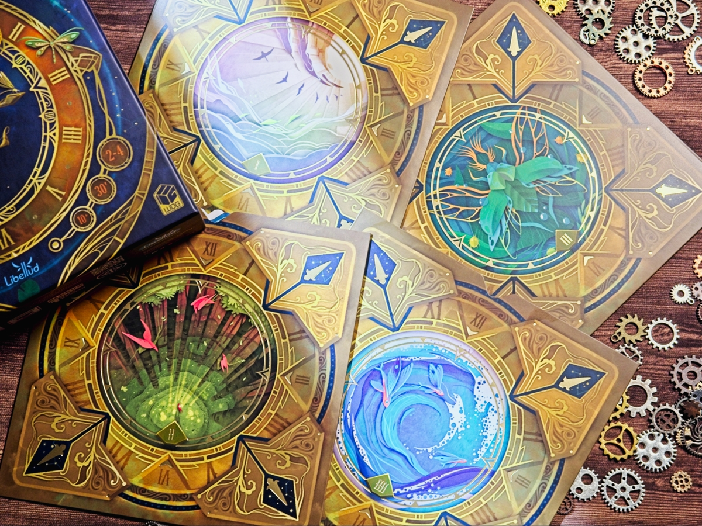
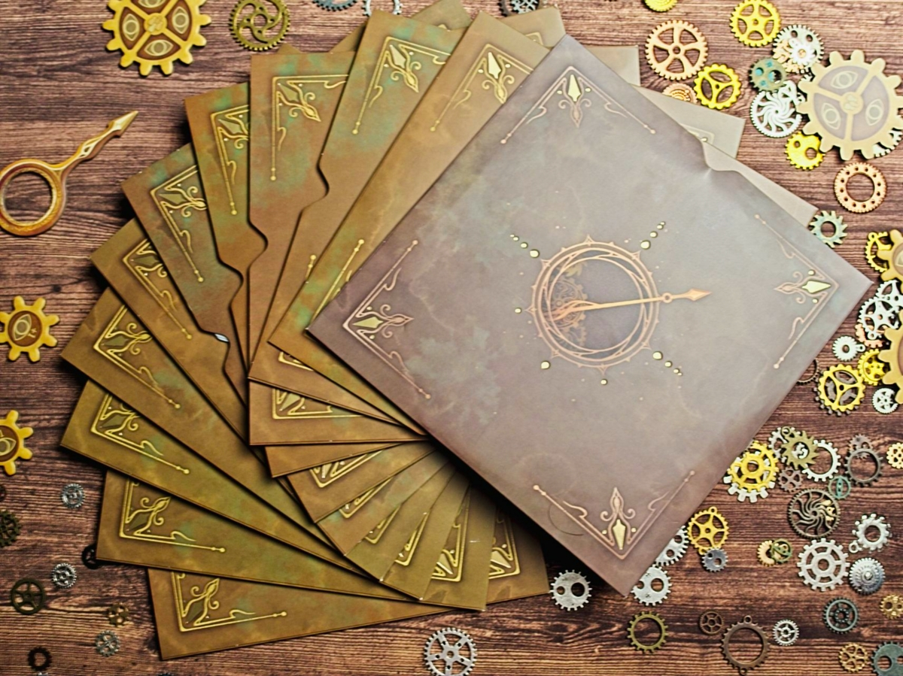
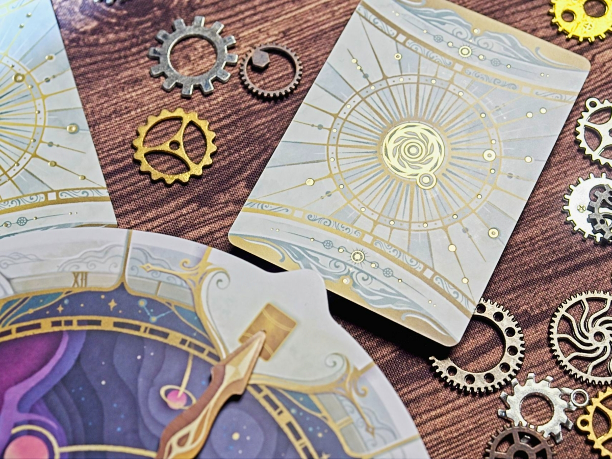

Take Time เป็นเกมช่วยกันเล่นที่ใช้คำว่าสวยได้เปลืองมากๆ

เรื่องธีมน่าจะประมาณย้อนเวลาวาร์ปไปที่โน้นที่นี่แต่ช่างมันเถอะไม่ได้เกี่ยวอะไรกับการเล่น แกนหลักของเกมจะอยู่ที่เรามีการ์ดเลข 1-12 อยู่ 2 ชุดคือหลังขาวและดำเอามาสับรวมกันทั้งๆอย่างนั้นแหละจากนั้นก็แจกให้ผู้เล่น 3/4/6 ในขึ้นอยู่กับว่าเล่นกี่คน ส่วนใบที่เหลือแยกเก็บไว้

เป้าหมายของเกมในการผ่านแต่ละฉาก (มี 40 ฉาก) ก็คือให้เราเอาเลขในมือเราเนี่ยผลัดกันวางรอบๆนาฬิกาจะวางซ้อนก็กันก็ได้แต่เงื่อนไขคือพอทุกคนลงครบแล้วตอนหงายออกมาผลรวมต้องเรียงกันจากน้อยไปมาก แต่ในแต่ละกลุ่มจะต้องมีผลรวมกันไม่เกิน 24 ..... จบล่ะเกม แต่เออระหว่างเล่นห้ามคุยกันนะ ส่งซิกก็ไม่ได้เล่นการ์ดได้อย่างเดียว

แต่เห้ยแค่นี้มันจะสนุกเหรอว่ะ? กิมมิคสำคัญที่เล่นแล้วลุ้นทุกครั้งคือในแต่ละฉากจะมีเงื่อนไขในการผ่านไม่เหมือนกัน อย่างบางช่องจะต้องมีสีขาวสองใบ บางช่องผลรวมห้ามเกิน บางช่องผลรวมต้องใกล้บางเลข บางช่องต้องเป็นเลขใหญ่สุดของสีน้้น  ฯลฯ เอาเป็นว่าเงื่อนไขเยอะสิ่ง ทำให้การเล่นมั่วๆแล้วหวังว่าจะผ่านนั้นแทบเป็นไปไม่ได้เลย

แต่เกมก็ยังมีตัวช่วยอยู่ซึ่งเป็นจุดวัดกึ๋นของวงด้วยนั้นคือเราสามารถวางการ์ดแบบหงายได้ด้วยจำนวนก็แล้วแต่คนเล่น ซึ่งตรงนี้เรียกได้ว่าเป็นการสื่อสารแบบเดียวที่เกมยอมให้เราใช้ ก็ต้องใช้ทักษะในการรู้ใจแล้วก็วิธีคิดกันพอดู

ส่วนที่ชอบเป็นการส่วนตัวแม้ไม่เกี่ยวกับวิธีเล่นก็คืออาร์ทสวยมาก แบบมากๆ ทั้งที่ไม่จำเป็นหรือเกี่ยวอะไรกับเกม คือสวยแบบทุกมุมมีเยอะรายละเอียดใส่ปั๊มทองในจุดที่ควรไม่เกร่อไม่ล้น ภาพซองแต่ชุด ฉากเล่นแต่ละด่านไม่ซ้ำเลย ชอบแบบชอบอ่ะ แบบมาคิดๆว่าถ้าเป็นอาร์ทง่อยๆอาจจะไม่ enjoy ขนาดนี้นะ 

แต่ใดๆก็คือต้องระวังไว้นิดหน่อยว่าเกมมันไม่ได้ออกแบบมาให้เล่นรอบเดียวผ่านเท่าไร (ข้อดีสำหรับผมนะ) แบบมันจะมีจังหวะที่มือไม่เป็นใจอยู่บ้างแต่ถ้าการวางแผนมาดี กับไม่เล่นมั่วก็คิดว่าไม่ยากเกินไปนะ

---
🐸 ME - #กบชอบ คือปกติผมไม่ชอบเล่น co-op เท่าไร หลายเกมก็ limit communication ในแบบไม่ค่อยสนุก The Mind, The Crew นี้ไม่ชอบเลยรู้สึกน่าเบื่อ แต่มาปีนี้ตั้งแต่ Bomb Buster ล่ะที่เล่นแล้วชอบการคิดดักทางในมิติที่ไม่ซับซ้อนจนเกินไปแต่ก็ไม่ได้ตื้นเขินจนง่วงนอน เล่นแล้วอยากไปฉากต่อไปเรื่อยๆ

จุดที่ชอบคือไอเดียมันคือการอ่านมือพร้อมกับเดาทางว่าเลขประมาณนี้ลงอะไรดีในกรอบที่ไม่แคบหรือกว้างไป แต่ก็แน่ล่ะว่าข้อเสียมันคือถ้าในวง'มือไม่ถึง'เกมก็กร่อยจัดเพราะพื้นที่ในการลงพลาดมันก็น้อยลงมากๆ รวมไปถึงความไม่เป็นใจจากการที่การ์ดในมือมีแต่เลขที่ไม่เข้าทางกับเงื่อนไขฉากก็ต้องยอมรับความซวยเล่นแพ้ละเริ่มใหม่ แต่ข้อดีก็คือมัน reset เกมได้ไวมากๆเพราะแค่รวบการ์ดไม่กี่ใบแล้วแจกใหม่

🔴 expert  | 🟠 regular | 🟢casual/family | 🧸newbie : เกมช่วยกันเล่นที่กติกาหลักง่ายมาก ใครที่ชอบคิดดักทางเดามือชาวบ้าน ถ้าชอบเกม co-op ที่จำกัดการสื่อสารแล้วมาเดามืออย่าง Bomb Buster หรือไม่ก็พวก Davinci Code (หรือเกมทรง The Crew) ก็น่าจะชอบเกมนี้ได้ไม่ยาก แต่ใดๆด้วยความที่มันต้อง 'คิด' พอตัวก็จะไม่เหมาะกับวงที่ต้องการความเฮฮาล้วนๆนะ

---
> 🐸 ME - ความเห็นส่วนตัวสำหรับตัวเองเพื่อตัวเอง
> 🔴 expert - ผ่านเกมมาเยอะ อ่านเกมใหม่ตลอด
> 🟠 regular - เล่นบ่อยเล่นประจำออกตระเวนเล่น
> 🟢casual/family - เล่นที่ร้านเล่นหรือกับครอบครัว
> 🧸newbie - มือใหม่พึ่งเข้าวงการผ่านเกมตามร้านมานิดหน่อย

---  
this is a gifted product from Well Designed Game - WDG Distributor, no money changed hand for this content. ได้รับสินค้าโดยไม่มีค่าใช้จ่าย คอนเทนต์ทำเพื่อแสดงความเห็นส่วนตัวเกี่ยวกับเกมโดยไม่มีการจ้างวาน