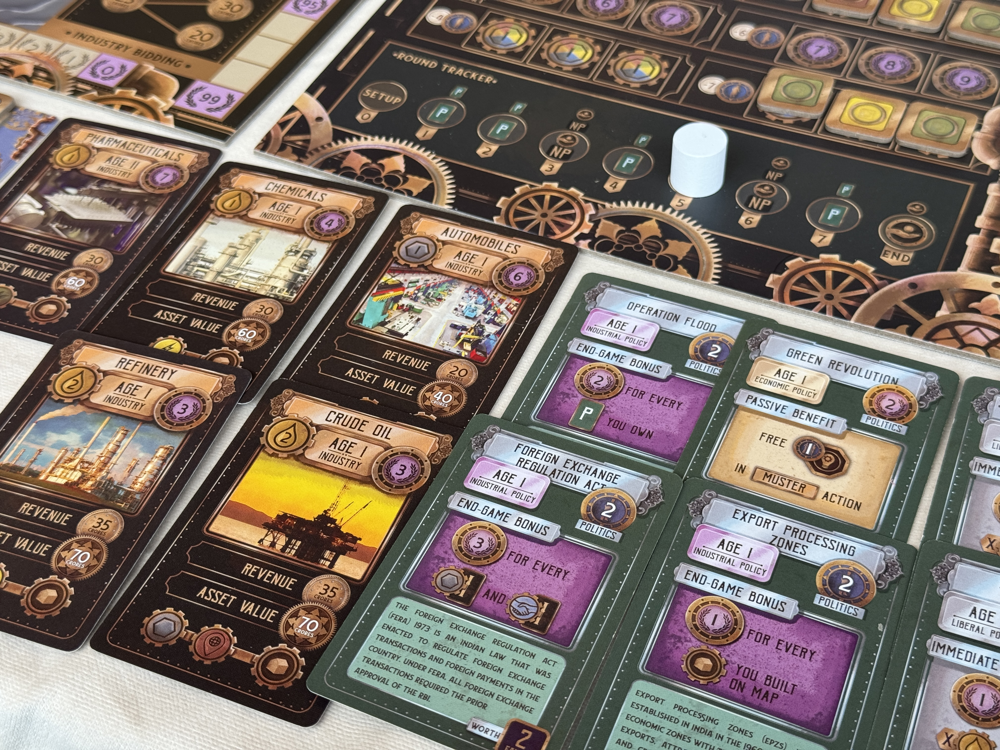

Tycoon: India 1981 เล่าถึงการฟื้นฟูและพัฒนาเศษรฐกิจของอินเดียในช่วงที่อังกฤษถอนตัวออกไปผลงานจากนักออกแบบไม่คุ้นชื่อ Sidhant Chand จากประเทศนอกสายตาอย่างอินเดียที่ขายูโรหลายคนกำลังให้ความสนใจ

เรียนตามตรงผมนึกไม่ออกจริงๆว่าจะอธิบายเกมนี้แบบไหน ถ้าจะให้พูดก็คงเป็นอะไรที่คล้ายกับแกงกระหรี่อันเป็นเครื่องแกงที่มาจากการบด โคลก ผักชี ยี่หร่า พริกป่น ขมิ้น ลูกกระวาน กานพลู อบเชย แล้วมาผสมผสานกันเป็นรสชาติของมัน ที่อธิบายแบบนี้เพราะว่าผมไม่มีคำอธิบาย 'ทรง' เกมยูโรใดๆมาทำเป็นแกนของเกมนี้เลยเพราะมันผ่านการหั่นออกแยกส่วนเป็นชิ้นเล็กแล้วถูกนำมาร้อยเรียงใหม่ในเกมนี้ ซึ่งมันเป็นทั้งข้อดีหรืออาจจะข้อเสีย แต่ก็แน่ล่ะมันเป็น 'ความใหม่' ที่มีกลิ่นหอมหวนของสิ่งที่คุ้นเคยอยู่เต็มไปหมด

ไอเดียน่าสนใจของเกมคือแม้ตอนจบจะนับคะแนนก็จริงแต่ว่าคนที่จะมีสิทธิ์ไปนับคะแนนตอนจบนั้นต้องเป็นคนที่มีมูลค่ากิจการสูงที่สุดหรือมีอิทธิพลสูงสุดอย่างใดอย่างหนึ่งเท่านั้น หมายความว่าแม้แต้มจะสำคัญแต่ถ้าคุณลงทุนกับมันมากไปคุณอาจจะแพ้ในเกมนี้ก็ได้

ในแต่ละรอบเกมจะเริ่มจากการให้เราประมูลเพื่อล็อบบี้นักการเมืองเพื่อหยิบการ์ดความสามารถพิเศษด้วยโทเคนนักการเมืองกันก่อน ตามด้วยการประมูลเพื่อแย่งสิทธิ์ในการสร้างโรงงานด้วยเงิน ซึ่งเกมนี้อยู่ๆสร้างเลยไม่ได้นะ ต้องมาประมูลเอาสิทธิ์ตรงนี้ก่อน

มิติที่น่าสนใจของการสร้างตึกในเกมคือระบบแทรคอุตสาหกรรม 6 ประเภทที่ทำงาน 2 ฟังก์ชั่นอย่างแรกคือช่องรับโบนัสในแต่ละสาย และอีกอย่างคือการกำหนดว่าใครคือผู้นำในอุตสาหกรรมนั้นๆ เวลาใครสร้างตึก (ที่พึ่งประมูลมา) ก็ต้องจ่ายเงินเพิ่มให้กับผู้นำในส่วนนั้นๆด้วย ซึ่งไม่เยอะแต่มันให้ฟีลของการเป็นผู้นำตลาดอยู่นะ

ตัวแอคชั่นในเกมจะให้ทำแค่คนละ 2 แอคชั่นต่อรอบ (+1 ถ้าชนะประมูลโรงงานด้วยแอคชั่นที่จำกัดการลงเงินเพื่อซื้อสิทธิ์โรงงานเลยเดือนขึ้นเพราะรางวัลมันเยอะ) ตัวแอคชั่นไม่มีอะไรมากก็สร้างตึก กู้เงิน ไปซื้อหุ้นคนอื่น เอาโทเคนนักการเมืองที่ประมูลแพ้ไปซื้อแอคชั่นพิเศษ เก็บทรัพยากรนิดหน่อย

ถ้าสังเกตละก็ความสวยทางการออกแบบอีกอย่างก็คือโทเคนนักการเมืองที่จะเอาไปซื้อแอคชั่นนั้นเราจ่ายตรงๆไม่ได้ มันต้องมาจากการแพ้ประมูลการ์ดความสามารถพิเศษเท่านั้น ตรงนี้ทำให้ไปเดินมิติการประมูลให้น่าสนใจเข้าไปอีกเพราะไม่มีใครอยากจ่ายน้อยเพราะต้องเอาไปใช้ และถ้าชนะได้การ์ดที่ค่อนข้างแรงไปก็จริงแต่โทเคนมันจะหายหมดคนที่แพ้ก็ได้ไปทำโบนัสแรงๆต่อ

ตรงการซื้อหุ้นก็เป็นระบบที่ทวิสมาน่าสนใจคือเราถูกบังคับให้ซื้อหุ้นคนอื่นเท่านั้นและการซื้อนอกจากจะทำให้เราได้แต้มอิทธิพล (ที่เป็น 1 ในเงื่อนไขท้าชิง) แล้วการซื้อหุ้นถูกตัวจะมีผลทำให้หุ้นเรานับเป็นทรัพย์สินมูลค่าสูงอีกด้วย (ซึ่งก็เป็นอีก 1 ในเงื่อนไขท้าชิง) ซึ่งระบบนี้ของเกมทำให้เกิดการหมุนเวียนเงินของผู้เล่นได้น่าสนใจดี เพราะผู้เล่นที่ถูกซื้อหุ้นไปเยอะแต่ดันไม่มีโรงงานมาผลิตรายได้ที่มากพอก็จะไม่มีเงินปันผลทำให้ต้องกู้มาจ่าย ซึ่งนำไปสู่การต้องสู้เพื่อประมูลโรงงานอีกต่อ brovo!

---
🐸 ME - #กบชอบ  ผมชอบในการออกแบบเกมที่ความสัมพันธ์ระหว่างองก์ประกอบและแอคชั่นมันมีเชื่องโยงกันดีมาก แทบไม่เจอจุดที่รู้สึกว่าฝืนใส่มาเพื่อให้มันยากหรือฟิตพอดี ทั้งๆที่เป็นแบบนั้นเกมกลับไม่มีส่วนของ interlock ที่บังคับเราไปมาทุกอย่างสมูทโดยที่การทำทุกแอคชั่นมีความหมายหมด (เอาตรงๆก็คือไม่เหมือนเกมของ  Vital นั้นแหละ.....) แถมการนับหาผู้ท้าชิงก็คือมองออกยากมากจริงๆต้องรอวิ่งกันจนตาสุดท้ายเพราะมันมีจังหวะพุ่งแซงกับเบียดกันมากจริงๆ

ส่วนที่ทำให้อยู่ #กบชอบ ไม่ใช่ #กบโปรด ก็คือความสมูทของมันนี้แหละ คือเกมมันลื่นไหลมากแต่ผมเป็นคนชอบเกมที่มีความแข็งคมในบางมุม พวกแนวมีท่ามีสายชัดๆหน่อย แต่เกมนี้จะมีความต้องขยับตามการ์ดมิชชั่นนิด ตามหน้างานหน่อย ด้วยความที่มันสัมพันธ์กันหมดก็เลยตอนจบไม่ได้รู้สึกว่าตัวเองได้สร้าง economic empire แต่อย่างใด คือมันดูเท่ากันไปหมดไม่มีจุดที่รู้สึกว่าเด่นออกมา (ซึ่งเอาจริงๆที่ยกมาไม่ใช่ข้อเสียซักข้อนะ)

จุดที่อาจจะต้องระวังหน่อยก็คือเกมไม่มี catch up ใดๆ ก็จะมี event ที่ต้องเอาไปประเมินความเสี่ยงกันนิดหน่อย (จุดนี้ไม่ชอบนิดๆพวกแนวเปิด event) ตัว event เองมันจะออกแนวทำร้ายคนที่พยายามวิ่งบางหมวดในตานั้นๆอยู่ ซึ่งส่วนตัวผมคิดว่ามันเป็นแรงต้านเทียมที่มีผลต่อการตัดสินใจในมูฟการเล่นพอตัว

อนึ่งตัว deluxe มันมี poker chip มาด้วย ไม่แนะนำครับค่อนข้างธรรมดา เป็นพลาสติกที่สีพิลึกจำยากเหรียญ 1 สีเขียวงี้ แทนที่จะเป็นสีขาว 

🔴 expert  | 🟠 regular | : เกมยูโรระดับหนักที่ทุกอย่างลื่นไหล ไม่มี interlock ปวดหัว แต่เล่นให้ดีนั้นไม่ง่าย

🟢casual/family | 🧸newbie :  แม้เกมจะเล่นตามได้ไม่ได้ยาก แต่เงื่อนไขความสัมพันธ์ของส่วนประกอบต่างๆในเกมที่ทำให้เล่นได้ดีนั้นค่อนข้างซับซ้อนอาจจะไม่เหมาะกับมือใหม่นะ อาจจะลองซัก Brass ก่อนว่าไหวกับระดับความซับซ้อนของเกม economic ขั้นถัดไปหรือยัง

---
> 🐸 ME - ความเห็นส่วนตัวสำหรับตัวเองเพื่อตัวเอง
> 🔴 expert - ผ่านเกมมาเยอะ อ่านเกมใหม่ตลอด
> 🟠 regular - เล่นบ่อยเล่นประจำออกตระเวนเล่น
> 🟢casual/family - เล่นที่ร้านเล่นหรือกับครอบครัว
> 🧸newbie - มือใหม่พึ่งเข้าวงการผ่านเกมตามร้านมานิดหน่อย
