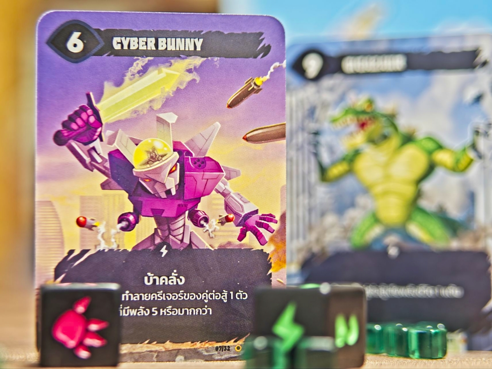
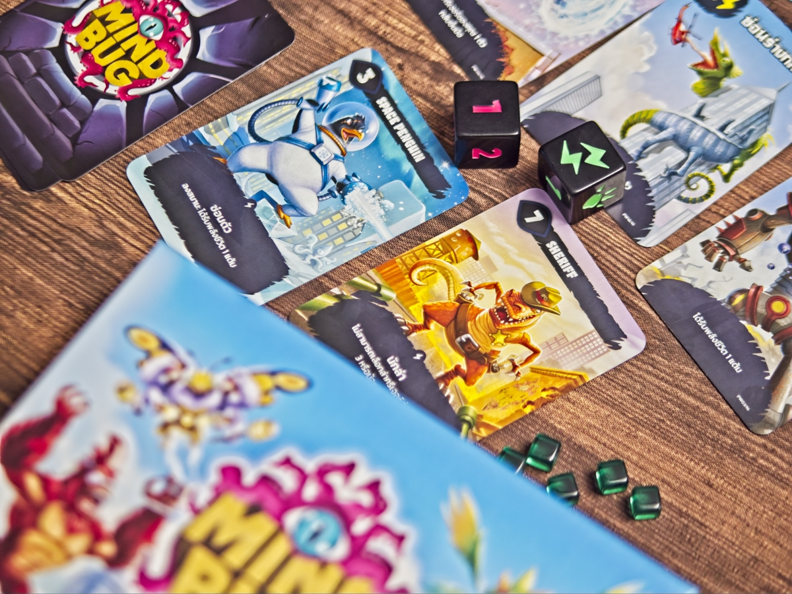
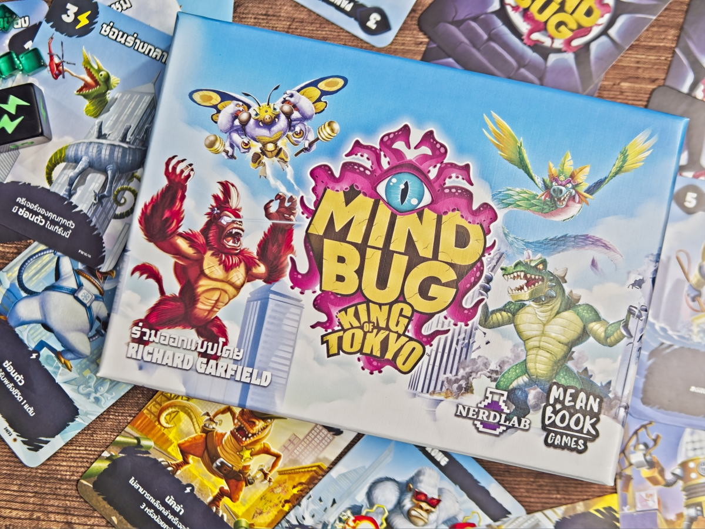

Mindbug x King of Tokyo เอาสัตว์ยักษ์มาวัดกึ๋นตบกันเหมือนเดิม เพิ่มเติมคือทอยเต๋าปล่อยพลัง

เกมนี้จริงๆก็คือ Mindbug เดิมที่เคยเขียนถึงไปแล้วแต่รอบนี้ออกเป็นตัว standalone ที่ซื้อมาเล่นได้เลย (หรือจะรวมกันก็ได้) พร้อมกับกิมมิคจากเกม King of Tokyo ที่เป็นการทอยเต๋าสะสมพลังงานไว้เล่นการ์ดปล่อยท่า

ถ้ายังไม่เคยเล่นซักภาค ไอเดียคือเกมมันจะมีสัตว์ประหลาดขี้โกงๆสุ่มแจกเป็นกองการ์ดคนละ 10 ใบ มาถึงตาเราก็เล่นหรือส่งไปตบฝ่ายตรงข้าม วิ่งเข้าตัวได้ 3 ทีก็ชนะ ถ้าเอามอนสเตอร์มาบล็อกกันก็ดูว่าใครเบอร์ใหญ่กว่าชนะไป เกมว่ากันง่ายๆแค่นี้เลยแทบไม่มีกติกาจุกจิกให้ถาม

แต่ทีเด็ดสุดของเกมก็คือระบบ mindbug หรือแมลงสะกดจิตที่เราจะมีคนละสองใบ เวลาใครเล่นมอนสเตอร์ลงมาก็จะถามก่อนว่าเราจะทำการใช้ mindbug เราไปขโมยตัวนั้นมาเป็นของเราแทนไหมง่ายๆแค่นั้นเลย มันเลยทำให้เกมนี้จริงๆแล้วเป็นเกม 'บลัฟ' ว่าเรากำลังส่งตัวที่ดีที่สุดหรือตัวพลิกเกมของเราลงไปหรือยัง

ของเล่นในตัว x King of Tokyo  คือมอนสเตอร์บางตัวจะมีความสามารถทอยเต๋าสะสมพลังให้ เวลาตีก็สะสมพลังไว้แลกการ์ดความสามารถพิเศษเอา แต่ว่ามันจะมีแค่เฉพาะตัวในภาคนี้ ถ้าจะเอาการ์ดตัวหลักมาผสมก็อาจจะทำเป็นผสมแบบมีสัดส่วนหน่อยทั้งสองคนจะได้มีสิทธิใช้ท่าพอๆกัน แต่เอาจริงไม่ต้องทำก็ได้สุ่มมั่วๆแหละเพราะถ้ามันดูเก่งโกงก็ใช้ mindbug ปล้นเอา :D

---
🐸 ME - #กบโอเค สำหรับผมแล้วมันเป็นเกมที่สำหรับแล้วมันได้ 'จับ' ส่วนที่เป็นสาระสำคัญที่ผมรักสมัยยังเล่น Magic the Gathering อยู่นั้นคือจะ 'เค้าเตอร์' ไหมครับ? มาภาคใหม่โดยใจความสำคัญเกมไม่ได้เปลี่ยนแต่เกมสกิลที่มีความลุ้นมาให้ ข้อดีก็น่าจะเป็นทำให้เกมขยายฐานคนเล่นได้กว้างขึ้นอีกเพราะหลอกเด็กง่ายขึ้น 

🔴 expert  | 🟠 regular | 🟢casual/family | 🧸newbie :  เกมสั้นคั่นเวลา กติกาน้อยแต่มองหน้ากันเข้มอยู่นะแบบมันจะ mindbug ฉันหรือยางงงงงงงงงง

---
> 🐸 ME - ความเห็นส่วนตัวสำหรับตัวเองเพื่อตัวเอง
> 🔴 expert - ผ่านเกมมาเยอะ อ่านเกมใหม่ตลอด
> 🟠 regular - เล่นบ่อยเล่นประจำออกตระเวนเล่น
> 🟢casual/family - เล่นที่ร้านเล่นหรือกับครอบครัว
> 🧸newbie - มือใหม่พึ่งเข้าวงการผ่านเกมตามร้านมานิดหน่อย

---  
this is a gifted product from Meanbook no money changed hand for this content. ได้รับสินค้าโดยไม่มีค่าใช้จ่าย คอนเทนต์ทำเพื่อแสดงความเห็นส่วนตัวเกี่ยวกับเกมโดยไม่มีการจ้างวาน