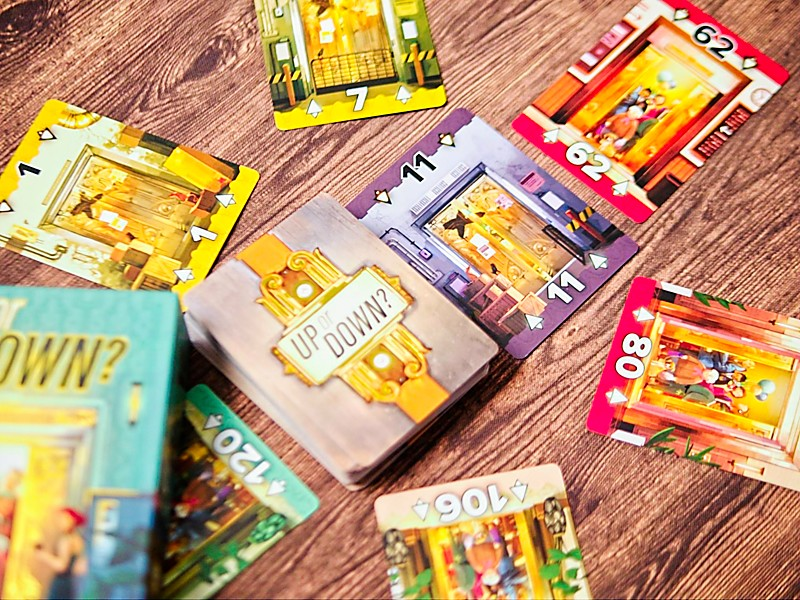
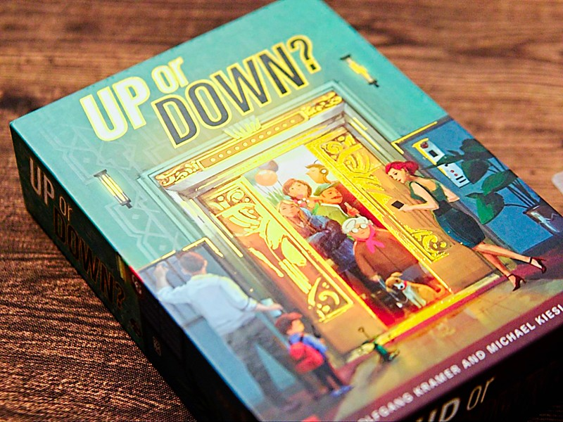
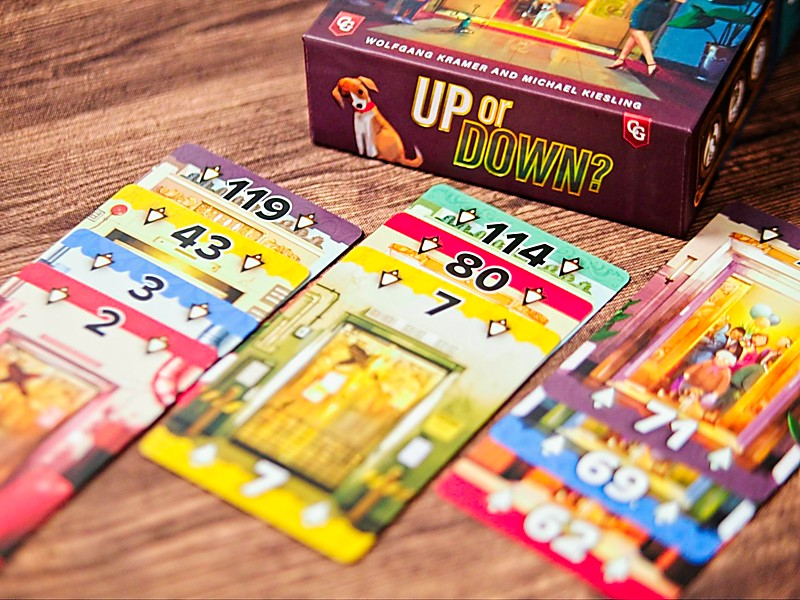

Up or Down? การ์ดเกมเล็กๆเล่นง่ายจากทีมคุณภาพ Michael Kiesling + Wolfgang Kramer เกมมาในธีม  ขึ้น/ลง ลิฟ

เอาจริงๆมันก็คือเกมที่มีการ์ด 60 ใบเรียงเลข 1-60 ง่ายๆเลยสิ่งที่เราจะทำคือเลือกการ์ดมาวางเป็นแถวลิฟตรงหน้าเราซึ่งจะมีได้สามกอง ในแต่ละกองถ้าเลือกว่าจะต่อให้เลขเรียงขึ้นแล้วก็ต้องเพิ่มขึ้นเรื่อยๆ แต่ถ้าลงก็ลงไปเรื่อยๆ เกมจะคิดคะแนนตอนจบว่าในแต่ละแถวเรามีการ์ดสีอะไรในแถวเยอะสุดก็เอาจำนวนนั้นมาคูณกับจำนวนการ์ด ง่ายๆแค่นั้น

กิมมิคที่ทำให้เกมนี้สนุกก็คือกระบวนการในการหยิบการ์ดมาเติมในลิฟของเรา เกมจะเริ่มจากให้เราจั่วการ์ด 6 ใบมาเป็นตลาดกลาง โดยต้องวางเป็นวงกลมแล้วก็เรียงเลขจากน้อยไปมาก ทีนี้ในมือผู้เล่นจะมีการ์ดอีกคนละ 3 ใบ พอถึงตาเราเราก็ต้องเอาการ์ดในมือเราไป 'แทรก' ระหว่างการ์ดในตลาดแล้วก็หยิบเอาใบในตลาดไปเติมลิฟเราอีกที

ฟังดูเหมือนจะไม่มีอะไร แต่ตอนเล่นจริงมันมีจังหวะของการทิ้งการ์ดไว้เพื่อรอเก็บ กับการกั๊กการ์ดที่คนอื่นอยากได้ทั้งสีและเลขอยู่พอตัว ผสมกับความขัดใจเวลาโดนตัดกับบริหารเลขในมือไปพลางๆ ก็เพลินๆดีนะ

ส่วนที่ชอบอีกอันที่อาจจะไม่เกี่ยวกับเกมแต่ก็เป็นผลที่ทำให้ตัดสินใจซื้อง่ายเลยก็คืออาร์ทสวย ทำ UV ดิ้นทองสวยงาม (แบบเห้ยเอาจริงโดนตกแบบนี้บ่อย Take Time ก็ใช่, Courtisans  ก็ด้วย) แบบคือถ้าเป็นอาร์ทอีกแบบที่ไม่ใช่ของ Capstone Games เนี่ยอาจจะไม่ซื้อก็ได้.... ซึ่งนำมาสู่จุดที่ไม่ชอบนิดหน่อยคือปกติผมจะไม่ใส่ซองการ์ดแต่เกมนี้มันมีสีทองสวยๆอ่ะก็เลยอยากจะใส่แต่ว่ากล่องมันเล็กใส่ซองแล้วปิดไม่ลง......

---
🐸 ME - #กบโอเค เป็นการ์ดเกมคั่นเวลาเล่นง่ายที่เล่นปุ๊บกด add cart ปั๊บเลย หลักๆคือชอบอาร์ท เอาจริงๆแอบพบว่าตัวเองมี soft spot กับพวกการ์ดเกมเล็กๆที่ปั๊ม UV ทำลายสีทอง (ฮา) ชอบที่เกมมันเหมือนจะหยิบเลขมาเรียงง่ายๆแต่มันก็มีจังหวะวัดใจหน้างานเหมือนตอนเล่น 6 nimmt (ที่คนออกแบบก็ Wolfgang Kramer) หน่อยๆว่าเติมแล้วการ์ดที่รอมันมาไหม หรือว่าการ์ดที่เราทิ้งออกจากมือจะวนกลับมาหรือปล่าว ก็มีจังหวะในการบริหารมือที่เพลินๆดี

🟢casual/family | 🧸newbie  | 🔴 expert  | 🟠 regular | :  แม้จะเป็นเกมเรียงเลขและสะสมสีเพื่อทำคะแนนแต่ถ้าเล่นแบบคิดเยอะเราก็ต้องมองการทิ้งการ์ดในมือ การมองเรื่องสีที่คนอื่นเก็บแล้วก็ดูตัวเลขด้วยนะถึงจะทำคะแนนได้ดี แต่ถ้าเล่นแบบจั่วๆทิ้งๆเกมก็อาจจะไม่สนุกเท่าไร

---
> 🐸 ME - ความเห็นส่วนตัวสำหรับตัวเองเพื่อตัวเอง
> 🔴 expert - ผ่านเกมมาเยอะ อ่านเกมใหม่ตลอด
> 🟠 regular - เล่นบ่อยเล่นประจำออกตระเวนเล่น
> 🟢casual/family - เล่นที่ร้านเล่นหรือกับครอบครัว
> 🧸newbie - มือใหม่พึ่งเข้าวงการผ่านเกมตามร้านมานิดหน่อย
