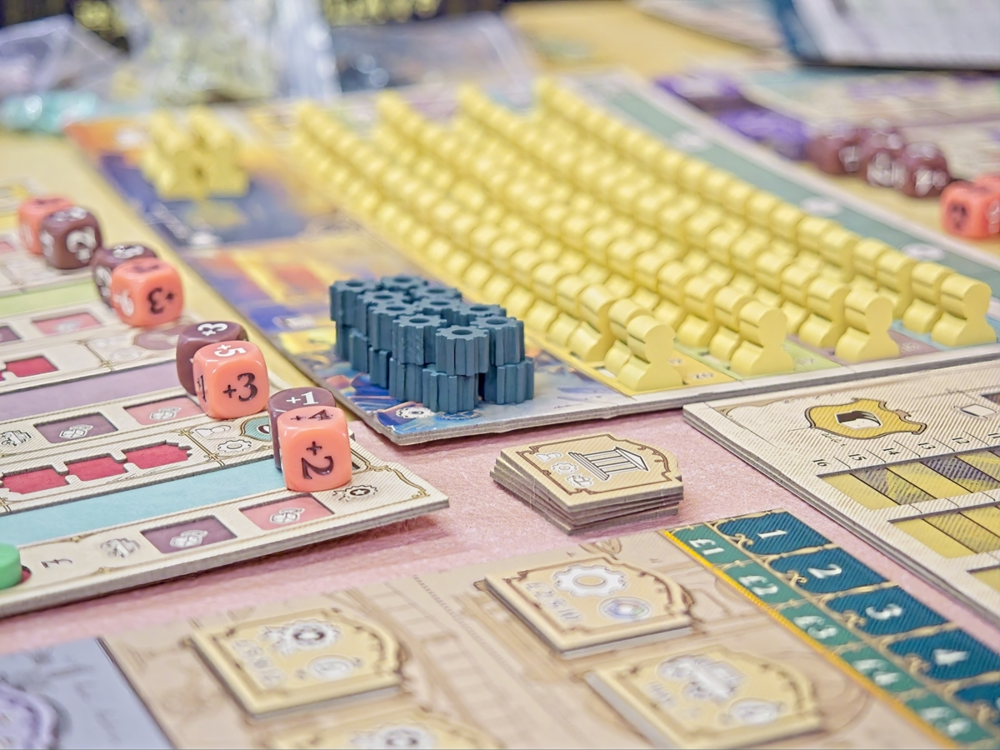
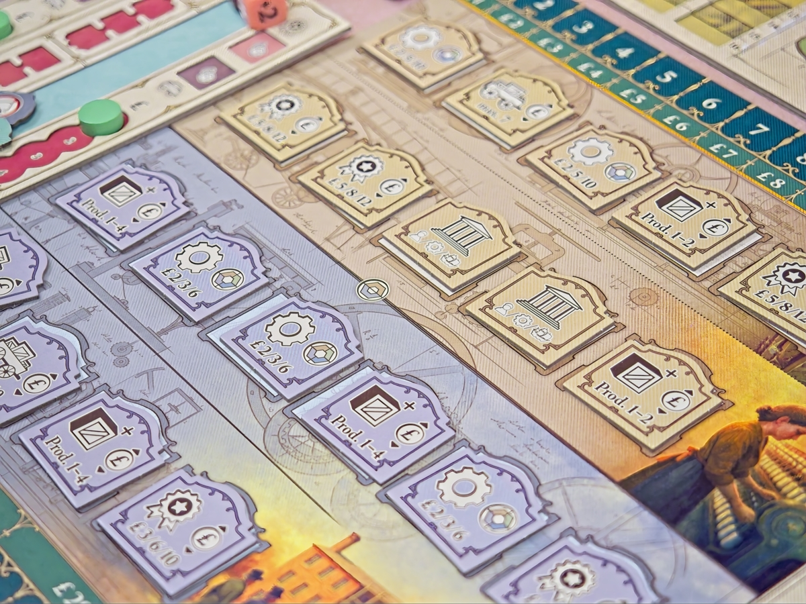
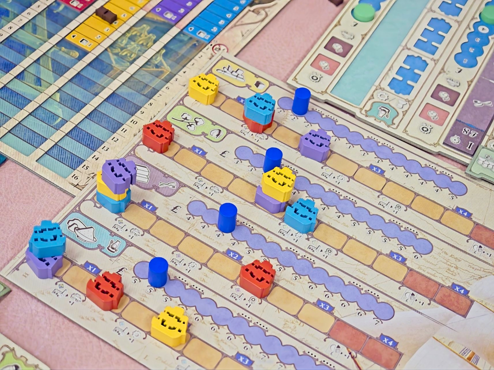
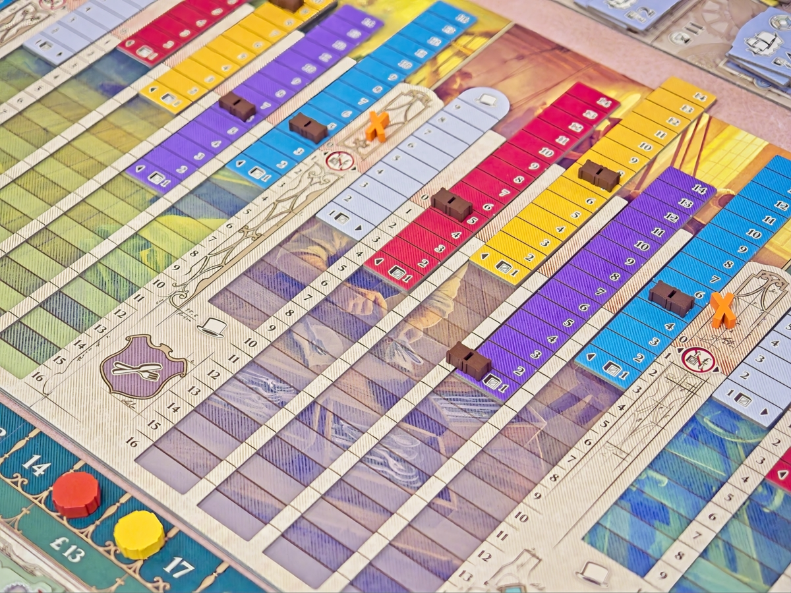

#เล่าสั้นๆ Arkwright Anniversary Edition (2025) เป็นฉบับครบรอบ 10 ปีของเกมธีม economic ระดับหนัก (4.58 / 5.00) โพสนี้จะเล่าสั้นๆถึงตัวเกม และความแตกต่างที่คนที่เป็นแฟนเกมน่าจะสนใจ

---

สำหรับคนที่ไม่รู้จักและอาจจะกำลังกลัวใน weight ของเกม โดยเนื้อแท้แล้วมันเป็นเกมที่ให้เราเปิดโรงงาน 4 ชนิดแล้วมาบริหารจัดการต้นทุน/เวลา ผ่านการจ้างคนงานตั้งราคา ในหลายๆแง่แล้วมันก็แค่ worker placement ที่เล่นในกระดานตัวเองแล้วก็ตั้งราคาสินค้าให้มันขายแข่งกับคนอื่นได้โดยที่ยังไม่จมทุนไปซะก่อน เป็นเกมที่เล่นให้ครบลูปไม่ยากไปกว่าเกมระดับกลาง คิดเลขก็น้อยกว่าเกมตระกูล 18XX เกมมัน 'หนัก' เพราะการบริหารจังหวะแอคชั่นที่การจะทำให้ดีนั้นต้องคิดเยอะกว่าที่เห็น แต่ใดๆมันก็เป็นเกมที่คนเล่นยูโรสายหนักชื่นชอบกันตั้งแต่วันที่มันออกมา

---

ตัว Anniversary แน่นอนว่าทำใหม่มาสวยงาม

.

- ระบบตลาดที่ทำใหม่หมด แค่มีสิ่งนี้อย่างเดียวก็ควรค่าแก่การครอบครอง ระบบการซื้อของของ AW เดิมมันดูยากมากๆว่าสินค้าชิ้นท้ายๆใครจะขายได้แล้วจะมีของเหลือพอส่งเรือไหม แต่ระบบตลาดใหม่ที่กางเอาทุกโรงงารมาเทียบพร้อมพร้อมกับเลื่อนบอก appeal + production volume ทำให้ช่วงการขายสมูธขึ้น 500%!!

.

- โรงงานแต่ละชนิดจะมีชนิดแยกย่อยไปอีก 3 แบบ อย่างแรกคือแบบปกติ อย่างที่เพิ่มมาคือ โรงงานถูกๆที่มีราคาโรงงานต่ำแต่ได้จำนวนชิ้นเยอะ และโรงงานพรีเมี่ยมที่จำนวนผลผลิตน้อยกว่าแลกกับมูลค่าโรงงานที่สูงขึ้น ตรงนี้ทำให้เกมมี depth เพิ่มขึ้น ไม่จำเป็นต้องแข่งกันปั๊มมูลค่าโรงงานแบบเดิมๆ เปิดให้มีวิธีการเล่นเพิ่ม

.

- จูนระบบจุกจิกเล็กน้อยออกไปหลายจุดให้เกมลีนขึ้น อย่างระบบ obsolete โรงงาน, ระบบทำแอคชั่นซ้ำที่ยืดหยุ่นมากขึ้น, ไทล์แอคชั่นซื้อหุ้นที่ความสามารถหลากหลายขึ้น ทำให้จังหวะการทำแอคชั่นซื้อหุ้นมันเจ๋งไปอีก

---

ข้อเสียของตัว Anniversary คือ

.

- กระดาษแข็งค่อนข้างบาง ทำให้กระดานโกงงอ

.

- ทำกระดาษบางขนาดนี้ก็ยังปิดฝาไม่ลง (อะไรฟระ)

.

- กระดานใหญ่ไปทุกส่วนใช้พื้นที่ในการเล่นเยอะมากเอื้อมแทบไม่ถึง

---

ส่วนที่ผมคิดว่าตัว Anniversary น่าจะทำได้ดีกว่านี้

.

- โมดูลเสริม EIC ในเรามาเดินแทรคไว้นับเงินคูณตอนจบเกม รู้สึกเฉยๆและหลุดจาก flow เกม ไม่รู้สึกถึง impact ของมันเท่าไร แต่หลักๆก็เหมือนเอามาช่วยในทรง free action ให้เราจูนโรงงานนิดๆหน่อยๆกับได้โบนัสมาซื้อหุ้น

.

- ระบบตลาดแรงงานยังคิดว่าน่าเบื่อเหมือนเดิม คือสุดท้ายทุกคนก็ จ้างเปิดโรงงานกันรัวๆอยู่แล้ว ค่าแรงก็จะเพิ่มขึ้นในทรงเหมือน pace maker ในจังหวะของเกมมากกว่า ไม่ได้แย่แต่พอเปิด event เติมคนมันไม่ได้รู้สึกอะไรเท่าไร

.

- ไทล์โรงงานหลากชนิดต้องผลิกไปผลิกมาชวนหงุดหงิดนิดหน่อย ดูเหมือนของพึ่งมาคิดได้อย่างไรชอบกล

.

- ไทล์ความสามารถไอคอนยังดูไม่ค่อยรู้เรื่องในครั้งเดียวเท่าไร

.

- คู่มือจะทำใหญ่ไปไหนว่ะ.....

---

verdict : ถ้ารับได้กับกระดานโก่ง แฟน Arkwright จะได้เจอกับทุกสิ่งที่ตัวเองชอบในฉบับที่สมูธขึ้น เล่นได้อย่างสบายใจมากขึ้น ลดความน่ารำคาญตรงโน้นตรงนี้ แต่ด้วยความที่แก่นเกมไม่ได้เปลี่ยนอะไรมาก (ถ้าเมื่อก่อนไม่ชอบตอนนี้ก็ไม่น่าช่วย) อยากเล่นปีละครั้งสองครั้ง เล่นกล่องเก่าก็ยังเป็นตัวเลือกที่ดีครับ (แต่ผมน่ะซื้อแน่!!)

