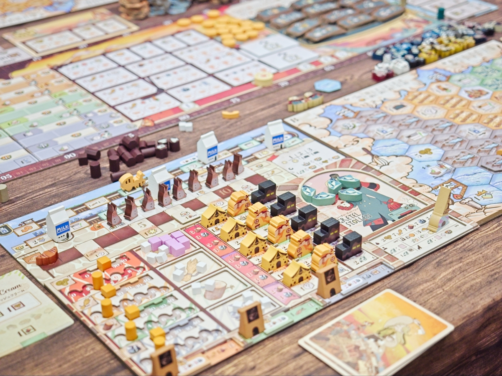
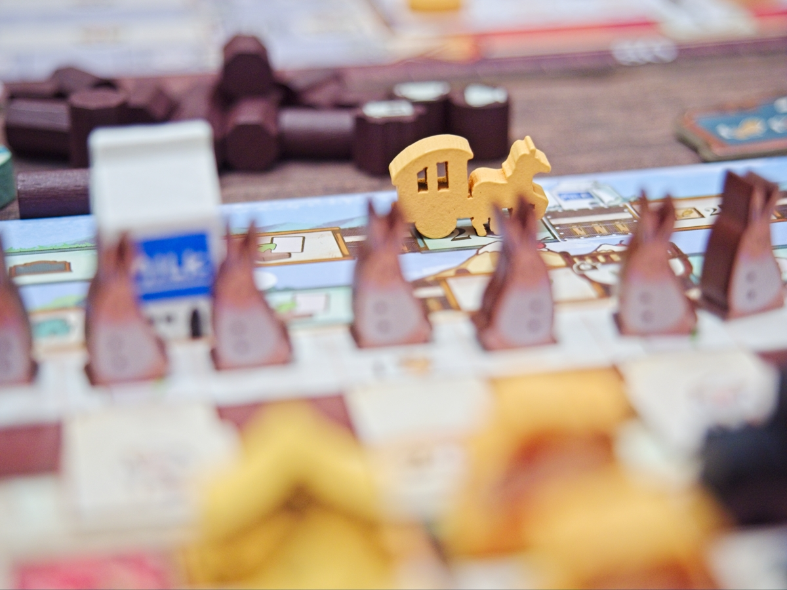
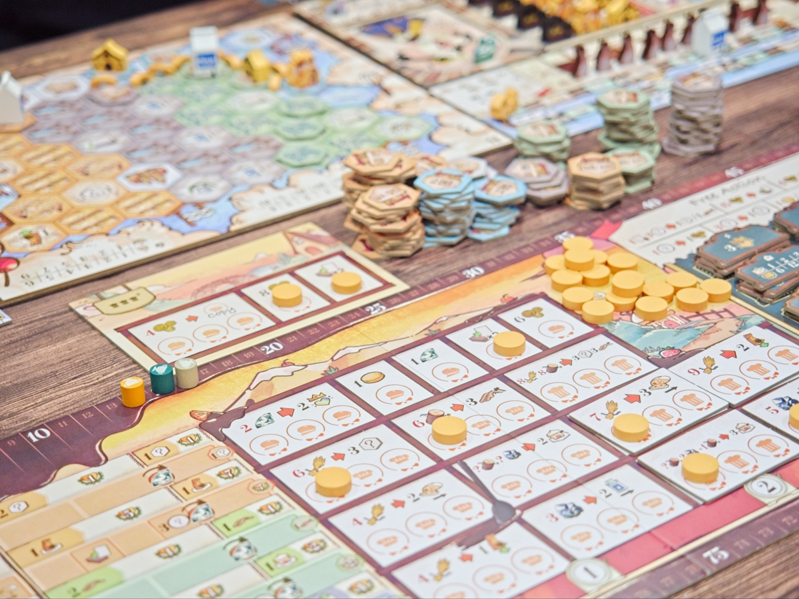
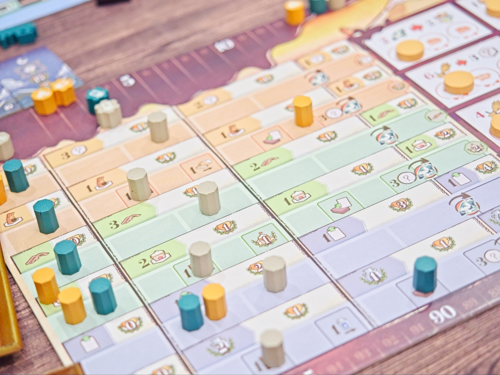
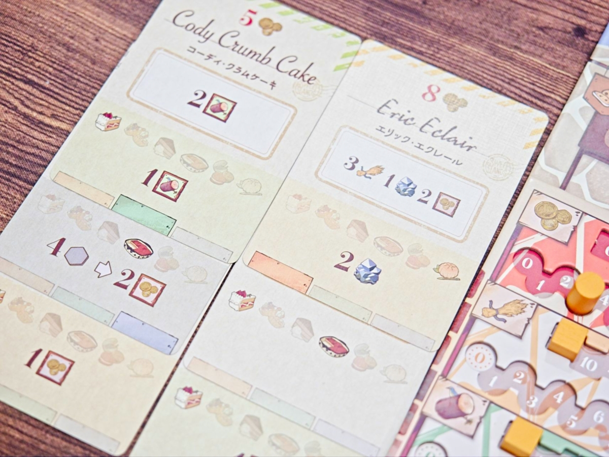
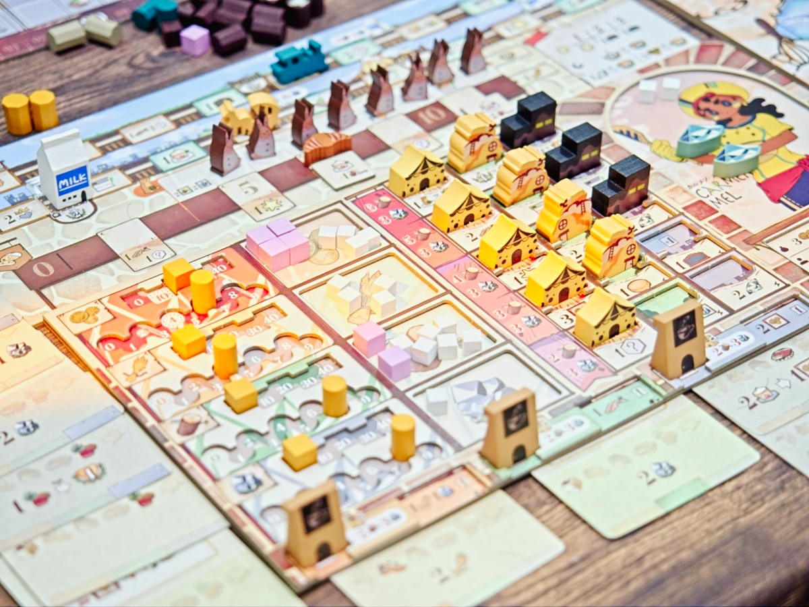

Sweet Lands เกมสุดน่ารักที่จะให้เรามาแข่งกันสร้างเมืองแห่งขนมหวานเพื่อกรุยทางสู้การเป็นเจ้าแห่งดินแดนขนมหวานแห่งนี้!! 

ใดๆคือบอกไว้ก่อนว่าอย่าโดนปกหลอก เพราะนี้มันคือเกมยูโรระดับหนักที่เกิดจากการหยิบยืมกลไกเด่นๆจากเกมดังมากมาย ( Ultimate Railroads, Tzolkin, Terraforming Mars, Terra Mystica, ....etc ) มาตีส่วนผสมขึ้นใหม่แล้วโรยน้ำตาลอย่างหนาให้ดูน่าเคี้ยวแต่ความหนักของเกมไม่ได้ลดทอนแต่อย่างใด (ลองนึกถึง Root ก็ได้เคลือบน้ำตาล Wargame อย่างมุ้งมิ้งแต่แกนไม่เปลี่ยนเลย)

ปกติผมคิดว่าการอธิบายเทียบระบบเกมมันค่อนข้าง orange to apple ดูแล้วโง่ๆอวดภูมิไปหน่อยแต่สำหรับเกมนี้จะข้อใช้วิธีนี้นะ (ฮา) เพราะมันหยิบมาหลายเกมมาก ไม่เคยเล่นก็ไม่เป็นไรแต่ถ้าเคยมาก่อนจะเก็ทฟีลเกมเร็วมากๆ เป็นเกมที่สามารถย่นเวลาสอนและการทำความเข้าใจลงได้เกินครึ่งถ้าเปลี่ยนไปใช้ศัพท์เทคนิคพร้อมอ้างอิงเกม

Concept หลักคือผู้เล่นแต่ละคนจะมีบอร์ดดินแดนของตัวเอง แอคชั่นส่วนมากจะวนอยู่กับการหยิบไทล์ดินแดนมาวางให้ตรงสีในบอร์ดเรา (ฟีล Burgundy) จากนั้นเราจะต่อถนน (ใช่ Catan) ไล่ตามไป พออารมณ์ความเจริญมาถึงไทล์ที่ดินที่เราวางไว้มันจะพลิกด้านให้เราได้โบนัสมา หลักๆจะให้เราเลือกระหว่างเดินแทรคผลิตทรัพยากร (แบบ Terraforming Mars) หรือจะเดินแทรคที่เอาไว้คูณคะแนนจากหมวดต่างๆตอนจบเกม เกมจะพ่วงขยักไว้อีกว่าในการวางพื้นที่เราอาจจะได้โบนัสบางอย่างและการต่อถนนไปยังบางพื้นที่เราจะได้โบนัสกับคะแนนเพิ่มอีก

พอเรามีพื้นที่ที่พัฒนาแล้วอีกเลเยอร์คือการสร้างตึกตรงนี้เกมมีหลายตึกที่สร้างแล้วได้ทรัพยากรบ้างปลดล็อกโน้นนี้บ้าง บางตึกจะเป็นตัวบล็อกทางที่ทำให้เราเลื่อนแทรคไม่ได้ก็ต้องไปปลอดออก (อารมณ์หินบล็อกทางใน American Railroad)

แต่ส่วนที่ทำให้เกมเดินไปในทิศทางที่ไม่ซ้ำกันเลยในแต่ละเกมมากๆอีกอย่างก็คือการ์ดจำนวน 200 กว่าใบที่ทำหน้าที่สองอย่าง อย่างแรกคือเอาไว้ทิ้งเป็นค่าใช้จ่ายในการทำแอคชั่น อย่างที่สองคือจ่ายทรัพยากรเพื่อเอาผลของมัน

คือแกนหลักในการทำแอคชั่นเกมนี้คือ Worker Placement ที่มีช่องแอคชั่นตรงกลาง เกมใช้ระบบว่าบางช่องลงได้มากกว่า 1 ครั้งแต่เราต้องทิ้งการ์ดในมือเพิ่มขึ้นเรื่อยๆ แล้วด้วยความที่การ์ดในมือมันมีได้แค่ตาละ 5 ใบ ตรงนี้มันมีผลที่ทำให้เราต้องคิดว่าอยากทำแอคชั่นหลักหรืออยากจะเล่นการ์ด'

ตัวการ์ดเองก็ลีลาเยอะในทรงแบบ Terraforming Mars คือมันก็จะมีทั้งการ์ดที่มีผลตรงไปตรงมากับการ์ดที่ได้ของเพิ่มหรือมีเงื่อนไขพิเศษตาม ไอคอนขนมจากการก่อนๆหน้า (tag แบบใน TM / Ark Nova) เล่นเสร็จก็มีตัวเลือกให้เราเอาการ์ดไปสอดทำโบนัสแบบอื่นต่อได้อีก

ว่ากันในจุดที่ชอบก่อนคือมัน 'สนุก' ตอนเล่นนี้ออกเชนคอมโบปลดโน้นนี่สนุกสนานมาก จังหวะที่ต้องคิดในการเล่นการ์ดก็มีตลอดว่าจะไปทางไหนดี ระบบแม้จะยำมาเยอะแยะแต่ก็แกะมาแต่ส่วนที่ดีๆ และองก์ประกอบโดยร่วมค่อนข้างคลีนไม่พันกันทำให้เล่นค่อนข้างง่ายด้วย (สำหรับขาประจำยูโรนะ)

แต่ส่วนที่ไม่ชอบในเชิงเกมเลยคือก็เพราะการที่ตัวเลือกมันเยอะทำแอคชั่นแยะ downtime ระหว่างรอเลยสูง และด้วยความที่ interaction ระหว่างผู้เล่นแทบไม่มีเกมมันก็เลยจมอยู่กับตัวเองซะเยอะ คนอื่นทำอะไรก็ไม่ได้จำเป็นต้องมองขนาดนั้น

ข้อสังเกตอีกอย่างสำหรับผมเองคือตัวละครมันเก่งกากต่างกันเยอะไปหน่อยกับความสามารถมันเฉพาะทาง แบบถ้าเล่นตัวนี้ก็ต้องไปสายนี้แหละ เลยยิ่งทำให้เกมมันจมอยู่กับแต่ตัวเองหนักเข้าไปอีก

ส่วนอันที่หงุดหงิดเชิงการผลิตคือตัวชุดอัพเกรดแม่งไร้สาระฉิบหาย ซองการ์ดสีๆที่สับไม่กี่ทีก็ลอก กับ token ลายตัวละครน่ารักๆที่ไม่ได้ใช้อะไรในเกมจริงจังแต่เราต้องจ่ายไปแพงมาก อันนี้คือเซงฉิบ

---
🐸 ME - ถ้าเอาเรื่องความสนุกผมให้ #กบชอบ ได้แบบไม่คิดเลย แต่ว่าเรทสุดท้ายที่จะให้คือ #กบโอเค ครับเนื่องจากคาแรกเตอร์สำคัญคือมันใช้เวลาในตาตัวเองเยอะ แทบไม่ยุ่งกับคนอื่นแล้วต้องรอนานนนนนน คือเป็นเกมที่ผมคิดว่าเหมาะสุดสำหรับ 2 คน ถ้าเล่น 3 คนก็คือต้องสายที่โคตรสปีดจัดๆถึงจะอยากเล่น แต่ 4 คนเอาเกมเชี้ยนี่ไปเผาทิ้ง คือมันสนุกนะแต่ถ้าต้องรอแล้วใช้เวลา 4 ชั่วโมงก็จะพบว่ายังมีเกมอื่นอีกมากมายที่น่าเล่นมากกว่า  (เช่นบรรดาเกมที่มันยกระบบมานั้นแหละ)

ที่นี้ถ้ามามองในมุมว่ามันเป็นเกม 2 คน (หรือ solo?) ความ perfect ของมัน (ถ้าไม่ติดเรื่องที่มันไม่ค่อยมีอะไรมาแตะกันตรงกลาง) ผมคิดว่ามัน worked กว่าไปเล่นเกมอย่าง Ultimate Railroads / Terforming Mars / Ark Nova ที่มีฟีลลงการ์ดกับปลดโน้นนี่คล้ายๆกันแต่เล่นหลายคนสนุกกว่า เกมนี้มันเลยเหมือนถ้าอยากได้อะไรแบบนั้นแต่เล่น 2 คนก็จะได้เกมงึมงำที่ 'แน่น' กว่ากลับมาแทน

คือถ้าคุณอยู่ในกลุ่มไม่มีปัญหากับการงึมงำแบบในเกมอย่าง  Paladins of the West Kingdom เกมนี้ก็อาจจะเหมาะกับคุณมากๆก็ได้ 

🔴 expert  | 🟠 regular | : เกมที่บดเอาระบบเกมดังมาใช้ มีแอคชั่นโบนัสเยอะแยะ เล่นอยู่กับตัวเองเกือบทั้งเกม เกม AP ได้ง่ายควรเลือกวงถ้าไม่อยากใช้เวลารวมนาน

🟢casual/family | 🧸newbie : เป็นเกมรวมระบบเกมเกมใหญ่ดังๆมาผสมเข้าด้วยกัน ในหลายๆแง่แล้วเกมไม่ได้ซับซ้อนถ้ามีเวลาให้ก็เล่นตามได้แต่อาจจะมึนๆหน่อย ส่วนตัวไม่แนะนำนะ เล่นมาซักพักค่อยมาลองจะ enjoy กับความสนุกมันได้ดีกว่า

---
> 🐸 ME - ความเห็นส่วนตัวสำหรับตัวเองเพื่อตัวเอง
> 🔴 expert - ผ่านเกมมาเยอะ อ่านเกมใหม่ตลอด
> 🟠 regular - เล่นบ่อยเล่นประจำออกตระเวนเล่น
> 🟢casual/family - เล่นที่ร้านเล่นหรือกับครอบครัว
> 🧸newbie - มือใหม่พึ่งเข้าวงการผ่านเกมตามร้านมานิดหน่อย
