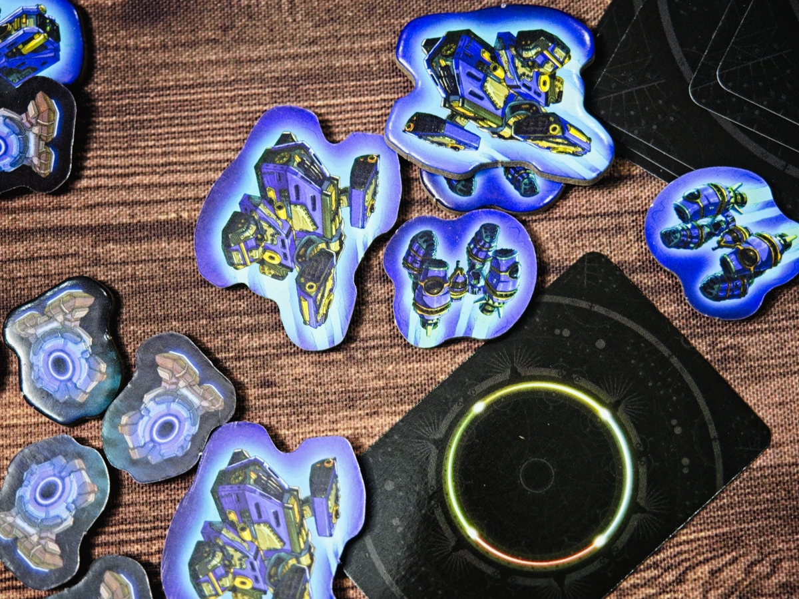
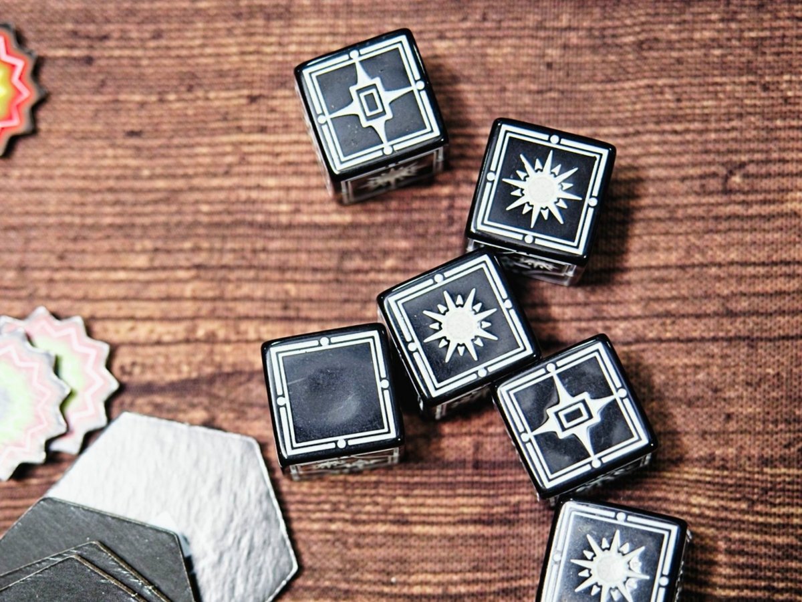
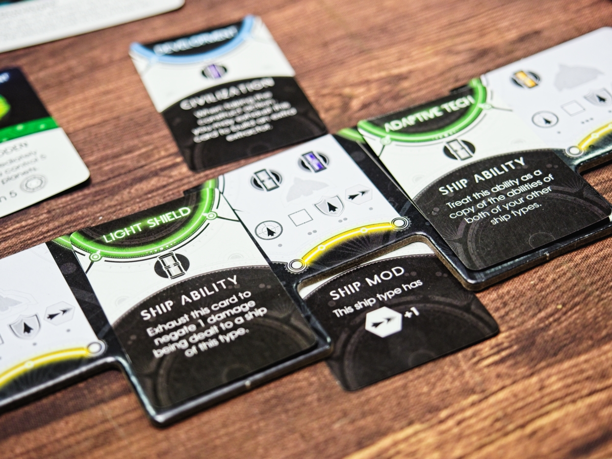

เกมนี้ขายตัวเองไว้ว่าเป็น 4X เกมฉบับเร่งด่วน 1 ชั่วโมงจบ ธีมก็เหล่าเผ่าพันธ์ในอวกาศมาแก่งแย่งพลังงานแสงแหล่งสุดท้ายในกาแลคซี่

สาเหตุที่เกมเดินได้เร็วเพราะเดินด้วยระบบทำแอคชั่นแบบพร้อมกัน คือผู้เล่นจะมีการ์ดแอคชั่นหน้าตาเหมือนกันอยู่ชุดนึง ตัวแอคชั่นก็จะเป็นพวก สร้าง, เดิน+โจมตี , เก็บของ, เทรดของ, วิจัยเทค แล้วการ์ดพวกนี้มันเล่นได้ครั้งเดียวอีกแอคชั่นก็คือการ refresh เพื่อดึงทุกอย่างขึ้นมือ

คือเกมมันออกแบบให้ทุกแอคชั่นต่างคนต่างทำได้เลยยกเว้นแอคชั่นการเดินแล้วตี (ก็แน่ล่ะ)  ถ้ามีคนเลือกเหมือนกันจะให้ตาม turn order ซึ่งตัวเกมก็ปรับให้เร็วอีกด้วยระบบฝ่ายตีก็ทอยยิงเลยฝ่ายรับไม่ต้องสวน ส่วนเลือดก็ค้างๆไว้ ด้วยความที่เกมมันจ่ายค่าสร้างได้ถูกแผนที่ก็เล็ก รูปแบบเกมมันก็เลยไวเอามากๆ

กิมมิคน่าสนใจของแผนที่เกมก็คือมันมีส่วนหมุนเป็นวงๆซ้อนกันอยู่ซึ่งจะหมุนเป็นระยะทำให้แผนที่มันขยับไปเรื่อยจังหวะการเดินก็เลยสนุกดี แบบตอนแรกอยู่ไกลแต่พอวนไปก็อ้าววววมาใกล้ซะงั้น

ระบบเทคโนโลยีในเกมจะให้เราโมยานได้ 3 แบบ ก็จะมีทั้งเทคหลักสำหรับความสามารถยานแล้วก็เทครองที่ให้เราเอาไปเสียบโมยานเพิ่มได้ตรงนี้ไปผสมกับความสามารถเผ่าก็ทำให้เกมดูมีอะไรทำเรื่อยๆนะ

ทีนี้เราจะสังเกตุว่ามันมีบอลกลมๆแทนดาวเคราะห์อยู่ ซึ่งไม่ได้ทำไรอะไรเลยจ้าาาาาา... เอาจริงๆคือมันมีไว้บอกสีของดาวน่ะดูป้ายตรงฐานได้เลย เพราะเกมมันจะมีพวก mission ยึดดาวตามสีอยู่ แต่นอกนั้นไม่มีความหมายอะไรในเกม เนื่องจากทรัพกรที่เราจะขุดได้จริงๆมันจะสุ่มจากไทล์อื่นอีกที แต่ก็ได้เรื่องความสวยงามแปลกตานะ

เกมเล่นกันจนกว่าจะมีผู้เล่นสะสมคะแนน (ผลึกแสง) ครบ 20 หน่วย

---
🐸 ME - #กบโอเค เกมทำแอคชั่นได้เร็วเข้าใจง่ายโดยที่ยังให้อารมณ์ tense ของการปั้นยานไปสู้กันอยู่ คือเอาไว้เล่นตีกันสนุกๆได้อยู่ ระบบผมคิดว่าปั้นและจูนให้เหมาะกับระยะเวลาเกมมากๆ

แต่ใดๆก็ด้วยความดวงของการจั่วการ์ดและการใช้ลูกเต๋าแบบไม่มีการโมดิฟายในการต่อสู้ก็ต้องยอมรับในเรื่องความเหวี่ยงของดวงอยู่นะ กับไอเดียทำแต้มหลักของเกมคือการวิ่งไปยึดจุดศูนย์กลางเพื่อฟาร์มแต้มมันก็จะมีอารมณ์แบบ เห้ยยยยไอ้นี้มันนำอยู่รุมมานนนนนน อยู่หน่อยๆ (แต่ใดๆคือเกมมันก็ทุกคนได้เดินแต้มไปข้างหน้าอยู่แล้ว)

ปกติแล้วจั่วหัวประมาณนี้ผมจะไม่ค่อยมองเท่าไร เพราะ 4X ที่ระยะเวลาสั้นและจบไว้นั้นเกมมักจะตื้นจนไม่สนุก แต่มันมีเหตุว่าเคยเห็นโหนด (bewitched) เล่นแล้วบอกว่าสนุกดีก็เลยจดชื่อไว้ แล้วดันมีคนขายมือสองใกล้ๆกันสองรอบแต่ทักแล้วไม่ทันทั้งคู่ก็เลยแค้นนนนนน กดสั่งเองมันซะเลย.... ซึ่งเล่นแล้วก็สนุกดีนะ แอบเสียดายนิดๆตรงยังคลุมไม่ครบทุก aspect ของ 4X อย่างใน March of Ants แต่ว่ามันก็จูนมาได้เบาและตรงประเด็นดีแบบไม่ใช่เกมทอยตีโง่ๆ โดนตีแล้วไม่หัวร้อนแต่มีอารมณ์แบบด้ายยยยยย เดี๋ยวเจอกรู

สำหรับเกม 90 นาทีในจังหวะไม่อยากคิดอะไรเยอะแยะก็คิดว่าโอเคนะ แบบถ้าจะไปกางอย่าง The Golden Ages มันก็อาจจะต้องมารื้อกติกาหน่อยแต่เกมนี้ไม่ต้องเลย

🔴 expert  | 🟠 regular | : จะเหมาะกับการคั่นอารมณ์หรืออยากได้เกมไม่ต้องคิดมากหรือฟังกติกาเยอะก่อนกลับบ้าน ตอนโมยานก็ดูมีกิมมิคให้คุยกันสนุกๆอยู่

🟢casual/family | 🧸newbie : ไอเดียตรงประเด็นแต่อาจจะงงนิดๆในพวกการ์ดความสามารถที่ต้องทำความเข้าใจหน่อยเพื่อให้เกิดการทำงานร่วมกันแล้วสนุก

---
> 🐸 ME - ความเห็นส่วนตัวสำหรับตัวเองเพื่อตัวเอง
> 🔴 expert - ผ่านเกมมาเยอะ อ่านเกมใหม่ตลอด
> 🟠 regular - เล่นบ่อยเล่นประจำออกตระเวนเล่น
> 🟢casual/family - เล่นที่ร้านเล่นหรือกับครอบครัว
> 🧸newbie - มือใหม่พึ่งเข้าวงการผ่านเกมตามร้านมานิดหน่อย
