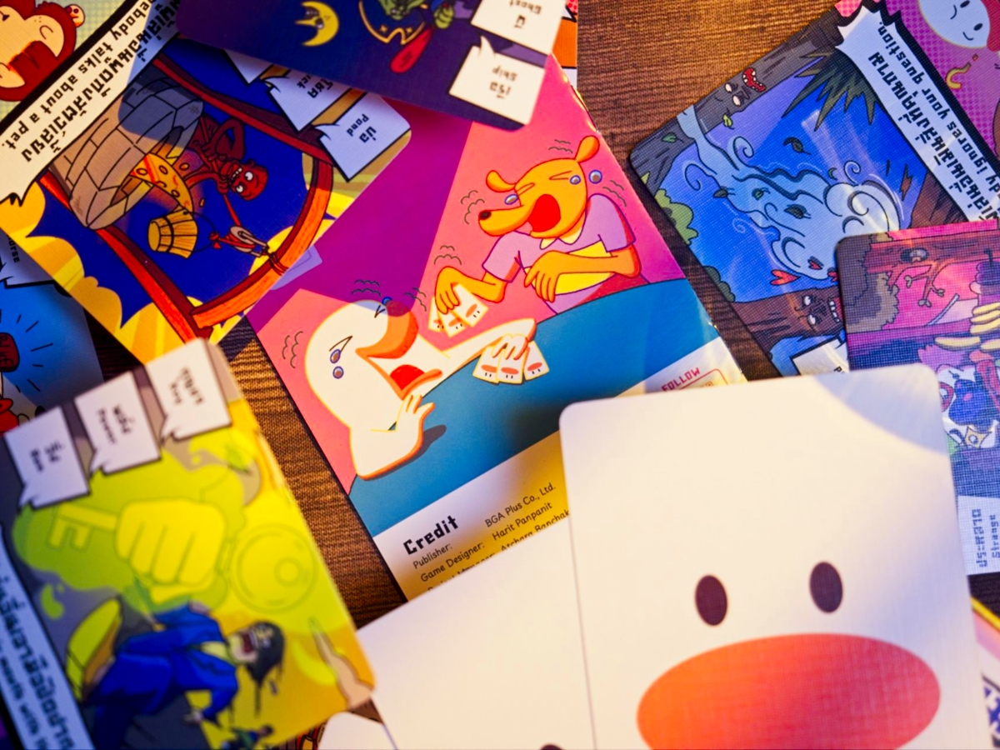
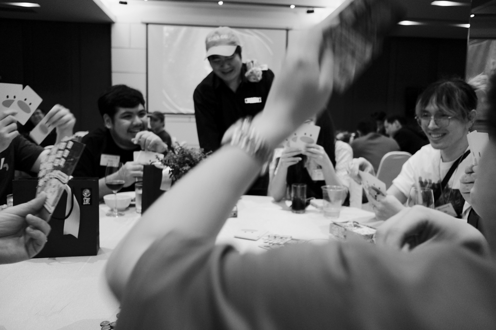
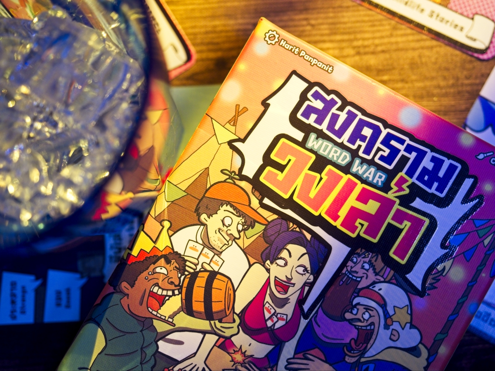

Word War สงครามวงเล่า - ทุกวงย่อมมีเรื่องเล่าไม่ว่าจะมีเหล้าหรือไม่ก็ตาม

เกมแนวปาร์ตี้ที่มีกติกาเรียบง่าย หลังจากแจกการ์ดจำนวนหนึ่งให้ผู้เล่นแล้ว เราจะเริ่มจากเปิดการ์ดมา 1 ใบเพื่อกำหนดธีมของเรื่องที่เราจะแต่งจากนั้นเราก็ผลัดกันเล่าเรื่องในธีมที่ว่านั้นแหละ แต่มีข้อกำหนดว่าต้องอย่างน้อย 10 พยางค์นะ ถ้าน้อยกว่าจะถูกปรับให้จั่วการ์ดเพิ่ม

การชนะคือเมื่อใดก็ตามที่ผู้เล่นออกคำพูดที่ตรงกับคำในการ์ดหรือออกท่าทางตรงกับที่การ์ดเราบอกซึ่งใน 1 ใบจะมี 3 คำกับ 1 ท่าทาง เราก็จะได้ทิ้งการ์ดแล้วก็แย่งเล่าเรื่องต่อได้ เกมก็วนๆจนการ์ดใครซักคนหมดมือ

ส่วนที่คิดว่าเป็นจุดเด่นของเกมเทียบกับเกมเล่าคำแบบนี้คือมันมีกำหนดธีมมาก่อนทำให้ตอนเล่าเรื่องมันไม่ออกทะเลมาก (หรือถ้านอกเรื่องจะโดน challange ทำให้ต้องจั่วการ์ดเพิ่ม) แล้วการที่เงื่อนไขมันมีทั้งเรื่องคำกับท่าทางก็ทำให้สมองเราไม่วาง เพราะต้องดักทั้งทำพูดเพื่อนแล้วก็คอยสังเกตท่าทางของเพื่อนๆในวง อย่างการ์ดบางใบก็แบบดูว่ามีใครเกางี้ บางใบก็อารมณ์แบบต้องเราพยายามหลอกล่อเพื่อนนอกเกมก็มี

ก็เป็น mash up ของ คำต้องห้าม + Once upon the time + Don't Get Got ที่ออกแบบได้น่าสนใจดี

---
🐸 ME - #กบเฉย ต้องเข้าใจก่อนว่ามันไม่ใช่แนวปกติผมอ่ะนะ แต่ผมก็มีจังหวะหยิบมากางอยู่เหมือนกันโดยเฉพาะเอาไปนำเสนอกลุ่ม non-gamer ที่ออฟฟิตหรือตอนออกทริปต่างจังหวัด (จริงๆเค้าให้เกมมานานละ แต่ผมรอไปเทสกับแก๊ง non-gamer ก่อน) ซึ่งพวกนี้ก็จะพอรู้จักพวกเกมคำต้องห้ามอะไรเแบบนี้อยู่ล่ะ ก็เอาเกมนี้ไปแทรกได้เลยซึ่งสวนตัวคิดว่าเกมมัน make sense กว่าคำต้องห้ามเยอะอยู่

คือที่มันไม่ค่อยไปกับผมเท่าไรคือเราติดคิดแบบนักวางแผนดักทางอ่ะ ตอนพูดก็คือมานั่งนับพยางค์จนกลายเป็นเรื่องไม่เดิน ผสมกับจะแต่งยังไงดีว่ะให้เรื่องมันวนกลับมาหาคำของเราในหัวก็คิดมากเกิ๊น ตอนคนอื่นเล่าก็จับผิดไม่ทันเพราะมัวแต่คิดเรื่องจะแทรกไรงี้ เป็น multi task ที่สมองไม่ถนัดเท่าไร พอไปอยู่วงที่ทรงเกมเมอร์จ๋าๆเลยเหมือนเรื่องพายวนอยู่ในอ่าง

🔴 expert  | 🟠 regular | 🟢casual/family | 🧸newbie : เกมแนวปาร์ตี้เล่าเรื่องสไตล์คำต้องห้ามแต่มีทวิสในการกำหนดธีม แล้วก็มีการแทรกหยุดที่หลากหลายกว่าเพราะมีทั้งคำและท่าทาง

---
> 🐸 ME - ความเห็นส่วนตัวสำหรับตัวเองเพื่อตัวเอง
> 🔴 expert - ผ่านเกมมาเยอะ อ่านเกมใหม่ตลอด
> 🟠 regular - เล่นบ่อยเล่นประจำออกตระเวนเล่น
> 🟢casual/family - เล่นที่ร้านเล่นหรือกับครอบครัว
> 🧸newbie - มือใหม่พึ่งเข้าวงการผ่านเกมตามร้านมานิดหน่อย

---  
this is a gifted product from Box & Brew Boardgame Cafe no money changed hand for this content. ได้รับสินค้าโดยไม่มีค่าใช้จ่าย คอนเทนต์ทำเพื่อแสดงความเห็นส่วนตัวเกี่ยวกับเกมโดยไม่มีการจ้างวาน